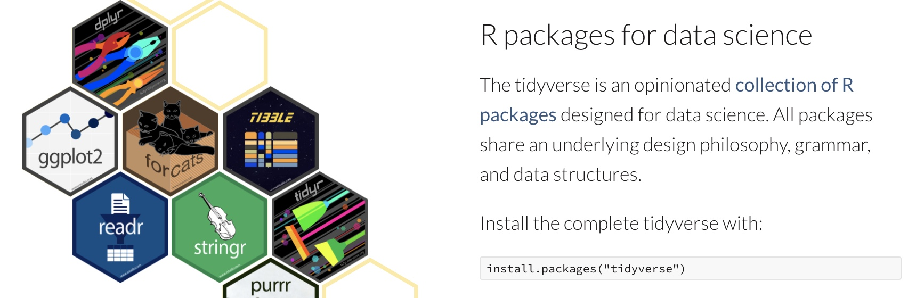
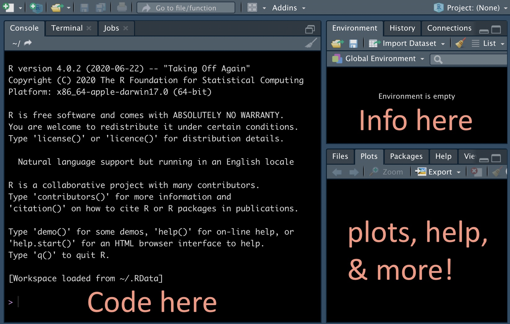
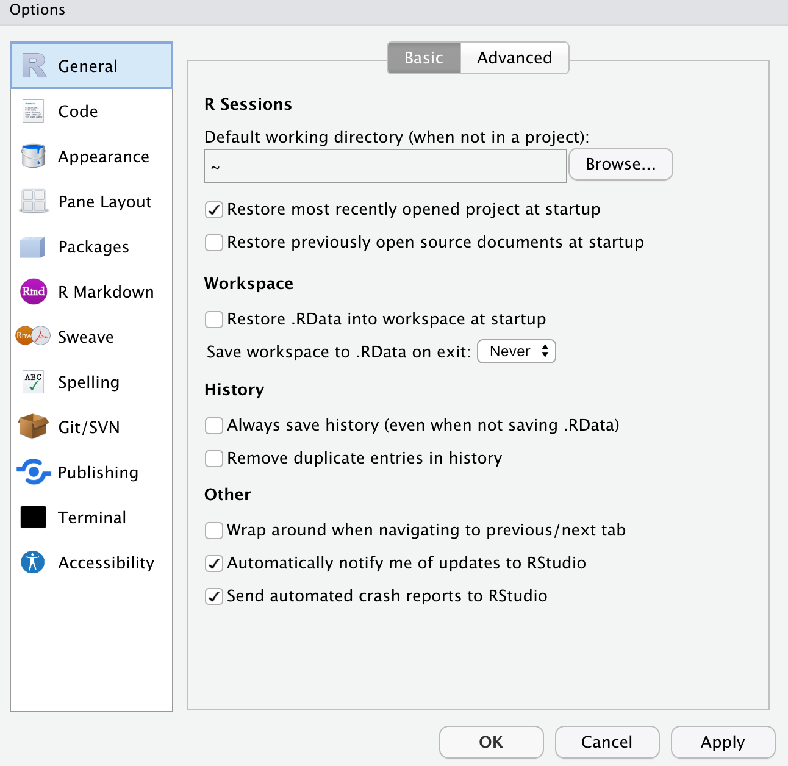
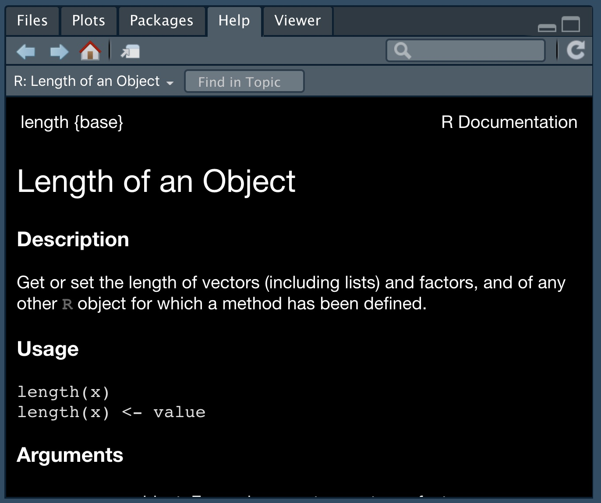
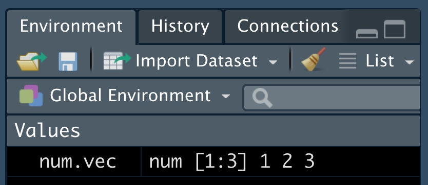
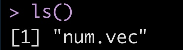
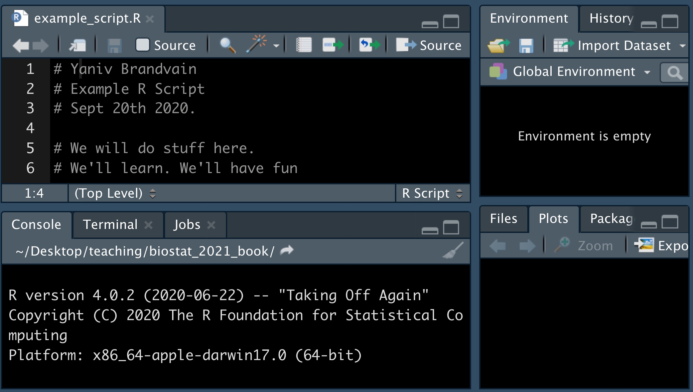

# (PART) Introduction to `R` {-}


# Day one of R and RStudio {#intro2r}  


```{r, echo = FALSE, message=FALSE}
library(knitr)
library(blogdown)
library(tweetrmd)
library(tufte)
library(emo)
```

```{block2, type='rmdnote'}
There is no accompanying reading.    
```

<span style="color: Blue;font-size:22px;">   Motivating scenario:  </span>  <span style="color: Black;font-size:18px;"> Motivating scenario: You have heard about R and RStudio, and maybe used them, but want a foundation so you can know whats going on as you do more and more with it.</span>    

**Learning goals: By the end of this chapter you should be able to**  

- Explain why we are using R and RStudio.  
- Describe the five tips for writing code like a pro.  
- Install R and RStudio (or have access to them on RStudio cloud).  
- Set up RStudio preferences.   
- Install the tidyverse package.  
- Open and save an R script.  
- Explain vectors, classes of variables, doing math, and asking logical questions in R.  


```{block2, type='rmdnote'}
There is no external reading for this chapter, but watch the required video embeded in the text (Fig.  \@ref(fig:rtips)), complete the RStudio primer on programming basics embeded below (Fig. \@ref(fig:primer12)). Then go to canvas to complete the survey for this content.
```


## What is `R` and why / how do we use it?
`R` is a computer program, which is the go to language for most statisticians and data scientists (although some prefer python or Julia). R makes it possible to conduct complex statistical analyses, make nice figures, and write this book, all in one environment.


As opposed to GUI’s, like Excel, or click-based stats programs, R is focused around writing and sharing scripts. This allows analyses to be shared and replicated, ensures that data manipulation occurs in a script, preserving the integrity of the original data, and allows for tremendous flexibility.

## Why use R?  

- R is free.    
- There are many "packages" in R for specialized analyses.   
- R can make nice graphics.  
- While learning R is not easy, inexperienced programmers can quite quickly do useful things. You will be able to make nice plots and summarize data by next week!    
- Using R (or any scripting based analysis) allows us to save all the steps of our analysis, making our work easy to reproduce, describe, and build off of.  


```{r rtips, fig.cap = 'Watch [this video](https://youtu.be/91LmBj29-Sc) about why and how to R (6 min and 10 sec), from [STAT 545](https://www.youtube.com/watch?v=91LmBj29-Sc) -- a grad level data science class at the University of British Columbia. We will borrow from this course occasionally.', echo = FALSE, out.extra= 'allowfullscreen'}
include_url("https://www.youtube.com/embed/91LmBj29-Sc")
```


###  What is RStudio?
> More precisely, R is a programming language that runs computations, while RStudio is an integrated development environment (IDE) that provides an interface by adding many convenient features and tools. So just as the way of having access to a speedometer, rearview mirrors, and a navigation system makes driving much easier, using RStudio’s interface makes using R much easier as well.
> `r tufte::quote_footer('--- [Statistical Inference via Data Science: A ModernDive into R and the Tidyverse](https://moderndive.com/) [@ismay2019]')`


In addition to being a great place to use R, RStudio is a [Certified B corporation](https://bcorporation.net/directory/rstudio), which offers many great resources we will rely on over this term. RStudio has a freemium business model, and you will not need to pay for any of RStudio's products this term.

### What is the tidyverse? {#tidyverse}
A great part about R is that many people have written packages to help with specific tasks. 

The [`tidyverse`](https://www.tidyverse.org/) refers to both a set of packages, and a way to do things in R. The tidyverse packages we use the most in this course are:  

- [`ggplot2`](https://ggplot2.tidyverse.org/): For making plots.    
- [`dplyr`](https://dplyr.tidyverse.org/): For summarizing and handling data.  
- [`tidyr`](https://tidyr.tidyverse.org/): For converting data from wide to long format (and vice versa).   
- [`readr`](https://readr.tidyverse.org/): For reading in data.  
- [`forcats`](https://forcats.tidyverse.org/): For controlling the order of categorical variables.   

We will use the [`tibble`](https://tibble.tidyverse.org/), [`stringr`](https://stringr.tidyverse.org/), and [`purrr`](https://purrr.tidyverse.org/) packages less often if at all (although I use them often). If you are using your computer, rather than RStudio Cloud, you will need to install tidyverse (see 3.2.3) the first time you use it.


```{r, echo=FALSE, fig.cap='The tidyverse is an opinionated collection of R packages... shar[ing] an underlying design philosophy, grammar, and data structures. - [tidyverse.org](https://www.tidyverse.org/)'}

```  


You will see that there are many ways to do things in R. Over years of teaching this course I have switched to teaching predominantly using tidyverse tools.

One major reason for this is that the focus on a shared and coherent philosophy, grammar and data structure makes the tidyverse easier to teach and learn than base R. However, there are still challenges to learning and teaching the tidyverse, the two major challenges are  

1. It takes time to learn and appreciate the shared philosophy and data structure.   
2. Many people first learned R using base R, so it can be frustrating to start to learn again.    

Overcoming challenge (1) takes time but is helped by reflecting on why and how code works when it works, and fails when it fails (rather than copying and pasting code that works), and continually asking questions.

Overcoming challenge (2) can be tough, but I believe it's well worth it. [Amelia McNamara's](https://www.amelia.mn/) R syntax comparison [cheat sheet](https://www.amelia.mn/Syntax-cheatsheet.pdf) (Fig: \@ref(fig:SyntaxCheatsheet)) can help .


```{r SyntaxCheatsheet, echo=FALSE, fig.cap='download the [syntax comparison cheat sheet](https://www.amelia.mn/Syntax-cheatsheet.pdf)'}
include_graphics("https://d33wubrfki0l68.cloudfront.net/948e2a62a1eab719f3cad4763d74b383ed466acc/d4baa/wp-content/uploads/2018/02/syntax.png")
```  

## 3.2 Installing R and tidyverse (or not)  

**We use R version 4.0.0 or above, and tidyverse version 1.3.0 or above.**  
You can either download and install R, RStudio, and tidyverse onto your computer (see [Installing RStudio](#oncomp) for more info), or you can do all the coursework with RStudio Cloud without installing anything on your computer (see [Getting on RStudio Cloud](#onthecloud) for more info). Which option is right for you? It depends (see below). I suggest doing both and seeing which yuo prefer.

### Getting on RStudio Cloud {#onthecloud}  
Using RStudio Cloud allows you to use R and RStudio without installing anything on your computer. Additionally, if you log into our course project on RStudio Cloud you will not need to install any packages or load any files except those you want for fun of for your independent project at the end of term.

DETAILS YANIV

#### Advantages to RStudio Cloud  {#cloadadvant -}  
- From my experiencing teaching this course, about 5% of students have computers or computer systems where installing R is challenging, now you don’t have to.  

- Some students have older computers with limited computation. For them, a few class exercises (involving large-scale permutation or simulation) go super slow, and they can get justifiably frustrated.  

- Some computer setups make installing tidyverse or other specific R packages somewhat painful. RStudio Cloud removes this pain.  

- Using the course project gauntness that you’ll get the same environment as the prof and TA, making it easier for them to help you.   

####  Disadvantages to RStudio Cloud {-}  

- The biggest disadvantage of RStudio cloud is that it's expensive and I only paid for a certain amount of usage, so please use it only if you're having issues using R on your computer.    
- Sometimes the system can get overwhelmed. This is pretty rare, but once a student was trying to use RStudioCloud during the international RStudio convention. The RStudio Cloud couldn’t handle all the traffic and went down that day.    
- You need an internet connection to use R. This can be a bummer if you don’t always have a reliable one.  
- Some people (🖐) like having everything on their computer and struggle thinking about / working with folders on a cloud.    
- Using the course project on RStudio Cloud might prevent you from learning how with load data, download packages etc.  


### Installing RStudio  {#oncomp}    

1. First **download/update R** from [here](https://www.r-project.org/), be sure to download the version compatible with your computer, and pick any CRAN mirror you like (I usually do Iowa). If you installed R a while ago, be sure you’re using R version 4.0.0 or above.  

2. Then **download/update RStudio** [from here](https://rstudio.com/products/rstudio/download/#download). Be sure to select he free version (RStudio Desktop, Open Source License), and as above, be sure to download the version compatible with your computer. If you installed RStudio a while ago, be sure you’re using RStudio version 1.3.0 or above.  

```{r, echo=FALSE}
tweetrmd::include_tweet("https://twitter.com/joanneXaugust/status/1306695578370347013")   
```

#### Advantages to downloading and installing RStudio {-}   

- You can do a bunch without stable internet.  
- You are not reliant on a cloud service which could go down.  
- Everything is on your computer.     
- You learn the joys (and frustrations, and how to overcome them) of dealing with packages, loading data etc... .  

####  Disadvantages to downloading and installing RStudio {-}   

- See [Advantages to RStudio Cloud](#cloadadvant).   

### Installing tidyverse  

Open RStudio and type `install.packages("tidyverse")` into the console, and then `library(tidyverse)` to ensure this worked.  


## The RStudio IDE  

### A tour of the RStudio IDE.  

If you are unfamiliar with the RStudio environment you should watch this video on the RStudio webpage.

```{r rstudioovreview, fig.cap = "The RStudio IDE Overview (2min and 45 sec)", echo=FALSE}
include_url("https://fast.wistia.net/embed/iframe/520zbd3tij?videoFoam=true")
```


### A tour of the Rstudio environmenmt

```{r, echo=FALSE, out.width='60%'}

```

#### Customize settings and preferences in the RStudio IDE. {-}  
Suggested preferences for RStudio IDE.

```{r, prefs, fig.cap = 'Suggested preferences for RStudio IDE.', out.width= '60%', echo=FALSE}

```


After you open RStudio, navigate to `Preferences` under the `RStudio` tab. Set yours to be like mine (Fig: \@ref(fig:prefs)), below and then click `apply`.

Feel free to set `Code`, `Appearance`, `Pane Layout` etc to however you like!

## Intro to R

###  Using R as a calculator and for logical questions  

We can use R for doing math. For example:

- `1 + 1` will return 2,     
- `3 * 2` will return 6,   
- `3 / 2` will return 1.5,       
- `3^2` will return 9, etc... .   

We can also use R for asking logical questions. For example:

- 'Is one greater than two?' like this `1 > 2`, which returns `FALSE`.   
- 'Does four divided by four equal one?' like this `4/4 == 1` (note the two equals signs), which returns `TRUE`.    
- 'Does four divided by four not equal one?' like this `4/4 != 1` (note an exclamation point, then an equals sign), which returns `FALSE`.    
- 'Is four divided by four less than or equal to one?' like this `4/4 <= 1` (note an less than sign followed by the equals sign), which returns `TRUE`.  
- 'Is four divided by four greater than or equal to one?' like this `4/4 >= 1` (note an exclamation point, then an equals sign), which returns `TRUE`.   

###  Vectors in R 

Most of what we do in R starts with a **vectors** -- a combination of simple entities. We already came across a few simple vectors of length one – for example, the number, 1 and the logical statement, TRUE, above.

Vectors are often longer than length one, for example, we can make a vector with the numbers one, five, and two with the [`c()`](https://stat.ethz.ch/R-manual/R-devel/library/base/html/c.html)oncatenate function as follows `c(1, 5, 2)` which returns `1, 5, 2`.

#### Classes of Vectors in R {-}  

All entries in a vector must be of the same class. The three most relevant classes are:

- `numeric` -- Contains numbers which can take any value. For example `c(1, 2, 3)` returns `1, 2, 3`.   
`logical` -- Contains logical statements. For example, `c(TRUE, FALSE, FALSE)` returns `TRUE, FALSE, FALSE`.  
- `character` -- Contains letters, words, and/or phrases. For example `c("The dog", "jumped", "over", "the moon")` returns `The dog, jumped, over, the moon`.   
 
You may also come across two other classes of vectors:  

- `factor` -- This is a lot like a character, with the caveat that they are coded by numbers in R’s brain (see below). This can sometimes make things tough, so be careful, and consider when things are not working right that maybe you have factor when you thought you had a character.     
- `integer` -- A number that must take an integer value. For example `as.integer(c(1, 2.1, 3))` returns `1, 2, 3`.  


```{r, echo = FALSE, out.extra = 'allowfullscreen', out.width="40%", out.extra='style="float:right; padding:10px"'} 
#fig.cap = 'R as a calculator, intro to vectors (3 min 47 sec).', 
include_url("https://www.youtube.com/embed/gkxE57xGmuc", height="200")
```

####  Using math and/or logical operations on vectors {-}   

In R you can add, subtract etc. two vectors. When doing so make sure vectors are of the same length, or one is of length one, otherwise you can get weird results.   
 
- To add one to the vector `1, 2, 3`, type `1 + c(1, 2, 3)` to get `2, 3, 4`.  
- Similarly, to multiply the vector `1, 2, 3`, by two, type `2 * c(1, 2, 3)` to get `2, 4, 6`.   
- To divide the vector `1, 2, 3` by the vector `2, 4, 1`, type `c(1, 2, 3) / c(2,4,1)`, which returns `0.5, 0.5, 3`.   
- To ask, for each element in the vector `1, 2, 3`, if it equals one, type `c(1, 2, 3) == 1`, which returns `TRUE, FALSE, FALSE`.   
- To ask, for each element in the vector `1, 2, 3`, if it equals the corresponding element in the vector `3, 2, 1`, type `c(1, 2, 3) == c(3, 2, 1)`, which returns `FALSE, TRUE, FALSE`.  

### Using functions in R   

Only so much can be done with simple math. We can do more complex analyses in R with functions. Functions take in arguments and return some output. Here are some simple examples:  

- To get the mean of a vector, use the [`mean()`](https://stat.ethz.ch/R-manual/R-devel/library/base/html/mean.html) function. For example, mean(`x = c(1, 2, 3))` returns `2`.     
- To get the length of a vector, use the [`length()`](https://stat.ethz.ch/R-manual/R-devel/library/base/html/length.html) function. For example, `length(x = c(1, 2, 3))` returns `3`.     
- Use the [`help()`](https://stat.ethz.ch/R-manual/R-devel/library/utils/html/help.html) function to learn more about a given function. For example `help(length)` will return this (Fig: \@ref(fig:help)).  

```{r help, fig.cap = 'An example of R help', out.width='60%', echo = FALSE}

```

Throughout the text, I include a hyperlink to the help for every function I introduce. There is no need to look into all of these, but it is a good practice to look at the when you are confused. Unfortunately it takes a bit of practice / knowledge to make sense of R's help. So, check out [this reference](https://csgillespie.github.io/efficientR/learning.html#getting-help-on-functions) to figure out how to get the most from R's help.

The `tab` button is very useful when we deal with functions. Hitting tab as you begin to type a function’s name will give suggested functions, with a brief description, while hitting tab inside the parentheses of a function will show the arguments the function takes.


```{block2, type='rmdtip'}
You do not need to give the arguments name if we don’t want – by default R processes arguments by the order it expects them. So `sqrt(x = 4)`, returns `2`, as does `sqrt(4)`. But it’s usually a good practice to do so, especially when there are more than two arguments as this makes it easier to understand your code and harder to mess up.
```

```{r, echo = FALSE, out.extra = 'allowfullscreen', out.width="40%", out.extra='style="float:right; padding:10px"'} 
#fig.cap = 'More vectors in R, intro to functions (6 min).', 
include_url("https://www.youtube.com/embed/xPe8pKtBD4o", height = "200")
```  

###  Assigning variables in R

Use the assignment operator `<-` to assign values to a variable. For example  
```{r}
num_vec <- c(4, 9, 16)
```

```{r, echo=FALSE, out.width='40%'}

```

With these variables assigned, we can do simple math, ask logical questions , use them as arguments for functions. For example `sqrt(x = num_vec)` returns `2, 3, 4`.

All variables assigned should be in your environment window, or you can use the [`ls()`](https://stat.ethz.ch/R-manual/R-devel/library/base/html/ls.html) function to ask R for them.

```{r, echo=FALSE, out.width='20%'}

```


#### Converting betwee types of vectors {-}   

- `logical` to `numeric` -- A convenient trick in R is that `TRUE` equals one and `FALSE` equals zero. So `sum(c(TRUE, FALSE))` returns `1`, and `mean(c(TRUE, FALSE))` returns `0.5`.  
- `factor` to `character` (and vice versa) -- This usually works without incident, so you can convert a factor, `factor_vec <- factor(c("a","x"))`, to a character like this: `char_vec <- as.character(factor_vec)`.   
- `factor` to `numeric` -- This will return the numeric ID associated with levels, so `as.numeric(factor_vec)` returns `1, 2`.   
- `numeric` to `factor` -- **DONT DO THIS, UNEXPECTEDLY BAD THINGS WILL HAPPEN**.  

### Writing R scripts and beyond  

A great thing about R is that you can remember and share exactly what you have done by saving your work as a script. In doing so it’s best practice to type your name, date and the goal of the analysis at the top (with a `#` to tell R this isn’t code), plus a description of your goals. Regular comments throughout, help make your code more usable.

To make a new R `Script`, click on `File`, the `New File`, and then `R Script`.


```{r, echo=FALSE, out.width='60%'}

```


## Loading tidyverse and other packages

In Section \@ref(tidyverse) we introduced the idea that people have developed packages to extend R to do a bunch of stuff, and in Section 3.2.3, we saw that we install an R package with the [`install.packages()`](https://stat.ethz.ch/R-manual/R-devel/library/utils/html/install.packages.html) function.

We only need to install a package once, but we need to load all packages we are using every time we open a new R session. Use the [`library()`](https://stat.ethz.ch/R-manual/R-devel/library/base/html/library.html) function to do so.

So, for example, type the following to load the tidyverse package


```{r}
library(tidyverse)
```

You should see messages like I did upon loading the tidyverse library.

## RStudio primer

Be sure to complete [this primer](https://rstudio.cloud/learn/primers/1.2) from RStudio. This will get you a solid foundation in R which we will build off in the coming weeks.

```{r, primer12, fig.cap = 'Primer on programming basics: Complete the RStudio programming basics tutorial [from the RStudio website](https://rstudio.cloud/learn/primers/1.2)',echo=FALSE}
include_app("https://rstudio.cloud/learn/primers/1.2")
```

