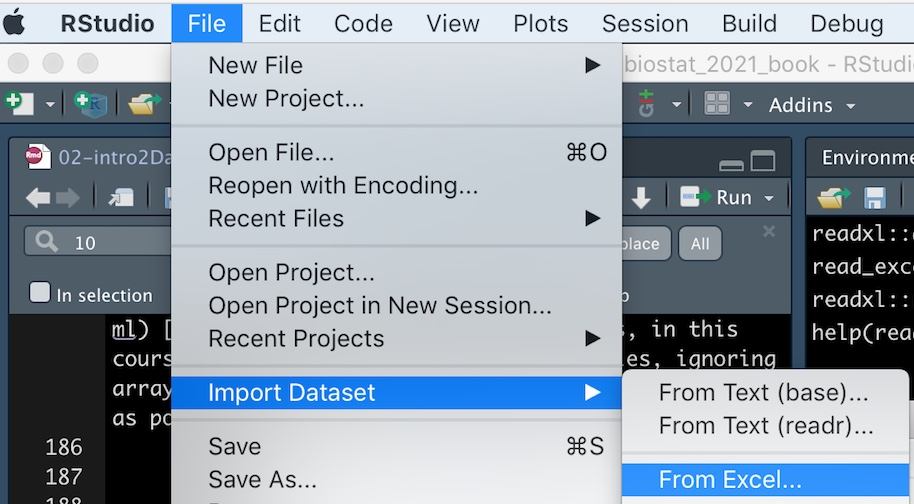

# Handling data in `R`  {#rdata}


```{r, echo = FALSE, message=FALSE}
library(knitr)
library(tidyverse)
library(blogdown)
library(tweetrmd)
library(tufte)
library(emo)
options(crayon.enabled = FALSE)   
```


```{r, echo=FALSE, message=FALSE, warning = FALSE}
grades <- tibble(
  last_name  = c("Horseman", "Carolyn"), 
  first_name = c("BoJack", "Princess"),
  exam_1     = c(70, 97)/2, 
  exam_2     = c(73, 95)/2
)

tidy_grades <-pivot_longer(data = grades, # Our data set
             cols = c(exam_1, exam_2),    # The data we want to combine
             names_to = "exam",           # The name of the new column in which we put old names.
             values_to = "score"          # The name of the new column in which we put the values.  
             )
```


```{block2, type='rmdtip'}
This is a lot getting started, remember our goal here is exposure, not mastery. Mastery will come as the term progresses. 
```


<span style="color: Blue;font-size:22px;">   Motivating scenarios:  </span>  <span style="color: Black;font-size:18px;"> We just got our data, how do we get it into `R` and explore? </span> 

**Learning goals: By the end of this chapter you should be able to get data  into `R` and explore it**. Specifically, students will be able to:

- *Load data into `R` and make their own tibbles.*       
- *[`filter`](https://dplyr.tidyverse.org/reference/filter.html), [`mutate`](https://dplyr.tidyverse.org/reference/mutate.html), [`arrange`](https://dplyr.tidyverse.org/reference/arrange.html), and [`select`](https://dplyr.tidyverse.org/reference/select.html) data with the [`dplyr`](https://dplyr.tidyverse.org/) package.*   
- *(Optional) Tidy data with the [`tidyr`](https://tidyr.tidyverse.org/) package.*   


```{block2, type='rmdwarning'}
There is no external reading for this chapter, but   

- Watch the required videos from Stat 545 -- one about using [dplyr](https://www.youtube.com/watch?v=Gms3zSPqCk8) and about [tidying data](https://www.youtube.com/embed/qivE6exNsZI) embeded in the text (feel free to skip the videos featuring me),  and
- Complete the `learnR` tutorials and quizes embeded in this chapter.        
- And canvas assignment which goes over the quiz, readings, tutorials and videos. 
```


## Intro

Through the rest of this chapter we will buy in fully to the tidyverse, so make sure it's installed and load it at the top of your script by typing and entering `library(tidyverse)`.   In the next portions of this section, we focus on how to load and process data with tidyverse tools in `R`.


But first, we describe the primary structure that holds data in the tidyverse, a `tibble`. A tibble is a data structure in which each column is a vector and (ideally) entries in a row are united by relating to the same observation (e.g. individual at a time). Each variable associated with an observation is a column (i.e. a vector), and all so while all entries in a column must be of the same class,  each column in a tibble can have its own class. Tibbles do not ensure that our data are tidy but they do make this easier.


If you have spent time in base `R` you are likely familiar with matrices, arrays, and data frames - don't even worry about these. A tibble is much like a data frame, but has numerous features that make them easier to deal with. If you care, see [chapter 10 of R for Data Science](https://r4ds.had.co.nz/tibbles.html) [@grolemund2018] for more info. Anyways, in this course we will focus on vectors and tibbles, ignoring arrays and matrices, and avoiding lists for as long as possible.
 


### First primer   

***Now is a great time to complete the [Primer on tibbles](https://rstudio.cloud/learn/primers/2.1)***,  embedded below (Fig. \@ref(fig:primer21)).   


```{r primer21, fig.cap = 'The RStudio [Primer on tibbles](https://rstudio.cloud/learn/primers/2.1)', echo=FALSE} 
include_app("https://rstudio.cloud/learn/primers/2.1")
```


## Getting Data into `R`    

Getting data into R is often the first challenge we run into in our first R analysis. The video (Fig: \@ref(fig:intoR)) and text below should help you get started. 


 
```{r intoR, fig.cap='Getting data into R (6 in and 6 seconds).', echo=FALSE, out.extra = 'allowfullscreen', out.width="40%", out.extra='style="float:right; padding:10px"'}
include_url("https://www.youtube.com/embed/d7gYc1o2M3c" , height = "200")
```


### Loading data 


Ideally, your data are stored as a `.csv`, and if so you can read data in with the [`read_csv()`](https://readr.tidyverse.org/reference/read_delim.html) function. `R` can deal with other formats as well. Notably, using the function [`readxl::read_excel()`](https://readxl.tidyverse.org/reference/read_excel.html) allows us to read data from *Excel*, and can take the Sheet of interest as an argument in this function. 

Here's an example of how to read data into `R`.

```{r, eval=FALSE}
library(tidyverse)
toad_data <- read_csv(file = "science_projects/Toads/data/toad_data.csv")
```

The bit that says `science_projects/Toads/data/` points `R` to the correct folder, while `toad_data.csv` refers to the file we're reading into `R` and assigning to `toad_data`. Using tab-completion in RStudio makes finding our way to the file less terrible. <span style="color: lightgrey;"> But you can also point and click your way to data (see below). If you do, be sure to copy and paste the code you see in the code preview into the script so you can recreate your analysis.</span>.
  


```{r fig.cap='', echo=FALSE}
#
```


```{block2, type='rmdtip'}
As above, best practices for loading data make use of R [projects](https://r4ds.had.co.nz/workflow-projects.html), so feel free to learn more. But for now, we're focused on *good enough* practices. 
```


### Entering data into `R` 

We can create tibbles manually. I present the simplest and most common way this is done.  

```{r}
toad_data <- tibble(             # This makes the data
  individual = c("a", "b", "c"),
  species    = factor(c("Bufo spinosus", "Bufo bufo", "Bufo bufo")),
  sound      = c("chirp", "croak","ribbit"),
  weight     = c(2, 2.6, 3),
  height     = c(2,3,2)
) 

toad_data                        # This shows the data
```


Feel free to [read about more ways to make tibbles](https://r4ds.had.co.nz/tibbles.html) if you desire. Many of these options are fun and useful,  but a distraction from our major mission

## Dealing with data in `R`


```{r Tips04, fig.cap='**Watch [this video](https://www.youtube.com/watch?v=91LmBj29-Sc)** introducing `dplyr` (watch the frist 5 min and 9 sec), from [STAT 545](https://stat545.com/) -- a grad level data science class at the University of British Columbia. We will borrow from this course occasionally.', echo=FALSE, out.extra= 'allowfullscreen'}
include_url("https://www.youtube.com/embed/Gms3zSPqCk8?end=309")
```


```{r fig.cap='', out.width='30%', echo=FALSE, out.extra='style="float:right; padding:10px"'}
knitr::include_graphics('https://github.com/A/stats-illustrations/raw/master/rstats-artwork/dplyr_wrangling.png')
```

Looking at the `toad.data` tibble above, we can get a sense of the utility of a tibble. We can see, not only the first few values of the data set, but also the class of each variable (`chr` for character, `fct` for factor, `dbl` for double -- a continuous class of data). 

### Viewing and glimpsing tibbles {#glimpse}

To see the entire dataset in a spreadsheet, type [`view(toad_data)`](https://tibble.tidyverse.org/reference/view.html). While this is not useful for the small toad_data we made, it could be more useful for the `starwars` data set already in tidyverse. Have a look with `view(starwars)`.

The [`glimpse()`](https://tibble.tidyverse.org/reference/glimpse.html) function is another useful way to explore a new, large data set. For example


```{r, echo=FALSE}
knitr::include_app('https://brandvain.shinyapps.io/glimpseintro/', height = '500px')
```


While these are among the very handy tidyverse functions, the real utility of tidyverse is that it gives us a unified way to  deal with data. Usually when we get data we want to handle/clean it, summarize it, visualize the results and develop a statistical model from it. This is where tidyverse really shines! 

We first focus on handling data with the `dplyr` package. Today we'll talk about using it to `filter`, `arrange`, and `mutate` our data, and to `select` columns of interest.


```{r fig.cap='From [`R` for data Science](https://r4ds.had.co.nz/) [@grolemund2018]', echo=FALSE}
knitr::include_graphics('https://d33wubrfki0l68.cloudfront.net/571b056757d68e6df81a3e3853f54d3c76ad6efc/32d37/diagrams/data-science.png')
```


```{r  echo = FALSE}
include_tweet("https://twitter.com/LucyStats/status/1087770108443815936", hide_thread=TRUE)
```


### `mutate` your data   

```{r fig.cap='', out.width='30%', echo=FALSE, out.extra='style="float:right; padding:10px"'}
knitr::include_graphics('https://github.com/allisonhorst/stats-illustrations/raw/master/rstats-blanks/dplyr_mutate_blank.png')
```


In our toad_data, we have height and weight. Let's add a column for  BMI (weight divided by height) with  the [`mutate()`](https://dplyr.tidyverse.org/reference/mutate.html) function.

```{r}
toad_data <- mutate(toad_data, BMI = height / weight)
toad_data
```


### `arrange` rows  

You might want to sort BMI from lowest to highest, or vice-versa. The [`arrange()`](https://dplyr.tidyverse.org/reference/arrange.html) function is here for you!  

```{r}
arrange(toad_data, BMI)       # arrange from lowest to highest
arrange(toad_data, desc(BMI)) # arrange from highest to lowest
```

### `filter` your data  


```{r fig.cap='', out.width='70%', echo=FALSE}
knitr::include_graphics('https://raw.githubusercontent.com/allisonhorst/stats-illustrations/master/rstats-artwork/dplyr_filter.jpg')
```


Say we only wanted to deal with individuals of the species,  *Bufo bufo*. We can [`filter()`](https://dplyr.tidyverse.org/reference/filter.html) our data to only have them! 

```{r}
filter(toad_data, species == "Bufo bufo" )
```

We can filter by any set of logical questions like greater than `>`, greater than or equal to `>=`, less than `<`, not equal `!=`, in a vector `%in%` etc... (see Ch \@ref(intro2r) for more info).   


### `select` your columns 

Let's say we didn't care about the height or weight, and we just wanted individual, species, sound, and BMI. We can  [`select()`](https://dplyr.tidyverse.org/reference/select.html) those columns as follows: 


```{r}
select(toad_data, individual, species, sound, BMI)
```

A negative sign in `select` means remove, so `select(toad_data, -height, - weight)` will give the same result as the code above. 


```{r}
select(toad_data, -height, -weight)
```


#### `pull()` vectors from tibbles
Some things we do in `R` require vectors to be pulled out of tibbles. We can achieve this with the [`pull()`](https://dplyr.tidyverse.org/reference/pull.html) function. For example, to get the BMI as a vector, type  

`pull(toad_data, var = BMI)`  


### Second primer   


***Now is a great time to complete the [Primer on isolating data with dplyr](https://rstudio.cloud/learn/primers/2.2)***,  embedded below (Fig. \@ref(fig:primer22)).   

Note - we won't be working on the last part `%>%` aka 'piping' until next class so, you can out that off for a few days.   


```{r primer22, fig.cap = 'The RStudio [Primer on isolating data with dplyr](https://rstudio.cloud/learn/primers/2.2)', echo=FALSE} 
include_app("https://rstudio.cloud/learn/primers/2.2")
```

## Tidying  messy data   


```{r fig.cap='Tidy tools require tidy data', echo=FALSE, out.width='80%'}
knitr::include_graphics('https://github.com/allisonhorst/stats-illustrations/raw/master/rstats-artwork/tidydata_3.jpg')
#include_tweet("https://twitter.com/LucyStats/status/1148634381352726528",hide_thread=TRUE)
```


In Ch. \@ref(data1), we saw that it is best to keep data in a tidy format, and in Section \@ref(tidyverse) we noted that Tidyverse tools have a unified grammar and data structure.  From the name, tidyverse, you could probably guess that tidyverse tools require tidy data -- data in which every variable is a column and each observation is a row. What if the data you loaded  are untidy? The [`pivot_longer`](https://tidyr.tidyverse.org/reference/pivot_longer.html) function in the [`tidyr`](https://tidyr.tidyverse.org/) package (which loads automatically with tidyverse) can help! Take this example dataset, about `grades` in last year's course. 

```{r, echo=FALSE}
grades <- tibble(
  last_name  = c("Horseman", "Carolyn"), 
  first_name = c("BoJack", "Princess"),
  exam_1     = c(70, 97)/2, 
  exam_2     = c(73, 95)/2
)

grades
```

This is not tidy. If it were tidy each observation would be a score on an exam. So we need to move exam to another column. We can do this!!!

```{r}
tidy_grades <-pivot_longer(data = grades, # Our data set
             cols = c(exam_1, exam_2),    # The data we want to combine
             names_to = "exam",           # The name of the new column in which we put old names.
             values_to = "score"          # The name of the new column in which we put the values.  
             )

tidy_grades
```

This function name, [`pivot_longer`](https://tidyr.tidyverse.org/reference/pivot_longer.html), makes sense because another name for tidy data is *long format*. You can use the [`pivot_wider`](https://tidyr.tidyverse.org/reference/pivot_wider.html) function to get data into a *wide format*.

Learn more about tidying messy data in Fig. \@ref(fig:tidying):

```{r tidying, fig.cap='Tidying data (first 5 min and 40 seconds are relevant).',  echo=FALSE, out.extra= 'allowfullscreen'}
include_url("https://www.youtube.com/embed/qivE6exNsZI?end=340")
```


## Think about reproducibility  

Science is iterative, social / collaborative, and builds on previous work. You should know that   

(1) Your first analysis is almost never your last.    
(2) Your will need to be able to explain EXACTLY what you did to others.   
(3) People might want to take you've done, understand it, and do it again on this or another data set, perhaps changing it a bit. 

Think about this when you work in `R`. I suggest asking yourself the following questions:   
(1) Could I explain what my code is doing to a colleague? What if I hadn't looked at it in a month?  Could someone who's pretty good with `R` look at my code and understand what I was trying to do?    
(2) Could my code work well (within minimal changes) on another data set? How about on another computer?   
If your work is fully reproducible, the answers should all be yes.   

One of the great things about scripting-based analyses that you can do in `R` (or similar programs) is that it facilitates us answering "yes" to most of these questions --- take advantage of this.   Always save your `R` script. Use enough commenting (`#`) to make sure it makes sense. Make sure it works from start to finish without anything in your `R` environment. etc...  


###  Assignment {-}

1. Complete RStudio's primers [on working with tibbles](https://rstudio.cloud/learn/primers/2.1) and [isolating data with `dplyr`](https://rstudio.cloud/learn/primers/2.2)

2. Complete the glimpse intro (\@ref(glimpse)) and the quiz (\@ref(Quiz)).  

3. Fill out the quiz on canvas, which is very simlar to the one below.


###  Quiz {#Quiz}

You know the drill... on [canvas](https://canvas.umn.edu/courses/225135/quizzes/410542)  

```{r, echo=FALSE}
knitr::include_app('https://brandvain.shinyapps.io/datainr/', height = '500px')
```


## Functions covered  in *Collecting and storing data + handling and visualizing it in `R`* 
All require the tidyverse package


### Functions for loading, formatting, and exploring data  

```{block2, type='rmdcode'}
[`tibble()`](https://tibble.tidyverse.org/reference/tibble.html): Entering data as a tibble. Give each column a name and assign its values with an equals sign, =. Separate columns with a comma ,.   
[`glimpse()`](https://tibble.tidyverse.org/reference/glimpse.html): Show the name of every column in your data frame, as well as their class and first few values.      
[`view()`](https://tibble.tidyverse.org/reference/view.html):   Look at your entire tibble as a scrollable spreadsheet.   
[`read_csv()`](https://readr.tidyverse.org/reference/read_delim.html):  Reads a dataset saved as a .csv into R.  
[`readxl::read_excel()`](https://readxl.tidyverse.org/reference/read_excel.html): Reads a  dataset saved as a .xlsx into R. You can also specify the sheet with *sheet =*.   
[`pivot_longer()`](https://tidyr.tidyverse.org/reference/pivot_longer.html): Allows use to tidy data.    
[`pivot_wider()`](https://tidyr.tidyverse.org/reference/pivot_wider.html): Allows use to go from tidy to wide data.   
```


### Functions for dealing with data   

```{block2, type='rmdcode'}
[`mutate()`](https://dplyr.tidyverse.org/reference/mutate.html): Add a new column, usually as some function of existing columns.   
[`arrange()`](https://dplyr.tidyverse.org/reference/arrange.html): Sort rows from low to high (or from high to low with `arrange(`[`desc()`](https://dplyr.tidyverse.org/reference/desc.html)`)`) values of a specified column.     
[`filter()`](https://dplyr.tidyverse.org/reference/filter.html):  Limit your dataset to those with certain values in specifed columns.  
[`select()`](https://dplyr.tidyverse.org/reference/select.html): Select columns of interest (or remove ones you do not care about with `select(-))` from your tibble.  ```


### dplyr cheat sheet

There is no need to memorize anything, check out this [handy cheat sheet](https://github.com/rstudio/cheatsheets/raw/master/data-transformation.pdf)!

```{r fig.cap='download the [dplyr cheat sheet](https://github.com/rstudio/cheatsheets/raw/master/data-transformation.pdf)', echo=FALSE}
knitr::include_graphics('https://d33wubrfki0l68.cloudfront.net/db69c3d03699d395475d2ac14d64f611054fa9a4/e98f3/wp-content/uploads/2018/08/data-transformation.png')
```


```{r, echo=FALSE}
rm(list = ls())
```
