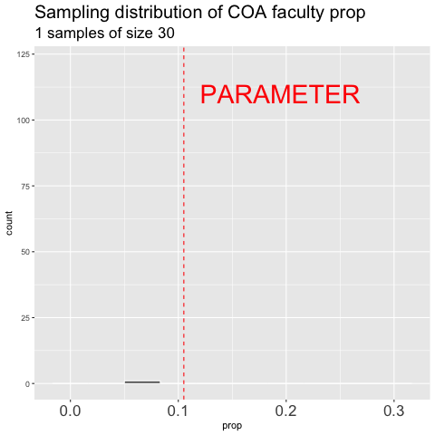

# Sampling  {#sampling}

```{r, echo = FALSE, warning=FALSE, message=FALSE}
library(tidyverse)
library(DT)
library(knitr)
library(blogdown)
library(beyonce, warn.conflicts=F, quietly=T)
library(stringr)
library(tweetrmd)
library(emo)
library(tufte)
library(cowplot)
library(lubridate)
library(ggthemes)
library(ggforce)
library(datasauRus)
library(ggridges)
library(randomNames)
library(infer)
```


```{block2, type='rmdnote'}
These notes accompany portions of Chapter 4  --- *Estimaing with Uncertainty* --- of our textbook, which we revisit in Section \@ref(uncertainty).   **The reading below is required,**  @whitlock2020 is  not.  

If you want a different (or another) presentiation of this material, I highly recommend [Chapter 7](https://moderndive.com/7-sampling.html) of [@ismay2019] as an optional reading.
```

<span style="color: Blue;font-size:22px;">   Motivating scenarios:  </span>  <span style="color: Black;font-size:18px;">   You want to understand the intellectual basis for a foundational challenge in statistics. </span> 
 
 
**Learning goals: By the end of this chapter you should be able to:**     

- Differentiate between a parameter and and an estimate.       
- Describe the different ways sampling can go wrong (sampling bias, nonindependence and sampling error) that make estimates deviate from parameters, and how to spot and protect against them.        
- Describe the sampling distribution and why it is useful.     
- Use `R` to build a sampling distribution from population data.  
- Describe the standard error.   
- Understand how sample size sample estimates.         


```{block2, type='rmdwarning'}
In addition to this reading,  the other assignment is to read pages [pages 104-112 and 126-133](https://drive.google.com/uc?export=download&id=1QIPjMf1xPEnE8pLdAwnChCgpeuaThX0T) about selection bias from Calling Bullshit [@bergstrom2020] and [Interleaf 2: psuedo-replication](https://drive.google.com/uc?export=download&id=1MBTwopPWgNzEHFmJC1aUKuqak8pAni4X) from the Analysis of Biological Data [@whitlock2020], and complete the sampling Quiz (Section \@ref(samplingQuiz)).  
```


## Populations have parameters


I went to a small college called College of The Atlantic. Because it is small, but can be accurately censused let's consider the academic population of this school -- consisting of all students and faculty.  College of The Atlantic prided itself on its student to faculty ratio -- there were 349 students and 41 faculty (so a 10.5\% of the academic  community are faculty).   

The calculation above is a **population parameter** it is the true value of the student to faculty ratio at the College of the Atlantic. This number could change (e.g. as student drop out or faculty get hired), and could be argued (e.g. do we count FTEs or number of people?), but as described it is known exactly as it is calculated by taking a census of the entire population.   

In frequentist statistics, **population parameters are the TRUTH** or the world out there as it really is, either from a population census, or from some process which will generate data with certain characteristics (e.g. flipping a coin, recombining chromosomes, responding to a drug etc...). In our example, the entire census data is presented in Figure \@ref(fig:coa). 


```{r, eval = FALSE}
coa <- read_csv("collegeOfAtlantic.csv")
```

```{r coa, fig.cap = 'Student and Faculty of College of the Atlantic (names are generated randomly, and do not reflect actual community members).', echo = FALSE}
rm(list = ls())
coa <- tibble(id = 1:390,
          name = randomNames(390),
          role = sample(rep(c("student","faculty"), times = c(349,41))))
DT::datatable(coa,options = list(pageLength = 5, lengthMenu = c(5, 10, 20, 50, 100)))
```


## We estimate population parameters by sampling  {#onesample}

```{r, echo=FALSE,cache=FALSE}
# Taking a random sample of 30 community members
# We do this without replacement because we can only sample an individual once. 
coa_sample <- sample_n(coa, size = 30, replace = FALSE) 
n_faculty  <- filter(coa_sample, role == "faculty") %>% nrow()
```

It is usually too much work, costs too much money, takes too much time etc. etc. to characterize an entire population and calculate its parameters. 
 
So we take **estimates from a sample of the population**. This is relatively easy to do in  `R` if we already have a population, we can use the [`sample_n()`](https://dplyr.tidyverse.org/reference/sample.html) function. The sample in the table below contains `r n_faculty` faculty and `r 30 - n_faculty`  students. So `r round(n_faculty/30 *100,digits = 2)`% of this sample are faculty -- a difference of about  `r round(abs((n_faculty/30 *100 - 10.5)),digits = 2)`% from the true population parameter of 10.5%.


```{r, eval=FALSE}
coa_sample <- sample_n(coa, size = 30) # Taking a random sample of 30 community members
```

```{r coaSample, fig.cap = 'Student and Faculty of College of the Atlantic (names are generated randomly, and do not reflect actual community members).', echo = FALSE}
DT::datatable(coa_sample, options = list(pageLength = 5, lengthMenu = c(5, 10, 20, 30)))
```


**Review of sampling**   


Of course, if we already had a well characterize population, there would be no need to sample -- we would just know actual parameters, and there would be no need to do statistics.   But this is rarely feasible or a good idea, and we're therefore stuck taking samples and doing statistics.  

As such, **being able to imagine the process of sampling** -- how we sample, what can go wrong in sampling **is perhaps the most important  part of being good at statistics.** I recommend walking around and imagining sampling in your free time.


```{block2, type='rmdnote'}
As discussed in Section \@ref(intro), sampling does not always mean taking a subsample from a larger population. For example, in an experiment we interfere with a system and see how this intervention changes some outcome things, or in flipping a coin we generate a new outcome that had not yet happened. Nonetheless, we can use the metaphor of sampling in all of these cases.
```


### (Avoiding) Sampling Bias

```{r, echo=FALSE, fig.cap = 'Example of sampling bias from [xkcd](https://xkcd.com/1999/)', out.width='30%',out.extra='style="float:right; padding:10px"'}
include_graphics("https://imgs.xkcd.com/comics/selection_effect.png")
```

Say we were interested to know if students or faculty spent more time on facebook. We could take our 30 individuals from our randomly generated sample above and take estimate for faculty and student. If we both students and faculty are equally likely to answer (honestly) we only have to deal with sampling error, discussed below. 

But maybe faculty who spent more time on facebook would be less likely to  answer this than students (or faculty who did not spend much time on facebook). Now we have to deal with bias in our sampling. This is why polling is so hard :(.


But it's often even worse -- we don't have a list of possible subject to pick from at random -- so what do we do?  An online survey? A phone call? Go to the cafeteria? You can see that each of these could introduce some  deviation between the rue population parameters and the sample estimate. This deviation is called [**sampling bias**](#samplingBias) and it can ruin all of the fancy statistical tricks we use to recognize sampling error.  


Say we are interested to estimate the proportion of College of the Atlantic's academic community that are faculty. If we go to a place where students are more likely to hang out then faculty, or vice versa, our estimate will be biased.


When designing a study, do everything you can to eliminate sampling bias, and when doing any analysis yourself or considering anyone else’s, always consider how sampling bias could mislead us.  


```{r selectionBias, out.width='25%', out.extra='style="float:right; padding:10px"', echo=FALSE}

#fig.cap =  'Be sure to read the [pages 104-112 and 126-133](https://drive.google.com/uc?export=download&id=1QIPjMf1xPEnE8pLdAwnChCgpeuaThX0T) about selection bias from Calling Bullshit [@bergstrom2020].'
```

```{block2, type='rmdwarning'}
This is a good time to remember the other assignment and read [pages 104-112 and 126-133](https://drive.google.com/uc?export=download&id=1QIPjMf1xPEnE8pLdAwnChCgpeuaThX0T) of Calling Bullshit [@bergstrom2020].  
```

### (Avoiding) nonindependence of Samples

One last important consideration of sampling is the independence of samples.   

- Samples are independent if sampling one individual does not change the probability of sampling another.  
- Samples are dependent (also called non-independent) if sampling one individual does not change the probability of sampling another.    


Say we are interested to estimate the proportion of College of the Atlantic's academic community that are faculty. If we go to a place where students and faculty are on average, equally likely to hang out, but faculty hang out with faculty and students hang out with students our sample will be dependent -- sampling one faculty would mean it's more likely to sample another.  

Near the end of the term, we'll consider ways of accounting for nonindependence. For now, know that dependence changes the process of sampling  and requires us to build more complex models.   

When designing an experiment, or considering someone else's, we therefore worry about **Pseudo-replication** the name for non-independent replication (See Fig. \@ref(fig:pseudorep1)). 


```{r pseudorep1, fig.cap = 'Comparing pseudo-replication (top) to independent replication (bottom). With pseudo-replication the effect of our experimental intervention (in this case fertilizer), is tied up with differences between environments unrelated to treatment (in this case, differences between gardens). Separating treatment and garden, and randomly placing treatments onto garden removes this issue.', echo=FALSE}
include_graphics("images/pseudorep.jpeg")
```


```{r pseudoread,  out.width='25%', out.extra='style="float:right; padding:10px"', echo=FALSE}
include_graphics("images/pseudorepRead.jpeg")
#fig.cap =  'Be sure to read the [interleaf from our textbook on pseudo-replication](https://drive.google.com/uc?export=download&id=1MBTwopPWgNzEHFmJC1aUKuqak8pAni4X).',
```


```{block2, type='rmdwarning'}
This is a good time to remember the other assignment and read [Interleaf 2 from our textbook on pseudo-replication](https://drive.google.com/uc?export=download&id=1MBTwopPWgNzEHFmJC1aUKuqak8pAni4X).  
```


### There is no avoiding sampling Error

Estimates from samples will differ from population parameters by chance. This is called sampling error (Introduced in  Section  \@ref(samplingerrorch01). But make no mistake -- **sampling error cannot be avoided**. We have just seen an example of sampling error when our estimate of the proportion faculty at the College of the Atlantic deviated from the true parameter.


Larger samples and more exacting measures can reduce sampling error, but it will always exist because we take our samples by chance. In fact, I would call it the *rule of sampling* rather than *sampling error*. 

All of the material in the rest of this chapter -- and about a half of the rest of this term -- concerns how to deal with the law of sampling error.  Sampling error is the obsession of many statistical methods.

## The sampling distribution


OK, say you collected data for a very good study, and you're very excited about it (as well you should be!). **`r ji("tada")` CONGRATS!`r ji("tada")` Stand in awe of yourself and your data** -- data is awesome and it is how we understand the world. 

But then get to thinking. We know that the law of sampling error means that estimates from our data will differ from the truth by chance. So, we start to imagine ''what could have other outcomes have been if the fates blew slightly differently?''

The **sampling distribution** is  our tool for accessing the alternate realities that could have been. The sampling distribution is a histogram of estimates we would get if we took a random sample of size $n$ repeatedly.  By considering the sampling distribution we recognize the potential spread of our estimate. 


```{block2, type='rmdnote'}
I keep saying how important sampling and he sampling distribution is. So, when, why, and how do we use it in statistics??? There are two main ways. 

- First, when we make an estimate from a sample, we build a sampling distribution around this estimate to describe uncertainty in this estimate (Section @\ref(uncertainty)).  

- Second, in null hypotheses significance testing (Section \@ref(test)) we compare our statistics to its sampling distribution under the null, to see how readily it could have been caused by sampling error.   

Thus the sampling distribution plays a key role in two of the major goals of statics - estimation and hypothesis testing.  
```


Wrapping your head around the sampling distribution is critical to understanding our goals in this term. It requires imagination and creativity. That is because we almost never have or can make an actual sampling distribution (because we don't have an actual population). Rather we have to imagine what it would look like under some model given our single sample. That is  **we recognize that we have only one sample, and will not take another, but we can imagine what other  estimates from another go at sampling would look like.** Watch the first five minutes of the video below for the best explanation of the sampling distribution I have come across. 


```{r, fig.cap ='Watch the first 5 minutes of this description of the sampling distribution. Burn this into your brain.', echo = FALSE, out.extra= 'allowfullscreen'}
include_url("https://www.youtube.com/embed/uPX0NBrJfRI?end=309" ) 
```

### Building a sampling distribution 


So, imagining a sampling distribution is very useful. But we need something more concrete than our imagination. How do we actually generate a useful sampling distribution??? 

#### Building a sampling distribution by repeatedly sampling  

```{r, eval=FALSE, echo=FALSE}
coa_dist<- lapply(500:1,function(i){
  prop <- sample_n(coa, size = 30) %>% filter(role == "faculty") %>% nrow() / 30
  tibble(trial = 500:i, prop)
  }) %>% bind_rows %>%
  filter(trial %in% c(1:10, 15,seq(25,500,25)))

coa_baseplot <- ggplot(coa_dist, aes(x = prop)) + 
  geom_histogram(binwidth = 1/30, color = "white")+
  theme(axis.text.x = element_text(size=15)) + 
  geom_vline(xintercept = 41/390, color = "red", lty = 2)

coa_sampling <- coa_baseplot + 
  transition_states(trial,transition_length = .2, state_length = .2)+
  labs(title = 'Sampling distribution of COA faculty prop', 
       subtitle = "{closest_state} samples of size 30")
anim_save("images/coasampling.gif", coa_sampling)
```


The most conceptually straightforward way to generate a sampling distribution is to take a bunch of random samples from our population of interest.  


```{r coadist, fig.cap = 'Building the sampling distribution for the faculty proportion at College of The Atlantic.',echo=FALSE, out.width='40%',out.extra='style="float:right; padding:10px"'}

```


Figure \@ref(fig:coadist) shows the different estimates of the proportion of faculty at College of the Atlantic with an unbiased an independent sample of size 30 -- building a histogram of sample estimates if we were to sample a bunch. This histogram is known as the **sampling distribution**.


We can make a sampling distribution by resampling from a population with the [`rep_sample_n()`](https://infer.netlify.app/reference/rep_sample_n.html) function and some data wrangling in `R`. The [`rep_sample_n()`](https://infer.netlify.app/reference/rep_sample_n.html) function, which requires the [`infer`](https://infer.netlify.app/index.html) package (install with `install.packages("infer"))` works just like the [`sample_n()`](https://dplyr.tidyverse.org/reference/sample.html) function, above, but it makes `reps` independent replicates of samples of the desired `size`. 

```{r, echo=FALSE}
sample.size <- 30
n.reps      <- 1000
```

```{r, eval=FALSE}
library(infer)
sample.size <- 30
n.reps      <- 1000

coa.sampling.dist <- coa %>%
  rep_sample_n(size = sample.size, reps = n.reps) %>%
  summarise(prop = sum(role == "faculty") / sample.size)  # count faculty and divide by sample size

ggplot(coa.sampling.dist, aes(x = prop))                  +
  geom_histogram(binwidth = 1/30, color = "white")        +
  ggtitle("Sampling distribution of COA faculty ratio")   + 
  geom_vline(xintercept = 41/390, color = "red", lty = 2) + 
  annotate(x = .12, y = 240, geom = "text", hjust = 0,
           label = "PARAMETER", color = "red")
  
```


*While this approach is conceptually straightforward it is also silly and not useful in practice* -- there is no reason to characterize a whole population and then resample from it to make an estimate. More often, we have an estimate from a single sample and need some way to consider the sampling distribution. 


#### Building a sampling distribution by simulation

If we have some sense (or hypothesis) of how our population might behave wa can simulate data from it. Like most programming languages, `R`  allows or incredibly complex simulations (I've simulated whole genomes), but for now, let's simulate the process of sampling with the [`sample()`](https://stat.ethz.ch/R-manual/R-devel/library/base/html/sample.html) function.

For example, we can generate a sample from a population in which I hypothesized that 10.5\% of the academic community was faculty.

```{r}
my.sample <- sample(c("student","faculty"), 
                    size = sample.size, 
                    prob = c(89.5, 10.5), 
                    replace = TRUE) # Sample with replacement, because we are simulating people, not selecting them from a population 
my.sample
```

and then find the proportion that are faculty. 

```{r}
mean(my.sample == "faculty")
```

Note that unlike our sampling from a population, ''observations'' in this simulated ''sample'' do not have names. That's because we are simulating data, not sampling subjects from a  population.


We could do this a bunch of times by simulating a bunch of samples (`n.reps`) each of size `sample.size`. The `R` code below provides one way to do this.  

```{r}
simulated_data <- tibble(replicate   = rep(1:n.reps, each = sample.size), 
                         # Here we make a bunch of replicate ids numbered 
                         # 1:n.reps, repeating each id sample.size times.   
                         role = sample(c("student","faculty"),
                                              size = sample.size * n.reps, 
                                              prob = c(.9,.1), 
                                              replace = TRUE) ) 
                         # Here, we simulate a bunch (sample.size * n.reps) of observations, 
                         # assigning the first sample.size observations to replicate 1,
                         # the second sample.size  observations to replicate 2 etc. etc...  
```
```{r, echo=FALSE}
DT::datatable(simulated_data %>% filter(replicate < 20), options = list(pageLength = 5, lengthMenu = c(5, 30, 90)))
```


We can then make an estimate from each replicate using the [`group_by()`](https://dplyr.tidyverse.org/reference/group_by.html) and [`summarise()`](https://dplyr.tidyverse.org/reference/summarise.html) functions we first learned in Section \@ref(summaRy).   

```{r, echo = FALSE, message=FALSE, warning=FALSE}
coa.sampling.dist <- simulated_data %>%
  group_by(replicate)       %>%
  summarise(prop = sum(role == "faculty") / sample.size) # count faculty and divide by sample size
```

```{r, eval = FALSE}
coa.sampling.dist <- simulated_data %>%
  group_by(replicate)       %>%
  summarise(prop = sum(role == "faculty") / sample.size)  # count faculty and divide by sample size

ggplot(coa.sampling.dist, aes(x = prop))                  +
  geom_histogram(binwidth = 1/30, color = "white")        +
  ggtitle("Sampling distribution of COA faculty ratio")   + 
  geom_vline(xintercept = 41/390, color = "red", lty = 2) + 
  annotate(x = .12, y = 240, geom = "text", hjust = 0,
           label = "PARAMETER", color = "red")
```

#### Building a sampling distribution by math   


We can also use math tricks to build a sampling distribution. Historically, simulation was impractical because computers didn't exist, and then were too expensive, or too slow, so mathematical sampling distributions were how stats was done for a long time. Even now because simulation can take a bunch of computer time, and because it too is influenced by chance, a majority of statistical approaches use mathematical sampling distributions. 

We will make use of a few classic sampling distribution over this course, including the $F$, $t$, $\chi^2$, binomial, and $z$ distributions. For now, recognize that these distributions are simply mathematically derived sampling distributions for different models. They aren't particularly scary or special.    


## Standard error   

The **standard error**, *which equals the standard deviation of the sampling distribution, describes the expected variability due to sampling error of a sample from a population*. Recall from Chapter [summaRy], that the sample standard deviation, $s$ is the square root  of the average squared difference between a value and the mean ($s = \frac{\Sigma (x_i - \overline{x})^2}{n}$), where we divide by $n-1$ instead of $n$ to get an unbiased estimate. For our calculation here, $x_i$ represents the estimated mean of the $i^{th}$ sample, $\overline{x}$ is the population mean (.104 for our faculty proportion example), and $n$  is the number of replicates (`n.reps` in our code above).    


The standard error is a critical description of uncertainty in an estimate (See Section \@ref(uncertainty)).  If we have a sampling distribution, w can calculate it as follows. 

```{r}
summarise(coa.sampling.dist, standard.error = sd(prop))
```


## Minimizing sampling error 

We cannot eliminate sampling error, but we can do things to decrease it. Here are two ways we can reduce sampling error:   

1. **Decrease the standard deviation in a sample**. We only have so much control over this, because nature is variable, but more precis measurements,  more homogenous experimental conditions, and the like can decrease the variability in a sample. 

2. **Increase the sample size**. As the sample size increases, our sample estimate gets closer and closer to the true population parameter. This is known as the law of large numbers.  Remember that changing the sample size will not decrease the variability in our sample, it will simply decrease the expected difference between the sample estimate and the population mean.    
  

The webapp (Figure @\ref(fig:samplingwebapp), below) from @whitlock2020 below allows us to simulate a sampling distribution from a normal distribution (we return to  a normal distribution in Section \@ref(normal)). Use it  to explore how sample size ($n$) and variability (population standard deviation, $\sigma$) influence the extent of sampling error. To do so,    

1. First click the *sample one individual*  button a  few times. When you get used to that,   
2. Click *complete the sample of ten*, and then *calculate mean*. Repeat that a few times until you're used to it.   
3. Then click *means for many samples* and try to interpret the output.   
4. Next, click *show sampling distribution*.   
5. Finally, pick different combinations of $n$ and $\sigma$ -- increasing and decreasing them one at a time or together and go through steps 1-4 until you get a sense for how they impact the width of the sampling distribution.    


```{r samplingwebapp, fig.cap = 'Webapp from @whitlock2020 showing the process of sampling and the sampling distribution. Find it on [their website](https://www.zoology.ubc.ca/~whitlock/Kingfisher/SamplingNormal.htm).', echo=FALSE}
include_app("https://www.zoology.ubc.ca/~whitlock/Kingfisher/SamplingNormal.htm")
```


### Be warry of exceptional results from small samples  

Because  sampling error is most pronounced in a small sample, estimates from small samples can mislead us. Figure \@ref(fig:smallN) compares the sampling distributions for the proportion faculty in a sample of size 5 and 30. Nearly 57% of samples of size of five have exactly zero faculty. So seeing no faculty in this sample would be unsurprising, but facilitates misinterpretation.  Imagine the headlines


> "Experimental college where students learn without faculty..."
> `r tufte::quote_footer('--- Some unscrupulous newspaper, probably.')`


The very same sampling procedure from that same population will also result in an extreme proportion of faculty (60% or greater) for one in one-hundred samples of size five. A sample like this would yield a quite different headline. 


> "Experimental college where faculty outnumber students..."
> `r tufte::quote_footer('--- Some unscrupulous newspaper, probably.')`

A sample of size 30 is much less likely to mislead -- it will only yield a sample with zero faculty 3.6 percent of the time, and will essentially never yield a sample with more than 50% faculty.   

The numbers I gave above are correct and scary. But it gets worse -- since unexceptional numbers are hardly worth reporting (illustrated by the light grey coloring of unexceptional values in Figure \@ref(fig:smallN)), so we'll rarely see accurate  headlines like this. 


> "Check out this college with a totally normal  faculty to student ratio..."
> `r tufte::quote_footer('--- A responsible, but quite boring newspaper.')`  


```{r smallN, fig.cap = 'Comparing the sampling distribution of faculty proportion in samples of size five and thirty. The true population proportion is 0.105. Bars are colored by if they are likely to be reported, with unremarkable observations blending into the background.', echo=FALSE, cache=TRUE, message=FALSE, warning=FALSE, fig.height=1.7, fig.width=4.75}
sample.size <- c(5, 30)
n.reps      <- 100000
coa.samples.by.n <- lapply(sample.size, function(N){coa %>%
    rep_sample_n(size = N, reps = n.reps) %>%
    summarise(prop = sum(role == "faculty") / N)  %>%
    mutate(sample.size = N) }) %>%
    bind_rows() %>%
    mutate(`Worth reporting` = ifelse( prop < .02 | prop > .3, "Yes", "No"))
    
ggplot(coa.samples.by.n, aes(x = prop, fill = `Worth reporting`))                  +
    geom_histogram(binwidth = 1/30, color = "white", size = .1)        +
    ggtitle("Sampling distribution of COA faculty ratio")   + 
    facet_wrap(~sample.size, labeller = "label_both")+
    geom_vline(xintercept = 41/390, color = "red", lty = 2) + 
    annotate(x = .12, y = 50000, geom = "text", hjust = 0,
             label = "Parameter", color = "red", alpha = .5) +
  scale_fill_manual(values = c("lightgrey","black"))
  
```

**The take home message here is** whenever you see some exceptional claim be sure to look into the sample size, and measures of uncertainty, which w discuss in Section \@ref(uncertainty). For a nice discussion check out this optional reading, [The most dangerous equation](https://www.americanscientist.org/article/the-most-dangerous-equation) [@wainer2007].  


### Small samples overestimation and the file drawer problem  

Say you have a new and exciting idea -- say a pharmaceutical intervention to cure a deadly cancer. Before you do a huge study, you may want to do a small pilot project with a limited sample size -- as this would be necessary before getting a bunch of money and permits and allotting time etc... 

- **What if you found a super cool result??** -- the drug worked even better than you initially hoped? You would probably jump up and down and shout it from the rooftops -- put out a press release etc...    

- **What if you found something very subtle??** -- the drug might have helped, but you can't really tell. Maybe you'd keep working on it, but more likely you would drop it and move on to a more promising target. 

After reading this Section, you know that these two outcomes could happen for two drugs with the exact same effect (see Figure \@ref(smallN)). This combination of sampling and human nature has the unfortunate consequence that reported results are often biased towards extreme outcomes. This issue, known as the **file drawer problem** (because underwhelming results are kept in a drawer somewhere until some mythical day when we have time and energy to share them), means that most published results are overestimated, modest effects are under-reported, and follow up studies tend show weaker effects than early studies.  Importantly, this happens even if all experiments themselves are performed without bias, and insisting on statistical significance  (Section \@ref(test)) does not help.   


## Sampling Quiz {#samplingQuiz -} 

```{r, echo=FALSE}
knitr::include_app('https://brandvain.shinyapps.io/sampling/', height = '800px')
```


## Sampling: Definitions and R functions {-}     

### Sampling: Critical definitions   {-}   

#### Newly introduced terms {-}   


```{block2, type='rmddef'}
**Standard error** A measure of how far we expect our estimate to stray from the true population parameter.  We quantify this as the standard deviation of the sampling distribution.   
 
**Pseudo-replication** Analyzing non-independent samples as if they were independent. This results in misleading sample sizes and tarnishes statistical procedures.  
```

#### Review of terms from Section \@ref(intro) {-}   

Many of the concepts discussed in this chapter were first introduced in Section [intro] and have been revisited in greater detail in this chapter. 

```{block2, type='rmddef'}
**Population:**  A  collection of all individuals of a circumscribed type, or a generative process from which we can generate  samples.   

**Sample:** A subset of a population -- individuals we measure.    

**Parameter:** A true measure of a population.   

**Estimate:** A guess at a parameter that  made from a finite sample. 

**Sampling error:** A deviation between parameter and estimate attributable to the finite process of sampling.   

**Sampling bias:** A deviation between parameter and estimate attributable to non representative sampling.     

**Independence:** Samples are independent if  the probability that one individual is studied is unrelated to the probability that any other individual is studied.
```

### Functions for sampling in `R`   {-}   
  

```{block2, type='rmdcode'}
[`sample(x = , size = , replace = , prob =  )`](https://stat.ethz.ch/R-manual/R-devel/library/base/html/sample.html):     Generate a sample of size `size`, from a vector `x`, with (`replace = TRUE`) or without (`replacement = FALSE`) replacement. By default the size is the length of `x`, sampling occurs without replacement and probabilities are equal. Change these defaults by specifying a value for the argument. For example, to have unequal sampling probabilities, include a vector of length `x`, in which the $i^{th}$ entry describes the relative probability of sampling the $i^{th}$ value in `x`.

[`sample_n(tbl = , size = , replace = , weight = )`](https://dplyr.tidyverse.org/reference/sample.html):  Generate a sample of size `size`, from a tibble `tbl`, with (`replace = TRUE`) or without (`replacement = FALSE`) replacement. All arguments are the same as in `sample()` except `weight` replaces `prob`, and `tbl` replaces `x`. `sample_n()` is a function in the `dplyr` package, which is loaded with tidyverse.   

[`rep_sample_n()`](https://infer.netlify.app/reference/rep_sample_n.html): Generate `reps` samples of size `size`, from a tibble `tbl`, with (`replace = TRUE`) or without (`replacement = FALSE`) replacement. All arguments are the same as in `sample()`,  except `tbl` replaces `x`, and `reps` allows us to specify how many samples of size `size` we would like. `rep_sample_n()` returns a tibble grouped by replicate.  `rep_sample_n()` is a function in the `infer` package, which must be installed and loaded in addition to tidyverse.     
```


