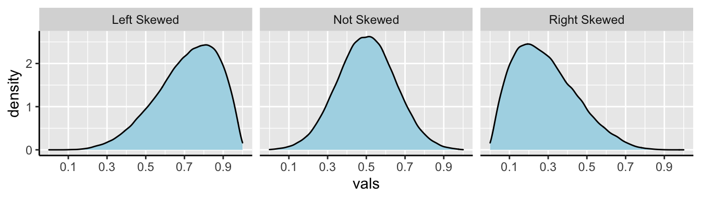
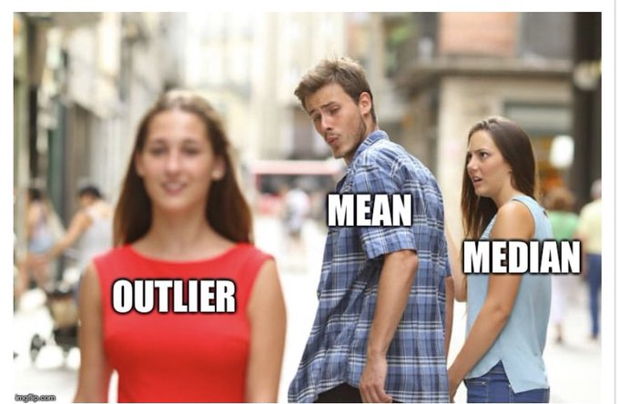
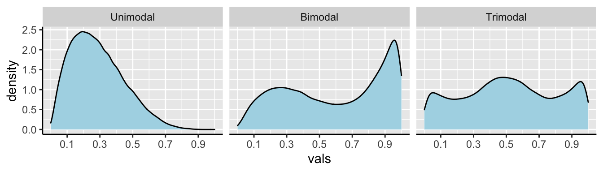
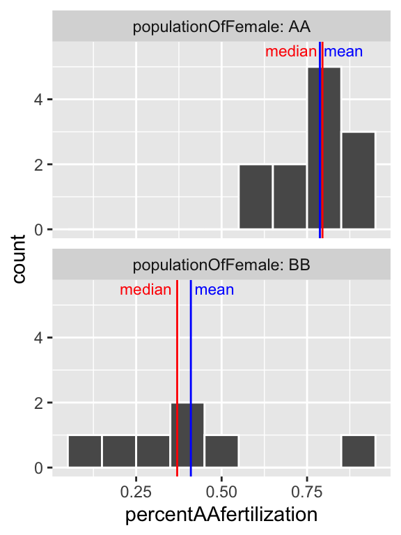
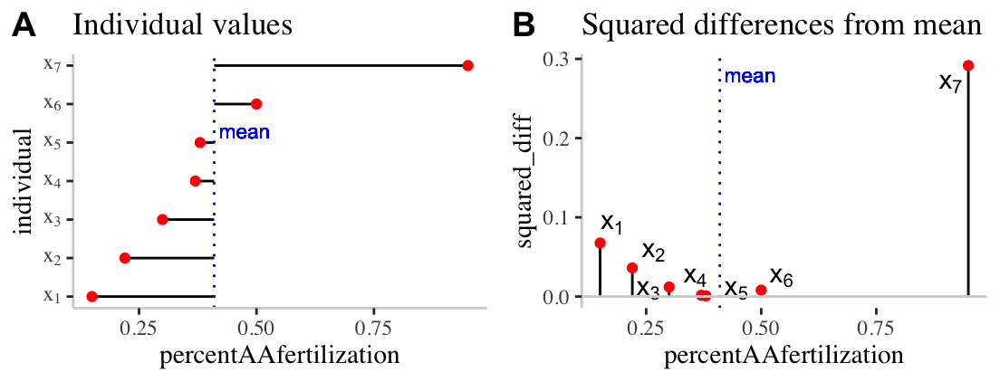

# (PART) Describing and visualizing data {-}

# Summarizing data {#summaRy}  

```{r, echo = FALSE, message=FALSE}
library(knitr)
library(tidyverse)
library(blogdown)
library(tweetrmd)
library(tufte)
library(cowplot)
library(emo)
library(DT)
```


```{block2, type='rmdnote'}
These notes accompany portions of Chapter 3 — Describing Data — of our textbook. The reading below is required, @whitlock2020 is not.
```


<span style="color: Blue;font-size:22px;">   Motivating scenarios:  </span>  <span style="color: Black;font-size:18px;"> You want to communicate simple summaries of your data or understand what people mean in their summaries.  </span>   


**Learning goals: By the end of this chapter, you should:**  

- Be able to explain and interpret summaries of the location and spread of a dataset.  
- Recognize and use the mathematical formulae for these summaries.  
- Calculate these summaries in R.  
- Use a histogram to responsibly interpret a given numerical summary, and to evaluate which summary is most important for a given dataset (e.g. mean vs. median, or variance vs. interquartile range).    


```{block2, type='rmdwarning'}
The other reading assignment for class is to watch the [video about data summaries](https://www.youtube.com/watch?v=mc-6-v2c4WM) from Calling Bullshit [@bergstrom2020], [this video](https://www.youtube.com/watch?v=bPFNxD3Yg6U) from crash course on the shape of data, and [this video](https://www.youtube.com/watch?v=38BA_v7BwKk&feature=emb_logo) from stat 545 on calculating summaries in R. 
```

##  Four things we want to describe

While there are many features of a dataset we may hope to describe, we mostly focus on four types of summaries:  

- The **location** of the data: e.g. mean, median, mode, etc...   
- The **shape** of the data: e.g. skew, number of modes, etc...   
- The **spread** of the data: e.g. range, variance, etc...   
- **Associations** between variables: e.g. correlation, covariance, etc...    

Today we focus mainly on the spread and location of the data, but regularly bring up the shape of the data, as the meaning of other summaries depend on the shape of the data. We save summaries of associations between variables for later chapters. 


```{block2, type='rmdnote'}

Whenever weare summarizing data, we are making an estimate from a sample, and do not have a parameter from a population.

In stats we use Greek letters to describe parameter values, and the English alphabet to show estimates from our sample.

We usually call summaries from data *sample means*, *sample variance* etc. to remind everyone that these are estimates, not parameters. For some   calculations (e.g. the variance) the equations to calculate the parameter from a population differ slightly from equations to calculate the parameter from a population, because otherwise estimates would be biased.
```


## Data sets for today  

We'll rely on a few data sets to work through these concepts, one from our textbook, and two of which are built into `R`.   

- `bindin` describes the proportion of sea urchin females of genotype AA or BB at the bindin locus fertilized by sperm from a male with an AA genotpe at the lysin gene. These two genes are known to interact to facillitate fertilization in sea urchin.       

- `rivers` gives the lengths (in miles) of 141 "major" rivers in North America, as compiled by the US Geological Survey.   

We load the `bindin` data set with the following code:


```{r, message=FALSE, echo=FALSE}
bindin_link <- "data/chap03q28SeaUrchinBindin.csv"
bindin <- read_csv(bindin_link)
```

```{r, message=FALSE, eval=FALSE}
bindin_link <- "https://whitlockschluter3e.zoology.ubc.ca/Data/chapter03/chap03q28SeaUrchinBindin.csv"
bindin <- read_csv(bindin_link)
```

## Measures of location 

```{r, echo = FALSE, fig.cap = 'Watch [this video](https://www.youtube.com/watch?v=mc-6-v2c4WM) on Calling Bullshit on summarizing location (15 min and 05 sec).'}
include_url("https://www.youtube.com/embed/mc-6-v2c4WM")
```
 
We hear and say the word, "Average", often. What do we mean when we say it? "Average" is an imprecise term for a middle or typical value. More precisely we talk about:     

-  **Mean** (aka  $\overline{x}$):  The expected value. The weight of the data. We find this by adding up all values and dividing by the sample size. In math notation, this is  $\frac{\Sigma x_i}{n}$, where  $\Sigma$ means that we sum over the first $i = 1$, second $i = 2$ ... up until the $n^{th}$ observation of  $x$, $x_n$. and divide by  $n$, where  $n$ is the size of our sample.   

- **Median**: The middle value. We find the median by lining up values from smallest to biggest and going half-way down.  

- **Mode**: The most common value in our data set.   

Let's explore this with the bindin data.


```{r, echo=FALSE}
bindin <- sample_n(bindin, size = n())
DT::datatable(bindin,  options = list(pageLength = 5, lengthMenu = c(5, 10, 15, 20)))
```


To keep things simple, let's focus on just the BB genotype, isolating it using the [`filter()`](https://dplyr.tidyverse.org/reference/filter.html) function we encountered in [Chapter 2](#data1). Let's also [`arrange()`](https://dplyr.tidyverse.org/reference/arrange.html) these data from smallest to largest value to make it easiest to find the median.

```{r}
bindin.BB <- bindin %>% 
  filter(populationOfFemale == "BB")%>% 
  arrange(percentAAfertilization)

bindin.BB 
```


- We can calculate the **sample mean** as   $\overline{x} = \frac{\Sigma{x_i}}{n}$     so,   
$\overline{x} = \frac{`r paste(pull(bindin.BB,percentAAfertilization), collapse = " + ")`}{`r nrow(bindin.BB)`}$       
$\overline{x} = \frac{`r sum(pull(bindin.BB,percentAAfertilization))`}{`r nrow(bindin.BB)`}$    
$\overline{x}= `r sum(pull(bindin.BB,percentAAfertilization)) /  nrow(bindin.BB)`$    

- We can calculate the **sample median** by going halfway down the table and take the  $\frac{n+1}{2}^{th} = \frac{4+1}{2}^{th}  = \frac{8}{2}^{th} = 4^{th}$  value, which is 0.37.     


```{block2, type='rmdnote'}
**NOTE:** If $n$ is even, the median is the sum of the  ordered $\frac{n}{2}^{th}$ and $\frac{n+2}{2}^{th}$   values divided by two.
```

### Getting summaries in R

The [`summarise()`](https://dplyr.tidyverse.org/reference/summarise) function in R reduces a data set to summaries that you ask it for. So, we can use tell R to summarize these data as follows.

```{r}
bindin.BB %>%
  summarise(mean_fert_1 = sum(percentAAfertilization) / n(), 
            mean_fert_2 = mean(percentAAfertilization),
            median_fert = median(percentAAfertilization))
```


- For `mean_fert_1` we took the sum with the [`sum()`](https://stat.ethz.ch/R-manual/R-devel/library/base/html/sum.html) function, and divided by the length, found with the [`n()`](https://dplyr.tidyverse.org/reference/n) function.   

- For `mean_fert_2` we directly used the [`mean()`](https://stat.ethz.ch/R-manual/R-devel/library/base/html/mean.html) function. These two values should be the same, and should equal our math above.   

- We found the median with the [`median()`](https://stat.ethz.ch/R-manual/R-devel/library/base/html/median.html) function.   


```{block2, type='rmdnote'}
Note, we can choose any name we want for these summarized columns - just make sure they follow best practices described in [Chapter 2](#data1).
```

#### Quiz: Getting summaries in R {-}   

```{r, echo=FALSE}
include_app("https://brandvain.shinyapps.io/one_group/")
```


### Getting summaries by group in R

```{r, fig.cap = 'Watch [this video](https://www.youtube.com/watch?v=38BA_v7BwKk&feature=emb_logo) from Stat 545, which combines a refresher on [`group_by()`](https://dplyr.tidyverse.org/reference/group_by.html) and calculates summaries by group (7 min and 25 sec).',  echo=FALSE,  out.extra= 'allowfullscreen'}
include_url("https://www.youtube.com/embed/38BA_v7BwKk")
```


Returning to our full data set, let's say we wanted to get the mean for females from the AA and BB populations, separately. Here, we can combine the [`group_by()`](https://dplyr.tidyverse.org/reference/group_by.html) function from Chapter @\ref(rdata) with the [`summarise()`](https://dplyr.tidyverse.org/reference/summarise) function introduced above.   

```{r}
bindin                                                   %>%
  group_by(populationOfFemale)                           %>%
  summarise(mean_fert   = mean(percentAAfertilization), 
            median_fert = median(percentAAfertilization))
```

So, it looks like AA sperm successfully fertilize AA eggs $\approx 79\%$ of attempts, while sperm from the AA population fertilizes eggs from the BB population in  $\approx 40\%`$ of attempts. These answers are pretty similar whether we look at the median or mean. Later in the term, we look into evaluating how weird it would be to see this extreme of a difference if the females where from the same (statistical) populations.


```{block2, type='rmdnote'}
If you type the code above, R will say something like `summarise(…, .groups ="drop_last")`. R is saying that it does not know which groups you want it to drop when you are summarizing (if you’re grouping by more than one thing, which we a are not). To make this go away, type:   

`summarise(..., .groups = "drop_last")` to drop the last thing in [`group_by()`](https://dplyr.tidyverse.org/reference/group_by.html),  
`summarise(..., .groups = "drop")` to drop all things in [`group_by()`](https://dplyr.tidyverse.org/reference/group_by.html),    
`summarise(..., .groups = "keep")` to drop no things in [`group_by()`](https://dplyr.tidyverse.org/reference/group_by.html), or     
`summarise(..., .groups = "rowwise")` to keep each row as its own group.   
```


## Summarizing shape of data   

```{r shape, fig.cap= 'The shape of distributions from [Crash Course Statistics](https://www.youtube.com/watch?v=bPFNxD3Yg6U).', echo=FALSE}
include_url("https://www.youtube.com/embed/bPFNxD3Yg6U")
```

**Always look at the data before** interpreting or presenting a quantitative summary. A simple histogram is best for one variable, while scatterplots are a good starting place for two continuous variables.   

🤔WHY? 🤔 Because knowing the shape of our data is critical for making sense of any summaries.   


### Shape of data: Skewness  


Let us have a look at the river dataset  


```{r, eval = FALSE}
# ggplot needs tibbles. So 
# let's make river_length a column in a tibble called river.length
river.length <- tibble(river_length = rivers) 

ggplot(river.length , aes(x=river_length))+
  geom_histogram(bins = 30, color = "white") # for now ignore code for added elaborations (labeling mean and median)
```

```{r medianmean, echo=FALSE, fig.height=1.7, fig.width=4, fig.cap= 'Histogram of river length dataset. The  median is the <span style="color:red">dashed red line</span>, and the median is shown by the <span style="color:blue">solid blue line</span>.'}
river.length <- tibble(river_length = rivers) 

ggplot(river.length , aes(x=river_length))+
  geom_histogram(bins = 30, color = "white")+
  geom_vline(xintercept = median(river.length$river_length), color = "red", lty = 2)+
  annotate(x = median(river.length$river_length), y = 45, color = "red", label = "median ", geom = "text",hjust = 1, size = 3)+
  geom_vline(xintercept = mean(river.length$river_length), color = "blue")+
  annotate(x = mean(river.length$river_length), y = 45, color = "blue", label = " mean", geom = "text",hjust = 0, size = 3)+
  scale_y_continuous(limits = c(0,50)) 
```

We notice two related things about Figure \@ref(fig:medianmean):   
1. There are a numerous extremely large values.   
2. The median is substantially less than the mean.    

We call data like that in Figure \@ref(fig:medianmean) **Right skewed**, while data with an excess of extremely small values, and with a median substantially greater than the mean are Left **skewed**.    

In Figure \@ref(fig:skew1), we show example density plots of left-skewed, unskewed, and right-skewed data.

```{r skew1, fig.cap = 'Examples of skew.', echo=FALSE}

```


```{block2, type='rmdwarning'}
For skewed data sets, the median is often a more relevant description of the data set than the mean, because it better describes a typical data point.*
```


```{r , echo=FALSE}

```


### Shape of data: Unimodal, bimodal, trimodal

```{r, eval=FALSE}
ggplot(bindin , aes(x = percentAAfertilization))+
  geom_histogram(bins = 8, color = "white") # for now ignore code for added elaborations (labeling mean and median)
```


```{r medianmean2, echo=FALSE, fig.height=1.7, fig.width=3, fig.cap= 'Histogram of bindin  dataset. The  median is the <span style="color:red">dashed red line</span>, and the median is shown by the <span style="color:blue">solid blue line</span>.'}

ggplot(bindin , aes(x = percentAAfertilization))+
  geom_histogram(bins = 8, color = "white")+
  geom_vline(xintercept = median(bindin$percentAAfertilization), color = "red", lty = 2)+
  annotate(x = median(bindin$percentAAfertilization), y = 6, color = "red", label = " median", geom = "text",hjust = 0, size = 3)+
  geom_vline(xintercept = mean(bindin$percentAAfertilization), color = "blue")+
  annotate(x = mean(bindin$percentAAfertilization), y = 6, color = "blue", label = "mean ", geom = "text",hjust = 1, size = 3)+
  scale_y_continuous(limits = c(0,6.5)) 
```


We notice two things about Figure \@ref(fig:medianmean2).   
1. There is an excess of small values and the mean is way smaller than the median, so this is left skewed.   
2. It looks like there are two modes here -- one near 0.3, and one near 0.8.    

We call data with two modes, as we see in \@ref(fig:medianmean2) **bimodal**. By contrast, the river length data (Fig. \@ref(fig:medianmean)) has only one mode, so it is **uniomodal**. If we had three modes, (i.e. three bumps in a histogram) it would be **trimodal** (Fig. \@ref(fig:modes1)).

```{r, modes1, fig.cap= 'Examples of unimodal, bimodal, and trimodal data.',echo=FALSE}

```


Often, multimodal data sets suggest that our sample contains a mix of observations of individuals from different populations. This may be going on in the bindin data set as we have females from two different populations. This could be happening here, as we recall from our summaries that the different types of females have different means…

Let’s have a look!

```{r,  eval=FALSE}
ggplot(bindin , aes(x = percentAAfertilization))+
  geom_histogram(binwidth =  .1, color = "white")     + 
  facet_wrap(~populationOfFemale, ncol =1, labeller = "label_both")
```


```{r, bindinHist2, fig.cap = 'Histogram of all bindin data, by female population, and placed in eight bins.  The  median is the <span style="color:red">dashed red line</span>, and the median is shown by the <span style="color:blue">solid blue line</span>.' , echo=FALSE}

```


So separating females by population (Fig. \@ref(fig:bindinHist2)), suggests that the apparent bimodality in fertilization (Fig. \@ref(fig:medianmean2)) may reflect the combination of two unimodal populations with difference statistical properties.


```{block2, type='rmdnote'}
To get a better sense of the shape of the data, I highly recommend exploring different values for the number of bins `(bins =)` or the width of bins `(binwidth =)` as we did in Figures \@ref(fig:medianmean2) and \@ref(fig:bindinHist2), respectively.  
```


## Measures of width

**Variability** (aka width of the data) is not noise that gets in the way of describing the location. Rather, the **variability in a population is itself an important biological parameter** which we estimate from a sample. For example, the key component of evolutionary change is the extent of genetic variability, not the mean value in a population.  

Common measurements of width are the     

- **Range**: The difference between the largest and smallest value in a data set. 
- **Interquartile range (IQR)**: The difference between the  $3^{rd}$ and  $1^{st}$ quartiles.   
- **Variance**: The average squared difference between a data point and the sample mean.  
- **Standard deviation**: The square root of the variance.  
- **Coefficient of variation**: A unitless summary of the standard deviation facilitating the comparison of variances between variables with different means.   


### Measures of width: Range and Interquartile range (IQR)  {#iqr}

We call the range and the interquartile range nonparametric because we can’t write down a simple equation to get them, but rather we describe a simple algorithm to find them (sort, then take the difference between things).

Let's use a **boxplot** to illustrate these summaries.

```{r, riverboxoplot, fig.cap = 'Boxplot of river lengths, note that the y axis increases on a log scale (enabled with `scale_y_continuous(trans = "log10")`. As we will see later in the term, this is often a good way to present and analyze right skewed data.', fig.width=3, fig.height=2.5}
ggplot(river.length , aes(x=1, y=river_length))+
  geom_boxplot() +
  xlim(c(0,2))   + 
  scale_y_continuous(trans = "log10", limits = c(100,10000)) +
  annotation_logticks(sides = "l",base = 10, size = .2)+ # put log ticks on bottom "b" and left )
  ggtitle("Boxplot of river lengths") +
  # this last bit is me having fun to add the labels for quantile
  # you wont ned t do this, but I shared some fun tricks there
  geom_text(data = .  %>% summarise(river_length=quantile(river_length,probs =seq(0,1,.25)),
                           quantile = c("min", "Q1","median","Q3","max"),),
            aes(x = 1.5, label = quantile),hjust = 0, size=2.5)
```


- We calculate the **range** by subtracting min from max (as noted in Fig. \@ref(fig:riverboxoplot)). But because this value increases with the sample size, it’s not super meaningful, and it is often given to provide an informal description of the width, rather than a serious statistic. I note that sometimes people use range to mean “what is the largest and smallest value?” rather than the difference between theme (in fact that’s what the [`range()`](https://stat.ethz.ch/R-manual/R-devel/library/base/html/range.html) function in R does).     

- We calculate the **interquartile range (IQR)** by subtracting Q1 from Q3 (as shown in  Fig. \@ref(fig:riverboxoplot)). The IQR is less dependent on sample size than the range, and is therefore a less biased measure of the width of the data.    

#### Calculating the range and IQR in R.  

Staying with the `rivers` data set, let's see how we can calculate these summaries in R. As I showed with the mean, I'll first worth through example codes that shows all the steps and helps use understand what we are calulating, before showing R shortcuts.

To calculate the range, we need to know the minimum and maximum values, which we find with the [`min()`](https://stat.ethz.ch/R-manual/R-devel/library/base/html/Extremes.html) and [`max()`](https://stat.ethz.ch/R-manual/R-devel/library/base/html/Extremes.html).

To calculate the IQR, we find the $25^{th}$ and $75^{th}$ percentiles (aka Q1 and Q3), by setting the `probs` argument in the [`quantile()`](https://stat.ethz.ch/R-manual/R-devel/library/stats/html/quantile.html) function equal to 0.25 and 0.75, respectively.


```{r}
river.length %>% 
  summarise(length_max   = max(river_length),
            length_min   = min(river_length),
            length_range = length_max - length_min,
            length_q3    = quantile(river_length, probs = c(.75)),
            length_q1    = quantile(river_length, probs = c(.25)),
            length_iqr   = length_q3 - length_q1 )
```


#### Range and interquartile range in R Quiz {-}

```{r, echo=FALSE}
include_app("https://brandvain.shinyapps.io/nonparametric/")
```


### Measures of width: Variance, Standard Deviation, and coefficient of variation.  

The variance, standard deviation, and coefficient of variation all communicate how far individual observations are expected to deviate from the mean. However, because (by definition) the differences between all observations and the mean sum to zero ($\Sigma x_i = 0$), these summaries work from the squared difference between observations and the mean.

To work through these ideas and calculations, let's return to the bindin data sorted from lowest to highest percent fertilization, and looking only a females from the BBpopulation (we called this `bindin.BB`). As a reminder, the mean percentage of BB females’ eggs fertilized by AA males was 0.41. Before any calculations, lets make a simple plot to help investigate these summaries:

```{r, bindinvar1, fig.cap = 'Visualizing variability. **A)** The red dots show the proportion of each females (from population BB) eggs fertilized by males from population AA. The solid black lines show the difference between these values and the mean (<span style="color: Blue;">  dotted blue line</span>). **B)** The proportion of each females (from population BB) eggs fertilized by males from population AA is shown on the x-axis. The y-axis shows the squared difference between each observation and the sample mean (<span style="color: Blue;">dotted blue line</span>). The solid black line highlights the extent of these values.', echo=FALSE}

```

#### **Calculating the sample variance:** {-}   

**The sample variance, which we call $s^2$**  is the sum of squared differences of each observation from the mean, divided by the sample size minus one. We call the numerator 'sums of squares x', or  $SS_x$. 

$$s^2=\frac{SS_x}{n-1}=\frac{\Sigma(x_i-\overline{x})^2}{n-1}$$. 

Here's how I like to think the steps:   

1. Getting a measure of the individual differences from the mean, then  
2. Squaring those diffs to get all the values positive,    
3. Adding all those up, then dividing them to get something close to the mean of the differences.   
4. Instead of dividing by N though, we use N-1 to adjust for sample sizes (as we get larger numbers, the -1 gets diminishingly less consequential).    

We know that this dataset contains seven observations and so  $n-1 = 7-1=6$, so let's work towards calculating the Sums of Squares x, $SS_x$.   

Figure \@ref(fig:bindinvar1)A highlights each value of  $x_i - \overline{x}$ 
as the length of each line. Figure \@ref(fig:bindinvar1)B plots the square of these values, $(x_i-\overline{x})^2$  on the y, again highlighting these squared deviations with a line. So to find  $SS_x$    
 

- We take these values  $SS_x = `r paste(paste("(",pull(bindin.BB[,2]) ," - ", mean(pull(bindin.BB[,2])) ,")","^2",sep = ""),collapse = " + ")`$.   
- After subtracting the mean from each observation, we find: $`r paste(paste("(",pull(bindin.BB[,2])  -mean(pull(bindin.BB[,2]) ),")^2",sep = ""),collapse = " + ")`$.     
- After squaring these values, we find:   $`r paste(round(pull((bindin.BB[,2])  -mean(pull(bindin.BB[,2]))) ^2, digits = 4), collapse = " + ")`$.   
- And adding these all up, we find:    $SS_x = `r sum(pull((bindin.BB[,2])  -mean(pull(bindin.BB[,2]))) ^2)`$.   
- Finally we now plug these values into the equation for the sample variance,  $s^2=\frac{SS_x}{n-1} = \frac{`r sum(pull((bindin.BB[,2])  -mean(pull(bindin.BB[,2]))) ^2)`}{7-1} = `r round(sum(pull((bindin.BB[,2])  -mean(pull(bindin.BB[,2]))) ^2) /6, digits = 4)`$.

#### **Calculating the sample standard deviation:** {-}   

The **sample standard deviation*, which we call  $s$,  is simply the square root of the variance. So  $s = \sqrt{s^2} = \sqrt{\frac{SS_x}{n-1}}=\sqrt{\frac{\Sigma(x_i-\overline{x})^2}{n-1}}$. So for the example above the sample standard deviation,  $s$ equals $\sqrt{0.0697} = `r round(sqrt(0.0697),digits = 4)`$.

```{block2, type='rmdnote'}
🤔 [You may ask yourself](https://www.youtube.com/watch?v=5IsSpAOD6K8) 🤔 *when should you report / use the standard deviation vs the variance?* Because they are super simple mathematical transformations of one another, it is usually up to you, just make sure you communicate clearly.

🤔 [You may ask yourself](https://www.youtube.com/watch?v=5IsSpAOD6K8) 🤔 *why teach/learn both the standard deviation and the variance?* We teach because both are presented in the literature, and because sometimes one these values or the other naturally fits in a nice equation.
```

#### **Calculating the sample coefficient of variation** {-}   

**The sample coefficient of variation standardizes the sample variance by the sample mean**. So the sample coefficient of variation equals the sample standard deviation divided by the sample mean, multiplied by 100, $CV = 100 \times \frac{s}{\overline{x}}$.  So for the example above the sample coefficient of variation equals $100 \times \frac{0.264}{0.41} = `r round(0.264/0.41,digits = 3)`\%$.  


The variance often gets bigger as the mean increase. Take, for example, measurements of height for ten individuals calculate in pounds or stones. Because there are 14 pounds in a stone, the variance for the same measurements on the same individuals will be fourteen times bigger for measurements in pounds relative to stone. Dividing by the mean removes this effect. Because this standardization results in a unitless measure, we can then meaningfully ask questions like “What is more variable, human height or the rate or dolphin swim speed.”


```{block2, type='rmdnote'}
🤔[You may ask yourself](https://www.youtube.com/watch?v=5IsSpAOD6K8) 🤔 when should you report the standard deviation vs the coefficient of variation?    

- When we are sticking to our study, it is nice to present the standard deviation, because we do not need to do any conversion to make sense of this number.     

- When comparing studies with different units or measurements, consider the coefficient of variation.
```


#### **Calculating the variance, standard deviation, and coefficient of variation in R.** {-}   


##### *Calculating the variance, standard deviation, and coefficient of variation with math in R.* {-} 

We can calculate these summaries of variability with learning very little new R! Let’s work through this step by step:

```{r}
# Step one, find the mean and the swqured deviation  
bindin.BB %>% 
  mutate(mean_percentfert       = mean(percentAAfertilization),
         squareddev_percentfert = (percentAAfertilization - mean_percentfert)^2)
```


So, now the we have the squared deviations, we can calculate all of our summaries of interest. But there os a bit of new R to learn.    

- I introduce the [`sqrt()`](https://stat.ethz.ch/R-manual/R-devel/library/base/html/MathFun.html) function to find the standard deviation square root of the variance.     
- I introduce the [`unique()`](https://stat.ethz.ch/R-manual/R-devel/library/base/html/unique.html) function to go from our mean repeated values of the mean in above, to just one representation of the value in our coefficient of variation calculation.   


```{r}
bindin.BB %>% 
  mutate(mean_percentfert       = mean(percentAAfertilization),
         squareddev_percentfert = (percentAAfertilization - mean_percentfert)^2)%>%
  summarise(n_percentfert      = n(),
            SSx_percentfert     = sum(squareddev_percentfert),
            var_percentfert     = sum(squareddev_percentfert) / (n_percentfert-1),
            sd_percentfert      = sqrt(var_percentfert), 
            coefvar_percentfert = 100 * sd_percentfert / unique(mean_percentfert ))
```

##### *Calculating the variance, standard deviation, and coefficient of variation with built in  R functions.* {-} 


The code above shows us how to calculate these values with math, but as we saw with the [`mean()`](https://stat.ethz.ch/R-manual/R-devel/library/base/html/mean.html) function, R often has a built-in function to do common statistical procedures, so there's no sense in writing the code above for a serious analysis. We can use the [`var()`](https://stat.ethz.ch/R-manual/R-patched/library/stats/html/cor.html) and [`sd()`](https://stat.ethz.ch/R-manual/R-devel/library/stats/html/sd.html) functions to calculate these summaries more directly.

```{r}
bindin.BB %>% 
  summarise(mean_percentfert    = mean(percentAAfertilization),
            var_percentfert     =  var(percentAAfertilization),
            sd_percentfert      =   sd(percentAAfertilization), 
            coefvar_percentfert = 100 * sd_percentfert / mean_percentfert)
```


##### Calculating width quiz {-}

```{r, echo=FALSE}
knitr::include_app("https://brandvain.shinyapps.io/final/")
```


## Parameters and estimates    

Above we discussed estimates of the mean ($\overline{x} = \frac{\Sigma{x_i}}{n}$), variance ($s^2 = \frac{SS_x}{n-1}$), and standard deviation ($s =  \sqrt{\frac{SS_x}{n-1}}$). We focus on estimates because we usually have data from a sample and want to learn about a parameter from a sample.


If we had an actual population (or, more plausibly, worked on theory assuming a parameter was known), we use Greek symbols and have slightly difference calculations.   

- The population mean  $\mu = \frac{\Sigma{x_i}}{N}$.     
- The population variance  = $\sigma^2 = \frac{SS_x}{N}$.     
- The population standard deviation  $\sigma = \sqrt{\sigma^2}$.      

Where $N$ is the population size.

```{block2, type='rmdnote'}
🤔 ?Why? 🤔 do we divide the sum of squares by $n-1$   to calculate the sample variance, and but divide it by $N$ to calculate the population variance?  

 Estimate of the variance are biased to be smaller than they actually are if we divide by n (because samples go into estimating the mean too). Dividing by `n-1` removes this bias. But if you have a population you are not estimating the mean, you are calculating it, so you divide by N. In any case, this does not matter too much as sample sizes get large.
```

## Rounding and number of digits, etc...   

How many digits should you present when presenting summaries? The answer is: be reasonable.   

Consider how much precision you would you care about, and how precise your estimate is. If i get on a scale and it says I weigh 207.12980423544  pounds. I would probably say 207 or 207.1 because scales are generally not accurate to that level or precision.   

To actually get R value’s from a tibble we have to [`pull()`](https://dplyr.tidyverse.org/reference/pull.html) out the vector and [`round()`](https://stat.ethz.ch/R-manual/R-devel/library/base/html/Round.html) as we see fit. If we don’t [`pull()`](https://dplyr.tidyverse.org/reference/pull.html), we have to trust that tidyverse made a smart, biologically informed choice of digits -- which seems unlikely. If we do not round, R gives us soooo many digits beyond what could possibly be measured.


```{r}
#Example pulling and rounding estimates
river.length  %>%
  summarise(mean(river_length)) %>%
  pull()
```

```{r}
river.length  %>%
  summarise(mean(river_length)) %>%
  pull()                        %>%
  round(digits =2)
```


## Summarizing data: Definitions, Notation, Equations, and Useful functions {-}  

### Summarizing data: Definitions, Notation, and Equations {-}  

```{block2, type='rmddef'}
**Location of data:** The central tendency of the data.   
**Width of data:**  Variability of the data.  

**Summarizing location**   
**Mean:** The weight of the data, which we find by adding up all values and dividing by the sample size.    
- Sample mean $\overline{x} = \frac{\Sigma x}{n}$.     
- Population mean $\mu  = \frac{\Sigma x}{N}$.      
**Median:** The middle value. We find the median by lining up values from smallest to biggest and going half-way down.   
**Mode:** The most common value in a dataset.  

**Summarizing width**   
**Range:** The difference between the largest and smallest value.  
**Interquartile range (IQR):** The difference between the third and first quartile.     
**Sum of squares:** The sum of the squared difference between each value and its expected value. Here  $SS_x = \Sigma(x_i - \overline{x})^2$.   
**Variance** The average squared difference between an observations and the mean for that variable.  
- Sample variance: $s^2   = \frac{SS_x}{n-1}$    
- Population variance: $\sigma^2   = \frac{SS_x}{N}$    
**Standard deviation:** The sqaure root of the variance.   
- Sample standard deviation:  $s=\sqrt{s^2}$.    
- Population standard deviation:  $\sigma=\sqrt{\sigma^2}$.       
**Coefficient of variation:** A unitless summary of the standard deviation facilitating the comparison of variances between variables with different means.  $CV = 100 \times \frac{s}{\overline{x}}$.   
```


### Here are the functions we came across in this chapter that help us summarize data. {-}

```{block2, type='rmdnote'}
If your vector has any missing data (or anything else R seen as `NA`, R will return `NA` by default when we ask for summaries like the mean, media, variance, etc... This is because R does not know what these missing values are.

To override this and get summaries excluding `NA` values add the `na.rm = TRUE`, e.g. `summarise(mean(x,na.rm = TRUE))`.
```

```{block2, type='rmdcode'}
**General functions**   
[`group_by()`](https://dplyr.tidyverse.org/reference/group_by.html): Conduct operations separately by values of a column (or columns).  
[`summarise()`](https://dplyr.tidyverse.org/reference/summarise):Reduces our data from the many observations for each variable to just the summaries we ask for. Summaries will be one row long if we have not `group_by()` anything, or the number of groups if we have.    
[`sum()`](https://stat.ethz.ch/R-manual/R-devel/library/base/html/sum.html): Adding up all values in a vector.   
[`diff()`](https://stat.ethz.ch/R-manual/R-devel/library/base/html/diff.html): Subtract sequential entries in a vector.  
[`sqrt()`](https://stat.ethz.ch/R-manual/R-devel/library/base/html/MathFun.html): Find the square root of all entries in a vector.  
[`unique()`](https://stat.ethz.ch/R-manual/R-devel/library/base/html/unique.html): Reduce a vector to only its unique values.  
[`pull()`](https://dplyr.tidyverse.org/reference/pull.html): Extract a column from a tibble as a vector.    
[`round()`](https://stat.ethz.ch/R-manual/R-devel/library/base/html/Round.html): Round values in a vector to the specified number of digits.   

**Summarizing location**   
[`n()`](https://dplyr.tidyverse.org/reference/n): The size of a sample.  
[`mean()`](https://stat.ethz.ch/R-manual/R-devel/library/base/html/mean.html): The mean of a variable in our sample.    
[`median()`](https://stat.ethz.ch/R-manual/R-devel/library/base/html/median.html): The median of a variable in our sample.    

**Summarizing width**  
[`max()`](https://stat.ethz.ch/R-manual/R-devel/library/base/html/Extremes.html): The largest value in a vector.     
[`min()`](https://stat.ethz.ch/R-manual/R-devel/library/base/html/Extremes.html): The smallest value in a vector.   
[`range()`](https://stat.ethz.ch/R-manual/R-devel/library/base/html/range.html): Find the smallest and larges values in a vector. Combine with [`diff()`](https://stat.ethz.ch/R-manual/R-devel/library/base/html/diff.html) to find the difference between the largest and smallest value...     
[`quantile()`](https://stat.ethz.ch/R-manual/R-devel/library/stats/html/quantile.html): Find values in a give quantile. Use `diff(quantile(... , probs = c(0.25, 0.75)))` to find the interquartile range.     
[`IQR()`](https://stat.ethz.ch/R-manual/R-devel/library/stats/html/IQR.html): Find the difference between the third and first quartile (aka the interquartile range).  
[`var()`](https://stat.ethz.ch/R-manual/R-patched/library/stats/html/cor.html): Find the sample variance of vector.   
[`sd()`](https://stat.ethz.ch/R-manual/R-devel/library/stats/html/sd.html): Find the sample standard deviation of vector.  
```

### Optional quiz     {-}   

Feel free to try [this learnR tutorial](https://rstudio.cloud/learn/primers/2.3) for more practice.
