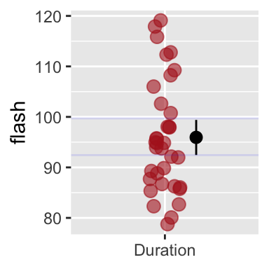

#  Uncertainty {#uncertainty}  

```{r, echo = FALSE, warning=FALSE, message=FALSE}
library(tidyverse)
library(DT)
library(knitr)
library(blogdown)
library(beyonce, warn.conflicts=F, quietly=T)
library(stringr)
library(tweetrmd)
library(emo)
library(tufte)
library(cowplot)
library(lubridate)
library(ggthemes)
library(ggforce)
library(datasauRus)
library(ggridges)
library(randomNames)
library(infer)
```


```{block2, type='rmdnote'}
These notes accompany portions of Chapter 4 — Estimating with Uncertainty — which we first encountered in Section 7, and the “Bootstrap Standard Errors and Confidence Intervals” section of Chapter 19 (pages 647-654) of our textbook. **The reading below is required**, @whitlock2020 is not.

If you want a different (or another) presentiation of this material, I highly recommend [Chapter 8](https://moderndive.com/8-confidence-intervals.html) of @ismay2019 as an optional reading.   

If you want to read more about visualizing uncertainty, I suggest [Clause Wilke's](https://clauswilke.com/dataviz/visualizing-uncertainty.html) chapter on the subject [@wilke2019].
```

<span style="color: Blue;font-size:22px;">   Motivating scenarios:  </span>  <span style="color: Black;font-size:18px;">   You have a sample and made an estimate, and want to communicate th precision of this estimate. </span> 
 
 
**Learning goals: By the end of this chapter you should be able to:**   

- Explain why the idea of the sampling distribution is useful in communicating our uncertainty in an estimate.   
- Describe the challenge we have in building a sampling distribution from a single sample.   
- Explain how we can build estimate a sampling distribution from a single sample by resampling with replacement.   
- Use R to bootstrap real data.  
- Describe the concept of the confidence interval.   
- Calculate bootstrapped standard errors and bootstrapped confidence intervals.   
- Recognize why/when we would (or would not) use the bootstrap to quantify uncertainty.  
- Know how to visualize uncertainty in R.  

```{block2, type='rmdwarning'}
In addition to this reading, the other assignment is to read pages pages 104-112 and 126-133 about selection bias from Calling Bullshit (Bergstrom and West 2020) and Interleaf 2: psuedo-replication from the Analysis of Biological Data (Whitlock and Schluter 2020), and complete the sampling Quiz (Section 7.6). 
``` 

## Review of relevant material:  
So far, sampled from a population many times and building a sampling distribution.   

But, if we had data for an entire population, we would know **population parameters**, so there would be no reason to calculate **estimates from a sample**.     

In the real world we have a small number (usually one), sample and we want to learn about the population. This is a major a major challenge of statistics (See Section 1).   

### Review: Populations have parameters    
We conceptualize populations as truth with true parameters out there.

### Review: Sampling involves chance    
Because (a good) sample is taken from a population at random, a sample estimate is influenced by chance.

### Review: The standard error   
The **sampling distribution** -- a histogram of sample estimates we would get by repeatedly sampling from a population -- allows us to think about the chance deviation between a sample estimate and population parameter induced by sampling error.    

The **standard error** quantifies this variability as the standard deviation of the sampling distribution.    

```{block2, type='rmdnote'}
Reflect on the two paragraphs above. They contain stats words and concepts that are the foundation of what we are doing here.  

- Would this have made sense to you before the term?    
- Does it make sense now? If not, take a moment, talk to a friend, email Yaniv or Anna, whatever you need. This is important stuff and should not be glossed over.    
```


## Estimation with uncertainty   

Because estimates from samples take their values by chance, it is irresponsible and misleading to present an estimate without describing our uncertainty in it, by reporting the standard error or other measures of uncertainty.

### Generating a sampling distribution   

**Question:** We usually have one sample, not a population, so how do we generate a sampling distribution?  
**Answer:** With our imagination!!! (Figure \@ref(fig:imagination)).     

What tools can our imagination access?  

- We can use math tricks that allow us to connect the variability in our sample to the uncertainty in our estimate.   
- We can simulate the process that we think generated our data.   
- We can resample from our sample by bootstrapping (describe below).  


```{r, imagination, fig.cap = 'We use our imagination to build a sampling distribution by math, simulation, or bootstrapping.', echo=FALSE}
include_graphics("https://i.imgflip.com/4qga05.jpg")
```


Don't worry about the first two too much – we revisit them throughout the course. For now, just know that whenever you see this, we are imagining an appropriate sampling distribution. Here we focus on bootstrapping.

#### Resampling from our sample (Bootstrapping)  {#boot}

>While statistics offers no magic pill for quantitative scientific investigations, the bootstrap is the best statistical pain reliever ever produced.
> `r tufte::quote_footer('--- [Xiao-Li Meng](https://statistics.fas.harvard.edu/people/xiao-li-meng)')` As quoted in @cochran2019


So we only have one sample but we need to imagine resampling from a population. One approach to build a sampling distribution in this situation is to assume that your sample is a reasonable stand-in for the population and resample from it.   

Of course, if you just put all your observed values down and picked them back up, you would get the same estimate as before. So we resample with replacement and make an estimate from this resample – that is, we   

1. Pick an observation from your sample at random.    
2. Note its value.  
3. Put it back in the pool.   
4. Go back to (1) until you have as many resampled observations as initial observations.  
5. Calculate an estimate from this collection of observations.   
6. After completing this you have one bootstrap replicate.  

```{block2, type='rmdwarning'}
**Assignment:** Physically generate a bootstrap replicate. W will soon learn how to conduct a bootstrap in R, but I find that getting physical helps it all be real, and gives us more appreciation for what is going on in a bootstrap. So, our assignment is to generated a single bootstrap replicate by brute force   

1. Find a sample of about twenty of something that is easy to quantify, I suggest the date on n = twenty pennies if you have them. If all else fails you can write down values on a piece of paper (e.g. the pint differential for Timberwolves games this season, the length of twenty songs on your itunes etc..)       
2. Estimate the sample mean (i.e. What is the mean date of issue of pennies in your sample).   
3. Shove your observations in a bag or sock or something.    
4. Generate an estimate from a single bootstrap replicate. Sample n observations with replacement, and calculate your estimate from this bootstrap replicate.      
5. On canvas, you will need to state what you resampled, what population it was meant to represent. If it is or is not a random sample of that population (with some explanation about why), the value of the sample estimate, the value of the bootsrtapped estimate, and how/why they differed. Reflect on what is going on here.    
```

While the exercise above was useful, it would be tedious and unfeasible to do this more than a handful of times. Luckily, we don’t have to, we can use a computer to conduct a bootstrap.


##### **Bootstrapping computation and example: Fireflies!** {-}   

```{r fig.cap = 'Firefly  pulsing.', echo=FALSE, out.extra='style="float:right; padding:10px"'}
include_graphics("https://media.tenor.com/images/cddb9e93aa8924e2e7df00531a48e855/tenor.gif")
```


**EXAMPLE** Say we are studying the duration of light pulses of male fireflies, *Photinus ignitis*, a species in which females prefer to mate with males that are bright for longer pulses. We can look at pulse duration data, collected by @cratsley2003 [data](https://whitlockschluter3e.zoology.ubc.ca/Data/chapter04/chap04q07FireflyFlash.csv), to estimate the mean duration of pulses and the uncertainty in this estimate.

```{r, message=FALSE, warning=FALSE} 
firefly_file <- "https://whitlockschluter3e.zoology.ubc.ca/Data/chapter04/chap04q07FireflyFlash.csv"  ### link to data
firefly     <- read_csv(firefly_file) %>% ### load the data
  mutate(id = 1:n(),
         id = factor(id))                ### let's add an id [for fun, so w can see who we sampled, this isnt necessary]
```

First (as always) let’s look at the actual data. You could do this with [`glimpse()`](https://tibble.tidyverse.org/reference/glimpse.html), [`view()`](https://tibble.tidyverse.org/reference/view.html), or just typing `firefly`.  

```{r, echo=FALSE}
DT::datatable(firefly,options = list(pageLength = 5, lengthMenu = c(5, 10, 20, 40)))
```


**Calculating estimates from the data**     

So now, let’s make an estimate from the data! We can bootstrap any estimate - a mean, a standard deviation, a median, a correlation, an F statistic, a phylogeny, whatever. But we will start with a mean for simplicity.   

```{r}
sample_estimate <-  firefly  %>%
  summarise(mean_flash = mean(flash)) %>%### Summarize the data (lets summarize the mean and sd)
  pull()

sample_estimate 
```

So, our sample estimate is that the mean firefly pulse rate is `r sample_estimate`. But that is just our sample.

Now we can’t learn the true **population parameter**, but we can bootstrap to get a sense of how far from the true parameter we expect an **estimate** to lie.

First, let’s use the [`sample_n()`](https://dplyr.tidyverse.org/reference/sample.html) function to generate a sample of the same size. You’ll notice, that this code is very similar to what we wrote for sampling (Section \@ref(onesample)) except that we sample with replacement – that is, we tell R to toss each observation back and mix up the bag every time, outlined in [above](#boot).

```{r}
sample_size         <- nrow(firefly)  # find the sample size.  
resampled_fireflies <- firefly  %>%   ### resample the data 
  sample_n(size = sample_size, replace = TRUE)
```

So, lets look at the resampled data:


```{r, echo=FALSE}
DT::datatable(resampled_fireflies,options = list(pageLength = 5, lengthMenu = c(5, 10, 20,40)))
```

To confirm that my resampling with replacement worked, let's making sure some we see some individuals more than once, and some not at all.

```{r, fig.height=1.5}
resampled_fireflies                %>%
  group_by(id, .drop=FALSE)        %>%   # .drop = FALSE on this factor means that we keep count for individuals with zero, instead of losing theme
  tally(sort = TRUE)               %>%   # count how many times we see each individual in the resample, and arrange from most to fewest times. 
  mutate(id = fct_reorder(id, n,.desc = TRUE)) %>%  # tell R we want to list numbers in the order of number of observvations, not from 1 to n
  ggplot(aes(x=id, y = n))+ # set up the ggplot
  geom_col()              + # make a bar plot
  labs(title = "Distribution of resampled individuals in our bootstrap")
```

So, now that it looks like we resampled wth replacement right (we see some individuals a few times, some zero times), let’s make an estimate from this resampled data.

```{r, message=FALSE, warning=FALSE}
resampled_fireflies  %>%
  summarise(mean_flash = mean(flash)) ### Summarize the data (lets summarize the mean and sd)
```


```{r, echo=FALSE, message=FALSE, warning=FALSE}
resample_estimate  <- pull(summarise(resampled_fireflies ,mean_flash = mean(flash)) )
```

So, the difference between the sample estimate and the resample-based estimate is `r sample_estimate - resample_estimate`. But this is just one bootstrap replicate.

Let’s do this many (10,000) times with the [`rep_sample_n()`](https://infer.netlify.app/reference/rep_sample_n.html) function, and then visualize this bootstrapped sampling distribution as a histogram.

```{r fireflyboot, fig.cap = 'The bootstrapped sampling distribution. Dashed line represents sample estimate.', message=FALSE, fig.width = 2.75, fig.height = 2, warning=FALSE, out.extra='style="float:right; padding:10px"'}
library(infer)  # remember  to load the infer library to use rep_sample_n

many_resampled_fireflies <- firefly  %>%   ### resample the data 
  rep_sample_n(size = sample_size, replace = TRUE, reps = 10000)### many new resamples  
firefly_boot <- many_resampled_fireflies %>% 
  summarise(mean_flash = mean(flash))   # recall we're grouped by replicate when we come out of rep_sample_n()

boot_dist_plot <- ggplot(firefly_boot, aes(x = mean_flash)) +   # assign plot to a variable
  geom_histogram(fill = "firebrick", color = "white", bins=40)+
  geom_vline(xintercept = sample_estimate, lty = 2)+
  labs(title = "The bootstrapped sampling\ndistribution",
       subtitle = "Firefly pulse time (n = 35).")

boot_dist_plot  ## show the plot
```


**AWESOME!** So what happened here? We had a sample, not a population. but we resampled from it with replacement to generate a **sampling distribution**. This histogram depicts the expected sampling error from a population that resampled our sample. So we can use this to get a sense of the expected sampling error in our actual population which we do not explore beyond this sample.  

Note that this is a good guide - but is not foolproof. Because we start with a sample from the population, this bootstrapped sampling distribution, will differ from our population sampling distribution – but it is a reasonable estimate!!!   

#####  **Bootsrtapping: Notes and considerations** {-}
The bootstrap is incredibly versatile - it can be used for any estimate, and, with enough care for study design, can be applied to almost any statistical problem. Because the bootstrap does not assume much about the shape of the variability in a population, it can be used when many other method we cover this term fail.  


Because it requires some computer skills, and because it solves hard problems, the bootstrap is often taught at the end of an intro stats course. For example, the bootstrap is covered in Computer intensive methods of our textbook (Section 19.2 of @whitlock2020). But I introduce it early because it is both useful and helps us think about the sample standard error and confidence intervals (below).     

```{r, echo=FALSE}
tweet_embed("https://twitter.com/rdhernand/status/1104361442625630212?s=20")
```

That said, a bootstrap is not always the best answer.      

- Bootstraaping require a reasonable sample size, such that the breadth of values in the population is sampled [as a thought experiment, imagin bootsrapping with one or two observations -- the answer would clearly be nonsense]. The minimum sample size needed depends on details of the population distribution etc.., but in many cases a sample of size twenty is large enough for bootstrapping to be reasonable.   

- Because a bootstrap depends on chance sampling, it will give (very slightly) different answers each time. This can be frustrating.


```{block2, type='rmdnote'}  
The bootstrap method described above is known more formally as the empirical bootstrap. Parametric bootstrapping -- in which we estimate parameters and use them to simulates a sampling distribution -- represent a different way to generate a sampling distribution.
```


### Estimating the standard error  
In Section \@ref(sampling) we saw learned how to generate a (potentially infinite) number of samples of some size from a population to calculate the true standard error. But, in the real world we estimate the standard error from a single sample.

Again, we can use our imagination to calculate the standard error, and again we have math, simulation, and resampling as our tools.

#### The bootstrap standard error  
Here, we focus on the bootstrap standard error as an estimate of the standard error. Because the standard error measures the expected variability among samples from a population as the standard deviation of the sampling distribution, ****the bootstrap standard error estimates the standard error as the standard deviation of the bootstrapped distribution**.

We already did the hard work of bootstrapping, so now we find the bootstrap standard error as the standard deviation of the bootstrapped sampling distribution \@ref(fig:fireflyboot).    

```{r, message=FALSE, warning=FALSE}
firefly_boot_SE <- firefly_boot %>% 
  summarise(SE = sd(mean_flash))

firefly_boot_SE
```

### Confidence intervals  
**Confidence intervals** provide another way we describe uncertainty. To do so we agree on some level of confidence to report, with 95% confidence as a common convention.   

Confidence intervals are a bit tricky to think and talk about. I think about a confidence interval as a net that does or does not catch the true population parameter. If we set a 95% confidence level, we expect ninety five of every one hundred 95% confidence intervals to capture the true **population parameter**.

Explore the webapp from @whitlock2020 to make this idea of a confidence interval more concrete. Try changing the mean, standard deviation, and sample size to see what it does to our confidence intervals.

```{r fig.cap='Webapp from Whitlock and Schluter (2020) showing the disrtibution of confidence interavals. Find it on [their website](https://www.zoology.ubc.ca/~whitlock/Kingfisher/CIMean.htm).',echo  = FALSE}
include_app("https://www.zoology.ubc.ca/~whitlock/Kingfisher/CIMean.htm")
```  

Because each **confidence interval does or does not capture the true population parameter, it is wrong to say that a given confidence interval has a given chance of catching the parameter**. The parameter is fixed, it is the chance sampling of the sample from which we calculate the confidence interval where the chance happens.

So, how do we calculate confidence intervals? Like the standard error, we can calculate confidence intervals with math, simulation or resampling. We explore the other options in future Sections, but discuss the bootstrap based confidence interval here.

### The bootstrap confidence interval  

We can estimate a specified confidence interval as the middle region consisting of that proportion of bootstrap replicates. So the edges between the middle 95% of bootstrap replicates and more extreme resamples denote the 95% confidence interval. We can use the [`quantile()`](https://stat.ethz.ch/R-manual/R-devel/library/stats/html/quantile.html) function in R to find these breaks of the bootstrap.


```{r, message=FALSE, warning=FALSE}
firefly_boot_CI <- firefly_boot %>% 
  summarise(CI         = c("lower 95", 'upper 95'), # add a column to note which CIs we're calcualting
            mean_flash = quantile(mean_flash ,probs = c(.025,.975)))  # boundaries separating the middle 95% from the rest of our bootstrap replicates. 

firefly_boot_CI
```

So we are 95% confident that the true mean is between `r round(pull(firefly_boot_CI, mean_flash)[2], digits = 1)` and `r round(pull(firefly_boot_CI, mean_flash)[2], digits = 2)`.

A confidence interval should be taken as a guide, not a bright line. There is nothing that magically makes `r round(pull(firefly_boot_CI, mean_flash)[2], digits = 2)-.1` a plausible value for the mean and `r round(pull(firefly_boot_CI, mean_flash)[2], digits = 2)+.1` implausible.

We can add these confidence intervals to our plot with [`geom_vline()`](https://ggplot2.tidyverse.org/reference/geom_abline.html)   

```{r bootwci, fig.cap = 'The bootstrapped sampling distribution. Dashed black line represents sample estimate. Dotted blue line shows 95% confidence limits.', message=FALSE, fig.width = 2.75, fig.height = 2, warning=FALSE, out.extra='style="float:right; padding:10px"'}
boot_dist_plot  +
  geom_vline(xintercept = pull(firefly_boot_CI, mean_flash),
             color      = "blue")+
  annotate(x = 102, y = 650, color = "blue", 
           geom = "text", label = "95% CI", lty = 3)
```


## Visualizing uncertainty   

In addition to stating our uncertainty in words, we should show our uncertainty in plots. The most common display of uncertainty in a plot is the 95% confidence interval, but be careful, and clear, because this is not what everyone does.   
  
The code below shows how we can have R add 95% confidence intervals to out plot by telling the [`stat_summary()`](https://ggplot2.tidyverse.org/reference/stat_summary.html) function that we want R to calculate and show bootstrap based confidence limits (8.6).

```{r echo=FALSE, eval=FALSE}
ggplot(firefly, aes(x = "Duration", y = flash))+ 
  geom_jitter(width = .1, color = "firebrick", alpha = .6, size = 3)+ 
  stat_summary(fun.data = mean_cl_boot, 
               position = position_nudge(x = .2, y = 0)) # move line over some so as to not hide our data. 
```

```{r fireflyse, fig.cap = 'R will calculate and display 95% bootstrap confidence limits if ww add `stat_summary(fun.data   =mean_cl_boot)`. Faint blue horizontal lines  (from my boostrap, above), closely match the bootsrap `R` just did.', message=FALSE, fig.width = 2.75, fig.height = 2, warning=FALSE, echo=FALSE, out.extra='style="float:right; padding:10px"'}

```

While this display is most traditional Clause Wilke has recently developed a bunch of fun new approaches to visualize uncertainty (see his R package, [ungeviz](https://github.com/wilkelab/ungeviz)), and the [chapter on the subject](https://clauswilke.com/dataviz/visualizing-uncertainty.html) [@wilke2019], is very fun. We show one such sample in Figure \@ref(fig:uncertflex).      

```{r uncertflex, fig.cap = 'A novel form of visualizing uncertainty provides a smoother view of uncertainty, to complement  the traditional confidence limits based display.', out.width='60%', echo=FALSE}
include_graphics("https://raw.githubusercontent.com/wilkelab/ungeviz/master/man/figures/README-cacao-means-1.png")
```

## Common mathematical rules of thumb   

So long as a sample isn't too small, the bootstrap standard error and bootstrap confidence intervals are reasonable descriptions of uncertainty in our estimates.  

Above, we also pointed to mathematical summaries of uncertainty. Throughout the term, we will cover different formulas for the standard error and 95% confidence interval, which depends on aspects of the data – but rough rules of thumb are:  

- The sample standard error usually equals the sample standard deviation divided by the square root of the sample size,    $SE_x = \frac{s_x}{\sqrt{n}}$.   
-  The 95% confidence interval is approximately the mean plus or minus two times the standard error.  

## Uncertainty Quiz

```{r echo = FALSE}
include_app("https://brandvain.shinyapps.io/uncertainty/")
```
