#  Data presentation and visualization. Goals, considerations, and best practices {#goodfigs}

```{r, echo = FALSE, warning=FALSE, message=FALSE}
library(tidyverse)
library(DT)
library(knitr)
library(blogdown)
library(beyonce, warn.conflicts=F, quietly=T)
library(stringr)
library(tweetrmd)
library(emo)
library(tufte)
library(cowplot)
library(lubridate)
library(ggthemes)
library(ggforce)
library(datasauRus)
library(ggridges)
library(randomNames)
library(infer)
```


```{block2, type='rmdnote'}
This chapter pulls from Chapter 2 of Whitlock and Schluter (2020), all of Wilke (2019), and much of Bergstrom and West (2020). If you have time / interest I highly recommend having a look. However, the only outside resources required for this reading are the imbedded youtube videos from Calling Bullshit.
```

<span style="color: Blue;font-size:22px;">   Motivating scenarios:  </span>  <span style="color: Black;font-size:18px;">   You are thinking about how to communicate your results in figures or you are worrying that someone is tricking you with their figures. </span> 
 
 
**Learning goals: By the end of this chapter you should be able to:**   

- Explain the concepts behind what makes a good figure, and the specific elements of a figure that can be modified to make a good figure.  
- Critique figures and understand when / how they are being manipulated.   

```{block2, type='rmdwarning'}
tbd
``` 

In Chapter \@ref(viz1), we went over our goals in making a plot, and dove into making our first ggplots. I did this so that we could get started on something, before perfecting.   

**Here we:**

- Think deeper about making good plots,  
- Reflect on what makes plots less effective, and  
- Consider how plots can lie to us.  

My goal here is to separate the challenge of conceptualizing and interpreting a figure from the challenge of making a figure in R. I do this because they are very different problems, and worrying about making your figure in R before you know what you want to do often leads to bad figures. On the other hand, if you know what you are aiming to do in R you can usually do it, and if/when you cannot, you can then readjust your goal (or touch up the figure in illustrator).  

That said, I do introduce a few R tips when our desired effects can be achieved relatively simply. In Chapter \@ref(betteRfigs), we focus on making our desired figures in R.   

##  Why make a plot?     

It’s nearly impossible to looking at all numbers in a data set, and come home with a holistic view of it. It is incredibly inefficient to communicate results in this way. In Chapter \@ref(summaRy) we introduced classic summary statistics that can more efficiently communicate data. However, on their own, these simple summaries can mislead, can miss important features in our data, and do not allow for readers to rapidly take in and evaluate our claims.     

### Why make exploratory plots?

> The first principle is that you must not fool yourself – and you are the easiest person to fool.
> `r tufte::quote_footer('--- Attributed to physicist Richard Feynman')`   

In Chapter  \@ref(summaRy)  we also began to reveal limitations to these summaries, as we noted that we need to know the shape of our data to responsibly interpret and communicate these summaries. The Review below provides a fun example of how much can be hidden in summary stats.

```{r echo = FALSE}
include_app("https://brandvain.shinyapps.io/review/")
```

As we discuss in Chapter \@ref{intro}, model building is a big part of what we do as biostatisticians. Thus it is important to explore the shape of our data BEFORE doing any statistical modeling, so that we can build appropriate models.   

### Why make explanatory plots?  
Scientists build explanatory plots to effectively communicate their results, and convince provide skeptical readers the opportunity to evaluate their claims. Plots are such a critical mode of scientific communication that in many lab meetings, papers are discussed by lookng at the figures.  

So, an effective plot should  

- Clearly communicates a high-level take home message, and  
- Convinces the skeptical reader to believe this message.   

**Clear communication is essential.** We present results in plots because they effectively allow readers to take in a message. As we increase the number of categories in a variable, and/or increase the number of variables of interest, this becomes more essential as the cognitive load created by too many data summaries can get in the way of understanding. Plots should not be a mystery or logic puzzle. So we want to help our readers understand the major through line in the (potentially complex) data we analyzed.   

**Convincing the skeptical reader and inviting their thoughts.** Most people are skeptical. They don’t want to be told results, they want to evaluate them and contribute their own two cents. So, an effective plot **shows the data** in a way that makes a clear claim and allows the reader to evaluate (and perhaps even refine and/or critique). Thus, as we see below, much of **making a good plot revolves around building trust** by showing the data and not misleading them. If someone thinks you are trying to deceive them they may not trust your analyses (even if the analysis is good).

🤔 **WHY do we bring this up?** 🤔 Because, you should remember that you’re making plots for a reason, not just to make them. And you should consider the reason for your plot as you make them.

## Telling a story and making a point  

When we tell a story we do not simply list everything that happened in a time period. Rather, we tell a story for a purpose -- we have a goal of what we would like to communicate.   

A good figure should, in many ways, resemble a good story.  

- A good figure should have a point (or two or maybe three).  
- A good figure should be constructed to highlight this point.  
- A good figure should facilitate understanding of this point.   
- A good figure should be easy to follow.  
- A good figure should be verifiable.   
- A good figure should be honest.  
- The main point of a good figure should hold up upon scrutiny.  

```{r, fig.cap = 'A good story [video](https://www.youtube.com/watch?v=geG8E_ocYDY&).', echo=FALSE}
include_url("https://www.youtube.com/embed/geG8E_ocYDY")
```


```{block2, type='rmdwarning'}
**Assignment:** Reflect on the following questions after watching this video on telling a good story  

1. How does making a good plot resemble telling a good story?   
2. How is making a good plot very different than telling a good story?   
3. How does thinking of a figure as a story change how you think about making a figure? How does it make sense of ideas you have had before? How could it change your approach to making a figure.    
```


### What point are you making???  
Graphs exist to make clear points. Together a set of plots should come together to tell a story. So, in making an explanatory plot, think  

1. What point do I want to make?  
2. How does it fit in the larger story I trying to tell?   

*Example of telling a story:* In basketball most shots are worth two points, while distant shots beyond the 'three point' line are worth three points. In around 2008-ish the NBA started to ge serous about nalytics, and a bunch of mathy people figured out that three points are more valuable than two points, so teams should shoot either three pointers, or very close twoo point shots, that have a really good chance of going in ([podcast for the curious](https://www.npr.org/2020/09/11/911898347/the-science-of-hoops)).  

Figure \@ref(fig:nbathrees)A compares shot selection before and after this insight spread through the NBA. It makes the point that before the analytical revolution, different teams shot from very different places with no obvious trends, while after the revolution, all teams shot mainly three pointers and very close shots. \@ref(fig:nbathrees)B shows a greater context to these data point – highlighting the extreme rise in three point shot attempts from 2006 to the present, providing a longer historical record for background. Together, they tell the story of the NBA’s analytics revolution.

```{r nbathrees, fig.cap = 'Figure **A** is modified from images on instagram [&commat;llewellyn_jean](https://www.instagram.com/llewellyn_jean/?hl=en). Figure **B** is modified from a [an article on espn.com](https://www.espn.com/nba/story/_/id/26633540/the-nba-obsessed-3s-let-fix-thing).', echo=FALSE}
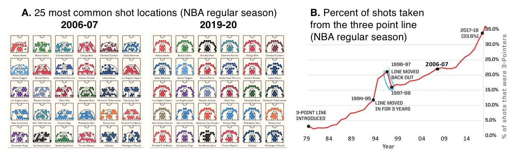
```

### Did you make your intended point?  
Figure \@ref(fig:nbathrees) is imperfect. Most notably, the team names are too small to read. I could imagine spending a bunch of time fixing this. But that time would be largely wasted – team names do not play much of a role in the story we are telling, so this should not be a big concern.    

After you make your plot, stop and look at it. Consider how your figure makes this point, and how it detracts from this point. Then brainstorm how you could improve your plot to more clearly and honestly make your point.

### The processs
Computational tools like ggplot can help us make good plots. But always remember that they are tools for us, and don’t let them push you around. I and the internet (see tweet below) therefore suggest to go into ggplotting with a plan – (1) **first sketch** your desired plot and (2) **be wary** of default selections and common plots etc.

```{r, echo=FALSE}
include_tweet("https://twitter.com/webbshasta/status/1263894431268106241")
```

You will then go back and forth with you pencil and paper and ggplot with a few iterations until you have a plot you like (See Figure \@ref(fig:evo) for an example, and the pblog it came from](https://cedricscherer.netlify.app/2019/05/17/the-evolution-of-a-ggplot-ep.-1/) for how they did it).

For an explanatory plot, share a draft plot with someone unfamiliar with the data to see if your point pops.

```{r evo, fig.cap = 'Making a plot is an iterative process. gif taken from [tweet](https://twitter.com/WeAreRLadies/status/1280859374668283906?s=20) by [&commat;WeAreRLadies](https://twitter.com/WeAreRLadies). See the evolution of a ggplot [tutorial](https://cedricscherer.netlify.app/2019/05/17/the-evolution-of-a-ggplot-ep.-1/) for a "how to". We will refer to this example often below.', out.width='40%', echo=FALSE}
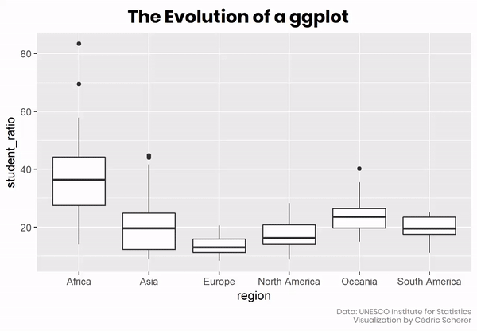
```

## The audience and the goal
Not every plot has to be a masterpiece - our characterization of exploratory vs explanatory plots considers two ends of a continuum. Consider your audience and your goal when making a plot.

That said, you might find it useful to develop a consistent collection of colors, font size etc. ready to go in ggplot so that all plots are accessible with limited additional effort.

### The audience.  
We tell stories to an audience, not a wall. And when we tell stories, we need to consider who our audience may be, and how they are consuming our story. Just like you would write a book differently than a screenplay, and provide different context / info when telling a story to your bff vs your sibling, you similarly will need to consider you audience when making a plot. For example,  

- What is their subject matter expertise? Do they have a background in science? In statistics?  
- Are they familiar with interpreting the plots we're making or do they need guidance?  
- What is our method of presentation -- that is, how is the experiencing our plots? Printed paper? A slide? A poster? The internet etc...?    
For most of this term your audience will be you, me, and sometimes a few peers. So you should make clear plots for people with some background in stats, who will be reading your plot on a computer.

**As you read the guidence below, consider how would you change plots based on audience.**

#### **Tailoring presentations to their method of presentation**   {- #presentation}

Science is communicated in many ways. The most common presentations that include the visual display of data are: books/papers, public talks, posters, internet. While the basic principles of  making a good plot are always the same, you should customize your explanatory plots to the method of communication.  

- **Books / Papers:** Here plots are static, and while we can write about them in  the text, there's no guaranteed the audience will read it. So, plot for papers and books should be self-contained such that the readers get the figure's main point  from image and caption alone. If a figure can be misinterpreted by looking at it, this should be fixed in the figure (or less ideally, the figure caption), not the text of the manuscript.    
- **Public Talks:** When telling stories to a captive audience in a public talk, you control the flow of information. 
    - You can build up figures one slide of a time to bring our audience along.  
    - But be sure the text is big enough to be visible from the back of the room.     
- **Poster sessions:** Large conference halls are filled with posters. Stunning images and catch visualizations are important in this medium because we want people to pay attention to us and engage, rather than walking on by.    
- **Digital:** When your work is online, you can include gifs, and make interactive plots to better engage and empower your readers.   


### The goal   
People often spend hours or even days on perfecting a plot for publication or an important presentation. You should not spend this long on most plots in this class.   

For most plots, you should be sure that they are readable, clearly make their point, and do not lie. And while you should go over the top in customizing every plot in this course for perfect clarity, a well-considered set of colors, shapes, background etc, will make all of your figures good and accessible with minimal additional effort.  

Then for your final project, senior thesis, scientific papers etc, you will be in a good place to go from a nice plot, to a publication quality plot with some customization.

**As you read the guidance below, consider what you would put in early exploratory plot drafts (e.g. for yourself, homework or advisors), vs what you would only add in a version that would be read by a larger audience (e.g. for senior theses, publications, presentations).**  

##  Making a good plot   {#goodplot}
All bad plots are bad in their own way, but all good plots are the same. All good plots are:  

- Honest  
- Transparent   
- Clear  
- Accessible  

We will focus on the distribution of student to ratio ratios across continents (first introduced in Figs \@ref(fig:evo)), as an example, but will introduce other data sets when necessary.   

Let us start with two versions of this plot so bad, they are hard to make in R.  


```{r verybad, fig.cap = 'It is hard to make a plot this bad.', echo=FALSE, out.width='80%'}
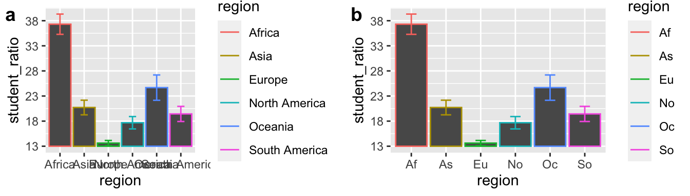
```

**Take a moment to reflect on what makes Figs \@ref(fig:verybad)A and B so bad, and what you could do to improve them.**   

### Be honest
While plots should clearly make points, they should not lie or mislead. A misleading exploratory plot will confuse us, and have us waste time chasing wrong ideas. A misleading explanatory plot will sow distrust in your readers - and we want our readers to trust us.

Here are some things to consider to avoid misleading yourself and/or your audience.

#### Don’t mislead with axes

##### **Misleading y-axes** {- #misy}   


When we see a filled area, our mind naturally thinks in ratios. So, if a reader is not looking carefully at the y-axis they would think that Af student to teacher ratios in Af (Africa), are on average four times higher than in As (Asia), even though in reality it is closer to a two-fold difference (compare a and b in Fig. \@ref(fig:stillbad)).


```{r stillbad, fig.cap = 'Do not truncate the y-axis of bar plots, or other filled plots.', echo=FALSE, out.width='80%'}
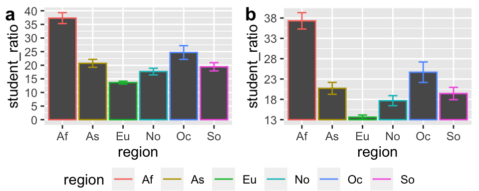
```


```{block2, type='rmdnote'}
**Not all y-axes need to start at zero:** Truncating they y-axis is most misleading for filled plots, but not all y-axes need to start at zero.    

- Scatterplots tend not to trick the eye in the same way as bar plots, and generally need not start at zero. When we want to communicate absolute difference, rather than relative differences, display the data as points, and worry less about truncating the y-axis.   
- When zero is arbitrary (e.g. temperature) starting at zero makes no more sense than starting at any other number.  
```

Watch the assigned video below for a discussion on when truncating the y-axis is misleading and when the y-axis does not need to start at zero.

```{r, fig.cap = 'Misleading axes from [calling bullshit](https://www.youtube.com/watch?v=9pNWVMxaFuM&feature=emb_logo).',  echo=FALSE}
include_url("https://www.youtube.com/embed/9pNWVMxaFuM")
```

##### **Misleading x-axes** {-}     

Figure \@ref(fig:georgia) shows a graph, released by the sate of Georgia in May 2020, to show that they were controlling coronavirus. Can you spot what is misleading here?

```{r georgia, fig.cap = '*HINT:* look at the x-axis', out.width='80%', echo=FALSE}
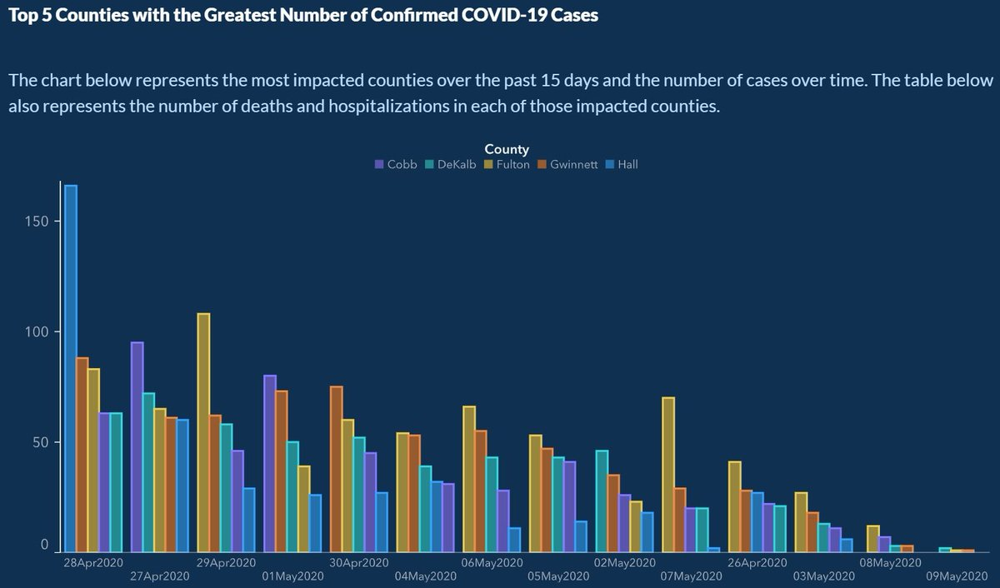
```

A quick glance at Figure \@ref(fig:tufte) leaves the impression that the US had a slump in science Nobel Prizes in the early 1970’s. How is this misleading?   


```{r tufte, fig.cap = '*HINT:* look at the number of years in each bin on the x-axis.', out.width='40%', echo=FALSE}
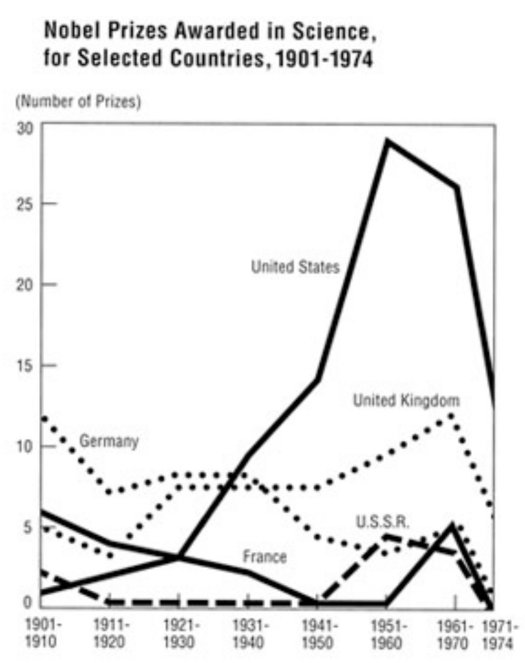
```

#### Do provide context  

```{r date1, fig.cap = 'Was the airline industry crashing at the end of 1960?', echo=FALSE, out.extra='style="float:right; padding:10px"'}
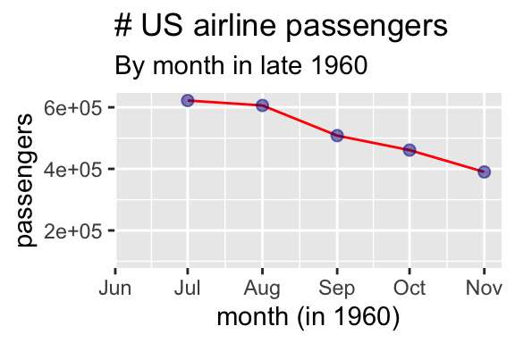
```


Not only can truncating the y-axis mislead, but truncating the x-axis can also mislead. Plots should provide context to understand the bigger picture underlying patterns. For example, Fig \@ref(fig:date1) suggests that the airline industry was crashing in the end of 1960, but plotting the data year-over-year (Fig. \@ref(fig:date2)) shows that this is a predictable seasonal decline, not a terrifying omen.

Similarly prices will mislead if not adjusted for inflation, job numbers must be adjusted for seasonal fluctuations etc... 


```{r date2, fig.cap = 'Seasonal fluctuations in US air travel (1949-1960).', echo=FALSE}
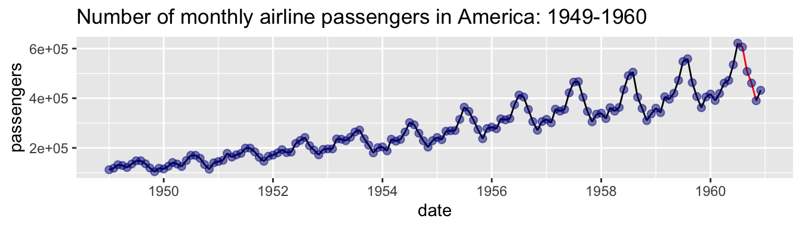
```


#### Do not use misleading bin sizes 

```{r, fig.cap = 'Different bin sizes might tell different stories (5 min and 15 sec from [Calling Bullshit](https://www.youtube.com/watch?v=zAg1wsYfwsM)).',  echo=FALSE}
include_url("https://www.youtube.com/embed/zAg1wsYfwsM")
```

```{r binsize, fig.cap = 'Be careful -- different bin sizes can generate different stories.', echo=FALSE, out.extra='style="float:right; padding:10px"'}
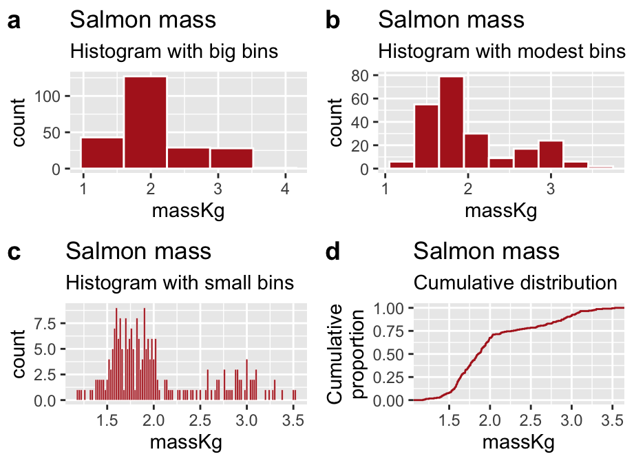
```

**The required video above** shows one way in which bin sizes can mislead. Bin sizes can also mislead us when we are using histograms to look at the shape of a distribution. For example, with large bins the distribution of salmon weights looks to be unimodal and right skewed (Fig.  \@ref(fig:binsize)A), but is revealed to be bimodal with smaller bins (Fig.  \@ref(fig:binsize)B). However, smaller bins are not always best – too many bins might distract us from the overall shape (see Fig. \@ref(fig:binsize)C).  

So, what should you do? I recommend experimenting with a few different bin sizes (by either specifying they number or width with the `bins` or `binwidth` arguments to the [`geom_histogram()`](https://ggplot2.tidyverse.org/reference/geom_histogram.html) function, respectively).

If you are not satisfied with any binwidth, you can show the cumulative frequency distribution (e.g. Figure \@ref(fig:binsize)D with the [`stat_ecdf()`](https://ggplot2.tidyverse.org/reference/stat_ecdf.html) function)). Here we make no decision about binsize – rather they y-axis shows thee proportion of the data with a value less than x. The bimodality is revealed by the two distinct steep slopes of this plot. While this shows all the data the downside is that they are harder for inexperienced readers to interpret.

Finally I note that all of the concerns about bin size carry over to any use of smoothing as you might use in a density plot. In ggplot you can control the smoothing of density plot by using the `adjust` argument in the [`geom_density()`](https://ggplot2.tidyverse.org/reference/geom_density.html) function.   


```{r heights, fig.cap = 'This is very very bad.', echo=FALSE, out.extra='style="float:right; padding:10px"'}
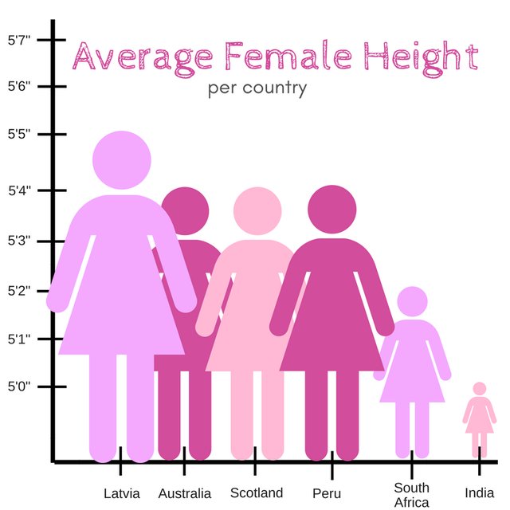
```


#### Do not be manipulative   

We saw that plotting filled areas brings our attention to the area, not the point. As such, scaling data by height and width will trick brains into squaring differences. Figure \@ref(fig:heights)  breaks all the rules and makes a truly misleading plot. If you are interested to here more you can watch an [optional video](https://youtu.be/oNhusd3xFC4?t=559) from calling bullshit (the most relevant part is from 9:19 to 11:23).

### Be transparent  

As biostatsticians we never want people to simply take our word for it. We want to empower our readers to evaluate our claims, criticize them, test them for themselves and even find new things in our data. Showing the data is an important step towards building trust with a skeptical reader, and invites them to think about our data.

#### Show your data / Allow the reader to interrogate your claims  

As we saw in our learnr quiz, reporting summaries can hide interesting patterns in the data. Plotting summaries is no better. As such it is best to honestly show your data. See Figure \@ref(fig:drake) for an example of how to do this, and the tweet for why it matters. [[@weissgerber2015]](https://journals.plos.org/plosbiology/article?id=10.1371/journal.pbio.1002128) make an impassioned plea to end the overuse of barplots.

```{r drake, fig.cap='Hangin with some data points Ive never seen before.', fig.show='hold', out.width='50%', echo=FALSE}
include_graphics("https://github.com/allisonhorst/stats-illustrations/raw/master/other-stats-artwork/summary_statistics.png")
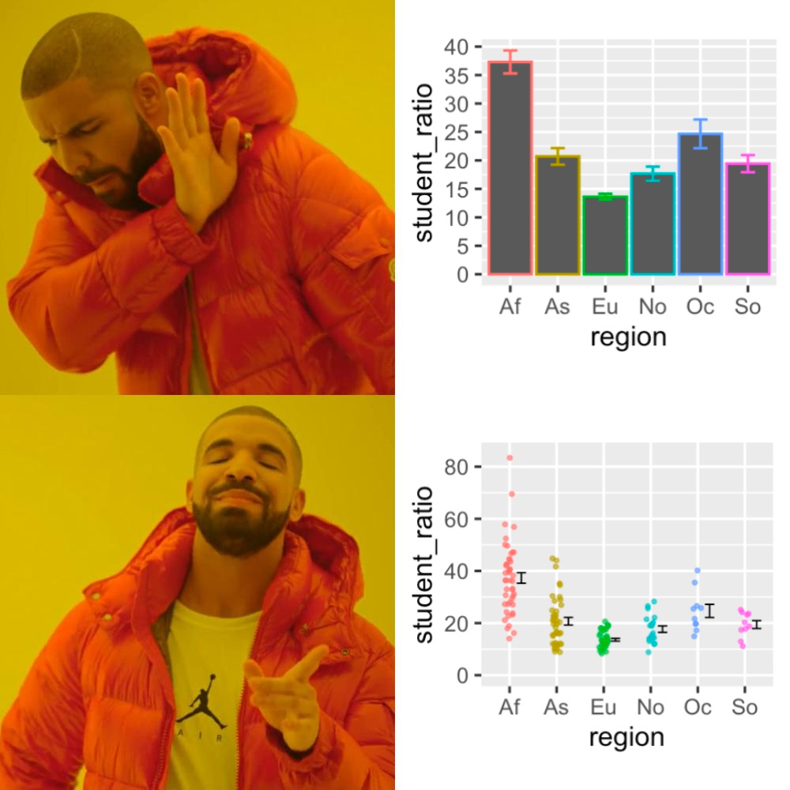
```

```{block2, type='rmdnote'}
Barplots are not uniformly bad. While we should not report means in a barplot, barplots are good for presenting proportions or count data.
```


***ADVANCED: Link to your data and share your code***   

The most transparent data are cully reproducible – that is people should be able to download your code and your data, and redo your analysis, and understand the data well enough to run a different analysis on it. This is becoming the standard for scientific papers, and I will revisit these ideas throughout the term, but this is more relevant to Honors and Grad students than the rest of the class. Check out [this paper](https://journals.plos.org/ploscompbiol/article?id=10.1371/journal.pcbi.1003285) by @sandve2013 for an introduction to reproducible research.    

#### Avoid overplotting  {#nooverplotting}  
Sometimes showing all your data actually hides patterns. Figure 9.15a demonstrates this issue, and Figures \@ref(fig:overplotting)offer some ways to overcome overplotting.  


```{r overplotting, fig.cap='Sometimes showing all the data hides patterns. **(a)** By plotting data points on top of each other, **a** hides the distribution of values. **(b--i)** display plots to solve the this *overplotting* issue. The *sina plot* **(f)** is one of my favorites because it shows the shape of the data and each data point. After installing and loading the [ggforce package](https://ggforce.data-imaginist.com/index.html), use [`geom_sina()`](https://ggforce.data-imaginist.com/reference/geom_sina.html) to make a sina plot. Data from @beall2006. Download data [here](https://whitlockschluter3e.zoology.ubc.ca/Data/chapter02/chap02e3bHumanHemoglobinElevation.csv).',echo=FALSE}
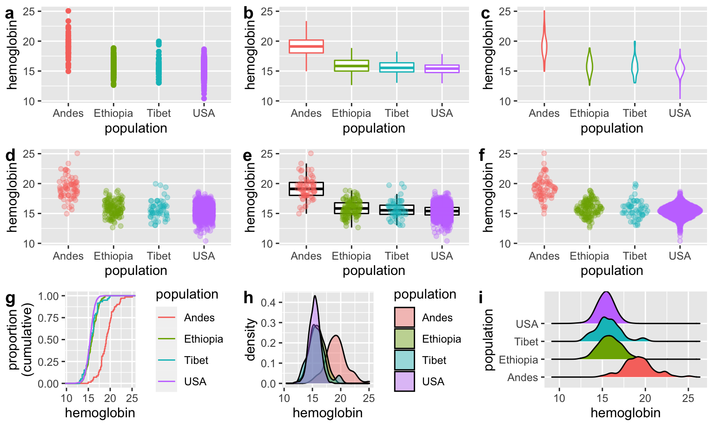
```

### Be clear    {#clarity}

Good plots are clear with messages that pop out at you. To make a clear plot, minimize the cognitive burden, make the point easy to see, and avoid distractions.  

- **Minimize cognitive burden.** Two of my favorite books are Crime and Punishment, and 100 Years of Solitude. These are great stories. But I hated that I needed to bring a piece of paper to trace the relationships between each character in 100 years of solitude, or remember that Raskolnikov, Rodya, and were all the same person. While I’m not here to critique Márquez or Dostoyevsky, that won’t fly in a scientific figure. Be consistent, and use any tricks you can to minimize how much a reader must keep in their head at once.   
  
- **Make points obvious.** While scientific figure should tell a sorry, they should not be a mystery novel or *Fight Club* -- that is, the story should be obvious throughout, and the reader should get the story without needing to solve a puzzle.

- **Avoid distractions.** Readers should be thinking about your story, not the special effects or CGI.

Let's consider how we can us these concepts to build clear plots.


#### Help readers focus on patterns 
We should build our plots in such a way as to help readers focus on the important results.

##### **Bring out important comparisons** {-}   
Simply putting data in a readable formal in a plot is not enough. Good plots are designed to help readers see and evaluate the patterns critical to our story. Consider the story telling analogy - depending on the point of your story, highlighting a detail could either be a red-herring or a critical element. When making figures, we should not hide or lie about certain features of our data, but we should draw attention to what we believe is important. Practically, this means that, for one data set, very different plots could be appropriate depending on the point we are making (see Fig. \@ref(fig:modernaplots)).     


```{r modernaplots, fig.cap='**Same data different message:** Different plots of the Moderna vaccine trial tell different stories. **(a)** and **(b)** highlight the result that most people in the trial did not develop covid regardless of treatment. These plots are dishonest, as they leave us with the impression that the vaccine is not effective.  **(c)** is useful in that it allows readers to compare the risk of severe covid cases by treatment for those infected, but this plot hides the key result that the vaccine decreased risk of infection, **(d)** and **(e)** place our attention towards the severity of the cases. **(f)** highlights the efficacy of the vaccine, but makes it hard to compare the severity by treatment. Still, it is my favorite.',echo=FALSE}
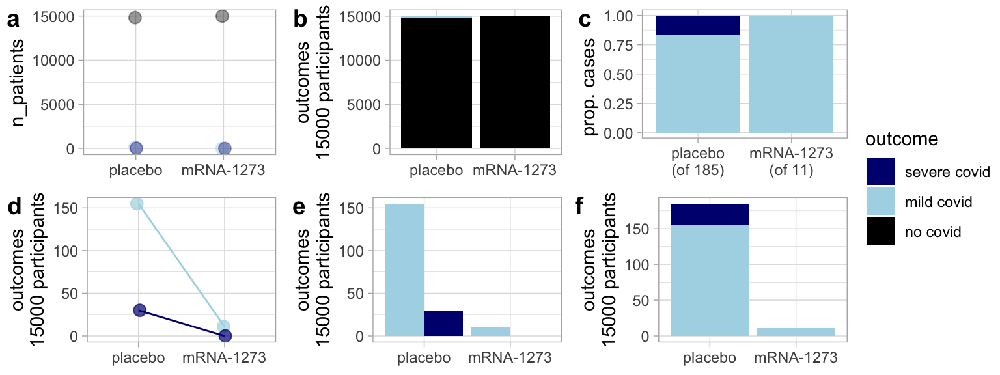
```


##### **Consider how people process images** {-}
When we make a plot, we have to consider not just the data and what we hoped to highlight, but what readers process. Some rules of thumb are known -- for example, pie charts make comparisons difficult, so they are usually avoided. But you don’t need much background knowledge here -- you just need to ask a friend or two to look at your plot and tell you what it is telling them.


```{r broman, fig.cap='Facilitate comparisons -- Which plot makes A and B easiest to compare? Image from slide 28 of [this powerpoint](https://www.biostat.wisc.edu/~kbroman/presentations/graphs2018.pdf) by [Karl Broman](https://kbroman.org/).', echo=FALSE}
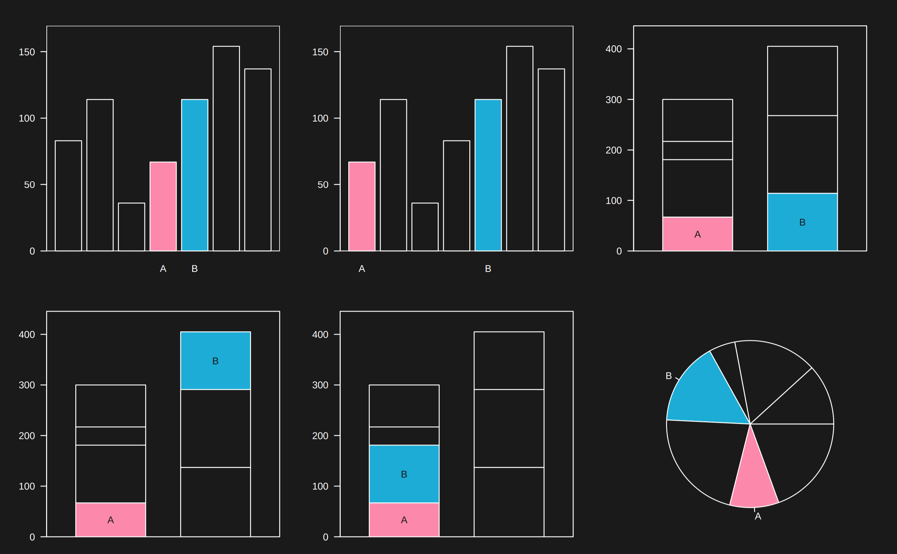
```


####  Make labels informative, easy to digest, and readable

Figure \@ref(fig:xlab)a is clearly bad – we cannot read the names of regions. \@ref(fig:xlab)b, c, and d present possibilities.  


```{r xlab, fig.cap='When dealing with long x-axis labels, its usually best to rotate the axis (d).', echo=FALSE}
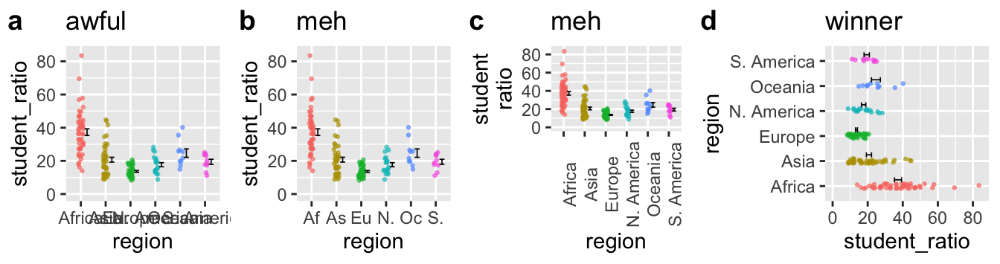
```

- Shortening labels some code (e.g. as we do with the first two characters in \@ref(fig:xlab)b) seems like a good idea, but it is not. A code is a cognitive burden for the reader, so when they see As they have to translate this to Asia, making it harder for them to process your point.    
- Similarly, rotating the x-axis labels (which we can do in R by adding [`theme(axis.text.x = element_text(angle = 90))`](https://ggplot2.tidyverse.org/reference/element.html) to the plot) is not a great solution. Someone reading Fig \@ref(fig:xlab)c must rotate the text in their head, again taking their head out of the data.     
- The **best solution is to rotate the plot itself** (by adding [`coord_flip()`](https://ggplot2.tidyverse.org/reference/coord_flip.html) to the plot). So in Fig \@ref(fig:xlab)d the reader naturally reads right through to the data.


#### Be consistent  

Projects often have numerous plots. Help readers carry the story across plots by being consistent. For example, Figure \@ref(fig:consistent) builds on Fig. \@ref(fig:xlab)d comparing the variation in student to teacher ratios in Asia vs. S. America. Figure \@ref(fig:consistent)a is not great because our reader needs to associate these regions with difference colors. Because colors in Figure \@ref(fig:consistent)b are consistent with previous figures, readers can get to the point more quickly.


```{r consistent, fig.cap='Keep mapping consistent across  figures, and help readers process results.', echo=FALSE}
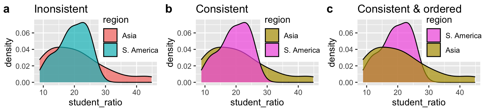
```

```{block2, type='rmdnote'}
In addition to maintaining the color mapping, Figure \@ref(fig:consistent)c sorts labels in the order readers come across them in the plot \@ref(fig:consistent), making it even easier to process.
```

#### Order categories sensibly


```{r order, fig.cap='Order categories sensibly.', echo=FALSE}
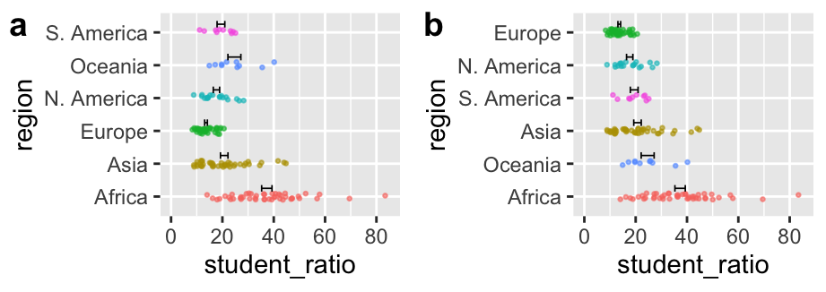
```


Be deliberate about the order of categories on the x-axis (when it is categorical). If data are ordinal (i.e. they can be ordered naturally, e.g. months of a year) place them in their natural order. When there is no natural order, order them from greatest to lowest means. If here are a bunch of categories with very low values, combine them into 'other' and place that after the smallest value (see Figure \@ref(fig:order) for an example). These rules of thumb will help readers process your data -- **do not rely on R to do the right thing for you** -- it naturally orders categories arbitrarily (in alphabetical order) unless you tell it otherwise.  

#### Use direct labeling  


```{r direct, fig.cap='Use direct labelling to minimize cognitive burden.', echo=FALSE, out.extra='style="float:right; padding:10px"'}
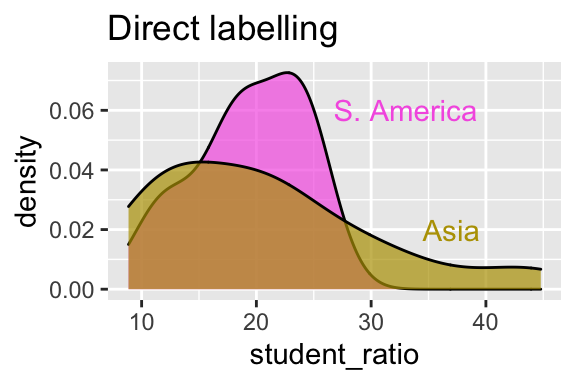
```


Figure \@ref(fig:direct) improves on Fig. \@ref(fig:consistent)c by directly labeling our plots. By doing so, we allow readers to directly think about the data, without making them connect color to label.

#### Avoid distractions
After experimented with unconventional clothing, the designer and architect Buckminster Fuller decided to become "the invisible man" by dressing in clothes that would not draw attention to himself. He realized that he wanted people to pay attention to his ideas, not his look. This principle, which underlies the name of my favorite podcast on desig, [99% Invisible](https://99percentinvisible.org/), holds for making figures. **A good figure calls attention to patterns in the data**, not to itself. @tufte1983 railed against "chartjunk", "data viz ducks", needless 3D, and other features that distract from the message in the data.


##### **Don’t use 3D, animation, etc. unnecessarily** {-}

```{r 3d, fig.cap='Just because you can do something, doesn’t mean it’s a good idea.', fig.show='hold', out.width='25%', echo=FALSE, out.extra='style="float:right; padding:10px"'}
include_graphics("https://media.giphy.com/media/mCClSS6xbi8us/giphy.gif")
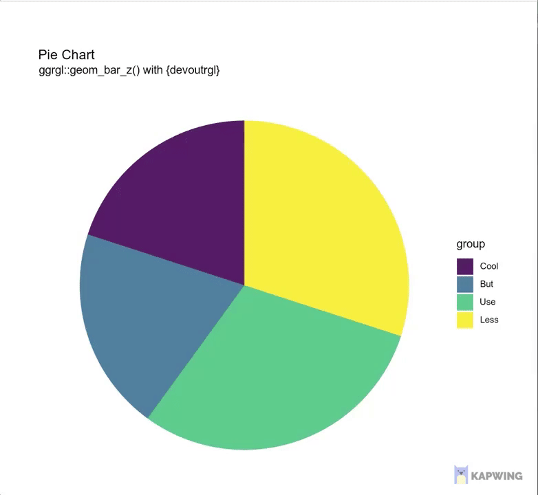
```

Occasionally animation or 3D is the right solution to a specific plotting problem (e.g. 3D is useful to show protein structures, animation can show plots over time) -- resist the urge to use the elaborations unless you’re dealing with one of those specific problems.

##### **What the duck?** {-}

```{r duck, fig.cap='The Big Duck (information and image from [wikepedia](https://en.wikipedia.org/wiki/Big_Duck))', out.width='25%', echo=FALSE, out.extra='style="float:right; padding:10px"'}
include_graphics("https://upload.wikimedia.org/wikipedia/commons/thumb/a/ad/Big_Duck_2018_05.jpg/800px-Big_Duck_2018_05.jpg")
```

@tufte1983 introduced the term 'duck' to describe a self-promoting figure that effectively communicates the composers attempt to be clever, rather than the take home message of the data. The term comes from a building in Flanders, New York, from which the owner sold ducks, duck meat, and duck eggs. This building (Fig. @\ref(duck)) draws attention to itself, it isn't particularly efficient or good for anything else.

We see similar silliness in advertisements and popular press. But, the most extreme duck I've seen is in the banana genome paper [@dhont]. Here the authors' have convinced me that they can draw a banana, but it takes a lot of work to extract any more information from their figure (Fig. \@ref(fig:bananas)). In fact in an effort to make a clever figure, they gave up on making an effective [Venn Diagram](https://en.wikipedia.org/wiki/Venn_diagram), as the area clearly has no meaning. Watch this [optional video](https://www.youtube.com/watch?v=rmii1hfP6d4) if you want to hear a Calling Bullshit rant on Dataviz Ducks.


```{r bananas, out.width= '60%', fig.cap='[This plot is bananas](https://youtu.be/gZHjRQjbHrE?t=152).  [Figure 4](https://www.nature.com/articles/nature11241/figures/4) of the [banana genome paper](https://www.nature.com/articles/nature11241) [@dhont].', echo=FALSE}
include_graphics("https://media.springernature.com/full/springer-static/image/art%3A10.1038%2Fnature11241/MediaObjects/41586_2012_Article_BFnature11241_Fig4_HTML.jpg")
```

[You may ask yourself](https://www.youtube.com/watch?v=5IsSpAOD6K8), why do we bring up data viz ducks? They seem pretty hard to make in R and you’re unlikely to make them? Two reasons:  

- One day, the devil will come to you (in the form of a fever dream, or a boss, or colleague) and will have you thinking about making a silly figure like this. Don't do it.   
 
- Another day you may get carried away with making a pretty figure. While eye catching / memorable graphics are great, do not let the look of figure take  precedence over its message.   

##### **Stay away from "glass slippers"** {-}
@bergstrom2020 describes a new form of data visualization malfeasance in which one specialized and appropriate visualization technique is co-opted for other visualizations. These are rarely successful, as the initial visualization was not built for the new data. This [optional video](https://www.youtube.com/watch?v=59teS0SUHtI) calls this a "glass slipper" as something nice is forced upon an unintended form, and will not fit. Like ducks, glass slippers distract the reader and take their attention away from the data. See the tweet below for an example of a glass slipper.

```{r, echo=FALSE}
include_tweet("https://twitter.com/callin_bull/status/1106259105377705985")
```

##### **Avoid chartjunk** {-}

Unncessary elabortations that distract a reader from the point of a plot aree known as chartjunk. These include eye-catvchign background colors, data viz ducks, glass slippers, 3D charts etc.


```{block2, type='rmdnote'}
The figure below demonstrates that not all elaborations are junk. [Elements that are both fun and help with comprehension can make a figure memorable and effective](https://clauswilke.com/dataviz/telling-a-story.html#make-your-figures-memorable). For example, if each data point is a species, you might wat to replace data points with silhouettes of the species See the [rphylopic package](https://github.com/sckott/rphylopic).
```


```{r, echo=FALSE}
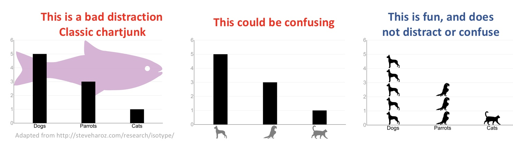
```

### Consider Accessibility and Universal Design
Making figures accessible for all tends to make them better for everyone. Consider the diversity of folks that may look at your figure -- for example it could be read by colorblind people, people with poor eyesight, people who print it in black and white etc. A good figure would be interpretable by all of these people.

We have already highlighted a few good practices -- for example, describing results of a figure in words can make figures more accessible to blind readers, while direct labeling can make colors visible to colorblind readers. These examples highlight the benefit of universal design – as they make figures better all readers.

#### Color  
Picking colors is hard. Be sure that your colors are easy to distinguish, especially if printed in black and white or viewed by a colorblind reader. There are numerous R tools, including the [ColorBrewer package](https://rdrr.io/cran/RColorBrewer/man/ColorBrewer.html) which can help. In particular, I suggest putting figures through a color vision deficiency emulator (I suggest http://hclwizard.org/cvdemulator/) to see how your plots would look to readers with a color vision deficiency.


```{r, fig.cap = '**ASSIGNMENT**: Download <a href="https://github.com/ybrandvain/biostat/blob/master/images/homglobin4comp.png?raw=true" download="hemoglobin"> this figure  </a> showing human hemoglobin levels by population -- which is meant to understand the basis of high altitude adaptation in the Andes, Ethiopia, Tibet, and  USA (as a control population that has not adapted to high elevation), upload it to http://hclwizard.org/cvdemulator/ (embedded below)  and see how these different figures are viewed under different color vision deficiencies.', echo = FALSE}
include_app("http://hclwizard.org/cvdemulator/")
```


#### Size
Make sure everything can be read even by people with poor eyesight. Always err on the side of larger text.   


```{r biggertext, out.width= '60%', fig.cap='Bigger text is easier to read.  [Image from Advanced Data Science](http://jtleek.com/ads2020/)', echo=FALSE}  
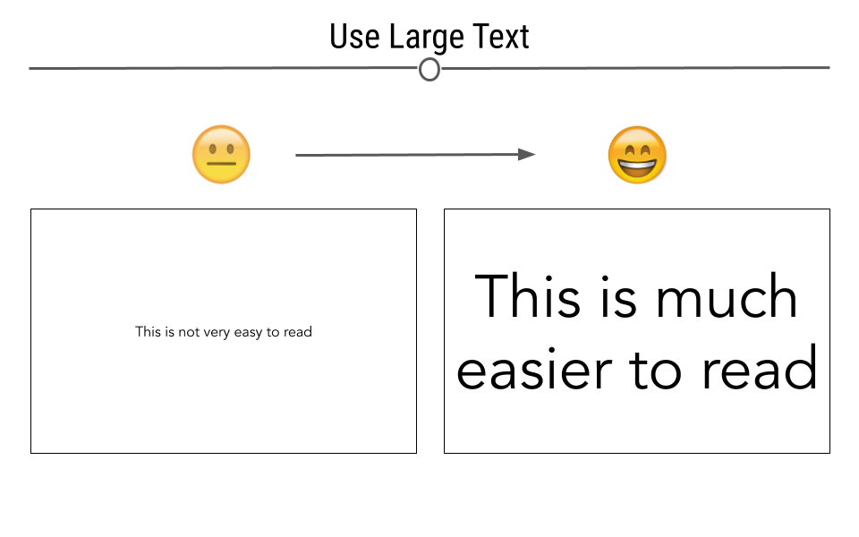
```

####  Redundant coding
As discussed above, colors can sometimes be difficult to distinguish. Redundant coding (e.g. mapping shape and color onto the same variable) provides readers with more information and more opportunities to discriminate between categories.


## Writing about and discussing figures   

Good figures should speak for themselves. Readers should be able to read your figure and come to a reasonable conclusion. But, we do have opportunities to help readers interpret the figure and digest their take home messages. We generally describe, explain, and interpret figures for readers in writing, presentation, or in the figure legend. Let’s make the most of these opportunities.

###  Writing about figures in text


```{r moderna2,  fig.cap='Moderna data, as an example for writing about figures', echo=FALSE} 
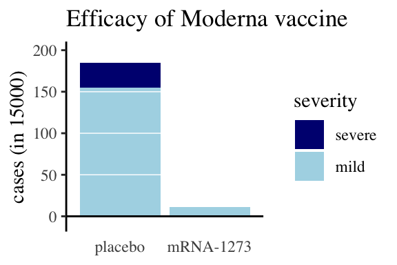
```

In writing up results, we describe our statistical analyses, summaries and figures in prose. This is an opportunity to reiterate the take-home messages from the analysis and point towards our figures and statistics as evidence for these messages. Let’s think about how to do this, leaving he discussion of statistics to a later time.

- **A bad write up:** Figure \@ref(moderna2) compares covid cases and severity of these cases for treatments and controls.   

- **Better write up:** Figure \@ref(moderna2) shows an excess of covid cases in people treated with a placebo compared to people getting the moderna mRNA-1273 vaccine (185 of 15,000 individuals in the placebo group caught coronovirus, while only 11 of the 15,000 vaccinated caught coronovirus). Additionally, none of the vaccinated participants who became infected developed a serve case of covid, while 30 of the 185 infected after receiving the placebo developed a serious case (compare the dark blue bar above control and its absence above mRNA-1273).   

```{block2, type='rmdnote'}
When reading text about a figure, **first look at the figure and think** about its message. Then look at what was written and consider:  

- What features of the figure support their claims?  
- How similar is your interpretation of the figure to theirs?  
- Are there elements of the figure that argues against their interpretation? 
```


### Writing good figure legends
All (good explanatory) figures should make sense on their own – without a figure legend. However, descriptive figure legends enhance good figures by pointing out take home messages underlying what is shown. So, while figures should make sense without a legend, a good legend should build a deeper appreciation for the results, perhaps including minor details which are not necessary for interpreting results.

```{r, fig.cap = '**This is not what legend is for.**  Group 1 received the control and Group 2 received the vaccine. Light blue shows mild cases, dark blue is severe.', echo = FALSE}
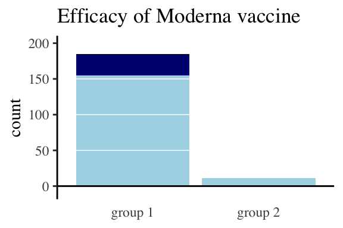
```


```{r, fig.cap='**Appropriate legend.** Participants receiving a placebo had a much higher incidence of covid than those receiving the Moderna vaccine (the bar on the left is much higher than that on the right). The few cases in the vaccinated group were all mild (represented by light blue bars), while both mild and severe (dark blue) cases arose in the placebo group. Data from the Moderna [press release](https://investors.modernatx.com/news-releases/news-release-details/moderna-announces-primary-efficacy-analysis-phase-3-cove-study).', echo=FALSE}

```


## Data tables
In Chapter \@ref(data1) we discussed storing data for analysis in tables. Although [it is usually better to present data in figures than tables](http://www.stat.columbia.edu/~gelman/research/published/dodhia.pdf), we may sometimes want to present results to readers in tables. These tables should not look like those introduced in chapter \@ref(data1). In general, these tables should follow best practices in making figures (e.g. facilitating comparisons, honesty, readability etc...). These tables need not be tidy, and should not include all raw data, but rather should summarize data and analyses.
