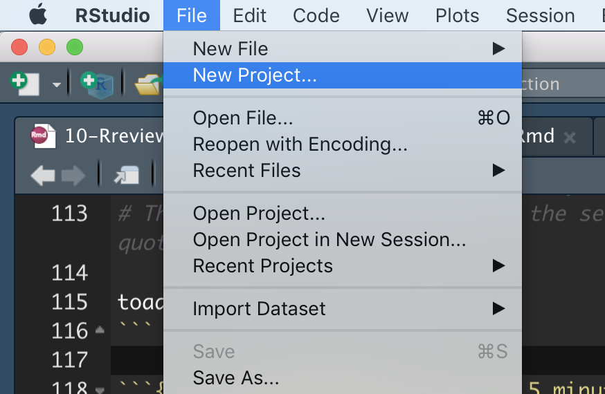

# Review of R and New tricks  

```{r, echo = FALSE, warning=FALSE, message=FALSE}
library(tidyverse)
library(knitr)
library(blogdown)
library(beyonce, warn.conflicts=F, quietly=T)
library(stringr)
library(tweetrmd)
library(emo)
library(tufte)
library(cowplot)
library(lubridate)
library(ggthemes)
library(ggforce)
library(DT)
library(datasauRus)
library(ggridges)
iris <- tibble(iris)
```

By now, we have hopefully gotten the hang of getting things done in `R`. But we're all in a different place. Some of us still have some fundamental things we don't understand. Others feel ok on the whole, but  there might be something that you don't quite get, or a bunch of confusing errors that you haven't understood. 

Maybe you have `R` questions related to work you have done outside of his class, or you are curious about base R. 

Or you want to make nice reproducible reports in `RMarkdown` and/or  learn how to organize an `RProject`, or organize make a collaborative open project on github.  

This lesson is designed to give you a chance to catch up on `R`, connect the dots between what you have learned, review, and/or learn new things. This should help you prepare for your first major assignment of an exploratory data analysis, due on Monday.


## Your questions, answered   

First they need to be asked   


## Enhancing your R experience    

There are two features of working in `R` which I recommend to people who will be working with `R` regularly:     

- **RMarkdown:** A way to integrate your code, figures, results, and ideas in one report,   and

- **R projects:** A way to organize your files and code.  


If you have time and interest, I recommend getting familiar with these tools and using them for your first project (due Monday), especially if you are taking this course at the honors or graduate level.  


### RMarkdown   (optional)  

```{r, echo=FALSE}
include_graphics("https://github.com/allisonhorst/stats-illustrations/blob/master/rstats-artwork/rmarkdown_wizards.png?raw=true")
```

RMarkdown is a file format that allows us to seamlessly combine text, R Code, results and plots. You use RMarkdown by writing in plain text and then interspersed with *code chunks*. See the video below (\@ref(fig:rmarkdownoverview)) for a brief overview. 


```{r rmarkdownoverview, fig.cap='A brief (4 min and 37 sec) overview of RMarkdown from Stat 545.', echo=FALSE, out.extra= 'allowfullscreen'}
include_url("https://www.youtube.com/embed/ZzDSkBgt9xQ" )
```

You can use RMarkdown to make pdfs, html, or word documents that you can share with peers, employers etc... RMardown is especially useful for communicating results of complex data analysis, as your numbers, figures, and code will all match. This also means that anyone (especially future you, See Fig. \@ref(fig:reproducible)) can recreate, learn from, and build off of your work.  


```{r reproducible, fig.cap='Why make a reproducible workflow (A dramatic 1 min and 44 sec video).', echo=FALSE, out.extra= 'allowfullscreen'}
include_url("https://www.youtube.com/embed/s3JldKoA0zw")
```


Many students in this course like to turn in their homeworks as html documents generated by RMarkdown, because they can share their code, figures and ideas all in one place. Outside of class, the benefits are similar -- people can see your code and results as they read your explanation. RMarkdown is pretty flexible -- you can write lab reports, scientific papers, or even this book in RMarkdown. 


To get started with RMarkdown, I suggest click `File > New File > RMarkdown` and start exploring.  For a longer introduction, check out [Chapter 27 of R for Data Science](https://r4ds.had.co.nz/r-markdown.html) [@grolemund2018]. Push onto [Chapter 2 of RMarkdown: The definitive guide](https://bookdown.org/yihui/rmarkdown/basics.html#basics) [@xie2018] to dig even deeper.  

*A few RMarkdown tips:*     

- You can control figure size by specifying `fig.height` and `fig.width` and you can show the code or not with the `echo = TRUE` or `echo = FALSE` options  in the beginning of your codechunk  `{r, fig.height = ..., fig.width = ..., echo = ...}`).    

- The `DT` and `kableExtra` packages can help make prettier tables. 

If you have the time and energy, I strongly recommend that you **turn in your first homework as an html generated by RMarkdown.**  


```{r fig.cap='download the [RMarkdown cheat sheet](https://rstudio.com/wp-content/uploads/2015/02/rmarkdown-cheatsheet.pdf)', echo=FALSE}
knitr::include_graphics('https://d33wubrfki0l68.cloudfront.net/374f4c769f97c4ded7300d521eb59b24168a7261/c72ad/lesson-images/cheatsheets-1-cheatsheet.png')
```


### Organizing projects and reading data        

Getting data into `R` reliably can be pretty challenging and frustrating. But there is a good practice that takes away most of the pain or reading data, and as a bonus, helps us keep our projects organized.  

In Section \@ref(orgfolder), I suggested that you give each project its own folder, with sub-folders for data, figures, code, and writing. For example, the analysis due Monday should be its own folder (like `Toads` in Fig. \@ref(fig:orgfolder)), kept in some larger organization (perhaps inside your `BIO3272` folder).

```{r orgfolder, fig.cap='Example folder structure', echo=FALSE}

```


In the `Toads` folder, you'll see the file, `Toads.Rproj`. Opening this file every time you work on this project will make your life easier -- as it will open up `RStudio` right there in that part of your computer. This means that you will be really close to your data.    

```{r, fig.,cap = 'How to start a project. Read Jenny Bryans [blgpost](https://www.tidyverse.org/blog/2017/12/workflow-vs-script/) if you want more info on why projects are the best way to R, and her [Chapter on R projects]([https://rstats.wtf/project-oriented-workflow.html]) from her book [WTF-r](https://rstats.wtf/).', fig.show='hold', echo=FALSE, out.width='50%'}
#
#include_graphics("images/project.png")
```

There are a bunch of ways to load in the `toad_data` from this project. My favorite way is to use the **use the here package**. Remember to install it (by entering `install.packages("here")`) before you use it the first time, and then then load it with `library(here)` in the beginning of your R code every time you will use it.  


```{r, eval=FALSE}
# loading a file with the here package in a project 
library(here) # load the here package  
toad_path <- here("data","toad_data") # use here to point to your file
# The first thing is the folder, the second is the filename, both  are in quotes.  

toads <- read_csv(toad_path)
```

```{r, fig.cap ='Watch the first 7 minutes and 50 secondsof this video from Stat 545.', echo = FALSE, out.extra= 'allowfullscreen'}
include_url("https://www.youtube.com/embed/2nHuNu6Zaqk?end=526" ) 
```

**I DO NOT REQUIRE YOU TO USE PROJECTS OR THE HERE PACKAGE** But I strongly suggest trying it for a while. I've come to really like it.  


```{r fig.cap='', out.width='30%', echo=FALSE, out.extra='style="float:right; padding:10px"'} 
include_graphics("https://github.com/allisonhorst/stats-illustrations/blob/master/rstats-artwork/stormyr.gif?raw=true")
```

## When `R` goes wrong  

`R` can be fun, useful and empowering, but it can also be a bummer. Sometimes it seems like you've done everything right, but things still aren't working. Other times, you just can't figure out how to do what you want.  When this happens it is natural to tense up, curse, through $h!t etc... While some frustration is OK, you should try not to avoid sulking. Here's what I do. 

1. Take a **deep breath**.  
2. **Copy and paste and try again**.  If that doesn't work, go to 3.   
3. **Look at the code forany common issues** (like those in Section  \@ref(gotcha), below).  If I see one of these issues, I fix it and feel like a champ. If not, I go to step 4.   
4. Remember that **google is my friend**, use it. I usually copy the error message R gives and past it into goole. If this gives me a path towards solving this? If so give it a shot, if not, go to 5.
5. **Take a walk** around the house, grab a drink of water, get away from the computer for a minute. Then think about what I was trying to do and return to the computer to see if I've done it right and if that time away allowed me to see mistakes I missed before. If I see  the issue, I fix it and feel like a champ. If not, I go to step 6.   
6. **Move on, do something else** and come back to it later  (7).  If you have more R to work on, try that (unless you need a break). If you're not going to do more R, you should probably close your RStudio session.  
7. OK back to it. Reopen RStudio and work through your code. Do you see the issue now? If so fix it, if not move onto 8.   
8. **Explain the issue** to a friend / peer. I often figure out what I did wrong, when I explain it. Like "I said add 5+5 and it kept giving me 10, when the answer should have been 25." And then I realize I added when I wanted to multiply. Or maybe your friend figures it out.    
9. How important is this thing? Can I **do something slightly different that is good enough**? If so I try that. If it's essential,   
10. **Find an expert** or [stackoverflow](https://stackoverflow.com/) or something.

```{r, echo=FALSE}
include_tweet("https://twitter.com/allison_horst/status/1213275783675822080?s=20")
```

### Warnings and Errors, Mistakes  and Impasses

Before digging into the common R errors, lets go over the four ways R can go wrong. 

1. **A warning.** We did something that got `R` nervous, and it gives us a brief message. It is possible everything is ok, but just have a look. I think of this as a yellow light.    The most common warning I get is the harmless `summarise() ungrouping output (override with .groups argument)`.   

2. **An error.** We did something that R does not understand or cannot do. R will stop working and make us fix this. I think of this as a green light.   

3. **A mistake.** Our communication with R broke down -- it thought we were doing one thing but we wanted it to do another. Mistakes are the most likely to cause a big problem. So, remember that just because R works without an error or warning, does not mean it did what we hoped.

4. **An impasse.** There's something we want to do, but can't figure it out.  

Be mindful of these types of issues with R as you code and as you read the common errors below. 


### Common gotcha's  {#gotcha}

I share my most common mistakes, below. I note that these are my common mistakes. If you find that you often make different sorts of mistakes, email me with them, and I'll add them.     


#### Spelling / capitilization etc 

`R` cant read your mind <span style="color:LightGrey">(although tab-completion in RStudio is awesome)</span>, and pays attenotion to capital letters. Spellng errors are my most common mistake. For example, the column, `Sepal.Length`, in the `iris` dataset has sepal lengths for a bunch of individuals. Trying to select the column by typing any one of the options below will yield a similar error: 


```{r, eval=FALSE}
select(iris, sepal.length)
select(iris, Sepal_Length)
select(iris, Sepal.Lngth)
```

```{r, error=TRUE, echo=FALSE}
select(iris, Sepal.Lngth)
```

Similarly, you might misspell the function:  

```{r, error=TRUE}
selct(iris, Sepal.Length)
```

So, check for these mistakes and fix the code above to look like this:  


```{r, eval=FALSE}
select(iris, Sepal.Length)
```

```{r, echo=FALSE}
select(iris, Sepal.Length) %>% head()
```


#### Confusing `==` and `=`  


Consecutive equals signs `==` ask if the thing on the right equals the thing on the left.  For example, if I want to know if two equals six divided by two, I type `2 == (6/2)` and R says `r 2 == (6/2)`.  But what if I accidentally type (6/2) = 3. In this case R gets very confused.  


```{r, error=TRUE}
 2 = (6/2)
```

This confusion arises because we told R to make two equal  six divided by two, which is nonsense.  

```{r, }
two <- 2
```

But it could be worse than nonsense. Say the value two  is assigned to `two`, and now we ask if `two` equals (6/2). Asking with a `==`, as in `two == (6/2)`, gives us our expected answer: `r two == (6/2)`. But typing `two = 6/2` does not ask if `two` equals `6/2`, rather it tells R that `two` equals `6/2` for now, returning unexpected results like that below.


```{r, echo=FALSE}
two = 6/2
```

```{r}
two^2
```

**This is one of many  cases in which `R` does what we say and does not warn of an error, but does not do what we hoped it would.**


One more note while we're here: **The clarity and utility of R's error messages vary tremendously.** 

For example, if we confuse `=` and `==` inside the [`filter()`](https://dplyr.tidyverse.org/reference/filter.html) function in the [`dplyr`]( https://dplyr.tidyverse.org/) package, R gives a very useful error message.  For example, say we mess up in asking R to only return data for *Iris setosa* from the `iris` data set.

```{r, error = TRUE}
filter(.data = iris, Species = "setosa")
```

By contrast doing a similar operation in base R <span style="color:LightGrey">(which you may have seen previously, but we don't cover in this course) </span>, yields a less clear error message:  

```{r, error = TRUE}
iris[ iris$Species = "setosa", ]
```


#### Confusing `=` and `<-`    


As we've seen throughout the course, we  use the *global operator*, to assign values to variables. But inside a function we use the `=` sign to assigning values to argument in a function. Using the global operator in a function does a bunch of bad things. 

Say we wanted to sample a letter from the alphabet at random. Typing `sample(x = letters, size =1)`, will do the trick and will not assign any value to x outside of that function. 

```{r, error=TRUE}
#### DO THIS
sample(x = letters[1:10], size =1)
x
```

The *error* above is a good thing -- we wanted to sample letters, not have `x` equal the letters. By contrast, using `<-` to assign values to arguments has bad consequences.   


```{r, error=TRUE}
#### DONT DO THIS
sample(x <- letters, size =1)
x
```


This is BAD. We did not want to assign the alphabet to `x`, we just wanted the [`sample()`](https://stat.ethz.ch/R-manual/R-devel/library/base/html/sample.html) function to sample from the alphabet.   Bottom line:     

- Use the `=` sign to assign values to arguments in a function.   
- Use `<-` to assign values to variables outside of a function.   
- Use `==` to ask if one thing equals another.    


#### Dealing with missing data    

Often our data includes missing values. When we do math on a vector including missing values, `R` will return `NA` unless we tell it to do something else. See below for an example:  

```{r}
my_vector <- c(3,1,NA)
mean(my_vector)
```

Depending on the function, we have different ways of telling R what to do with missing data. In the [`mean()`](https://stat.ethz.ch/R-manual/R-devel/library/base/html/mean.html) function, we type. 

```{r}
mean(my_vector, na.rm = TRUE)
```

We have to be extra carful of missing values when doing math ourselves. If  we  found the mean of `my_vector` by dividing its sum by its length, like this: `sum(my_vector) / length(my_vector) =` `r sum(my_vector) / length(my_vector)`, we would have the wrong answer. So be careful and avoid this mistake.


#### Conflicts in function names  

Each function in a package must be unique. But functions in different packages can have the same name and do different things. This means we might b using a totally different function than we think.  If we're lucky this results in an error, and we can fix it. If we're unlucky, this results in a bad mistake.  

We can avoid this mistake by typing the package name and two colons and then the function name (e.g. `dplyr::filter`) before using any function. But this is quite tedious. Installing and loading the [`conflicted package`](https://www.tidyverse.org/blog/2018/06/conflicted/), which tellsus  when we use a function that is used by more than one packages loaded, resulting in a warning that we can fix!


#### Mistakes in assignment

I often mess up in assigning values to variables. I do so in a few different ways, I:   

- Forget to assign a variable to memory,    
- I use the variable before it's assigned,   
- I don't update my assignment after doing something, or  
- I overwrite my old assignment.   


I'll show you what I mean and how to spot and fix these common issues...


##### **Mistakes in assignment:** Not in memory   


```{r nomem, echo=FALSE, fig.cap='I did not assign the value one to x.', out.width='60%', echo=FALSE, out.extra='style="float:right; padding:10px"'}
include_graphics("images/nox.jpeg")
```


As the example in Figure \@ref(fig:nomem) shows, typing a value into an `R` script is not enough. We need to enter it into memory. You can do this by either, hitting `ctl + shift`, or `/command + shift`, or hitting the `run` button in the RStudio IDE, or copying and pasting into the terminal widow.  

To see all the variables in `R`s memory,  check the environment tab in the RStudio IDE, or use the [`ls()`](https://stat.ethz.ch/R-manual/R-devel/library/base/html/ls.html) function with no arguments.

##### **Mistakes in assignment:** Wrong order 

If you want to square `x`, **after** assigning the value one to it (as in Figure \@ref(fig:nomem)), you must assign one to `x` **before** squaring x. This mistake is quite similar to the one above.  


```{r, eval=FALSE}
x^2
x  <-  1
```

```{r, error=TRUE, echo=FALSE}
x^2
```

```{r, echo=FALSE}
x <-1
```

##### **Mistakes in assignment:** Not updating assignment   

Another common mistake is to run some code but not save assign the output. So, for example we wanted to make a density plot of the ratio of petal width to sepal width. Can you spot the error in the code below?  


```{r, error=TRUE,out.width='0%'}
iris %>% 
  mutate(petal_to_sepal_width = Petal.Width / Sepal.Width) 

ggplot(iris, aes(x = petal_to_sepal_width, fill = Species )) + 
  geom_density(alpha = .5)
```


We clearly calculated `petal_to_sepal_width`, above, so why can't `R` find it? The answer is that we did not save the results. Let's fix this by assigning our new modifications to `iris`.      


```{r,fig.height=1.4, fig.width=3}
iris <- iris %>% 
  mutate(petal_to_sepal_width = Petal.Width / Sepal.Width) 

ggplot(iris, aes(x = petal_to_sepal_width, fill = Species )) + 
  geom_density(alpha = .5)
```


##### **Mistakes in assignment:** Overwriting assignments  

Above, I showed how failing to reassign after doing some calculation can get us in trouble. But other times,  reassigning can cause it own problems.  

For example, let's say I want to calculate [`mean()`](https://stat.ethz.ch/R-manual/R-devel/library/base/html/mean.html) petal to sepal widths for each species and then make the same plot as above.  


```{r,fig.height=0.1, fig.width=3, error = TRUE, warning=FALSE}
iris <- iris        %>% 
  group_by(Species) %>%
  summarize(mean_petal_to_sepal_width = mean(petal_to_sepal_width), .groups= "drop_last") 

ggplot(iris, aes(x = petal_to_sepal_width, fill = Species )) + 
  geom_density(alpha = .5)
```


So, what went wrong here?  Let's take a look at what I did to `iris`:

```{r}
iris
```

Ooops, we just have species means. In this case, it's better to assign your output to a new variable...

```{r, echo=FALSE, message=FALSE, warning=FALSE}
rm(iris)
iris <- tibble(iris)
iris <- iris %>% 
  mutate(petal_to_sepal_width = Petal.Width / Sepal.Width)
```

```{r,fig.height=1.4, fig.width=3, warning=FALSE, message=FALSE}
iris_petal2sepalw_bysp <- iris        %>% 
  group_by(Species) %>%
  summarize(mean_petal_to_sepal_width = mean(petal_to_sepal_width), .groups= "drop_last") 

ggplot(iris, aes(x = petal_to_sepal_width, fill = Species )) + 
  geom_density(alpha = .5)
```


**So when should we reassign top the old variable name, and when should we assign to a new name?** My rule of thumb is to reassign to the same variable  when I add things to a tibble, but do not change existing data, while I assign to a new variable, when values change or are removed <span style="color:LightGrey">(with some exceptions)</span>.

But what if **you wanted the mean in the same tibble as the initial data** so you could add lines for species means? You can so this with [`mutate()`](https://dplyr.tidyverse.org/reference/mutate.html) instead of [`summarise()`](https://dplyr.tidyverse.org/reference/summarise.html).


```{r,fig.height=1.4, fig.width=3, warning=FALSE, message=FALSE}
iris <- iris        %>% 
  group_by(Species) %>%
  mutate(mean_petal_to_sepal_width = mean(petal_to_sepal_width), .groups= "drop_last") 

ggplot(iris, aes(x = petal_to_sepal_width, fill = Species)) + 
  geom_density(alpha = .5)+ 
  geom_vline(aes(xintercept = mean_petal_to_sepal_width, color = Species), lty = 2)
```

#### Just because you didn't get an error doesn't mean R is doing what you want (or think):     

Say you want to reassign `x` to the value `10`, and you want `y` to equal `x$^2$` (so `y` should be  `100`). The code below messes this up by assigning the value `x$^2$` to `y` before it setting `x` to `10`. This means that `y` is using the older value `x`, which equals `1`, set above.  


```{r}
y  <-   x^2
x  <-   10
print(y)
```


#### Unbalanced parentheses, quotes, etc...    

```{r,echo=FALSE, out.width='15%',out.extra='style="float:right; padding:10px"'}

```

Some things, like parentheses and quotes come in pairs. Too many or too few will cause trouble.

```{r,echo=FALSE, out.width='15%',out.extra='style="float:right; padding:10px"'}

```  


- If you have one quote or parenthesis open, without its partner (e.g. `"p`), R will wait for you to close it. With a short piece of code you can usually figure out where to place the partner. If the code is long and it's not easy to spot,  hit `escape` to start that line of code over.  

- Unbalanced parentheses cause R to report an error (below).  

```{r, error=TRUE}
c((1)
```


#### Common issues in ggplot 


##### Using `%>%` instead of `+` 

We see two ways tidyverse to take what it has and keep moving.    

- When dealing with data, we pipe opperations forward with the `%>%` opperator. For example, we told `R` to tak our tibbl and then pull out our desired coumn, above `name_of_tibble %>% pull(var = name_of_column)`.    


- When building a plot, we add elements to it with the `+` sign. For example, in a scatterplot, we type: `ggplot(data = <name_of_tibble>, aes(x=x_var, y = y_var)) +  geom_point()`.  


I occasionally confuse these and get errors like this:  

```{r, error=TRUE}
ggplot(iris, aes(x = Petal.Length, y = Petal.Width)) %>%
  geom_point()
```

Or

```{r, error=TRUE}
iris +
  summarise(mean_petal_length = mean(Petal.Length))
```


##### Specifying a color in  the `aes` argument   

Say we want to plot the relationship between petal and sepal length in *Iris setosa* with points in  <span style="color:Blue">blue</span>.  

The code below is a common way to do this wrong. 


```{r,fig.height=1.7, fig.width=3, warning=FALSE, message=FALSE}
filter(iris, Species == "setosa") %>% 
  ggplot(aes(x=Petal.Length, y = Sepal.Length, color = "blue")) + 
    geom_point()
```

The right way to do this is  


```{r,fig.height=1.7, fig.width=2.15, warning=FALSE, message=FALSE}
filter(iris, Species == "setosa") %>% 
  ggplot(aes(x=Petal.Length, y = Sepal.Length)) + 
    geom_point(color = "blue")
```


##### Fill vs color      

There are two types of things to color in `R` -- the `fill` argument fill space with a color and the `color` argument colors lines and points.  To demonstrate let's first make two histograms of *Iris setosa* sepal length with decorative color:  


```{r, fig.height=2, fig.width=5.75, echo=FALSE, warning=FALSE}
plotA <- filter(iris, Species == "setosa") %>% 
  ggplot(aes(x=Petal.Length)) + 
  geom_histogram(color = "blue", bins = 10)+
  labs(subtitle = 'geom_histogram(color = "blue")')

plotB <- filter(iris, Species == "setosa") %>% 
  ggplot(aes(x=Petal.Length)) + 
  geom_histogram(fill = "blue", bins = 10)+
  labs(title = 'geom_histogram(fill = "blue")')

plot_grid(plotA, plotB, labels = c("a","b"))
```

*So we usually want to make histograms and density plots by specifying our desired color with `fill`*. I usually add `color = "white"` to separate the bars in the histogram.*  

Now lets try the same for color, now plotting petal length against sepal length, mapping species onto color or fill. 

```{r, fig.height=1.7}
plotA <- ggplot(iris, aes(x=Petal.Length,  y = Sepal.Length, color = Species)) + 
  geom_point()+   labs(title = 'aes(color = Species)')

plotB <- ggplot(iris, aes(x=Petal.Length, y = Sepal.Length, fill = Species)) + 
  geom_point()+  labs(title = 'aes(fill = Species)')

# using plot_grid in the cowplot package to combine plots 
plot_grid(plotA, plotB, labels = c("a","b"))
```


*So we usually want to make scatterplots and lineplots  by specifying our desired color with `color`*.

##### Bar plots with count data

Imagine we wanted to plot hair color and eye color for men and wommen.  Because this is count data, some form of bar chart would be good. If our data looks like this 


```{r, echo=FALSE, warning=FALSE}
hair_eye <- as_tibble(HairEyeColor) %>% 
  uncount(weight = n) %>% 
  sample_n(size = 592)


HairEyeColor <- as_tibble(HairEyeColor)
           
DT::datatable(hair_eye,  options = list(pageLength = 5, lengthMenu = c(5, 30, 90)))
```

We can make a bar plot with `geom_bar`

```{r, fig.height=1.7}
ggplot(hair_eye, aes(x = Sex, fill = Eye))+
  geom_bar(position = "fill", color = "white")+
  facet_wrap(~Hair, nrow = 1, labeller = "label_both")+
  scale_fill_manual(values = c("blue","brown","green","gold"))
```


But if our data looked like this:  


```{r, echo=FALSE, warning=FALSE}
DT::datatable(HairEyeColor,  options = list(pageLength = 5, lengthMenu = c(5, 30, 90)))
```

`geom_bar` would result in an error. 

```{r, fig.height=.1, error = TRUE}
ggplot(HairEyeColor, aes(x = Sex, y = n, fill = Eye))+
  geom_bar(position = "fill", color = "white")+
  facet_wrap(~Hair, nrow = 1, labeller = "label_both")+
  scale_fill_manual(values = c("blue","brown","green","gold"))
```

We could overcome this error by using [`geom_col()`](https://ggplot2.tidyverse.org/reference/geom_bar.html) instead of [`goem_bar()`](https://ggplot2.tidyverse.org/reference/geom_bar.html), or by typing  `geom_bar(position = "fill", color = "white",  stat = 'identity')`.


#### When you give `R` a tibble  

Throughout this course, we deal mostly with data in [`tibbles`](https://r4ds.had.co.nz/tibbles.html), a really nice way to store a bunch of variables of different classes -- each as its own vector in a column.  However occasionally we need to `pull` a vector from its tibble, to do so, type:  

```{r, eval=FALSE}
pull(.data = <name_of_tibble>, var = <name_of_column>)
## or 
name_of_tibble %>% 
  pull(var = name_of_column)
```


