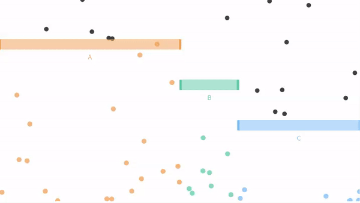
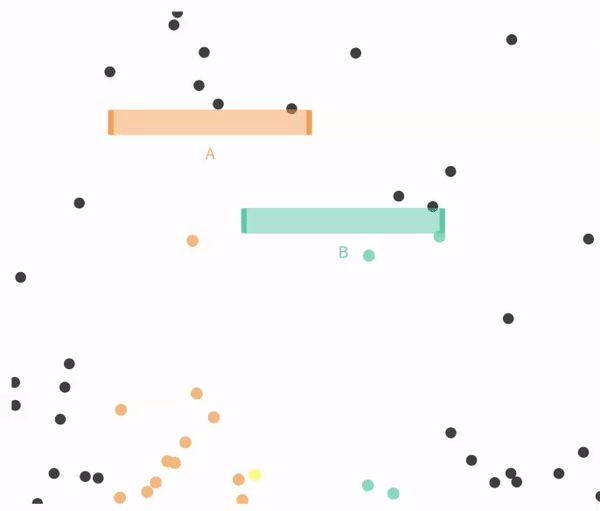
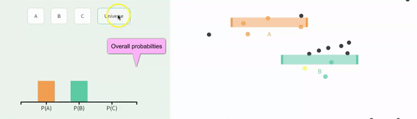
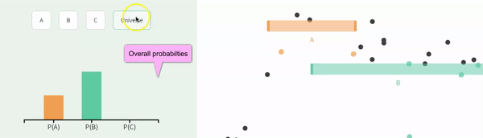

# Probabilistic thinking {#prob1}

```{r, echo = FALSE, warning=FALSE, message=FALSE}
library(tidyverse)
library(DT)
library(knitr)
library(blogdown)
library(beyonce, warn.conflicts=F, quietly=T)
library(stringr)
library(tweetrmd)
library(emo)
library(tufte)
library(cowplot)
library(lubridate)
library(ggthemes)
library(ggforce)
library(datasauRus)
library(ggridges)
library(randomNames)
library(infer)

html_tag_audio <- function(file, type = c("mp3")) {
  type <- match.arg(type)
  htmltools::tags$audio(
    controls = "",
    htmltools::tags$source(
      src = file,
      type = glue::glue("audio/{type}", type = type)
    )
  )
}
```


```{block2, type='rmdnote'}
These notes accompany portions of Chapter 5  --- *Probability* --- of our textbook, which we also examine in the [next section](#prob2).   **The reading below is required,**  @whitlock2020 is  not.    
```


<span style="color: Blue;font-size:22px;">   Motivating scenarios:  </span>  <span style="color: Black;font-size:18px;">  We want to understand how seemingly important patterns can arise by chance, how to think about chance events, how to simulate chance events in `R`, and gain an appreciation for a foundational concern of statistics and how the filed addresses this concern. </span> 
 
**Learning goals: By the end of this chapter you should be able to**   

- Provide a working definition of probability.  
- Explain why we need to think about probability when interpreting data.     
- Consider a proportion as an estimate as random outcome of a population parameter.      
- Recognize that "Random" does not mean "No clue".   
- Understand condicitional probabilities and non-ndependence.  
- Simulate complex probabilistic events in R with the [`sample()`](https://stat.ethz.ch/R-manual/R-devel/library/base/html/sample.html)  function.   
- Find proportions from real or simulated data using `tidyverse` tools.      
- Apply your knowledge of figure design to categorical data.   
- Use simulated data to to find the probability of one codition, given the observation of some other state.  


```{block2, type='rmdwarning'}
In addition to this reading,  the other assignment is to **listen to 5 minutes (4:10 - 9:10) of the** *No coincidence, No story* **[Episode of This American Life](https://www.thisamericanlife.org/489/no-coincidence-no-story), embedded below**.  
```


```{r echo  = FALSE, fig.cap = "hello"}
html_tag_audio("images/nocoincidence.mp3", type = "mp3")
```


## Why do we care about probability?   

So, our (and many) statistics textbook(s) has a chapter on probability, before it gets in to much statistics. Why is that, and why am I keeping this chapter here? For me there are three important and inter-related  reasons that we should think about probability before delving too deep into statistics.   

```{r, echo=FALSE,out.width='30%', echo=FALSE,out.extra='style="float:right; padding:10px"'}
include_graphics("https://imgs.xkcd.com/comics/sports.png")
```

1. **Many important biological processes are influenced by chance.** In my own field of genetics, we know that mutation, recombination and which grandparental allele you inherit are all chance events. If you get a transmissible disease after modest exposure is a chance event. Even apparently highly coordinated and predictable gene expression patterns can arise from many chance events.  It is therefore critical to get an intuition for how chance (random) events happen. <span style="color:lightgrey;">It is fun to philosophically consider if these things are really chance, or if they were all predestined, or if we could make perfect predictions with more information etc. etc. etc. While this is fun, it is not particularly useful -- whether or not something is predestined, we can only use the best information we have to make probabilistic statements. </span>


2. **We don't want to tell biological stories about coincidences.** A key lesson from probability theory is that some outcome will happen. So, for every coincidence in the podcast above, there are tens of thousands of cases where something uninteresting happened. For example, no one called This American Life to tell them that somehow their grandmother was not in a random picture their friend sent them (*No coincidence, no story*).  Similarly, we don't want to tell everyone that covid restore lactose tolerance just because someone in our extended social network lost his lactose intolerance after recovering from covid. Much of statistics is simply a mathematical contraption, built of probability theory, to help us judge if our observations are significant or if they are a mere coincidence.   


3. **Understanding probability helps us interpret statistical results** Confidence intervals, the sampling distribution, p-values, and a host of other  statistical concepts are notoriously confusing. Some of this is because they are strange and confusing topics, but a large contributor is that people come across these terms without a foundation in probability. In addition to helping us understand statistical concepts, probabilistic thinking can help us understand many seemingly magical or concerning observations in the scientific literature. For example, later in this class, we will see that attempts to replicate exciting experimental results often fail, and that the effect of a treatment tends to get smaller the longer we study it. Amazingly, understanding a little about probability and a little about how scientists work can explain many of these observations.  

Luckly, none of his requires serious expertise in probability theory -- while I recommend taking a bunch of probability theory courses (because it's soooo fun), a quick primer, like we're working through here is quite powerful!   

**Perhaps the most important take home message from all of this is that random goes not mean equal probability, and does not mean we have no clue. In fact, we can often make very good predictions about the world by considering how probability works. **   


### Simulating in R       

A lot of statistics is wrapping our heads around probabilistic thinking. To me the key here is to get good intuition for probabilistic thinking. Mathematical rules of thumb (below) are helpful for some people. But I personally understand things better when I see them, so I often simulate. 

I simulate to:    

1. Make sure my math is right.   
2. Build intuition for probability problems.   
3. Solve probability questions that do not have a mathematical solution.  

So, how do we simulate? We can use a bunch of `R` functions to simulate, depending on our goals. Today, we'll use both webapps from [seeing theory]()   the [`sample()`](https://stat.ethz.ch/R-manual/R-devel/library/base/html/sample.html) function, which we saw when we considering sampling and uncertainty in our estimates.


Here we use simulation to reinforce concepts in probability and to develop an intuition for probabilistic  outcomes. Next, in section \@ref(probmath), we develop mathematical rules of probability.  

## Sample space

When we think about probability, we first lay out all potential outcomes (formally known as **sample space**). 


The most straightforward and common example of sample space is the outcome of a coin flip. Here the states are 

```{r, echo=FALSE, out.width="30%", out.extra='style="float:right; padding:10px"'}

```

- Coin lands heads side up 
- Coin lands tails side up   

However, probabilistic events can have more than two potential outcomes, and need not be 50:50 affairs. 

Consider a single ball dropping in Figure \@ref(fig:exclusivefull), the **sample space** is: 

- The ball can fall through the orange bin (<span style="color:#EDA158;">A</span>).     
- The ball can fall through the green bin (<span style="color:#62CAA7;">B</span>).   
- The ball can fall through the blue bin (<span style="color:#98C5EB;">C</span>).   


```{r exclusivefull, out.width='60%',echo=FALSE, fig.cap = 'An example of probability example from [Seeing Theory](https://seeing-theory.brown.edu/) (gif on 8.5 second loop). Here outcomes <span style="color:#EDA158;">A</span>, <span style="color:#62CAA7;">B</span>, and <span style="color:#98C5EB;">C</span> are mutatually exclusive and make up all of state space.'}

```


*This view of probability sets up two simple truths*      

1. After laying out sample space, some outcome is going to happen.     
2. Therefor adding up (or integrating) the probabilities of all outcomes in sample space will sum to one.   

Point (1) helps us interpret coincidences -- something had to happen (e.g. the person in the background of a photo had to be someone...) and we pay more attention when that outcome has special meaning (e.g. that someone was my grandmother).

## Probabilities and proportions   


Let's look at a snapshot of a single point in time from Figure \@ref(fig:exclusivefull), below:  

```{r  echo=FALSE}

```

We count 15 balls - 10 orange (<span style="color:#EDA158;">A</span>), 2 green (<span style="color:#62CAA7;">B</span>), and 3 blue (<span style="color:#98C5EB;">C</span> ). So **the proportion** of each outcome is sthe number of  times we see that outcome divided by the number of times we seen any outcome. That is, 
So the **proportion describes an estimate from a sample**.  Here, the proportion of:   


- <span style="color:#EDA158;">A</span> = 10/15 = 2/3 = $0.66\overline{66}$.    
- <span style="color:#62CAA7;">B</span> = 2/15 =  $0.13\overline{33}$.   
- <span style="color:#98C5EB;">C</span>  = 3/15 =  1/5 = $0.20$.  


A **probability describes a parameter for a population.** So in our example if we watch the balls drop forever and counted the proportion we would have the parameter.   Or assuming that balls fall with equal probability across the line (they do) we can estimate the probabilities by the proportion of space each bar takes up in Figure \@ref(fig:exclusivefull). So the probability of a given event P(event)  is  approximately: 


```{r probdist, fig.cap = 'The probability distribution for the dropping balls example in Figure 12.1.', echo=FALSE, fig.height=2, fig.width=3, out.extra='style="float:right; padding:10px"'}
ggplot(tibble(event = c("A","B","C"),
              prob  = c(1/2,1/6,1/3)),
       aes(x = event , y = prob, fill = event)) +
  geom_col(show.legend = FALSE)+
  scale_fill_manual(values = c("#EDA158","#62CAA7","#98C5EB"))+
  scale_y_continuous(limits = c(0,1), breaks = round(seq(0,1,1/3),digits = 2))+
  labs(title = "Sample snapshot")
```

- P(<span style="color:#EDA158;">A</span> ) $\approx$ 3/6.    
- P(<span style="color:#62CAA7;">B</span> ) $\approx$ 1/6.     
- P(<span style="color:#98C5EB;">C</span> ) $\approx$ 2/6.        

Figure \@ref(fig:probdist) displays a **probability distribution:** the probability of any outcome. Any probability distribution must sum to one.  Strictly speaking,  categorical and discrete variables can have probability distributions. Continuous variables have probability densities because the probability of observing any specific number is $\approx 0$. So probability densities integrate to one.  


## Exclusive vs non-exclusive events  

A flipped coin will land heads up or tails up -- it cannot land on both sides at once. Outcomes that cannot occur at the same time are **mutually exclusive**.     

A coin we find on the ground could  be heads up or heads down (**mutually exclusive**), and could be a penny or nickel or dime or quarter etc (also **mutually exclusive**).  

But a coin can be both heads up and a quarter. These are nonexclusive events. **Non-exclusive** events are cases were the occurrence of one outcome does not exclude the occurrence of another.


### Exclusive events   


Keeping with our con flipping idea, let's use the app from [seeing theory](https://seeing-theory.brown.edu/basic-probability/index.html#section1), below, to explore the outcomes of one or more exclusive events.  

- Change the underlying probabilities away from 50:50 (so the coin toss is unfair).      
- Then toss the coin once.
- Then toss the coin again, and repeat this four times.   
- Finally toss it one hundred times.

**Be sure to note the probabilities you chose, the outcomes of the first five tosses, and the proportion of heads and tails over all coin flips.**


```{r, echo=FALSE}
include_app("https://seeing-theory.brown.edu/basic-probability/index.html#section1", height = '800px')
```

#### Simulating exclusive events with the sample function in `R`    

While I love the seeing theory app, it is both limiting and does not store our outoput or keep a record of our code. Rather we use the [`sample()`](https://stat.ethz.ch/R-manual/R-devel/library/base/html/sample.html) function in `R`.   

To flip a single coin with a 40\% chance of landing heads up, we type:    

```{r}
sample(x = c("Heads","Tails"), size = 1, replace = TRUE, prob = c(.4,.6))
```

To flip a sample of five coins, each with a 45\% chance of landing tails up, we type:    

```{r}
sample(x = c("Heads","Tails"), size = 5, replace = TRUE, prob = c(.55,.45))
```

If we do not give `R` a value for `prob` (e.g. x = c("Heads","Tails"), size = 5, replace = TRUE)`) it assumes that each outcome is equally probable.  

##### **Keeping track of and visualizing simulated proportions from a single sample in `R`**    {-}   

The single line of R code, above, produves a vector, but we most often want data in tibbles. 

Let's do this, and apply it to a sample of five hundred balls, with probabilities equal to those in Figure \@ref(fig:probdist):  

```{r}
n_balls  <- 500
P_A      <- 3/6  # aka 1/2
P_B      <- 1/6  # aka 1/6
P_C      <- 2/6  # aka 1/3

ball_dist_exclusive <- tibble(balls = sample(x = c("A","B","C"), 
                                  size  = n_balls, 
                                  replace = TRUE, 
                                  prob = c(P_A, P_B, P_C)))
```

**Let's have a look at the result**

```{r echo=FALSE,fig.width=5}
DT::datatable(ball_dist_exclusive,
              options = list(autoWidth = TRUE,pageLength = 5, lengthMenu = c(5, 25, 50),
                             columnDefs=list(list(targets=1, class="dt-right"),
                                             list(width = '20px', targets = 1)
                                             )))

```

**Let's summarize the results**  

There are a few tidyverse tricks we can use to find proportions.    

- We can do this for all outcomes at once by    

1. First [`group_by`](https://dplyr.tidyverse.org/reference/group_by.html) the outcome... e.g. `group_by(balls, .drop = FALSE)`, where `.drop=FALSE` tells R we want to know if there are zero of some outcome.  And     
2.  Use the [`n()`](https://dplyr.tidyverse.org/reference/n.html) function inside of [`summarise()`](https://dplyr.tidyverse.org/reference/summarise.html).   

```{r, message=FALSE, warning=FALSE}
ball_dist_exclusive %>% 
    group_by(balls, .drop = FALSE) %>%
    summarise(count = n(), proportion = count / n_balls)
```

Or we can count these ourselves by.

1.`sum`ing the number of times balls fall through <span style="color:#EDA158;">A</span>, <span style="color:#62CAA7;">B</span>, and <span style="color:#98C5EB;">C</span> inside of the [`summarise()`](https://dplyr.tidyverse.org/reference/summarise.html) function, without grouping by anything.  


```{r, message=FALSE, warning=FALSE}
ball_dist_exclusive %>% 
    summarise(n_A = sum(balls == "A") ,
              n_B = sum(balls == "B"),
              n_C = sum(balls == "C"))
```


**Let's make a nice plot**

```{r, ballsim1,fig.width=3, fig.height=2}
ball_colors <-  c(A = "#EDA158", B = "#62CAA7", C = "#98C5EB")

ggplot(ball_dist_exclusive, aes(x = balls, fill = balls)) +
  geom_bar(show.legend = FALSE)+
  scale_fill_manual(values = ball_colors)+
  labs(title = "One simulation")
```

#### **Proportions of OR and NOT**    {-}      

```{block2, type='rmdnote'}
Tips for mutually exclusive outcomes.      

-  We can find the proportion with $outcome1$ or $outcome2$  by adding them.     
- Because the probability of all events in sample space sums to one, the proportion of events without $outcome1$ is $1 - outcome1$.     

We revisit these rules in Chapter \@ref(nextd).  
```


Say we wanted to count the number of balls that fell through <span style="color:#EDA158;">A</span>, <span style="color:#62CAA7;">B</span>. 

Here we could adapt our old code and use the OR `|` operator 

```{r}
ball_dist_exclusive %>% 
  summarise(n_A_or_B = sum(balls == "A" | balls == "B"), 
            p_A_or_B = n_A_or_B / n_balls)
```

Alternatively, because <span style="color:#EDA158;">A</span>, <span style="color:#62CAA7;">B</span> and  <span style="color:#98C5EB;">C</span> make up all of sample space, we could find the proportion  <span style="color:#EDA158;">A</span> or <span style="color:#62CAA7;">B</span> as  one minus the proportion of <span style="color:#98C5EB;">C</span>.   


```{r}
ball_dist_exclusive %>% 
  summarise(p_A_or_B = 1- sum(balls == "C") / n_balls)
```


#### **Simulating proportions for many samples in `R`**    {-}   

We can also use the [`sample()`](https://stat.ethz.ch/R-manual/R-devel/library/base/html/sample.html) function to simulate a **sampling distribution.** So without any math tricks.  

There are a bunch of ways to do this but my favorite recipe is:    

1. Make a sample of size `sample_size` $\times$ `n_reps`.       
2. Assign the first `sample_size` outcomes to the first replicate, the second `sample_size` outcomes to the second replicate etc...    
3. Summarize the output.    

Here I show these steps


**1. Make a sample of size `sample_size` $\times$ `n_reps`.**   

```{r}
n_reps   <- 1000

ball_sampling_dist_exclusive <- tibble(balls = sample(x = c("A","B","C"), 
         size  = n_balls * n_reps, # sample 500 balls 1000 times
         replace = TRUE, 
         prob = c(P_A, P_B, P_C))) 
```


**2. Assign the first `sample_size` outcomes to the first replicate, the second `sample_size` outcomes to the second replicate etc...** 

```{r}
ball_sampling_dist_exclusive <- ball_sampling_dist_exclusive %>%
  mutate(replicate = rep(1:n_reps, each = n_balls))
```


**Let's have a look at the result** looking at only the first 2 replicates:

```{r echo=FALSE,fig.width=5}
DT::datatable(head(ball_sampling_dist_exclusive, n = 1000),
              options = list(autoWidth = TRUE,pageLength = 5, lengthMenu = c(5, 25, 50),
                             columnDefs=list(list(targets=1:2, class="dt-right"),
                                             list(width = '20px', targets = 1:2)
                                             )))

```


**3. Summarize the output.**  

```{r}
ball_sampling_dist_exclusive <- ball_sampling_dist_exclusive %>% 
  group_by(replicate, balls, .drop=FALSE) %>% # make sure to keep zeros
  summarise(count = n(),.groups = "drop")  # count number of balls of each color each replicate
```

**Let's have a look at the result**

```{r echo=FALSE,fig.width=5}
DT::datatable(ball_sampling_dist_exclusive,
              options = list(autoWidth = TRUE,pageLength = 5, lengthMenu = c(5, 25, 50),
                             columnDefs=list(list(targets=1:3, class="dt-right"),
                                             list(width = '20px', targets = 1:2)
                                             )))

```


**MAKE A PLOT**  

```{r ballsim2, fig.cap = 'Sampling distribution of the number of outcomes <span style="color:#EDA158;">A</span>, <span style="color:#62CAA7;">B</span> and  <span style="color:#98C5EB;">C</span>.', fig.width=4, fig.height=2}
ggplot(ball_sampling_dist_exclusive, aes(x = count, fill = balls)) +
  geom_density(alpha = .8, show.legend = FALSE, adjust =1.5)+
  scale_fill_manual(values = ball_colors)+
  geom_vline(xintercept =  n_balls * c(P_A, P_B, P_C), lty = 2,  color = ball_colors)+
  annotate(x = n_balls * c(P_A, P_B, P_C), y = c(.02,.02,.02), 
           geom = "text",label = c("A","B","C"), size = 6 )+
  labs(title = "Many simulations") 
```


**SUMMARIZE UNCERTAINTY**  

We can estimate the variability in a random estimate from this population with a sample of size `r n_balls` (the standard error) as the standard deviation of the density plots, in Fig. \@ref(fig:ballsim2).      

We do so as follows:   

```{r}
ball_sampling_dist_exclusive %>% 
  group_by(balls) %>%
  summarize(se = sd(count))
```


### Non-Exclusive events   

In Figure \@ref(fig:exclusivefull), the balls falling through  <span style="color:#EDA158;">A</span>, <span style="color:#62CAA7;">B</span>, and <span style="color:#98C5EB;">C</span> were mutually exclusive -- a ball could not fall through both  <span style="color:#EDA158;">A</span> and <span style="color:#62CAA7;">B</span>, so all options where mutually exclusive.  

This need not be true. The outcomes could be non-exclusive (e.g. if the bars were arranged such that a ball could fall on <span style="color:#EDA158;">A</span> and then <span style="color:#62CAA7;">B</span>). 

Figure \@ref(fig:indepA) shows a case when falling through <span style="color:#EDA158;">A</span> and <span style="color:#62CAA7;">B</span> are not exclusive.     

```{r, indepA, fig.cap = '**Non-exclusive events:** Balls can go through <span style="color:#EDA158;">A</span>, <span style="color:#62CAA7;">B</span>, <span style="color:gold;">both</span>, or **neither**.', echo = FALSE, out.width="50%"}

```

## Conditional probabilities and (non-)independence  


> **Conditional probabilities** allow us to account for information we have about our system of interest. For example, we might expect the probability that it will rain tomorrow (in general) to be smaller than the probability it will rain tomorrow given that it is cloudy today. This latter probability is a conditional probability, since it accounts for relevant information that we possess.     
>
> Mathematically, computing a conditional probability amounts to shrinking our sample space to a particular event. So in our rain example, instead of looking at how often it rains on any day in general, we "pretend" that our sample space consists of only those days for which the previous day was cloudy. We then determine how many of those days were rainy.    
>
> `r tufte::quote_footer('--- [Seeing Theory](https://seeing-theory.brown.edu/compound-probability/index.html#section3)')`


In mathematical notation,  | symbol denotes conditional probability.  So, for example, $P(A|C)=0$ means that if we know we have outcome $C$ there is no chance that we also had outcome $A$ (i.e. $A$ and $C$ are mutually exclusive.  


```{block2, type='rmdwarning'}
For some terrible reason  

`|` means *or* to R    
`|` means "conditional on" in stats. 

This is confusing and unfortunate, and I am very sorry.   
Stay safe.
```


### Independent events

Events are **independent** if the the occurrence of one event provides no information about the other.   Figure \@ref(fig:indepB) displays a situation identical to \@ref(fig:indepB) - but also shows conditional probabilities.  In this example, the probability of A is the same whether or not the ball goes through B (and vice versa).  


```{r indepB,echo=FALSE, fig.cap = '**Conditional independence.** These probabilities in this plot are the same as the figure [above](fig:nonexclusivefull). We reveal the probability of all outcomes, conditional on one other outcome by clicking on the outcome we are conditioning on (e.g. we see P(<span style="color:#EDA158;">A</span>|<span style="color:#62CAA7;">B</span>), after clicking on <span style="color:#62CAA7;">B</span> (which also reveals that P(<span style="color:#62CAA7;">B</span>|<span style="color:#62CAA7;">B</span>) = 1)). Here <span style="color:#EDA158;">A</span> and <span style="color:#62CAA7;">B</span> are independent. That is,  P(<span style="color:#EDA158;">A</span>|<span style="color:#62CAA7;">B</span>) =  P(<span style="color:#EDA158;">A</span>), and   P(<span style="color:#62CAA7;">B</span>|<span style="color:#EDA158;">A</span>) =   P(<span style="color:#62CAA7;">B</span>). Explore for yourself at the Seeing Theory [website](https://seeing-theory.brown.edu/compound-probability/index.html#section3).'}

```

#### Simulating independent events {-}  

We can simulate independent events as two different columns in a tibble, as follows.   

```{r}
p_A <- 1/3
p_B <- 1/3
nonexclusive1 <- tibble(A = sample(c("A","not A"), 
                                   size = n_balls,
                                   replace = TRUE, 
                                   prob = c(p_A, 1 - p_A)),
                        B = sample(c("B","not B"), 
                                   size = n_balls,
                                   replace = TRUE, 
                                   prob = c(p_B, 1 - p_B)))
```
  
**Summary counts**   

```{r}
nonexclusive1 %>%
  group_by(A,B)%>%
  summarise(count = n(), .groups = "drop") # lose all groupings after sumarising
```

**A plot**   

```{r, out.width=3, out.height=1.5}  
ggplot(nonexclusive1, aes(x =A, fill = B))+
  geom_bar(position = "dodge")+
  scale_fill_manual(values = c("black","grey"))
```


###  Non-independece   

Events are **non-independent** if their conditional probabilities differ from their unconditional probabilities.   We've already seen an example of non-independence. If events *a* and *b* are mutually exclusive, $P(A|B) =  P(B|A) = 0$, while $P(A|B) \neq P(A)$ and $P(B|A) \neq P(B)$. 


**Independence vs non-independence is very important for both basic biology and its applications.** For example, say we're all getting a vaccine and some people get sick with some other disease. If these where independent -- i.e. the proportion of sick people was roughly similar in the vaccinated and the unvaccinated group, we would probably feel ok about mass vaccination. On the other hand, if we saw an excess of sickness in the vaccine group, we would feel less good about it. That said, non-independence does not imply a causal link (e.g. the vaccinated people might socialize more, exposing themselves to the other disease, so we would want to see if we could disentangle correlation and causation before joining the local anti-vax group).  


Figure \@ref(fig:nonindepA) shows an example of non-independence:    

- The probability of <span style="color:#EDA158;">A</span>, P(<span style="color:#EDA158;">A</span>) =  <span style="color:#EDA158;">$\frac{1}{3}$</span>.      
- The probability of <span style="color:#EDA158;">A</span> conditional on <span style="color:#62CAA7;">B</span>, P(<span style="color:#EDA158;">A</span>|<span style="color:#62CAA7;">B</span>) =  <span style="color:#EDA158;">$\frac{1}{4}$</span>.           

- The probability of <span style="color:#62CAA7;">B</span>, P(<span style="color:#62CAA7;">B</span>) = <span style="color:#62CAA7;">$\frac{2}{3}$</span>.      
- The probability of <span style="color:#62CAA7;">B</span> conditional on <span style="color:#EDA158;">A</span>, P(<span style="color:#62CAA7;">B</span>|<span style="color:#EDA158;">A</span>) =  <span style="color:#62CAA7;">$\frac{1}{2}$</span>.        


```{r nonindepA, echo=FALSE, fig.cap = '**Non-independnece:** We would change our grobability that the ball fell through <span style="color:#EDA158;">A</span>  if we knew it fell through <span style="color:#62CAA7;">B</span>, and vice versa, so these variables are nonindependent. We reveal the probability of all outcomes, conditional on one other outcome by clicking on the outcome we are conditioning on (e.g. we see P(<span style="color:#EDA158;">A</span>|<span style="color:#62CAA7;">B</span>), after clicking on <span style="color:#62CAA7;">B</span>. Explore for yourself at the Seeing Theory [website](https://seeing-theory.brown.edu/compound-probability/index.html#section3).'}

```

#### Simulating conditional probabilities    

So, how to simulate conditional probabilities?   
The easiest way to do this is to:   

- Simulate one variable first.    
- Simulate another variable next, with appropriate conditional probabilities.  

So let's do this, simulating <span style="color:#EDA158;">A</span> first  

```{r}
p_A <- 1/3
nonindep_sim <- tibble(A = sample(c("A","not A"), size = n_balls, 
                                  replace = TRUE, prob = c(p_A, 1 - p_A)))
```


Now we simulate $B$. But first we need to know    

- P(<span style="color:#62CAA7;">B</span>|<span style="color:#EDA158;">A</span>) which we know to be <span style="color:#62CAA7;">$\frac{1}{2}$</span>, and    
- P(<span style="color:#62CAA7;">B</span>| **not <span style="color:#EDA158;">A</span>**), which we don't know. We'll see hw we could calculate that value in the next chapter. For now, I will tell you that p(<span style="color:#62CAA7;">B</span>| **not <span style="color:#EDA158;">A</span>**) = <span style="color:#62CAA7;">3/4</span>.   
We also use one new `R` trick -- the [`case_when()`](https://dplyr.tidyverse.org/reference/case_when.html) function. The fomr of this is   

`case_when(<thing meets some criteria> ~ <output something>,`
          `<thing meets different criteria> ~ <output somthing else>)`   
          
We can have as many cases as we want there! This is a lot like the [`ifelse()`](https://stat.ethz.ch/R-manual/R-devel/library/base/html/ifelse.html) function that you may have seen elsewhere, but is easier and safer to use. 
  
```{r}
p_B_given_A    <- 1/2
p_B_given_notA <- 3/4

nonindep_sim   <- nonindep_sim %>%
  group_by(A) %>%
  mutate(B = case_when(A == "A" ~ sample(c("B","not B"), size = n(),
           replace = TRUE, prob = c(p_B_given_A  , 1  - p_B_given_A )),
                       A != "A" ~ sample(c("B","not B"), size = n(),
           replace = TRUE, prob = c(p_B_given_notA  , 1  - p_B_given_notA))
           )) %>%
  ungroup()
```

Let's see what we got!!  

```{r, echo=FALSE}
DT::datatable(nonindep_sim,
              options = list(autoWidth = TRUE,pageLength = 5, lengthMenu = c(5, 25, 50),
                             columnDefs=list(list(targets=1:2, class="dt-right"))))
```

#### Making sure simulations worked  {-}

It is always worth doing some checks to make sure our simulation isn't too off base -- let's make sure that 

about <span style="color:#62CAA7;">2/3</span> of all balls went through <span style="color:#62CAA7;">B</span> (taking the mean of a logical to find the proportion).  

```{r}
nonindep_sim %>% 
  summarise(total_prop_B = mean(B=="B")) 
```

about <span style="color:#62CAA7;">1/2</span> of <span style="color:#EDA158;">A</span>s went through <span style="color:#62CAA7;">B</span> and <span style="color:#62CAA7;">3/4</span> of **not <span style="color:#EDA158;">A</span>** went through <span style="color:#62CAA7;">B</span>.


```{r}
nonindep_sim %>% 
  group_by(A) %>%
  summarise(conditional_prop_B = mean(B=="B")) 
```

```{block2, type='rmdnote'}
Complex simulations can be tough, so I always recommend quick spot checks like those above.   

When doing these checks, remember that sampling error is smallest with large sample sizes, so trying something out with a large sample size will help you better see signal.  
```


#### Learning things from simulation  {-}   

Obviously we do not simulate to learn things we already know. Rather we can learn new things from a simulation. 

For example, in the case above, we can find the proportion of balls that    

- Fell through <span style="color:#EDA158;">A</span> and <span style="color:#62CAA7;">B</span>,    
- Fell through neither <span style="color:#EDA158;">A</span> nor <span style="color:#62CAA7;">B</span>,    
- Fell through <span style="color:#EDA158;">A</span> not <span style="color:#62CAA7;">B</span>,    
- Fell through <span style="color:#62CAA7;">B</span> not <span style="color:#EDA158;">A</span>, 

```{r}
nonindep_sim %>%
  group_by(A, B, .drop = FALSE) %>%
  summarise(prop = n() / n_balls)
```

We can also find, for example,  the proportion of balls that    

- Fell through <span style="color:#EDA158;">A</span> conditional on **not** falling through <span style="color:#62CAA7;">B</span>.


```{r}
nonindep_sim %>%
  filter(B == "not B")  %>%
  summarise(prop_A_given_notB = mean(A == "A"))
```

This value of approximately <span style="color:#62CAA7;">1/2</span> lines up with a visual estimate that about half of the space not taken up by <span style="color:#62CAA7;">B</span> in Figure \@ref(fig:nonindepA) is covered by <span style="color:#EDA158;">A</span>. 


```{block2, type='rmdnote'}
Tips for conditional proportions.   

To learn the proportion of events with outcome *a* given outcome *b*, we divide the proportion of outcomes with both *a* and *b*  by the proportion of outcomes all outcomes with a and b by the proportion of outcomes with outcome *b*.

$$prop(a|b) = \frac{prop(a\text{ and }b)}{prop(b)}$$   
  
This is the basis for Bayes theorem, which we revisit in Chapter \@ref(prob2).  
```


## Probabilitic thinking by simulation: Quiz and Summary  

Go through all "Topics" in the `learnR` tutorial, below. Nearly identitical will be homework on canvas.

```{r, echo=FALSE}
include_app("https://brandvain.shinyapps.io/prob1/",height = '800')
```


## Probabilistic thinking: Definitions and R functions {-}     

### Probabilistic thinking: Critical definitions   {-}   

```{block2, type='rmddef'}
**Sample space:** All the potential outcomes of a random trial.  

**Probability:** The proportion of events with a given outcome if the random trial was repeated many times, 

**Mutually exclusive:** If one outcome excludes the others, they are mutually exclusive.  

**Conditional probability:** The probability of one outcome, if we know that some other outcome occurred.  


**Independent:** When one outcome provides no information about another, they are independent.  

**Non-Independent:** When knowing one outcome changes the probability of another, they are non-independent.   
```

###  `R` Functions to assist probabilistic thinking    {-}   
  

```{block2, type='rmdcode'}
[`sample(x = , size = , replace = , prob =  )`](https://stat.ethz.ch/R-manual/R-devel/library/base/html/sample.html):     Generate a sample of size `size`, from a vector `x`, with (`replace = TRUE`) or without (`replacement = FALSE`) replacement. By default the size is the length of `x`, sampling occurs without replacement and probabilities are equal. Change these defaults by specifying a value for the argument. For example, to have unequal sampling probabilities, include a vector of length `x`, in which the $i^{th}$ entry describes the relative probability of sampling the $i^{th}$ value in `x`.    

[`case_when()`](https://dplyr.tidyverse.org/reference/case_when.html): Tells R to do one thing under one condition, and another under another condition for as many conditions as we want. We combine this with `sample()` to simulate conditional probabilities.   
```
