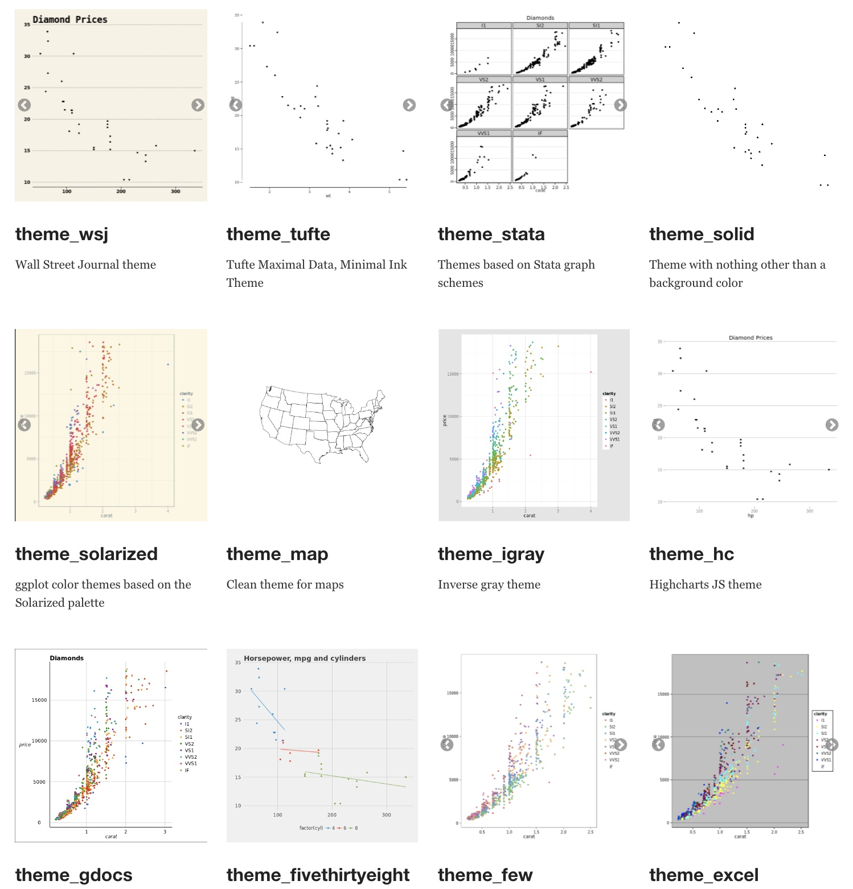

#  Making betteR figures {#betteRfigs}

```{r, echo = FALSE, warning=FALSE, message=FALSE}
library(tidyverse)
library(DT)
library(knitr)
library(blogdown)
library(beyonce, warn.conflicts=F, quietly=T)
library(stringr)
library(tweetrmd)
library(emo)
library(tufte)
library(cowplot)
library(lubridate)
library(ggthemes)
library(ggforce)
library(datasauRus)
library(ggridges)
library(randomNames)
library(infer)

df_students <- readr::read_csv("https://raw.githubusercontent.com/rfordatascience/tidytuesday/master/data/2019/2019-05-07/student_teacher_ratio.csv")

df_world_tile <- readr::read_csv("https://gist.githubusercontent.com/maartenzam/787498bbc07ae06b637447dbd430ea0a/raw/9a9dafafb44d8990f85243a9c7ca349acd3a0d07/worldtilegrid.csv") %>% 
  mutate(
    ## Namibias two-digit country code is handled as `NA` - let us fix that
    alpha.2 = if_else(name == "Namibia", "NA", alpha.2),
    ## We are going to split "Americas" into "North America" and "Sout America"
    region = if_else(region == "Americas", sub.region, region),
    region = if_else(region %in% c("Northern America", "Central America", "Caribbean"), 
                     "North America", region),
    region = if_else(region == "Southern America", "South America", region),
    ## to join both data sets, we need a id column
    country_code = alpha.3
  )

df_ratios <- df_students %>% 
  ## Let's keep only the most recent data per country
  group_by(country, indicator) %>% 
  filter(year == max(year)) %>% 
  ungroup() %>% 
  # Create `NA`s for countries which do not have any data 2012-2018
  complete(indicator, nesting(country, country_code)) %>% 
  ## Let's focus on primary education and keep only countries (coded by letters)
  filter(
    indicator == "Primary Education",
    str_detect(country_code, "[A-Z]")
  ) %>% 
  ## merge with world tile map data
  full_join(df_world_tile) %>%
  filter(
    !is.na(region),
    !is.na(indicator)
  ) %>% 
  group_by(region) %>% 
  mutate(student_ratio_region = median(student_ratio, na.rm = T)) %>% 
  ungroup()
```


```{block2, type='rmdnote'}
This chapter helps us follow  the best practices in plotting outlined in  Chapter 2 of @whitlock2020.
```

<span style="color: Blue;font-size:22px;">   Motivating scenarios:  </span>  <span style="color: Black;font-size:18px;">   You know what figure you want to make but need the R skills to go beyond the basics. </span> 
 
 
**Learning goals: By the end of this chapter you should be able to:**   

- Make figures look like you want them to look.     
- Deepen your appreciation and understanding of ggplot.


```{block2, type='rmdwarning'}
**How to read this chapter:** I tried to provide a lot here so that you can make the figures you want to. There is no need to memorize anything here, or read too carefully. Peruse to see how you can improve your plots for the assignment due Monday. 

Also -- while there is A LOT in this chapter, it does not show you how to do everything you may want to do. That would take numerous books. The best of those books are 
Other useful resources are [The R Graphics Cookbook](https://r-graphics.org/) [@chang2020], [ggplot2: Elegant Graphics for Data Analysis](https://ggplot2-book.org/) [@wickham2016], and [Data Visualization: A Practical Introduction](https://socviz.co/) [@healy2018].
```


## How to implement best practices and make fun and attractive plots    

In chapter \@ref(viz1) we introduced ggplot as a way to make figures, and in chapter \@ref(goodfigs) we talked about what makes a good plot. **So now you might b a bit frustrated as you know how to make plots in R, and you know what makes a good plot, but you can't make a good plot in R.** I have two answers:    

1. Choosing  the right plot for your data can get you  far in making a nice exploratory plot,  which will be about 95% of the plots you make. So most plots will only require one or two small quick R tricks.     

2. This chapter is here to help you begin with the rest. (See [The R Graphics Cookbook](https://r-graphics.org/) [@chang2020], [ggplot2: Elegant Graphics for Data Analysis](https://ggplot2-book.org/) [@wickham2016], and [Data Visualization: A Practical Introduction](https://socviz.co/) [@healy2018] for more help.)  


## Review -- what makes a good plot

- Good plots come together to tell the data's story.   
- Good plots are attuned to the audience and method of presentation.    
- Good plots are Honest, Transparent, Clear, and Accessible.        

We work through these below, spending the most time on making honest, transparent. and clear plots as this is where you'll have the most R customization.  


```{block2, type='rmdnote'}
**Datasets below:** To minimize  the information you need to process, I will stick to very few datasets.   

- `daphnia_resist`: Is [available](https://whitlockschluter3e.zoology.ubc.ca/Data/chapter15/chap15q17DaphniaResistance.csv) from our textbook and shows the resistance of the crustacean Daphnia to a poisonous cyanobacteria across years with high, medium and low concentrations of cyanobacteria. This address the question - can Daphnia evolve to resist poison?
```

```{r, message=FALSE}
daphnia_resist <- read_csv("https://whitlockschluter3e.zoology.ubc.ca/Data/chapter15/chap15q17DaphniaResistance.csv")
```

## Combining plots to tell a story.   


Most analyses require a few graphs to tell the story.  Some of these graphs will be spread across a document, while others will be combined in a multi-panel figure.    

Always be sure to keep visual metaphors consistent across figures (e.g. colors and shapes should mean the same thing in different figures). This can often be pretty challenging, and we'll come back to this soon,   

Here I focus on making multi-panel figures. There are a bunch of ways to do this in ggplot, but my favorite uses the [`plot_grid()`](https://wilkelab.org/cowplot/articles/plot_grid.html) function in the [cowplot](https://wilkelab.org/cowplot/index.html) package. You do this by saving plots and combining them with   `plot_grid()`.   I show a quick example below and urge you to go the [help page]((https://wilkelab.org/cowplot/articles/plot_grid.html)) for more complex issues. 

```{r, fig.cap = 'Combining plots with [`plot_grid()`](https://wilkelab.org/cowplot/articles/plot_grid.html) function in the [cowplot](https://wilkelab.org/cowplot/index.html) package. Look at the [help page]((https://wilkelab.org/cowplot/articles/plot_grid.html)) for more customization.', fig.height=2, fig.width=6}
# If you have not installed cowplot, you will need to!
library(cowplot)  # After cowplot is installed you still need to load it with the library function  

p1 <- ggplot(daphnia_resist, aes(x = resistance , fill = cyandensity))  +  geom_density(alpha = .4)
p2 <- ggplot(daphnia_resist, aes(x = cyandensity, y = resistance))  +  geom_point()

plot_grid(p1,  p2, labels = c("a","b"))
```


```{block2, type='rmdnote'}
I really like the [`plot_grid`]() function in cowplot - especially because it allows us to use just one legend (see [`get_legend()`](https://wilkelab.org/cowplot/reference/get_legend.html)). But I sometime get weird errors that go away if I do the exact same thing another time.  

The [`gridExtra`](https://cran.r-project.org/web/packages/gridExtra/vignettes/arrangeGrob.html) and [patchwork](https://patchwork.data-imaginist.com/) packages provide different ways to make multi-panel figures. Check them out if you like.
```


## Making plots attuned to the audience and method of presentation.    

### Considering your method of presentation   

We [previously](#presentation) noted that most results are presnted in press, in speach, in a poster or online. Most of this chapter and course focusses on presentation in press, but here I have a few resources for alternative modes of presentations.  

- **For online documents**, you can make a shinyapp with the [shiny package](https://shiny.rstudio.com/), or a gif with [gganimate](https://gganimate.com/index.html) to further engage your audience. We may cover this near the end of term, and you might want it in your final project, but for now know that these options exists.     

```{r, echo=FALSE, out.extra='style="float:right"'}
include_graphics("images/isotype.jpeg")
```

- **For posters**, the [ggtextures](https://github.com/clauswilke/ggtextures) package allows you to experiment with isotype plots. 

- **For talks** you will need to mess with the `theme` function to get change text and label size. I address this common challenge below.   


### Considering your method of presentation: Adjusting text size   {- #textsize}

You will need to change your text size for different modes of presentation -- e.g. text should be very large for posters and talks. Mastering the [`theme()`](https://ggplot2.tidyverse.org/reference/theme.html) function allows us to customize our plots. Most importantly we can change the size of text with the [`element_text(size = ...)`](https://ggplot2.tidyverse.org/reference/element.html) function, which we use after specifying what element we want to change (Fig. \@ref(fig:theme1)). 

```{r theme1, fig.cap = 'Changing font size by specifying [`element_text()`](https://ggplot2.tidyverse.org/reference/element.html) in [`theme()`](https://ggplot2.tidyverse.org/reference/theme.html). The colors are very bad, and are meant to help you connect our R to the output - you should stay away from doing silly things to your font color.', fig.height=1.8, fig.width=4}
ggplot(daphnia_resist, aes(x = cyandensity, y = resistance, color = cyandensity))  +  
  geom_point()+
  theme(axis.title.x = element_text(size = 20, color = "orange"),
        axis.text.x  = element_text(size = 15),
        axis.text.y  = element_text(size = 15, color = "firebrick"),
        legend.text  = element_text(color = "purple"),
        legend.title = element_text(size = 30, color = "gold"))
```


```{block2, type='rmdtip'}
Beyond these quick tricks  [`theme()`](https://ggplot2.tidyverse.org/reference/theme.html)  function is super complicated and frustrating. **I strongly recommend the [`ggThemeAssist package`](https://github.com/calligross/ggthemeassist/)** as this provides a GUI that lets us point and click our way to our desired figure and then returns the R code (Fig. \@ref(fig:ggthemeassist)). Also, in the past years I have gotten way better at using the [`theme()`](https://ggplot2.tidyverse.org/reference/theme.html) function without `ggThemeAssist` because that package gave me a sense of which arguments to use. 
```

```{r ggthemeassist, fig.cap = "An example of how to use the `ggThemeAssist` package from the `ggThemeAssist` [website](https://github.com/calligross/ggthemeassist/). Be nice to yourself and get use this package.", echo = FALSE}
include_graphics(path = "https://github.com/calligross/ggthemeassist/blob/master/examples/ggThemeAssist2.gif?raw=true")
```


## Making Honest, Transparent, Clear,  Accessible,  and Fun plots

In section \@ref(goodplot) we said good plots are   

- Honest  
- Transparent  
- Clear   
- Accessible  

Here I add Fun to the list too! So how do we translate these ideas into R plots? Check out these tips and tricks below!!!

```{block2, type='rmdwarning'}
Making and critiquing plots is one of my favorite parts of science -- I love it!!!! **But I know it can be a huge time suck**, and we dont want that. Here are  my tips to avoid spending too much time on every figure.   


- Know if you are making an explanatory or exploratory figure -- and do not try to perfect an exploratory figure.   
- Come up with a few standard themes and color schemes that you use most of the time and copy and paste them so that you can make nice plots that you like without customizing each one.   
- Get familiar with the most common stuff you will do in ggplot and keep the [ggplot cheat sheet](https://rstudio.com/wp-content/uploads/2015/03/ggplot2-cheatsheet.pdf), other resources (perhaps figure out which of the additional resources I highlighted here is best for you), and the google nearby.  
- If you are making an explanatory plot wait until the last minute to add specific customizations that you do with complex and specific code (e.g. annotation).  
```

### Making honest figures  

Be sure that your figures do not deceive. 

- Do not let yourself be deceived by your exploratory figures -- you will just waste a lot of your time and energy.  

- Do not deceive your audience with your explanatory figures, you will lose their trust.  

The most common ways figures deceive is with inappropriate limits, nonlinear (or nonsensical) axis scales, or changing data. Here I show how you can use ggplot to prevent these deceptions.


#### Making Honest figures: Set your limits {- #lim}   


The data on daphnia resistance to cyanobacteria is rported a s a porpotion, which are often best presented on a sale from zero to one. However a simple plot with `geom_point()` spans the range of the data, and does no go from zero to one. Set `limits` in the [`scale_y_continuous()`](https://ggplot2.tidyverse.org/reference/scale_continuous.html) function to change this


```{r scaleycont, fig.cap='Set x or y limits in the [`scale_x_continuous()`](https://ggplot2.tidyverse.org/reference/scale_continuous.html) or [`scale_y_continuous()`](https://ggplot2.tidyverse.org/reference/scale_continuous.html) functions. *Note* there are other ways to set limits, but this is the way I do it.', fig.height= 2, fig.width=3, message=FALSE}
ggplot(daphnia_resist, aes(x = cyandensity, y = resistance))  + 
  geom_point() + 
  scale_y_continuous(limits = c(0,1))
```


#### Making Honest figures: Ordering ordinals  {- #orderordinals}   

The explanatory variable in the daphnia data, on the x axis is the density of cyanobacteria, as `high`, `low`, or `medium`. This order on the x could confuse readers and might deceive them if they did not  look carefully. Ordering these from low to medium to high is more natural and would minimize the opportunity for deception.

The [`forcats`](https://forcats.tidyverse.org/index.html) package loaded with tidyverse has tools `for cat`egorical variables. For example, we can use the [`fct_relevel`](https://forcats.tidyverse.org/reference/fct_relevel.html) function, followed by our categories in our desired order to fix this. *NOTE* this alters our data before plotting so we do this via the [`mutate`](https://dplyr.tidyverse.org/reference/mutate.html) function.


```{r xordin, fig.cap='Set the order of levels with the [`fct_relevel`](https://forcats.tidyverse.org/reference/fct_relevel.html) function.   Be sure to do this inside [`mutate`](https://dplyr.tidyverse.org/reference/mutate.html), and save this modification.', fig.height= 2, fig.width=3, message=FALSE}
daphnia_resist <- daphnia_resist %>% 
  mutate(cyandensity = fct_relevel(cyandensity, "low","med", "high")) 

ggplot(daphnia_resist, aes(x = cyandensity, y = resistance))  + 
  geom_point() + 
  scale_y_continuous(limits = c(0,1))
```

#### Making Honest figures: Do not let `jitter` deceive  {- #honestjitter}   

Below, we will  see  that we often want to spread out our data with the `jitter` function to [avoid overplotting](#nooverplotting). **But a simple jitter can deceive  by:**       

- Giving the impression that an ordinal is continuous and    
- Changing continuous response values.  

To prevent such deception, I narrow the width of the jitter, make the height zero, and color the data points by category. Because this coloring is redundant, and does not contain additional information we do not need to show a legend.  


```{r lyingjittr, fig.cap = 'jittering can deceive (**a**), but reasonable precautions prevent this deception (**b**).', fig.height=2, fig.width=5}
dishonest_jitter <- ggplot(daphnia_resist, aes(x = cyandensity, y = resistance))  + 
  geom_jitter()+
  labs(title = "dishonest jitter")

honest_jitter <- ggplot(daphnia_resist, aes(x = cyandensity, y = resistance, color =  cyandensity))  + 
  geom_jitter(height = 0, width = .2, show.legend = FALSE)+
  labs(title = "honest jitter")

plot_grid(dishonest_jitter, honest_jitter, labels = c("a","b"))
```

#### Making Honest figures: Notify your audience of nonlinear scales   

Now let us take a look at variability in mammal lifespan across species as a function of the species bodyweight. Log-transforming these data can reveal  patterns (compare Fig. \@ref(fig:showticks)b to  Fig. \@ref(fig:showticks)a), but make it clear to the reader that the data are presented on a log scale (**That why Fig. \@ref(fig:showticks)c is the best**), so that they do not quickly look at a plot and interpret relationships linearly. The [`annotation_logticks`]( https://ggplot2.tidyverse.org/reference/annotation_logticks.html) can help alert readers to the fact that we're in logscale.  Note that we make this *log-log* plot with the [`scale_x_continuous()`](https://ggplot2.tidyverse.org/reference/scale_continuous.html) and [`scale_y_continuous()`](https://ggplot2.tidyverse.org/reference/scale_continuous.html) functions to retain linear numbers but show the data on a log scale.


```{r echo=FALSE, message=FALSE}
mammal_lifespan <- read_tsv("http://www.statsci.org/data/general/sleep.txt") # because it is tab delimitted 
plota <- ggplot(mammal_lifespan , aes(x= BodyWt, y = LifeSpan, ))+
  geom_point()+
  labs(title = "linear")+
  annotate(x = Inf, y = 1, geom = "text", color = "red", label = "bad :(", hjust = 1, vjust = -1)
  
plotb <- ggplot(mammal_lifespan , aes(x= BodyWt, y = LifeSpan, ))+
  geom_point() +
  scale_x_continuous(trans = "log10")+
  scale_y_continuous(trans = "log10")+
  labs(title = "log10 scale (no warning)")+
  annotate(x = Inf, y = 1, geom = "text", color = "red", label = "bad :(", hjust = 1, vjust = -1)
```


```{r fig.height=2, fig.width=3, message=FALSE, warning=FALSE}
mammal_lifespan <- read_tsv("http://www.statsci.org/data/general/sleep.txt") # because it is tab delimitted 
plotc <- ggplot(mammal_lifespan , aes(x= BodyWt, y = LifeSpan, ))+
  geom_point()+
  scale_x_continuous(trans = "log10")+
  scale_y_continuous(trans = "log10")+
  annotation_logticks(sides = "bl",base = 10, size = .2)+ # put log ticks on bottom "b" and left )
  labs(title = "log10 scale (w. warning)")
```

```{r showticks, fig.cap = 'Figure **a** hides the pattern. **b** log transforms both axes to reveal the log linear relationship, but only a careful reader would notice the axes increase on a $log_{10}$ scale. **c** reveals the patterns and notifies the reader that the plot is on $log_{10}$ scale.', message=FALSE, fig.height=2, fig.width=8, message=FALSE, warning=FALSE, echo=FALSE}
plot_grid(plota, plotb, plotc+
  annotate(x = Inf, y = 1, geom = "text", color = "blue", label = "good :)", hjust = 1, vjust = -1), labels = c("a","b","c"), nrow = 1)
```


### Show your data to be transparent 

By showing your data, we mean show the actual data, rathr than simply showing means and standard errors, or boxplots. Fortunately, if you start with raw data, R makes it pretty hard to hide it. So long as you give ggplot raw data, most ggplot goems will show the data. However there are a few things to consider.  


#### Don't hide your data by overplotting {-}
In Section \@(ref:goodplots) we said to [avoid overplotting](#nooverplotting) -- the hiding of your data by piling to many data points on top of one another. 

**With a modest sized data set**, like the `daphnia_resistance` data, a simple jitterplot can show data hidden by overplotting (compare Fig. \@ref(fig:jitterp)a to Fig. \@ref(fig:jitterp)b). Remember to adjust the `width` and `height` arguments in `geom_jitter` to [make an honest jitterplot](#honestjitter).  

```{r, message=FALSE, warning=FALSE}
daphnia_points <- ggplot(daphnia_resist, aes(x = cyandensity, y = resistance, color =  cyandensity))  + 
  geom_point(show.legend = FALSE)+
  scale_y_continuous(limits = c(0,1))+
  labs(title = "points hide data")

daphnia_jitter <- ggplot(daphnia_resist, aes(x = cyandensity, y = resistance, color =  cyandensity))  + 
  geom_jitter(height = 0, width = .2, show.legend = FALSE)+
  scale_y_continuous(limits = c(0,1))+
  labs(title = "jitter shows data")
```

```{r jitterp, fig.cap= 'When points are on top of each other we cannot see all the data (**a**). Spread the data out with [`geom_jitter()`](https://ggplot2.tidyverse.org/reference/geom_jitter.html).', fig.height=2, fig.width=4, message=FALSE, warning=FALSE, echo = FALSE}
plot_grid(daphnia_points+  annotate(x = Inf, y = -Inf, geom = "text", color = "red", label = "bad :(", hjust = 1, vjust = -1),
          daphnia_jitter +  annotate(x = Inf, y = -Inf, geom = "text", color = "blue", label = "good :)", hjust = 1, vjust = -1), 
          labels = c("a","b"))
```

**With a larger data set**, avoiding overplotting requires more effort. So, while plotting points hides the distribution in the price of diamonds of a given clarity, a simple jitter does not make things much better. Three common solutions to this problem are 

- Show the distribution of the data as a violin plot. (I don't like this because it still hides the data).   
-  Increase the transparency of points by changing `alpha` in [`geom_jitter()`](https://ggplot2.tidyverse.org/reference/geom_jitter.html).   
- Make a sinaplot (with the [`geom_sina()`](https://ggforce.data-imaginist.com/reference/geom_sina.html) function in the [`ggforce`]( https://ggforce.data-imaginist.com/index.html) package). A sina plot  is like a violin plot made of data. 

Figure \@ref(fig:overplot2) shows both bad (Fig. \@ref(fig:overplot2)a:c) and good (Fig. \@ref(fig:overplot2)d:e) solutions to this problem. If none of these work for your data, check out [Chapter 5 of the R graphics cookbook](https://r-graphics.org/recipe-scatter-overplot) [@chang2020].

```{r cache=TRUE}
library(ggforce)
base_diamond <- ggplot(diamonds, aes(x = clarity, y = price))

plot_a <- base_diamond + geom_point()  + labs(title = "geom_point")
plot_b <- base_diamond + geom_violin() + labs(title = "geom_violin")
plot_c <- base_diamond + geom_jitter()  + labs(title = "geom_jitter")
plot_d <- base_diamond + geom_jitter(alpha = 0.0025) + labs(title = "geom_jitter(alpha = 0.0025)")
plot_e <- base_diamond + geom_sina(alpha = 0.0025) + labs(title = "geom_sina")
```

```{r overplot2, fig.cap = 'Tricks for dealing with dense overplotting. The value of alpha was found by trial and error, and the best choice for alpha will get closer to one as the density of data points decreases.', echo = FALSE}
plot_grid(plot_a +  annotate(x = Inf, y = Inf, geom = "text", color = "red", label = "bad :(", hjust = 1, vjust = 1)+ylim(c(0,22500)), 
          plot_b +  annotate(x = Inf, y = Inf, geom = "text", color = "red", label = "bad :(", hjust = 1, vjust = 1)+ylim(c(0,22500)),
          plot_c + annotate(x = Inf, y = Inf, geom = "text", color = "red", label = "bad :(", hjust = 1, vjust = 1) +ylim(c(0,22500)),
          NULL,
          plot_d + 
            annotate(x = Inf, y = Inf, geom = "text", color = "blue", 
                     label = "good :)", hjust = 1, vjust = 1) +ylim(c(0,22500)),
          plot_e +  
            annotate(x = Inf, y = Inf, geom = "text", color = "blue", 
                     label = "good :)", hjust = 1, vjust = 1) + ylim(c(0,22500)) ,
          nrow = 3, labels = c(letters[1:3],"",letters[4:5]))
```


#### Don't hide your data with a boxplot  {-}

As we saw when encountering the [interquartile range](#iqr) in Chapter \@ref(summaRy) boxplots show the quartiles of the data, adding a potentially useful visual summary to a plot. **But, boxplots themselves are not a solution to overplotting** (Fig. \@ref(fig:howtobox)), and if [`geom_boxplot()`](https://ggplot2.tidyverse.org/reference/geom_boxplot.html) is added after showing the data, the boxes will hide the data.


```{r, message=FALSE, warning=FALSE}
daphnia_boxplot_a <- ggplot(daphnia_resist, aes(x = cyandensity, y = resistance))  + 
  geom_boxplot(outlier.color = NA) +   scale_y_continuous(limits = c(0,1)) 

daphnia_boxplot_b <- ggplot(daphnia_resist, aes(x = cyandensity, y = resistance))  + 
  geom_jitter(width = .2, height = 0) +
  geom_boxplot(outlier.color = NA) +   scale_y_continuous(limits = c(0,1)) 

daphnia_boxplot_c <- ggplot(daphnia_resist, aes(x = cyandensity, y = resistance))  + 
  geom_boxplot(outlier.color = NA) +
  geom_jitter(width = .2, height = 0) +   scale_y_continuous(limits = c(0,1))
```

```{r howtobox, fig.cap = 'Plot **c** effectively shows the data and summarizes quantiles with a boxplot. The boxplots in **a** and **b** hide the data.', message=FALSE, warning=FALSE, echo=FALSE, fig.height=2, fig.width=6}
plot_grid(daphnia_boxplot_a+  annotate(x = Inf, y = -Inf, geom = "text", color = "red", label = "bad :(", hjust = 1, vjust = -1),
          daphnia_boxplot_b +  annotate(x = Inf, y = -Inf, geom = "text", color = "red", label = "bad :(", hjust = 1, vjust = -1), 
          daphnia_boxplot_c +  annotate(x = Inf, y = -Inf, geom = "text", color = "blue", label = "good :)", hjust = 1, vjust = -1), 
        labels = c("a","b","c"), ncol = 3)
```

### Supercharge your ggplot skills to make clear plots  

ggplot is great for making clear, explanatory plots, but this requires a bunch of new tricks. Remember that [clear plots](#clarity) are easy to interpret and help readers focus on patterns. Below I show some very useful R tricks to achieve these goals. There is a lot here, so **I recommend skimming these to understand what you can do, rather than memorizing every trick**. Again I strongly recommend the [The R Graphics Cookbook](https://r-graphics.org/) [@chang2020] as a great place to expand your tools.

####  Order categories sensibly  

By default, R orders categorical variables alphabeticallt, which does not make any sense biologically. 

Above we used the [`forcats`](https://forcats.tidyverse.org/index.html) package to [order ordinals](#orderordinals) as we see fit. But what if there is no natural order for a categorical variable (i.e. it is nominal)? **A great way to highlight patters is to order categories from the greatest to the smallest mean.** 


Again the [`forcats`](https://forcats.tidyverse.org/index.html) package can help. We can use the [`fct_reorder`](https://forcats.tidyverse.org/reference/fct_reorder.html) function to reorder a factor by some other value.  *NOTE* this alters our data before plotting so we do this via the [`mutate`](https://dplyr.tidyverse.org/reference/mutate.html) function.  

After making Figure \@ref(fig:fctreorder)a with the default order of regions, we reorder `region` by `mean` `student_ratio`, in `desc`ending order and removing `NA` values to generate  \@ref(fig:fctreorder)b with the same code as we used for  \@ref(fig:fctreorder)a.  


```{r fctreorder, fig.cap = 'Use [`fct_reorder`](https://forcats.tidyverse.org/reference/fct_reorder.html) to order nominal categories by a numerical summary.', fig.height=2, fig.width=7, message=FALSE, warning=FALSE}
student_order_a <-  ggplot(df_ratios, aes(x = region, y = student_ratio, color = region)) + 
  geom_jitter(alpha = .3,size = 2, height = 0, width = .15, show.legend = FALSE)+
  scale_y_continuous(limits = c(0,100))

df_ratios <- df_ratios %>%
  mutate(region = fct_reorder(region, student_ratio, mean, na.rm = TRUE,.desc = TRUE))

student_order_b <-  ggplot(df_ratios, aes(x = region, y = student_ratio, color = region)) + 
  geom_jitter(alpha = .3,size = 2, height = 0, width = .15, show.legend = FALSE)+
  scale_y_continuous(limits = c(0,100))

plot_grid(student_order_a, student_order_b, labels = c("a","b"))
```


#### Make clear labels   

There are a few ways labels can be unclear:  

- Labels can run over one another making the hard to read.   
- By default, labels take the name of their column in a tibble, but often this is a handy shortcut, not a descriptive name.  
- Labels ca be missing altogether.  

Here is how we can solve these problems in R.

##### **Preventing labels from running over one another**  {-}  

Let us return to our example of variability in student to faculty ratios from Chapter \@ref(goodfigs). There we noticed that [region names ran over each other, and we could fix this](#goodlabels) by rotating the axes, or ever better, by flipping our coordinates. Figure \@ref(fig:howtoshowlabs) shows  how you do this in R.


```{r, message=FALSE, warning=FALSE}
student_plot_a <- ggplot(df_ratios, aes(x = region, y = student_ratio, color = region)) + 
  geom_jitter(alpha = .3,size = 2, height = 0, width = .15, show.legend = FALSE)+
  scale_y_continuous(limits = c(0,100))

student_plot_b <- student_plot_a +
  theme(axis.text.x = element_text(angle = 90))

student_plot_c <- student_plot_a +
  coord_flip()
```


```{r howtoshowlabs, fig.cap = 'Plot **c** effectively shows the x-axis labels.', message=FALSE, warning=FALSE, echo=FALSE, fig.height=2.5, fig.width=6}
plot_grid(student_plot_a +  annotate(x = Inf, y = Inf, geom = "text", color = "red", label = "bad :(", hjust = 1, vjust = 1),
          student_plot_b +  annotate(x = Inf, y = Inf, geom = "text", color = "grey", label = "meh :|", hjust = 1, vjust = 1), 
          student_plot_c  +  annotate(x = Inf, y = Inf, geom = "text", color = "blue", label = "good :)", hjust = 1, vjust = 1), 
        labels = c("a","b","c"), ncol = 3, rel_widths = c(1,1,2))
```


##### **Make more descriptive labels**  {-}  


We often want plots with more descriptive labels than we want to type in our data analysis. You can override the defaults labels with the [`labs()`](https://ggplot2.tidyverse.org/reference/labs.html) function. You can add math and Greek by using the [`expression`](https://rpubs.com/kylewbrown/math-expressions) function (Fig \@ref(fig:complexlabs)).  


```{r complexlabs, fig.cap = 'Customized labels.', fig.height=2, fig.width=5,message=FALSE, warning=FALSE}
student_plot_c   + 
labs(y = expression(paste('Students per faculty (', rho, " = ", frac('#  students','#faculty'),")")))
```


```{r faceted, echo = FALSE, fig.height=2.3, fig.width=2.52, message=FALSE, warning=FALSE, out.extra='style="float:right"'}
plot_grid(ggplot(iris, aes(x = Sepal.Length)) +
            geom_histogram(bins = 20,color = "white")+ 
            facet_wrap(~Species, ncol = 1)+
            scale_y_continuous(breaks = c(0,5,10)),
          ggplot(mtcars, aes(x = mpg)) +
            geom_histogram(bins = 8, color = "white")+ 
            facet_wrap(~gear, ncol = 1)+
            scale_y_continuous(breaks = c(0,3,6)), 
          labels = c("a","b"))
```


##### **Add labels to facets when ambiguous**  {-}

- In `iris` an educated reader could deduce that the facets designate the species.    
- Maybe a reader who knew a lot about cars could guess that the facet in **b** referred to the number of gears in the car, but I would not have guessed that.  

We do not want our readers guessing. At best this is frustrating for them and at worst the guess wrong. We could note the labels in the legend, but that would add to the reader's cognitive load. Best to include this information in the facet with the [`labeller`](https://ggplot2.tidyverse.org/reference/labeller.html) function in [`facet_wrap`](https://ggplot2.tidyverse.org/reference/facet_wrap.html) (Fig. \@ref(fig:facetedlabs)).  

```{r facetedlabs, fig.cap = 'Use `labeller` to add labels to your facets.', fig.height=2.5, fig.width=2.5}
ggplot(mtcars, aes(x = mpg)) +
  geom_histogram(bins = 8, color = "white")+ 
  facet_wrap(~gear, ncol = 1, labeller = label_both)
```


#### Add annotations, text, summaries, and lines to point out patterns  


```{block2, type='rmdwarning'}
This part is very fun, but invites two common pitfalls:   
  
1. It can be a big time sink.  

2. You can add too much and overwhelm the reader.  

To minimize these risks, I suggest saving these elaborations for nearly the last step in your explanatory presentation, and making carefully thinking about what elaborations to add and what the goal of each is.  
```

We can add statistical summaries, guiding lines, and other useful information to help the reader get more from our plot. For example, in Figure \@ref(fig:annotated), we:     


- Add the mean and 95% bootstrapped confidence interval for each region by giving the  `mean_cl_boot` command to the [`stat_summary()`](https://ggplot2.tidyverse.org/reference/stat_summary.html) function, showing the readers our estimates and uncertainty in them.   
- Use [`hline`]( https://ggplot2.tidyverse.org/reference/geom_abline.html) to add a horizontal line <span style="color: LightGrey;">(we can also use [`vline()`](https://ggplot2.tidyverse.org/reference/geom_abline.html) for a vertical line) </span> to show the overall mean.  
- Used the [`annotate()`](https://ggplot2.tidyverse.org/reference/annotate.html) function to add the word "mean" above the dashed line  to point out that the dashed line shows the mean.   
- Used the [`geom_text`]() function to add text to data points. Note that rather than showing every country, we filtered the data for the countries with the largest and smallest student ratios in Africa, and exceptionally variable region. We did so using our standard `dplyr` tools (from chapter \@ref(rdata)), starting with the data we initially gave ggplot (represented by the `.`).    


```{r annotated, fig.cap  = 'Sprucing up our figure!', fig.height=2, fig.width=6, message=FALSE, warning=FALSE}
ggplot(df_ratios, aes(x = region, y = student_ratio, color = region)) + 
  geom_jitter(alpha = .3,size = 2, height = 0, width = .15, show.legend = FALSE)+
  scale_y_continuous(limits = c(0,100)) +
  stat_summary(fun.data = mean_cl_boot, color ="black")+
  geom_hline( yintercept = summarise(df_ratios, mean(student_ratio, na.rm = TRUE)) %>% pull(), lty = 2 )+ # lty = 2 asks for a dashed line
  annotate(x = 3.5, y = 28, label = "mean", geom = "text", size = 3)+
  geom_text(data = . %>%
              filter(region == "Africa") %>%
              filter(student_ratio == max(student_ratio, na.rm = TRUE) | 
                       student_ratio == min(student_ratio, na.rm = TRUE)  ),
            aes(label = country), size =3, hjust = 0, show.legend = FALSE)
```


#### Use direct labeling   {#direct}

There are a bunch of ways to add direct labels. The most straightforward way is with the   [`annotate()`](https://ggplot2.tidyverse.org/reference/annotate.html)  function, introduced above.


#### Add groups to avoid confusion 

R does not naturally know what comes in groups. So, for example, if we are plotting weight of baby chicks on different diets over time (Fig \@ref(fig:chicks)), or bacterial growth rates over time, we need to tell R to group by bird, or bacteria plate or whatever, otherwise, we got nonsensical plots (e.g. Fig. \@ref(fig:chicks)a). 

In Figure \@ref(fig:chicks)b, we add `groups = Chick` in the main `aes` call when we set up our ggplot.  


In Figure \@ref(fig:chicks)c, we add `groups = Chick` only to `geom_point` `aes` because we want to show how  mean chick weight changes over time for each diet. 

I include a bit more details on sprucing up `plot_grid` for the curious.  


```{r chicks, fig.cap='Use the `groups` arguments in `aes` to keep repeated observations on a single entity together', message=FALSE, warning=FALSE, fig.height=2}
ChickWeight <- mutate(ChickWeight , Diet = factor(Diet)) # letting R know diet is categorical  

chick_plot_a <- ggplot(ChickWeight, aes(x = Time, y = weight, color = Diet))+
     geom_line() 
 
chick_plot_b <- ggplot(ChickWeight, aes(x = Time, y = weight, group = Chick, color = factor(Diet)))+
     geom_line(alpha = .8)
 
chick_plot_c <-  ggplot(ChickWeight, aes(x = Time, y = weight, color = factor(Diet)))+
     geom_line(aes(group = Chick), alpha = .3)+
     stat_summary(fun= mean, geom = "line", size = 2,alpha = .7)
 
chick_plots <- plot_grid(chick_plot_a + theme(legend.position = "none") + annotate(x = -Inf, y = Inf, color = "red", label = "bad :(", geom = "text", hjust = -1, vjust = 1) ,
                         chick_plot_b + theme(legend.position = "none") + annotate(x = -Inf, y = Inf, color = "blue", label = "better :|", geom = "text", hjust = -1, vjust = 1),
                         chick_plot_c + theme(legend.position = "none")+ theme(legend.position = "none") + annotate(x = -Inf, y = Inf, color = "blue", label = "better :|", geom = "text", hjust = -1, vjust = 1), 
                         labels = c("a","b","c"), nrow = 1)

chick_legend <- get_legend(chick_plot_c + theme(legend.position = "bottom"))

plot_grid(chick_plots,chick_legend, rel_heights = c(8,2), nrow =2)
```

#### Think about colors  

Just like our data type guide our choices of plot, our data type should guide our color scheme for mapping color onto a variable.     

- Use continuous color pallets for continuous variables.      
- Use sequential color schemes for ordinal variables.    
- Use qualitative color schemes for nominal variables.   

I have spent too much of my life choosing colors for plots. I suggest simplifying this choice by using the [`colorspace`](http://colorspace.r-forge.r-project.org/articles/hcl_palettes.html) package. This package has a range of color schemes you can choose from, and all are meant to minimize confusion for readers with a color vision deficiency.  I show how to use this package in Figure \@ref(fig:coloR).


```{r, coloR, fig.cap = 'Using [`colorspace`](http://colorspace.r-forge.r-project.org/articles/hcl_palettes.html) to specify colors.', fig.height=8, fig.width=7, message=FALSE, warning=FALSE}
library(colorspace)
color_a <- chick_plot_c +
  scale_color_discrete_qualitative(palette = "Harmonic")+
  theme(legend.position = "bottom")+
  labs(title = "Discrete qualitative pallets\nfor nominal variables")

color_b <- mammal_lifespan  %>%
  mutate(Danger = factor(Danger)) %>%  # letting R know Danger is categorical
  ggplot(aes(x= BodyWt, y = LifeSpan,  color = Danger))+
  geom_point(size = 3,alpha = .6)+
  scale_x_continuous(trans = "log10")+
  scale_y_continuous(trans = "log10")+
  annotation_logticks(sides = "bl",base = 10, size = .2)+
  scale_color_discrete_sequential(palette = "Viridis")+
  theme(legend.position = "bottom")+
  labs(title = "Discrete sequential (or diverging)\npallets for nominal variables")

color_c <- ggplot(mammal_lifespan , aes(x= BodyWt, y = LifeSpan, color = Gestation))+
    geom_point(size = 3,alpha = .6)+
    scale_x_continuous(trans = "log10")+
    scale_y_continuous(trans = "log10")+
    annotation_logticks(sides = "bl",base = 10, size = .2)+
    scale_color_continuous_sequential(palette = "Hawaii")+
    theme(legend.position = "bottom")+
    labs(title = "Continuous sequential (or diverging)\npallets for nominal variables")

plot_grid(color_a,color_b,color_c, labels = letters[1:3], ncol=2)
```


Check out the available pallets and which ypes of variables they accompany [here](http://colorspace.r-forge.r-project.org/articles/ggplot2_color_scales_files/figure-html/hcl-palettes-1.png)!

```{r fig.cap='Pallets from [colorspace](http://colorspace.r-forge.r-project.org/articles/ggplot2_color_scales_files/figure-html/hcl-palettes-1.png)', echo=FALSE}
knitr::include_graphics('http://colorspace.r-forge.r-project.org/articles/ggplot2_color_scales_files/figure-html/hcl-palettes-1.png')
```

If you are interested in specifying a few colors yourself you can use the `scale_color_manual(vals = <vectors of colors>)` function where  `<vector of colors>` is the colors you want (e.g. `scale_color_manual(vals = c("red", "blue"))` will have the first category in red and the second in blue). If you want to have more fun (but likely have harder to read figures), you can try the [`beyonce`](https://github.com/dill/beyonce) or [`wesanderson`](https://github.com/karthik/wesanderson) packages which have their own color pallets.   


#### Avoid distractions 

Luckily, R makes adding distracting backgrounds/graphics, 3D, animation, glass slippers and ducks somewhat challenging. But there are enough `R` packages to make anything possible, and adding these features can be fun. So before adding fancy decorations to a plot, think hard about if you are adding critical information and capturing the attention of readers, or if you are distracting them.   


###  Accessibility and Universal Design

In chapter \@ref(goodfigs) we discussed the advantages of univrsal desig - so how do we achieve this in R?  

#### Think of people with color vision deficiency 

##### **Think of people with color vision deficiency when picking colors**  {-}  
Think of people with color vision deficiency when picking colors. The main reason I pointed out the [`colorspace`]( http://colorspace.r-forge.r-project.org/index.html) package is because they have already picked pallets with accessibility in mind.  
 
##### **Use color vision deficiency emulators to make sure your colors are accessible**  {-}
Regardless, it is worth checking if your figures are accessible for people with color vision deficiency. We [previously](color) checked out an [online color vision deficiency emulator](http://hclwizard.org/cvdemulator/). Alternatively you can use the [`colorblindr`](https://github.com/clauswilke/colorblindr) package in R as a color vision deficiency emulator.

##### **Use direct labeling to make figures accessible**  {-}
See [above](#direct).   

#### Modify size of text and points to make figures accessible   

We have already discussed changing size in e.g. [`geom_point()`](https://ggplot2.tidyverse.org/reference/geom_point.html) or in [`theme()`](https://ggplot2.tidyverse.org/reference/theme.html) (perhaps using [`ggthemeassist`](https://github.com/calligross/ggthemeassist)).  

#### Use redundant coding to make figures accessible   

Colors can be tough to distinguish (or people might print in black and white). Redundancy in presentation provides readers with multiple opportunities to take the message in. I show some examples in Fig. \@ref(fig:redundant):  

a.  Danger is shown by shape and color.   
b.  Danger is shown by shape and color, but shape is made to be a number from one to five, decreasing the reader's cognitive burden.
c. Gestation time is shown by both the size and color of the points.   

```{r, redundant, fig.cap = "Redundant coding provides readers numerous ways to get the message.", fig.height=5, fig.width=7, message=FALSE, warning=FALSE}
redundant_coding_a <- mammal_lifespan  %>%
  mutate(Danger = factor(Danger)) %>%  # letting R know Danger is categorical
  ggplot(aes(x= BodyWt, y = LifeSpan,  color = Danger, shape = Danger))+
  geom_point(size = 3,alpha = 1)+
  scale_x_continuous(trans = "log10")+
  scale_y_continuous(trans = "log10")+
  annotation_logticks(sides = "bl",base = 10, size = .2)+
  scale_color_discrete_sequential(palette = "Viridis")+
  theme(legend.position = "bottom")+
  theme_light()

 redundant_coding_b <- redundant_coding_a+
  scale_shape_manual(values = as.character(1:5)) +
  theme(legend.text = element_blank())
 
 
 redundant_coding_c <- ggplot(mammal_lifespan , aes(x= BodyWt, y = LifeSpan, color = Gestation, size = Gestation))+
    geom_point(alpha = .6)+
    scale_x_continuous(trans = "log10")+
    scale_y_continuous(trans = "log10")+
    annotation_logticks(sides = "bl",base = 10, size = .2)+
    scale_color_continuous_sequential(palette = "Hawaii")+
  theme_light()

plot_grid(redundant_coding_a, redundant_coding_b, redundant_coding_c,  labels = letters[1:3], ncol=2) 
```


```{r, fig.cap = 'Watch [this video](https://www.youtube.com/watch?v=X8b44P5D-5w) from Stat 545, about making nicer ggplots (7 min and 25 sec). Note that he uses a slightly differe way to use log scale than I showed. No worries, there is more than one right way to do thing in R.',  echo=FALSE,  out.extra= 'allowfullscreen'}
include_url("https://www.youtube.com/embed/X8b44P5D-5w")
```


## Extra style  

Here, I shout out a few stylistic options to further customize your ggplots that I have used above.   

### Place your legend

Above we used the `legend.position` argument in [`theme()`](https://ggplot2.tidyverse.org/reference/theme.html) to change place a legend on the bottom of a plot. But we can have way more control -- play with [`ggthemeassist`](https://github.com/calligross/ggthemeassist) to see!  

### Pick your theme   

The default theme for ggplot is not for everyone. Spice up your plot with other themes. I introduced `theme_light()` above. [Other themes](https://ggplot2.tidyverse.org/reference/ggtheme.html) come standard with ggplot, and the [`ggthemes`](https://ggplot2.tidyverse.org/reference/ggtheme.html) package has even more (Fig. \@ref(fig:themes)). You can even [make your own theme](https://themockup.blog/posts/2020-12-26-creating-and-using-custom-ggplot2-themes/)!     

```{r, themes, fig.cap= "Themes in ggthemes. From [Hiroaki Yutani](https://yutannihilation.github.io/allYourFigureAreBelongToUs/ggthemes/).",echo=FALSE}

```
