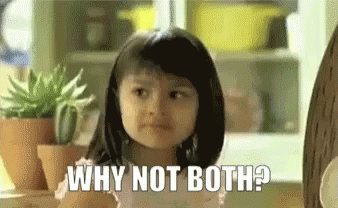
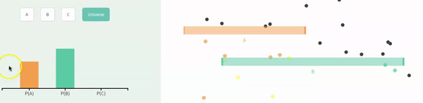
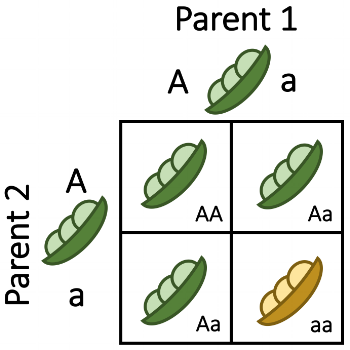
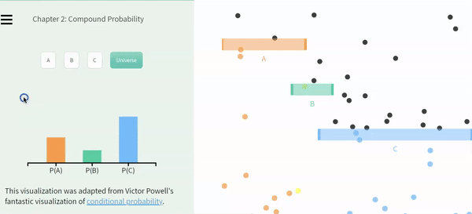

# Probabilistic thinking {#prob2}

```{r, echo = FALSE, warning=FALSE, message=FALSE}
library(tidyverse)
library(DT)
library(knitr)
library(blogdown)
library(beyonce, warn.conflicts=F, quietly=T)
library(stringr)
library(tweetrmd)
library(emo)
library(tufte)
library(cowplot)
library(lubridate)
library(ggthemes)
library(ggforce)
library(datasauRus)
library(ggridges)
library(randomNames)
library(infer)
```


```{block2, type='rmdnote'}
These notes accompany portions of Chapter 5  --- *Probability* --- of our textbook, which we also examine in the [previous section](#prob1).   **The reading below is required,**  @whitlock2020 is  not.    
```


<span style="color: Blue;font-size:22px;">   Motivating scenarios:  </span>  <span style="color: Black;font-size:18px;">  We want to build on our intuitive feel for probability that we can build from simulation, by developing a mathematical framework and key rules to  predict probabilistic outcomes. </span> 
 


```{block2, type='rmdwarning'}
In addition to this reading,  the other assignment is to read [this paper](https://drive.google.com/uc?export=download&id=1YBEE6pES415uQalTIEhaA-UD9u-l2D_5) [@humphrey2016].  
```

## How to do probability -- Math or simulation?   


In the previous chapter we saw that we could get pretty deep into probability by simulation. In fact -- everything we cover here could be discovered by simulation.  This holds not only for these chapters, but for pretty much all of stats. Simulation provides us with a good intuition, every problem we cover this term could be exactly solved by simulation (while math requires numerous assumptions), and some situations can uniquely solve problems that do not have nice mathematical answers. I often wonder -- "Why do we even use math?"  

The major advantages of math over simulation are:   

```{r, out.width='30%', echo=FALSE, ,out.extra='style="float:right; padding:10px"'}
   
```

- **Math gives the same answers every time.** Unlike random simulation, math is not influenced by chance, so (for example) a sampling error on our computer mean that the sampling distribution from simulation will differ slightly each time, while math based sampling distributions do not change by chance.  

- **Math is fast.** Simulations can take a bunch of computer time and energy (it has to do the same thing a bunch of times). With math, the computer quickly run some numbers through a calculator. The computational burdens we'll face this term are pretty minimal, but with more complex stats this can actually matter.   

- **Math provides insight.** Simulations are great for helping us build feelings, intuition and even probabilities. But clear mathematical equations allow us to precisely see the relationship between components of our model.   


In practice I often combine mathematical and simulation based approaches to my work. 

Today we'll work through the mathematical foundations of probability. 


### Probability Rules    

I highly recommend a formal probability course would go through a bunch of ways to calculate probabilities of alternative outcomes (probability theory was my favorite class). But you don't need all that here. We simply want to get an intuition for probability, which we can achieve by familiarizing ourselves with some straightforward rules and a bit of practice in math and simulation.

Internalizing the rough rules below will get you pretty far:    

- **Add** probabilities to find the probability of one outcome **OR** another. (be sure to subtract off double counting).     

- **Multiply** probabilities to find the probability of one outcome **AND** another. (be sure to consider conditional probabilities if outcomes are non-independent.)     

OK -- Let's work through these rules.

```{block2, type='rmdnote'}
Below, we talk about the probability of events *a* and *b*. These are generic events that can stand in for any random thing, so $P(a)$ is the probability of some event *a*. So if *a* was red head, p(*a*) is the probability that a person is a red head.

I distinguish this from <span style="color:#EDA158;">A</span>, <span style="color:#62CAA7;">B</span>, and <span style="color:#98C5EB;">C</span>, which refer to balls dropping through colored bars in our visualizations.  
```


## Add probabilities for **OR** statements  

To find the probability  or this or that we sum all the ways we can be this or that, being careful to avoid double-counting.   


\begin{equation} 
\begin{split}
P(a\text{ or }b) &= P(a) + P(b) - P(ab)\\
\end{split}
(\#eq:or)
\end{equation} 


### **Special case of exclusive outcomes** {-}

**If outcomes are mutually exclusive, the probability of outcome *a* or *b* is P(*a*) + P(*b*).**  

For example the probability that a random persons favorite color is **blue or orange** is the sum sum of the     

Probability their favorite color is orange, P(Orange),   
Plus the probability their favorite color blue, P(Blue).         

We often use this rule to find the probability of a range of outcomes for discrete variables (e.g. the probability that the sum of two dice rolls is between six and eight  = P(6) + P(7) + P(8)). 


### **General case** {-}

**More generally, the probability of outcome a or b is P(a) + P(b) - P(a and b).** This subtraction (which is irrelevant for exclusive events, because in that case P(*a* and *b*) = 0) avoids double counting. 

**Why do we subtract P(a and b) from P(a) + P(b) to find P(a or b)?** Figure \@ref(fig:dontdoublecount) shows that this subtraction prevents double-counting -- the sum of falling through A or B is $0.50 + 0.75 = 1.25$. Since probabilities cannot exceed one, we know this is foolish -- but we must subtract to avoid double counting even when the sum of probabilities do not exceed one.

```{r dontdoublecount, echo=FALSE, fig.cap = '**Subtract P(ab) to avoid double counting:** Another example of probability example from [Seeing Theory](https://seeing-theory.brown.edu/) (gif on 6 second loop).', out.width='80%'}

```

Following equation \@ref(eq:or) and estimating that about 35% of balls falls through  <span style="color:#EDA158;">A</span> and <span style="color:#62CAA7;">B</span>, we find that      
P(<span style="color:#EDA158;">A</span> or <span style="color:#62CAA7;">B</span>) = P(<span style="color:#EDA158;">A</span>) + P(<span style="color:#62CAA7;">B</span>) - P(<span style="color:gold;">AB</span>)        
P(<span style="color:#EDA158;">A</span> or <span style="color:#62CAA7;">B</span>) =  <span style="color:#EDA158;">0.50</span> + <span style="color:#62CAA7;">0.75</span> - <span style="color:gold;">0.35</span>   
P(<span style="color:#EDA158;">A</span> or <span style="color:#62CAA7;">B</span>) = 0.90.

For a simple and concrete example, the probability a random student played soccer or ran track in high school, is the probability they played soccer  *plus* the probability they ran track *minus* the probability they  played soccer and ran track.  


### The probability of not  {-}   

My favorite thing about probabilities is that they have to sum (or integrate) to one. This helps us be sure we laid out sample space right, and allows us to check our math. It also provides us with nice math tricks. 

Because probabilities sum to one, the **probability of "not a" equals 1 - the probability of a**. This simple trick often makes hard problems a lot easier.


## Multiply probabilities for **AND** statements  

The probability of two types of events in an outcome e.g. the probability of *a* and *b* equals the probability of *a* times the probability of *b* conditional on *a*, which will also equal the probability of *b* times the probability of *a* conditional on *b*.    


\begin{equation} 
\begin{split}
P(ab) &= P(a) \times P(b|a)\\
 & = P(b) \times P(a|b)
\end{split}
(\#eq:and)
\end{equation} 

### Special cases of AND {-}   

- **If two outcomes are mutually exclusive**, the probability of one conditional on the other is zero ($P(b|a) = 0$). So  the probability of  one given the other is zero ($P(a) \times P(b|a) = P(a) \times 0 = 0$).  

- **If two outcomes are independent**, the probability of one conditional on the other is simply its overall probability ($P(b|a) = P(b)$). So  the probability of one given the other is the product of their overall probabilities zero ($P(a) \times P(b|a) = P(a) \times P(b)$).  

```{r fig.cap = 'A Punnett Square is a classic example of indepndent probabilities  <span style="color:lightgrey;">(Image from the [Oklahoma Science Project](https://okscienceproject.org/lesson-2-punnett-squares))</span>.', out.width='30%', echo=FALSE,out.extra='style="float:right; padding:10px"'}

```

The Punnett square is a classic example of independent probabilities in genetics as the sperm genotype usually does not impact meiosis in eggs (but see [my paper](https://www.ncbi.nlm.nih.gov/pmc/articles/PMC5539998/) [@brandvain2015] about exceptions and the consequences for fun). If we cross two heterozygotes, each transmits their recessive allele with probability $1/2$, so the probability of being homozygous for the recessive allele when both parents are heterozygous is $\frac{1}{2}\times{1}{2} = \frac{1}{4}$.   


### The general cases of AND {-}   

The outcome of meiosis does not depend on who you mate with, but in much of the world context changes probabilities. 

**CONDITIONAL PROBABILIY EXAMPLE:** You're way less likely to get the flu if you get the flu vaccine.      

*So, what's the probability that a random person got a flu vaccine and got the flu?* It is the probability a random person got a flu vaccine (P(vaccine) $\approx$ 49%) and that they got the flu conditional on the vaccine (P(flu|vaccine) $\approx$ 10%), so the overall probability (P(vaccine) $\times$ P(flu|vaccine) $\approx$ is approximately 4.9%.       
By contrast, the probability of not getting a flu shot (P(no vaccine) $\approx$ 51%) and getting the flu if you didn't get a vaccine(P(flu | no vaccine) $\approx$ 30%) is 15%.      


**CONDITIONAL PROBABILITY VISUAL:**  Let's work through a visual example!   

```{r, echo=FALSE}
include_graphics("images/nonindep1.gif")    
```

In the figure above     
P(<span style="color:#EDA158;">A</span>) = <span style="color:#EDA158;">1/3</span>,    
P(<span style="color:#62CAA7;">B</span>) = <span style="color:#62CAA7;">2/3</span>,    
P(<span style="color:#EDA158;">A</span>|<span style="color:#62CAA7;">B</span>) =  <span style="color:#EDA158;">1/4</span>, and      
P(<span style="color:#62CAA7;">B</span>|<span style="color:#EDA158;">A</span>) =  <span style="color:#62CAA7;">1/2</span>.   

Using Equation \@ref(eq:and), we find the probability of A and B:    
P(<span style="color:gold;">AB</span>) = P(<span style="color:#EDA158;">A</span>) $\times$ P(<span style="color:#62CAA7;">B</span>|<span style="color:#EDA158;">A</span>)  = P(<span style="color:#EDA158;">A</span>) = <span style="color:#EDA158;">1/3</span>  $\times$ <span style="color:#62CAA7;">1/2</span>    =  <span style="color:gold;">1/6</span>.      
Which is the same as    
P(<span style="color:gold;">AB</span>) = P(<span style="color:#62CAA7;">B</span>) $\times$ P(<span style="color:#EDA158;">A</span>| <span style="color:#62CAA7;">B</span>)  =  <span style="color:#62CAA7;">2/3</span> $\times$ <span style="color:#EDA158;">1/4</span> =  <span style="color:gold;">2/12</span>=  <span style="color:gold;">1/6</span>.   

We can see this visually in Figure \@ref(fig:counting):    

```{r counting, fig.cap = 'A representation of the relative probabilities of each outcome in sample space. Color denotes outcome (which is also noted with black letters), and each box represents a probability of one sixth.', fig.height=1, fig.width=1.5, echo = FALSE, ,out.extra='style="float:left; padding:10px"'}
tibble(x = rep(1:3, each = 2), y = rep(1:2,times = 3), 
       z= c(rep("A",1),rep("AB",1),rep("B",3),rep("x",1))) %>%
  mutate(z =factor(z, levels = c("A","AB","B","x")))   %>%
  ggplot(aes(x=x,y=y,fill =z))+
  geom_tile(color = "black",show.legend = FALSE)+
  scale_fill_manual(values = c("#EDA158","yellow","#62CAA7","black"),drop = FALSE)+
    theme_tufte()+
  theme(axis.title = element_blank(), 
        axis.text = element_blank(),
        legend.position = "bottom", 
        legend.title = element_blank(),
        axis.ticks = element_blank())+
  geom_text(aes(label = z),show.legend = FALSE)
#  labs(title = "Probability of each outcome")
```

### Multiply probabilities for **AND** statements  

The probability of two types of events in an outcome e.g. the probability of *a* and *b* equals the probability of *a* times the probability of *b* conditional on *a*, which will also equal the probability of *b* times the probability of *a* conditional on *b*.    


\begin{equation} 
\begin{split}
P(ab) &= P(a) \times P(b|a)\\
 & = P(b) \times P(a|b)
\end{split}
(\#eq:and)
\end{equation} 

If two events are mutually exclusive, the probability of one given the other is zero. So, returning to our example in Figures \@ref(fig:nonexclusivefull), \@ref(fig:counting), and \@ref(fig:conditional), the probability of <span style="color:#EDA158;">A</span> and <span style="color:#98C5EB;">C</span>  equals zero, because these are exclusive events. 

```{block2, type='rmdwarning'}
For some terrible reason  

`|` means *or* to R    
`|` means "conditional on" in stats. 

This is confusing and unfortunate, and I am very sorry.   
Stay safe.
```

### Conditional probabilities  

Above we introduced one sort of conditional probability -- for exclusive events the probability of one event conditional on seeing another equals zero. We see in Figures \@ref(fig:nonexclusivefull), \@ref(fig:counting), and \@ref(fig:conditional) that events <span style="color:#EDA158;">A</span> and <span style="color:#98C5EB;">C</span> are mutually exclusive, so the probability of <span style="color:#EDA158;">A</span> conditional on <span style="color:#98C5EB;">C</span> equals zero (and vice versa). 

More broadly, the conditional probability of event *b* given event *a* (aka $P(b|a)$) is the probability of observing *b* if we know that *a* happened. Note this does not imply any causal or mechanistic relationship, just that our predictions change. The explanation from [Seeing Theory](https://seeing-theory.brown.edu/compound-probability/index.html#section3) (pasted below) is better than mine, so read it!


```{block2, type='rmdseeingtheory'}
Explanation of conditional probabilities from [Seeing Theory](https://seeing-theory.brown.edu/compound-probability/index.html#section3)
                        
"**Conditional probabilities** allow us to account for information we have about our system of interest. For example, we might expect the probability that it will rain tomorrow (in general) to be smaller than the probability it will rain tomorrow given that it is cloudy today. This latter probability is a conditional probability, since it accounts for relevant information that we possess.     

Mathematically, computing a conditional probability amounts to shrinking our sample space to a particular event. So in our rain example, instead of looking at how often it rains on any day in general, we "pretend" that our sample space consists of only those days for which the previous day was cloudy. We then determine how many of those days were rainy.    

Click on the tabs below to visualize the shrinking of the sample space."   
```

```{r conditional,echo=FALSE, fig.cap = '**Conditional probabilities.** These probabilities in this plot are the same as the figure [above](fig:nonexclusivefull). We reveal the probability of all outcomes, conditional on one other outcome by clicking on the outcome we are conditioning on (e.g. we see P(<span style="color:#EDA158;">A</span>|<span style="color:#62CAA7;">B</span>) and P(<span style="color:#98C5EB;">C</span>|<span style="color:#62CAA7;">B</span>), after clicking on <span style="color:#62CAA7;">B</span> (which also reveals that P(<span style="color:#62CAA7;">B</span>|<span style="color:#62CAA7;">B</span>) = 1)). Explre for yourself at the Seeing Theory [website](https://seeing-theory.brown.edu/compound-probability/index.html#section3).'}

```

In the example above,   

- P(<span style="color:#EDA158;">A</span>) = <span style="color:#EDA158;">1/3</span>,     
- P(<span style="color:#62CAA7;">B</span>)= P(<span style="color:#62CAA7;">1/6</span>),  and        
- P(<span style="color:#98C5EB;">C</span>)=<span style="color:#98C5EB;">11/18</span>.

####  Independece       

*Narrowing our universe to <span style="color:#EDA158;">A</span>* we see that the probability of <span style="color:#62CAA7;">B</span>, P(<span style="color:#62CAA7;">B</span>|<span style="color:#EDA158;">A</span>) is still <span style="color:#62CAA7;">1/6</span>. So **B is independent of A -- as the conditional probability equals to unconditional probability** (the probability if we didn't know if the ball fell through A or not). Likewise, in this example, <span style="color:#EDA158;">A</span> is independent of <span style="color:#62CAA7;">B</span>.   

Following Eq. \@ref(eq:and), the probability of <span style="color:#EDA158;">A</span> and <span style="color:#62CAA7;">B</span>, P(<span style="color:gold;">gold</span>), equals     
P(<span style="color:#EDA158;">A</span>\&<span style="color:#62CAA7;">B</span>) =  P(<span style="color:#EDA158;">A</span>) $\times$ P(<span style="color:#62CAA7;">B</span>|<span style="color:#EDA158;">A</span>) = <span style="color:#EDA158;">1/3</span> $\times$ <span style="color:#62CAA7;">1/6</span> = <span style="color:gold;">1/18</span>.


####  Non-independece   

Again *narrowing our universe to <span style="color:#EDA158;">A</span>*, we see that the probability of <span style="color:#98C5EB;">C</span> differs based on if we observe <span style="color:#EDA158;">A</span> or not. For example, P(C | <span style="color:#EDA158;">A</span>) = <span style="color:#98C5EB;">0</span>. Likewise  the probability of <span style="color:#EDA158;">A</span> differs based on if we observe <span style="color:#98C5EB;">C</span> or not P(<span style="color:#EDA158;">A</span>|<span style="color:#98C5EB;">C</span>) =0. We call outcomes **non-independent if their conditional probabilities differ from their unconditional probabilities.** 

Reassuringly, applying \@ref(eq:and) to this case shows that P(<span style="color:#c69c6d;">A&C</span>) = P(<span style="color:#EDA158;">A</span>) $\times$ P(<span style="color:#98C5EB;">C</span>|<span style="color:#EDA158;">A</span>) =span style="color:#98C5EB;">1/3</span> $\times$ 0 = <span style="color:#c69c6d;">0</span>.

While <span style="color:#62CAA7;">B</span> and <span style="color:#98C5EB;">C</span> are not mutually exclusive, they are not independent.  The probability of <span style="color:#62CAA7;">B</span> given <span style="color:#98C5EB;">C</span>, P(<span style="color:#62CAA7;">B</span>|<span style="color:#98C5EB;">C</span>) = <span style="color:#62CAA7;">1/11</span> (which differs from P(<span style="color:#62CAA7;">B</span>) = <span style="color:#62CAA7;">1/6</span>). Likewise the probability of <span style="color:#98C5EB;">C</span> given <span style="color:#62CAA7;">B</span>, P(<span style="color:#98C5EB;">C</span>|<span style="color:#62CAA7;">B</span>) =<span style="color:#98C5EB;">1/3</span>, (which differs from P(<span style="color:#98C5EB;">C</span>) = <span style="color:#98C5EB;">11/18</span>). 

Following Eq. \@ref(eq:and), the probability of outcome <span style="color:aqua;">B&C</span> is       
P(<span style="color:aqua;">B&C</span>) = P(<span style="color:#62CAA7;">B</span>)  $\times$   P(<span style="color:#98C5EB;">C</span>|B) = <span style="color:#62CAA7;">1/6</span> $\times$ <span style="color:#98C5EB;">1/3</span> = <span style="color:aqua;">1/18</span>.     
Which is the same as         
P(<span style="color:aqua;">B&C</span>) = P(<span style="color:#98C5EB;">C</span>)  $\times$   P(<span style="color:#62CAA7;">B</span>|<span style="color:#98C5EB;">C</span>) = <span style="color:#98C5EB;">11/18</span> $\times$ <span style="color:#62CAA7;">1/11</span> = <span style="color:aqua;">1/18</span>.   

### Calculating total probabilities from conditional probabilities. 

Let's move away from failling balls, and


### Simulating proportions in `R`    

A lot of statistics is wrapping our heads around probabilistic thinking. To me the key here is to get good intuition for probabilistic thinking. Mathematical rules of thumb (below) are helpful for some people. But I personally understand things better when I see them, so I often simulate. 

I simulate to:    

1. Make sure my math is right.   
2. Build intuition for probability problems.   
3. Solve probability questions that do not have a mathematical solution.  

So, how do we simulate? We can use a bunch of `R` functions to simulate, depending on our goals. Today, we'll use the [`sample()`](https://stat.ethz.ch/R-manual/R-devel/library/base/html/sample.html) function, which we saw when we considering sampling and uncertainty in our estimates.


#### **Simulating proportions from a single sample in `R`**    {-}   

Let's generate a sample of fifty balls, with probabilities equal to those in Figure \@ref(fig:probdist):  

```{r}
n_balls  <- 50
P_A      <- 3/6  # aka 1/2
P_B      <- 1/6  # aka 1/6
P_C      <- 2/6  # aka 1/3
ball_colors <-  c(A = "#EDA158", B = "#62CAA7", C = "#98C5EB")

ball_dist_exclusive <- tibble(balls = sample(x = c("A","B","C"), 
                                  size  = n_balls, 
                                  replace = TRUE, 
                                  prob = c(P_A, P_B, P_C)))
```

**Let's have a look at the result**

```{r echo=FALSE,fig.width=5}
DT::datatable(ball_dist_exclusive,
              options = list(autoWidth = TRUE,pageLength = 5, lengthMenu = c(5, 25, 50),
                             columnDefs=list(list(targets=1, class="dt-right"),
                                             list(width = '20px', targets = 1)
                                             )))

```

**Let's make a nice plot**
```{r, ballsim1,fig.width=3, fig.height=3}
ggplot(ball_dist_exclusive, aes(x = balls, fill = balls)) +
  geom_bar(show.legend = FALSE)+
  scale_fill_manual(values = ball_colors)+
  labs(title = "One simulation")
```

#### **Simulating proportions for many samples in `R`**    {-}   

We can also use the [`sample()`](https://stat.ethz.ch/R-manual/R-devel/library/base/html/sample.html) function to simulate a sampling distribution. There are a bunch of ways to do this but my favorite recipe is:    

1. Make a sample of size `sample_size` $\times$ `n_reps`.       
2. Assign the first `sample_size` outcomes to the first replicate, the second `sample_size` outcomes to the second replicate etc...    
3. Summarize the output.    

Here I show these steps


**1. Make a sample of size `sample_size` $\times$ `n_reps`.**   

```{r}
n_reps   <- 1000

ball_sampling_dist_exclusive <- tibble(balls = sample(x = c("A","B","C"), 
         size  = n_balls * n_reps, # sample 50 balls 1000 times
         replace = TRUE, 
         prob = c(P_A, P_B, P_C))) 
```


**2. Assign the first `sample_size` outcomes to the first replicate, the second `sample_size` outcomes to the second replicate etc...** 

```{r}
ball_sampling_dist_exclusive <- ball_sampling_dist_exclusive %>%
  mutate(replicate = rep(1:n_reps, each = n_balls))
```


**Let's have a look at the result** looking at only the first ten replicates:

```{r echo=FALSE,fig.width=5}
DT::datatable(head(ball_sampling_dist_exclusive, n = 500),
              options = list(autoWidth = TRUE,pageLength = 5, lengthMenu = c(5, 25, 50),
                             columnDefs=list(list(targets=1:2, class="dt-right"),
                                             list(width = '20px', targets = 1:2)
                                             )))

```


**3. Summarize the output.**  

```{r}
ball_sampling_dist_exclusive <- ball_sampling_dist_exclusive %>% 
  group_by(replicate, balls, .drop=FALSE) %>% # make sure to keep zeros
  summarise(count = n(),.groups = "drop")  # count number of balls of each color each replicate

ball_sampling_dist_exclusive 
```


**Let's have a look at the result**

```{r echo=FALSE,fig.width=5}
DT::datatable(ball_sampling_dist_exclusive,
              options = list(autoWidth = TRUE,pageLength = 5, lengthMenu = c(5, 25, 50),
                             columnDefs=list(list(targets=1:3, class="dt-right"),
                                             list(width = '20px', targets = 1:2)
                                             )))

```


**MAKE A PLOT**  

```{r ballsim2,fig.width=4, fig.height=2}
ggplot(ball_sampling_dist_exclusive, aes(x = count, fill = balls)) +
  geom_density(alpha = .8, show.legend = FALSE, adjust =1.5)+
  scale_fill_manual(values = ball_colors)+
  geom_vline(xintercept =  n_balls * c(P_A, P_B, P_C), lty = 2,  color = ball_colors)+
  annotate(x = c(25, 8, 16), y = c(.09,.09,.09), 
           geom = "text",label = c("A","B","C"), size = 6 )+
  labs(title = "Many simulations") 
```

##### **Calculating the proportion of OR from simulations** {-}   

We can calculate the proportion of A or B from our simulation by using the `|` operator which tells `R` that we want thing1 OR thing2.

So 
