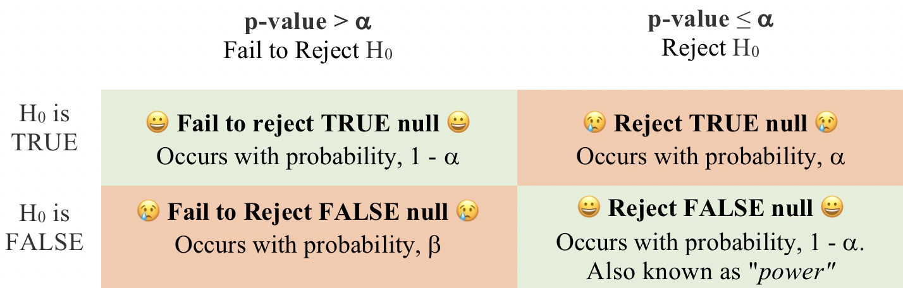
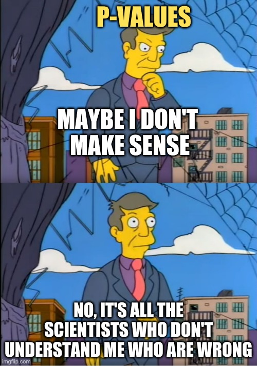
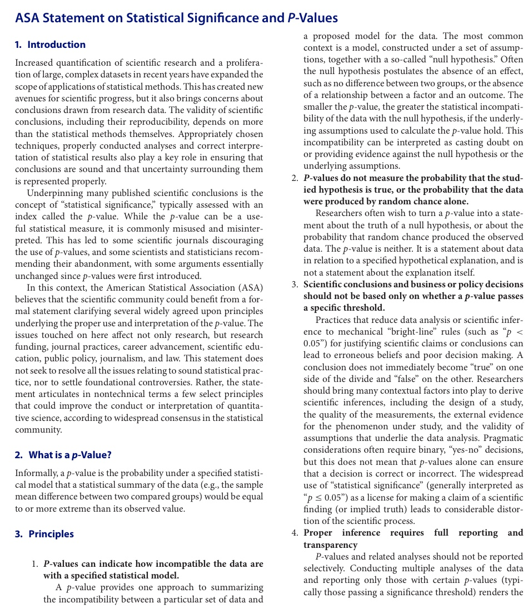

# Hypothesis Testing  {#hypoth}   

```{r, echo = FALSE, warning=FALSE, message=FALSE}
library(tidyverse)
library(DT)
library(knitr)
library(blogdown)
library(beyonce, warn.conflicts=F, quietly=T)
library(stringr)
library(tweetrmd)
library(emo)
library(tufte)
library(cowplot)
library(lubridate)
library(ggthemes)
library(ggforce)
library(datasauRus)
library(ggridges)
library(randomNames)
library(infer)
library(tiktokrmd)
library(ggridges)
library(colorspace)
```


```{block2, type='rmdnote'}
These notes accompany portions of Chapter 6  --- *Hypothesis Testing* --- of our textbook.   **The reading below is required,**  @whitlock2020 is  not.    
```


<span style="color: Blue;font-size:22px;">   Motivating scenarios:  </span>  <span style="color: Black;font-size:18px;">  ***(1)*** We want to know understand the standard by which scientists take results as serious vs. chalking them up to sampling error. ***(2)*** We are visiting a doctor, reading a newspaper, or a reading a scientific paper, and we are told results are "statistically significant", or have a P-Value of XXX and want to know what that means. ***(3)*** We have done a statistical analysis and want to guard against a simple explanation that our seemingly exceptional results are attributable to sampling error. </span> 

**There is one MAJOR GOAL here. You should understand a p-value and it's limitations. But  to brak this down.**     
**Learning goals: By the end of this chapter you should be able to**   


```{r,  echo = FALSE, out.extra= 'allowfullscreen', out.width="40%", out.extra='style="float:right; padding:10px"'}
include_url("https://www.youtube.com/embed/-kBtJow_pc0", height = "200")
```

- Explain why we make null models and what makes a good one.   
- Explain the motivation for Null Hypothesis Significance Testing (NHST).    
- Explain the role of a test statistic in hypothesis testing.    
- Describe a p-value in relation to the sampling distribution under the null.  
- Explain what a false positive and a false negative is and how likely we are to observe ne or the other as samples get larger.      
- Explain why a p-value is not "the probability that the null is true".   
- Explain the concept of statistical power and how it relates to the sample size and effect size.             


```{block2, type='rmdwarning'}
In addition to this reading,  the other assignment is to read the [Statement on P-values from the American Statistical Association](https://www.tandfonline.com/doi/pdf/10.1080/00031305.2016.1154108?needAccess=true) [@wasserstein2016], watch the imbedded video from calling bullshit on the "Prosecutor's Fallacy,", play with the imbedded shiny app which explores ideas of p-values and null hypothesis significance testing. 
```


## Review and motivation for null hypothesis significance testing  


In chapters \@ref(intro) and  \@ref(summaRy) we talked about estimation as a major goal of statistics -- we hope to summarize what we see in the world to estimate population parameters from a sample.     

But we also learned, in chapters \@ref(intro), \@ref(sampling), and \@ref(uncertainty), that all estimates are subject to sampling error. **Our goal in null hypothesis significance testing is to see if results are easily explained by sampling error.** Let's work though a concrete example: 

So, say we did an experiment: we gave the Moderna Covid vaccine to 15,000 people and a placebo to 15,000 people. This experimental design is meant to  

- Imagine if the population that got the Covid vaccine, or it did not.   
- Calculate parameters of interest (e.g. the probability of contracting Covid, or the frequency of severe Covid among those who caught Covid), or the frequency of severe reactions etc.. in the vaccinated and unvaccinated population.   
- Compare these parameters across **populations** with and without the placebo.    

Let's look at the **estimates** from the data!!!!

- Vaccine group: **11** cases of Covid **0** severe cases.  
- Placebo group: **185** cases of Covid **30** severe cases.  

So did the vaccine work??? There are certainly fewer Covid cases in the vaccine group.       

But these are  **estimates, NOT parameters**. We didn't look at populations, rather these results came from a process of sampling -- we sampled from a population. So, these results represent all the things that make samples estimates differ from population parameters, as well as true differences between populations (if there were any). So, before beginning a vaccination campaign we want to know if results are easily explained by something other than a real effect.  

What leads samples to deviate from a population?   

- Sampling bias 
- Nonindependent sampling  
- Sampling error

**Our goal in null hypotheses significance testing is to see if results are easily explained by sampling error.** 

## Null hypothesis significance testing


```{r,  echo = FALSE, out.extra= 'allowfullscreen', out.width="40%", out.extra='style="float:right; padding:10px"'}
include_url("https://www.youtube.com/embed/s1aScSHVd-8", height = "200")
``` 

So in null hypothesis significance testing we aim to see how easily the results can be explained by a "null model".  To do so, we go through four steps.     

1. State the null hypothesis and its alternative.    
2. Calculate a test statistic to summarize our data.   
3. Compare the observed test statistic to the sampling distribution of this statistic from the null model.  
4. Interpret these results.  If the test statistic is in an extreme tail of this sampling distribution, we reject the null hypothesis, otherwise we do not.  

Steps 1-3 are pretty straightforward, 

`r ji("warning")` Step 4 is  very strange and is one of the more challenging concepts in statistics. We'll see that a big reason for this challenge is that what the field does doesn't make that much sense `r ji("warning")`.  
 
### Statistical hypotheses   {#hypotheses}


**Scientific hypotheses are exciting.**  

- Scientific hypotheses should be well motivated in our understanding of our biological question.   
- There are a potentially infinite number of biological hypotheses, and we'll look into many over this term.    
- The answers to these hypotheses should be consequential.   
- Really good biological hypotheses come from an understanding of the process we're studying.   
- We usually have  a sense of the expected strength of the effect of our biological hypothesis.    


**We look into biological hypotheses with statistical hypotheses.**   

- Statistical hypotheses are boring.    
- In null hypothesis significance testing we keep looking into the same two biological hypotheses.   
- In null hypothesis significance testing statistical hypotheses don't know or care about your theories, or have any sense of an effect size.    


We cannot perfectly align biological and statistical hypotheses, but a good study will try its best to!

Unfortunately as scientists we're  usually out to evaluate  support for an  exciting scientific hypothesis, but in frequentist statistics we do  this in a totally backwards way, by looking into the plausibility of a boring statistical hypothesis known as the **null hypothesis**.


#### The null hypothesis {-}

```{r, out.width="30%", echo=FALSE,out.extra='style="float:right; padding:10px"'}
include_graphics("https://imgs.xkcd.com/comics/null_hypothesis.png")
```

So what is the null hypothesis? The **Null Hypothesis**, also called $H_0$, skeptically argues that data come from a boring population described by the null model. 

The null model is extremely specific. It is meant to represent the process of samplings to the truest extent we can, and then clams that the process of sampling can explain any interesting observation in our data. For the cas above, the null hypothesis for the effect of the Vaccine on Covid cases is:     

$H_0$: The frequency of Covid cases **does not differ** between vaccinated and unvaccinated populations.   


```{r blank, out.width="0%", fig.cap ='From [xkcd](https://xkcd.com/892/). *Rollover text:* Heck, my eighth grade science class managed to conclusively reject it just based on a classroom experiment. Its pretty sad to hear about million-dollar research teams who cant even manage that.', echo=FALSE, out.extra='style="float:right; padding:10px"'}
include_graphics("https://imgs.xkcd.com/comics/null_hypothesis.png")
```

```{r, echo = FALSE, fig.cap= "The null hypothesis."}
include_graphics("https://tenor.com/view/ok-csb-cool-story-bro-tired-yawn-gif-5625279.gif")
```

#### The alternative hypothesis  {-}

The alternative hypothesis, $H_A$, is much vaguer  than the null. While the null hypothesis claims that nothing is going on, the **alternative hypothesis** claims that something is going on, but it does not specify what that is. For the cas above, the alternative hypothesis for the effect of the Vaccine is:     

$H_A$: The frequency of Covid cases **differs** between vaccinated and unvaccinated populations.   


```{block2, type='rmdnote'}
**One tailed and two tailed tests**     
  
Notice that the alternative hypothesis above is that the frequency of Covid cases **differs** between the vaccinated and the unvaccinated. What if we just cared to know if the vaccine gave greater immunity than no vaccine? In theory we could look at only   one side of the null distribution, below. In practice, such **one tailed tests are almost always a bad idea**. In this case we would definitely want to know if the vaccine somehow made us more susceptible to covid. For that reason we generally avoid one-tailed tests.   

Rare cases when a one-tailed test is appropriate are when both ways to be extremely different are on the same side of the null distribution. As an extreme example, if I was studying the absolute value of something, the null is that it is zero, while the alternative is that it's greater than zero. We will see that some test statistics, like the $F$ statistic and (often the $\chi^2$ statistic only have one relevant tail.    
```


### The test statistic   
 
So how do we evaluate if our data are easily produced by the null mode? The first step is to find one summary of our data. This summary is called a **test statistic**. For now let's summarize our results as the number of cases in the vaccine group divided by all of the cases in the study.   

For  covid cases in the Moderna study, this equals $\frac{11}{11+185} = \frac{11}{11+185} \approx 0.0561$.   

A test statistics can be just about anything that makes sense, but commonly used test-statics, such as the $F$,  $\chi^2$, $Z$, and $t$, etc. etc, are special because their behavior is so well understood.   

 
### The sampling distribution under the null hypothesis   

Because the null model is specific, we can generate the expected distribution of the test statistic by generating a sampling distribution from the the null model. For now, I will provide you with sampling distributions of test-statics under he null. Later we will learn more about how we can generate this distribution.  

We can visualize the sampling distribution under the null as a histogram, as we would any other sampling distribution:   

```{r fig.height =1.8, fig.width=3.5, warning = FALSE, message = FALSE, echo = FALSE}
sample.dist  <- data.frame(estimate = replicate(50000,mean(rnorm(20,0,1))) )
ggplot(data = sample.dist, aes(x = estimate)) +
  geom_histogram(bins = 100, color = "white", lwd = .1, aes(y = ..count../sum(..count..)), fill = "lightsalmon")+ labs(title = "A null distribution", y = "", x= "test statistic")+
  annotate(geom = "text", x = 0, y = .015, label = "Null\nsampling\ndistribution", color = "black")
```


We then next compare our actual test statistic to its sampling distribution under the null. For example, figure \@ref(fig:moderna1) shows that the null model for the moderna Phase II vaccine trial would almost never generate  the low incidence of Covid infection among the vaccinated relative to the unvaccinated  that was observed in this Phase 3 trial.  
  

```{r, moderna1, fig.cap = 'Data from [Moderna Press Release](https://investors.modernatx.com/news-releases/news-release-details/moderna-announces-primary-efficacy-analysis-phase-3-cove-study).',  fig.height =2.2, fig.width=3.5, warning = FALSE, message = FALSE, echo = FALSE}
null_covid <- tibble(x =replicate(n = 100000,sum(sample(c("Unvaccinated", "Vaccinated"), replace = TRUE, size =196) == "Vaccinated") / 196 ))
ggplot(null_covid, aes(x = x))+ 
  geom_histogram(binwidth  = 1/196, color = "white", lwd = .1, aes(y = ..count../sum(..count..)), fill = "lightsalmon")+
    geom_segment(aes(x=.2, xend= 11/196, y=.03, yend=0), size = 1, color = "steelblue",arrow = arrow(length = unit(0.1, "npc")))+ 
  xlim(c(0,1))+
    annotate(geom = "text", x = .2, y = .045, label = "Estimate from \nPhase III trial", color = "steelblue")+
  labs(title = "Null sampling distribution for\nModerna data.", x ="Proportion of total covid cases observed\nin the vaccinated sample.", y = "prob")  #+
  #annotate(geom = "text", x = .8, y = .03, label = "Null\nsampling\ndistribution", color = "lightsalmon")
```

### P-values 


 
```{r fivethirtyeightp, fig.cap ='P-values are given incredible power over scientific research, and can confuse scientist. After watching this, read the rest of this chapter any try to explain them clearly. This video is from [Five Thirty Eights Blogpost *Not Even Scientists Can Easily Explain P-values*](https://fivethirtyeight.com/features/not-even-scientists-can-easily-explain-p-values/). 1 minute and 30 seconds. **REQUIRED**.', echo = FALSE, out.extra= 'allowfullscreen'}
include_url("https://fivethirtyeight.abcnews.go.com/video/embed/56150342" ) 
```


The observed test statistic shown in figure \@ref(fig:exampledist)a is in the middle of the sampling distribution for the null. If we saw this value pop out of a null model, we wouldn't bat an eye. By contrast, like the Moderna trial, the null model rarely generates an observation as extreme as observed for the test statistic shown in Figure \@ref(fig:exampledist)b.  


```{r exampledist, fig.cap = 'A sampling disribution with a test statistic that is unexceptional (**a**) or quite unlikely (**b**).', fig.height =2.5, fig.width=7,warning = FALSE, message = FALSE, echo = FALSE}
a <- ggplot(data = sample.dist, aes(x = estimate)) +
  #geom_histogram(bins = 100, color = "white", lwd = .1, aes(y = ..count../sum(..count..)), fill = "lightsalmon") +
  ylab("") + 
  xlab("Estimates from sampling dist.") +  
  annotate(geom = "text", x = .575, y = .023, label = "Estimate from \nmy sample", color = "steelblue")+
  labs(title = "A null distribution", y = "", x= "test statistic")#+
  #annotate(geom = "text", x = 0, y = .015, label = "Null\nsampling\ndistribution", color = "black")

unremarkable_teststat <- 0.2
exciting_teststat <- 0.5
my.ps <- sample.dist %>% 
  summarize(lower.area.2 = round(mean( estimate <= -unremarkable_teststat), digits = 3),
            upper.area.2 =  round(mean( estimate >= unremarkable_teststat), digits = 3), 
            p.val.2 = lower.area.2 + upper.area.2,
            lower.area.7 = round(mean( estimate <= -exciting_teststat ), digits = 3),
            upper.area.7 =  round(mean( estimate >= exciting_teststat ), digits = 3), 
            p.val.7 = lower.area.7 + upper.area.7) %>%
  unlist()
  
fail_to_reject <- a +  
  geom_histogram(aes(alpha = abs(estimate) >= unremarkable_teststat,
                     fill  = abs(estimate) >= unremarkable_teststat,
                     y = ..count../sum(..count..)), 
                 bins = 100, color = "white", lwd = .1,
                 show.legend = FALSE)+
  scale_alpha_manual(values = c(1,.3)) +
  scale_fill_manual(values = c("lightsalmon","steelblue")) +
  geom_segment(aes(x=.55, xend=unremarkable_teststat, y=.018, yend=0), size = 1, color = "steelblue",arrow = arrow(length = unit(0.1, "npc"))) + 
  annotate(geom = "text", x = c(-.8,.8), y = c(.01, .01), 
             label = c(sprintf("Area\n%s",my.ps["lower.area.2"]),sprintf("Area\n%s",my.ps["upper.area.2"])), 
             color = "steelblue")+  
    labs(title = "Unremarkable test statistic", subtitle = sprintf("Test Stat = %s; P-value = %s", unremarkable_teststat, my.ps["p.val.2"]), y= "probability") 


reject <- a +  
  geom_histogram(aes(alpha = abs(estimate) >= exciting_teststat,
                     fill  = abs(estimate) >= exciting_teststat,
                     y = ..count../sum(..count..)), 
                 bins = 100, color = "white", lwd = .1,
                 show.legend = FALSE)+
  scale_alpha_manual(values = c(1,.3)) +
  scale_fill_manual(values = c("lightsalmon","steelblue")) +
  geom_segment(aes(x=.55, xend=exciting_teststat, y=.018, yend=0), size = 1, color = "steelblue",arrow = arrow(length = unit(0.1, "npc"))) + 
  annotate(geom = "text", x = c(-.8,.8), y = c(.01, .01), 
             label = c(sprintf("Area\n%s",my.ps["lower.area.7"]),sprintf("Area\n%s",my.ps["upper.area.7"])), 
             color = "steelblue")+  
    labs(title = "Surprising test statistic", subtitle = sprintf("Test Stat = %s; P-value = %s",exciting_teststat, my.ps["p.val.7"]), y= "probability") 


plot_grid(fail_to_reject ,reject, nrow = 1, labels = c("a","b"))
```

We quantify how surprised we would be if the null model generate a test statistic as or more extreme than what we observe by the **P-value**. To calculate a P-value we sum (or integrate) the area under the curve from our observation out until the end of the distribution. Because we would be equally surprised by extreme values on the lower (left) or upper (right) tail of the sampling distribution, we almost always add up extremes on both sides.   


So, in Figure  \@ref(fig:exampledist)a, we sum add up all the area as  or more extreme than our observation on the lower  and upper tail and calculate a P-value of `r my.ps["lower.area.2"]` +`r my.ps["upper.area.2"]` = `r my.ps["p.val.2"]`.  This quantifies what we could see with our eyes -- our test statistic is unremarkable. We expect  that `r 100*my.ps["p.val.2"]`% of samples from the null would be as or more extreme. 

Likewise in Figure  \@ref(fig:exampledist)b, we sum add up all the area as  or more extreme than our observation on the lower and upper tail and calculate a P-value of `r my.ps["lower.area.7"]` +`r my.ps["upper.area.7"]` = `r my.ps["p.val.7"]`.  This again quantifies what we could see with our eyes -- our test statistic is surprising. We expect  that only `r 100*my.ps["p.val.7"]`% of samples from the null would be as or more extreme. 
 
 
```{r,  echo = FALSE, out.extra= 'allowfullscreen', out.width="40%", out.extra='style="float:right; padding:10px"'}
include_url("https://www.youtube.com/embed/GTeHJUxQy2c", height = "200")
``` 

### Interpretting results and drawing a conclusion

> A P-value can make or break a scientist's research.   
> P-values are often the measuring stick by which the gauge the significance of their work. 
>
> `r tufte::quote_footer('--- In the video from 538, above.')`

**So what do scientists do with a p-value? Why can it "make or break" your research etc?** 


```{r  xkcdsignif, fig.cap ='[xkcd](https://xkcd.com/1478/) poking fun at null hypothesis significance testing. *Rollover text:* If all else fails use significance at the α = 0.5  level and hope no one notices.', echo=FALSE, out.width="30%", out.extra='style="float:right; padding:10px"'}
include_graphics("https://imgs.xkcd.com/comics/p_values.png")
```


By custom, if our p-value is smaller than $\alpha$ <span style="color: lightgrey;">  (a number which is by convention set, somewhat arbitrarily to 0.05)</span> we **reject the null hypothesis**, and say the result is `r ji("victory")` statistically significant `r ji("victory")`.  What does this mean? It means that if we set $\alpha$ at its customary cut value of $0.05$, we will get a **false positive** -- that is we will reject a true null hypothesis,  in 5% of studies where the null is actually true. 


By custom, if our p-value is greater than $\alpha$ we say we **fail to reject the null hypothesis**.  Again failing to reject the null does not mean the null is true. In fact, there are many times when we will fail to reject a false null hypothesis. The probability of these **false negatives**, $\beta$ is not a value we choose, rather, it depends on both the  size of our sample and the size of the true effect (that is the difference between the null hypothesis and the true population parameter). **Power**, the  probability of rejecting a false null equals $1-\beta$. Often in planning an experiment, we pick a sample size large enough to ensure we have the power  to reject the null for an effect size that we're interested in. 

```{r, echo=FALSE}

```

These customary rituals are taken quite seriously by some scientists. To some audiences, the difference between a P-value of 0.051 and 0.049 are the difference between a non-significant and significant result, and the difference between publication or rejection. I and many others (e.g. [this article](https://www.nature.com/articles/d41586-019-00857-9?fbclid=IwAR3K6PysQ9FY4togs39BSciW3YsK-Pf6EE0Il9R8zxkW4GvrGBHFuz8yF5c) by @amrhein2019) think this is a bad custom and not all scientists adhere to it, but nonetheless this is the world you will navigate, so you should know these customs.    


#### **The effect of sample size** {-}   


## The Effect of Sample Size

**When the null is true** p-values will be uniformly distributed, and the false positive rate is   $\alpha$ regardless of sample size.      

**When the null is false** we will have more smaller p-values as sample sizes increasez, and a true positive rate that increases with the sample size.      


```{r, warning=FALSE, message=FALSE, echo=FALSE, fig.height=5, fig.width=6, fig.cap="**a)** When the null hypothesis is true, p-values are uniformly distributed regardless of sample size. By contrast we have more low p-values when the null hypothesis is false. Therefore, **b)** The probability of rejecting the null is always alpha when the null is true, but gets bigger as the sample size increases when the null is false. In both **a** and **b**, the null for both panels was 0, while the true parameter was 0.3 standard deviations away from zero in the panel on the right."}
sample.size <- c(2^(1:9))
sim <- tibble(p_reject = 
         c(sapply(sample.size , function(X){
           mean(replicate( 1000, unlist(t.test(rnorm(X),mu = .3)["p.value"]) <.05))}),
           sapply(sample.size , function(X){
             mean(replicate(1000, unlist(t.test(rnorm(X),mu = .0)["p.value"]) <.05))})))  %>%
  mutate(H_0 = factor(rep(c("Null is False","Null is True"), each = length(sample.size )), 
         levels = c("Null is True","Null is False")))%>%
  mutate(sample.size  = rep(sample.size, 2))

acceptreject <- ggplot(sim,aes(x = sample.size, y = p_reject)) +
  geom_point(show.legend = FALSE) +
  geom_smooth(se = FALSE, show.legend = FALSE) +
  facet_wrap(~H_0) +
  scale_x_continuous(trans = "log2") +
  geom_hline(yintercept =  .05, color = "purple") +
  theme_tufte() +
  scale_y_continuous(limits = c(0,1), expand = c(0,0), breaks = c(0.05,.25,.5,.75,1))+
  ylab(expression(P~'('~reject~null~'|'~alpha~""==0.05~')')) +
  ggtitle("P(reject the null)")+
  annotation_logticks(sides = "b",base = 10, size = .2)+
  theme(strip.text = element_text(size = 15, color = "blue"), strip.background = element_rect(colour = "grey",fill = "grey"), axis.line = element_line(colour = "black"),
       panel.border = element_rect(colour = "black",fill = NA))+
  geom_hline(yintercept = seq(0,.75,1/4), color = "lightgrey")


p.vals <- bind_rows(tibble(n = rep(sample.size, each  =1000), 
       p = c(sapply(sample.size , function(X){
           replicate( 1000, unlist(t.test(rnorm(X),mu = .3)["p.value"]))})),
       H0 = "Null is False"),
       tibble(n = rep(sample.size, each  =1000), 
       p = c(sapply(sample.size , function(X){
           replicate( 1000, unlist(t.test(rnorm(X),mu = 0)["p.value"]))})),
       H0 = "Null is True")) %>%
  mutate(H0  = factor(H0,levels = c("Null is True","Null is False")))

  
pvalsfig <- ggplot(p.vals%>% mutate(`sample size` = factor(n)), aes(x = p, color = `sample size`))+
  stat_ecdf()+
  facet_wrap(~H0)+
  scale_color_discrete_sequential(palette = "BluYl")+
  xlim(c(0,1))+theme_light()+
  labs(title = "P-value distribution", y = "cumulative frequency", x = "P-value")+
    theme_tufte() +
  scale_x_continuous(limits = c(0,1), expand = c(0,0), breaks = c(0.05,.25,.5,.75,1), labels = c(".05","0.25","0.50","0.75","1"))+
  geom_vline(xintercept =  .05, color = "purple") +
  theme(strip.text = element_text(size = 15, color = "blue"), strip.background = element_rect(colour = "grey",fill = "grey"), axis.line = element_line(colour = "black"),
       panel.border = element_rect(colour = "black",fill = NA))+
  geom_hline(yintercept = seq(0,.75,1/4), color = "lightgrey")

top <- plot_grid(pvalsfig + theme(legend.position = "none"), get_legend(pvalsfig),rel_widths = c(5,1), ncol = 2)
bottom <- plot_grid(acceptreject , NULL, ncol = 2,rel_widths = c(5,1))

plot_grid(top,bottom, nrow = 2,labels = c("a","b"))
 
```


SHINY APP HERE

## Problems with P-values and their interpretation  

### Why the interpretation of p-values is hard

```{r, echo=FALSE, out.width="40%", out.extra='style="float:right; padding:10px"'}

```


Students struggle to understand the meaning of a p-value, and I think it's because     

1. None of the customs above make sense,     
2. P-values don't measure the thing we care about.    
   - They have nothing to do with the alternative hypothesis.  
   - They have even less to do with the motivating biological hypothesis.  
3. Null hypothesis significance testing is not logically sound. We want to know about something that's not the null, and we never ever consider the alternative model, we simply pretend that the alternative hypothesis is likely right in cases when the observations are unusual for the null distribution.   

The common misinterpretations below, I believe reflect people wishing a p-value reported something useful or logical.     

**A P-VALUE IS NOT**  "the probability that the null hypothesis is true" **NOR IS IT** "the probability that what we observed is due to chance". These are both wrong because. But I sympathize with these misinterpretations, because it would be great if that's what a P-value told us. 

**A P-VALUE DOES NOT**  say anything about the alternative hypothesis. A p-value simply describes how weird it would be for the null model to generate such an extreme result. Again, I understand the desire to have the p-value tell us about the alternative hypothesis, because this is usually more interesting. Sadly, p-values cant do that.  

**A P-VALUE DOES NOT**  measure the importance of a result. Again, such a measure would be great to have. But we don't have that. The importance of a result depends on its effect size, and its role in the biological problem we're looking into.  


**What does this mean for us as scientists?**  What this means is that we have two challenging responsibilities      

1. We need to understand what the process of null hypothesis testing is, and be able to participate in the associated customs and rituals.   
2. At the same time, we need to responsibly interpret our statistics. Some good things to remember are   
    - Rejecting $H_0$ does not mean $H_0$ is false.   
    - Failing to reject $H_0$ does not mean $H_0$ is true, nor does it mean that there is no effect.   
    - We can reject or fail to reject $H_0$ for many reasons unrelated to our biological hypothesis.  A good practice is to think about a plausible effect size of our biological hypothesis to see if the size of the reported effect is consistent with our biological model.  


#### **The prosecutor's fallacy and Bayesian approaches** {-}  

```{r procute, echo=FALSE, fig.cap = 'The prosecuters fallacy as explained by [Calling Bullshit](https://www.youtube.com/watch?v=eesUdFlYMh8). 11 min and 58 seconds. **REQUIRED**.'}
include_url("https://www.youtube.com/embed/eesUdFlYMh8")
```

The video above (Fig \@ref(fig:procute)) makes a clear point.      

We calculate $P = P(\text{Data or more extreme}|\text{H_0})$, but we really want to know $P = P(\text{H_0}|\text{Data or more extreme})$. 

We have to always remind ourselves that with a p-value we have $P = P(\text{Data or more extreme}|\text{H_0})$. 

Later in the term, we'll see  Bayes theorem (See Section \@ref(bayes)) sets up a different way to do stats that answers questions like what's the probability of the null hypothesis given my data by flipping these conditional probabilities. However, for most of his class we cover classic frequentist statistics here, we have to remember that we are not answering that question.  
	


```{r pvalstatement, out.width='25%', out.extra='style="float:right; padding:10px"', echo=FALSE}

#fig.cap =  'Be sure to read the [Statement on P-values from the American Statistical Association](https://www.tandfonline.com/doi/pdf/10.1080/00031305.2016.1154108?needAccess=true) [@wasserstein2016]
```

```{block2, type='rmdwarning'}
This is a good time to remember the other assignment and read the [Statement on P-values from the American Statistical Association](https://www.tandfonline.com/doi/pdf/10.1080/00031305.2016.1154108?needAccess=true) [@wasserstein2016]. 
```


## **Why do we still use null hypothesis significance testing?** {-}

> Q: Why do so many colleges and grad schools teach p = 0.05?  
> A: Because that’s still what the scientific community and journal editors use.   
> Q: Why do so many people still use p = 0.05?    
> A: Because that’s what they were taught in college or grad school   
> 
> `r tufte::quote_footer('--- George Cobb, on the American Statisitcs Association forum')`  


So, with all the issues with p-values and null hypothesis testing? **Why am I teaching it and why do we still do it, as a field?**  

**The first answer** is well summarized by George Cobb, above. I teach this because this is how science is often done, and you should understand the culture of science and its rituals. When you read studies, you will see p-values, and when you write results people will expect p-values.  At the same time, you should recognize hat this isn't the only way to do statistics.  <span style="color: lightgrey;"> For example Bayesian stats is quite mainstream. We will return to Bayesian stats in the end of the term.</span>   

**The second answer is that null hypothesis significance testing works well.** Scientists have used this approach for the last decade, and made continued progress. So, although the theoretical underpinnings of null hypothesis significance testing are shaky, its practically quite useful. Unlike George Cobb, I believe we keep using p values and p =0.05 because it seems to be working well enough. That said, I believe that the nuanced understanding I tried to equip you with in this chapter helps us make even better use of  p-values.  


## Never report P-values without context     

P-values are shitty summaries of the data. They don't directly tell us about the effect size, or the variability or anything. Whenever you report a p-value, you should include key information alongside it. Most importantly always include the test statistics, parameter estimates, and uncertainty in these estimates.    


## Hypothesis testing quiz {-}   

Go through all "Topics" in the `learnR` tutorial, below. Nearly identitical will be homework on canvas.

```{r, echo=FALSE}
include_app("https://brandvain.shinyapps.io/nhst/",height = '800')
```


## Hypthesis testing: Definitions  {-}     


```{block2, type='rmddef'}
**The Null Hypothesis** A skeptical explanation, made for the sake of argument, which argues that data come from a boring population.    
 
**The alternative hypothesis** A claim that the data do not come from the "boring" population.    

**The test statistic** One number that summarizes the data. We compare the observed test statistics to its sampling distribution under the null model.   

**P-value** The probability that a random sample drawn from the null model would be as or more extreme than what is observed.     

**$\alpha$** The probability that we reject a true null hypothesis. We can decide what this is, but by convention $\alpha$ is usually 0.05.   

**False positive** Rejecting the null when the null is true.  

**False negative** Failing to rejecting the null when it is false.      

**Power** The probability of rejecting a false null hypothesis. We cannot directly set this -- it depends on sample size, and the size of the effect.  But we can design experiments aiming for a certain power.  
```


## OPTIONAL: Alternatives to null  hypothesis  significance testing     {-}   

Because of the strangeness around p-values, and the bright and arbitrary line separating "significant" vs "nonsignificant" results  some people have suggested alternative approaches to statistics.  

Some involve banning p-values, replacing p-values with confidence intervals, doing Bayesian analyses etc. I highly recommend the paper, [Some Natural Solutions to the p-Value
Communication Problem—and Why They Won’t
Work](https://www.tandfonline.com/doi/pdf/10.1080/01621459.2017.1311263?casa_token=60fh_ztCytkAAAAA:Swz3jXQlf9LWUw-HAHXhHh2r5_OgxJS3-L5g1Waq1GugNX_txrsQJTGsVdjHQodQIsUsVF5ot3kmKQ) [@gelman2017] for a fun take on these proposals.  

### Bayesian stats as another approach to statistics {-}  

Here, I briefly introduce Bayesian Statistics. Bayesian statistics aims to find the probability of a model given the data, by using Bayes' theorem.  This is the thing we usually want to talk about. But a word of caution -- to a frequentist there is no probability about the true parameter -- as populations have parameters that belong to them. By contrast, a Bayesian thinks that populations take their parameter values by chance.    This is a very different way to think about the world.     

$$P(\text{Model}|\text{Data}) = \frac{P(\text{Data}|\text{Model})\times P(\text{Model})}{P(\text{Data})}$$

We substitute some fancy words here, without making any math changes. We call      

- $P(\text{Model}|\text{Data})$ the "posterior probability".    
- $P(\text{Data}|\text{Model})$ the "likelihood". This is usually not too hard to figure out.      
- $P(\text{Model})$ the "prior", is the probability of our model BEFORE we have data. This is the trickiest part, as how can we know the probability of our model before we get the data??? This is the thing that most often prevents people from using Bayesian approaches, but  there are some clever math workarounds.    
- $P(\text{Data})$ is called the evidence. The math for this is often too hard for mathematicians, but there are a bunch of computer tricks we can use to find this.    

$$\text{Posterior Probability} = \frac{\text{Likelihood}(\text{Model}|\text{Data}) \times \text{Prior}}{\text{Evidence}}$$

Notably, this also mean that we can study "credible intervals" -- regions with a 95% probability of containitng the true population parameter, as opposed to "confidence intervals" which cannot do this. 

