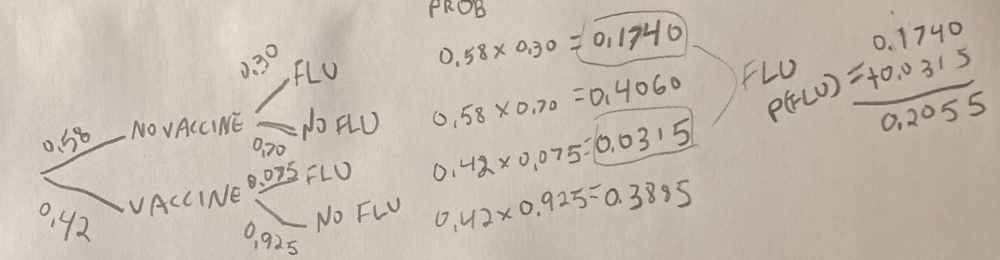

# Math for Probabilistic thinking {#prob2}

```{r, echo = FALSE, warning=FALSE, message=FALSE}
library(tidyverse)
library(DT)
library(knitr)
library(blogdown)
library(beyonce, warn.conflicts=F, quietly=T)
library(stringr)
library(tweetrmd)
library(emo)
library(tufte)
library(cowplot)
library(lubridate)
library(ggthemes)
library(ggforce)
library(datasauRus)
library(ggridges)
library(randomNames)
library(infer)
library(tiktokrmd)
options(crayon.enabled = FALSE)   
```


```{block2, type='rmdnote'}
These notes accompany portions of Chapter 5  --- *Probability* --- of our textbook, which we also examine in the [previous section](#prob1).   **The reading below is required,**  @whitlock2020 is  not.    
```


<span style="color: Blue;font-size:22px;">   Motivating scenarios:  </span>  <span style="color: Black;font-size:18px;">  We want to build on our intuitive feel for probability that we can build from simulation, by developing a mathematical framework and key rules to  predict probabilistic outcomes. </span> 
 
**Learning goals: By the end of this chapter you should be able to**   

- Add and subtract to calculate the probability of this OR that.       
- Subtract to find the probability of NOT THIS.   
- Multiply to calculate the probability of this AND that.          
- Add up all the ways you can get this to find its probability.    
- Use Bayes' theorem to flip between *"the probability of this given that"* to *"the probability of that given this."*    


```{block2, type='rmdwarning'}
In addition to this reading,  the other assignment is to read [this paper](https://drive.google.com/uc?export=download&id=1YBEE6pES415uQalTIEhaA-UD9u-l2D_5) [@humphrey2016].  
```

## How to do probability -- Math or simulation?   


In the previous chapter we saw that we could get pretty deep into probability by simulation. In fact -- everything we cover here could be discovered by simulation.  This holds not only for these chapters, but for pretty much all of stats. Simulation provides us with a good intuition, every problem we cover this term could be exactly solved by simulation (while math requires numerous assumptions), and some situations can uniquely solve problems that do not have nice mathematical answers. I often wonder -- "Why do we even use math?"  

The major advantages of math over simulation are:   

```{r, out.width='30%', echo=FALSE, out.extra='style="float:right; padding:10px"'}
include_graphics("images/whynotboth.gif")   
```

- **Math gives the same answers every time.** Unlike random simulation, math is not influenced by chance, so (for example) a sampling error on our computer mean that the sampling distribution from simulation will differ slightly each time, while math based sampling distributions do not change by chance.  

- **Math is fast.** Simulations can take a bunch of computer time and energy (it has to do the same thing a bunch of times). With math, the computer quickly run some numbers through a calculator. The computational burdens we'll face this term are pretty minimal, but with more complex stats this can actually matter.   

- **Math provides insight.** Simulations are great for helping us build feelings, intuition and even probabilities. But clear mathematical equations allow us to precisely see the relationship between components of our model.   


In practice I often combine mathematical and simulation based approaches to my work. 

Today we'll work through the mathematical foundations of probability. 


### Probability Rules    

I highly recommend a formal probability course would go through a bunch of ways to calculate probabilities of alternative outcomes (probability theory was my favorite class). But you don't need all that here. We simply want to get an intuition for probability, which we can achieve by familiarizing ourselves with some straightforward rules and a bit of practice in math and simulation.

Internalizing the rough rules below will get you pretty far:    

- **Add** probabilities to find the probability of one outcome **OR** another. (be sure to subtract off double counting).     

- **Multiply** probabilities to find the probability of one outcome **AND** another. (be sure to consider conditional probabilities if outcomes are non-independent.)     

OK -- Let's work through these rules.

```{block2, type='rmdnote'}
Below, we talk about the probability of events *a* and *b*. These are generic events that can stand in for any random thing, so $P(a)$ is the probability of some event *a*. So if *a* was red head, p(*a*) is the probability that a person is a red head.

I distinguish this from <span style="color:#EDA158;">A</span>, <span style="color:#62CAA7;">B</span>, and <span style="color:#98C5EB;">C</span>, which refer to balls dropping through colored bars in our visualizations.  
```


## Add probabilities for **OR** statements  

To find the probability  or this or that we sum all the ways we can be this or that, being careful to avoid double-counting.   


\begin{equation} 
\begin{split}
P(a\text{ or }b) &= P(a) + P(b) - P(ab)\\
\end{split}
(\#eq:or)
\end{equation} 

where *P(ab)* is the probability of outcomes *a* and *b*.     

### **Special case of exclusive outcomes** {-}

**If outcomes are mutually exclusive, the probability of outcome of both of them,** *p(ab)* **is zero, so the probability of** *a* **or** *b* **is**  

\begin{equation} 
\begin{split}P(a\text{ or }b | P(ab)=0) &= P(a) + P(b) - P(ab)\\
 &= P(a) + P(b) - 0\\
 &= P(a) + P(b)
\end{split}
\end{equation} 

For example the probability that a random persons favorite color is  **<span style="color:#EDA158;">orange</span> OR <span style="color:#62CAA7;">green</span>** is:       

Probability their favorite color is <span style="color:#EDA158;">orange, P(Orange),</span>      
**Plus** the probability their favorite color is <span style="color:#62CAA7;">green, P(Green)</span>.         

We often use this rule to find the probability of a range of outcomes for discrete variables (e.g. the probability that the sum of two dice rolls is between six and eight  = P(6) + P(7) + P(8)). 


### **General case** {-}

**More generally, the probability of outcome a or b is P(a) + P(b) - P(a b)** [Equation \@ref(eq:or)]. This subtraction <span style="color:lightgrey;">(which is irrelevant for exclusive events, because in that case $P(ab) = 0$)</span> avoids double counting. 

**Why do we subtract P(a and b) from P(a) + P(b) to find P(a or b)?** Figure \@ref(fig:dontdoublecount) shows that this subtraction prevents double-counting -- the sum of falling through A or B is $0.50 + 0.75 = 1.25$. Since probabilities cannot exceed one, we know this is foolish -- but we must subtract to avoid double counting even when the sum of probabilities do not exceed one.

```{r dontdoublecount, echo=FALSE, fig.cap = '**Subtract P(ab) to avoid double counting:** Another example of probability example from [Seeing Theory](https://seeing-theory.brown.edu/) (gif on 6 second loop).', out.width='80%'}
include_graphics("images/dontdoublecount.gif")
```

Following equation \@ref(eq:or) and estimating that about 35% of balls falls through  <span style="color:#EDA158;">A</span> and <span style="color:#62CAA7;">B</span>, we find that      
P(<span style="color:#EDA158;">A</span> or <span style="color:#62CAA7;">B</span>) = P(<span style="color:#EDA158;">A</span>) + P(<span style="color:#62CAA7;">B</span>) - P(<span style="color:gold;">AB</span>)        
P(<span style="color:#EDA158;">A</span> or <span style="color:#62CAA7;">B</span>) =  <span style="color:#EDA158;">0.50</span> + <span style="color:#62CAA7;">0.75</span> - <span style="color:gold;">0.35</span>   
P(<span style="color:#EDA158;">A</span> or <span style="color:#62CAA7;">B</span>) = 0.90.

For a simple and concrete example, the probability a random student played soccer or ran track in high school, is the probability they played soccer  *plus* the probability they ran track *minus* the probability they  played soccer and ran track.  


### The probability of not  {-}   

My favorite thing about probabilities is that they have to sum (or integrate) to one. This helps us be sure we laid out sample space right, and allows us to check our math. It also provides us with nice math tricks. 

Because probabilities sum to one, the **probability of "not a" equals 1 - the probability of a**. This simple trick often makes hard problems a lot easier.


## Multiply probabilities for **AND** statements  

The probability of two types of events in an outcome e.g. the probability of *a* and *b* equals the probability of *a* times the probability of *b* conditional on *a*, which will also equal the probability of *b* times the probability of *a* conditional on *b*.    


\begin{equation} 
\begin{split}
P(ab) &= P(a) \times P(b|a)\\
 & = P(b) \times P(a|b)
\end{split}
(\#eq:and)
\end{equation} 

### Special cases of AND {-}   

- **If two outcomes are mutually exclusive**, the probability of one conditional on the other is zero ($P(b|a) = 0$). So  the probability of  one given the other is zero ($P(a) \times P(b|a) = P(a) \times 0 = 0$).  

- **If two outcomes are independent**, the probability of one conditional on the other is simply its overall probability ($P(b|a) = P(b)$). So  the probability of one given the other is the product of their overall probabilities zero ($P(a) \times P(b|a) = P(a) \times P(b)$).  

```{r fig.cap = 'A Punnett Square is a classic example of indepndent probabilities  <span style="color:lightgrey;">(Image from the [Oklahoma Science Project](https://okscienceproject.org/lesson-2-punnett-squares))</span>.', out.width='30%', echo=FALSE,out.extra='style="float:right; padding:10px"'}
include_graphics("images/PunnettSquare.png")
```

The Punnett square is a classic example of independent probabilities in genetics as the sperm genotype usually does not impact meiosis in eggs (but see [my paper](https://www.ncbi.nlm.nih.gov/pmc/articles/PMC5539998/) [@brandvain2015] about exceptions and the consequences for fun). If we cross two heterozygotes, each transmits their recessive allele with probability $1/2$, so the probability of being homozygous for the recessive allele when both parents are heterozygous is $\frac{1}{2}\times \frac{1}{2} = \frac{1}{4}$.   


### The general cases of AND {-}   

The outcome of meiosis does not depend on who you mate with, but in much of the world context changes probabilities. When outcomes are nonexclusive, we find the probability of both *a* and *b* by multiplying the probability of a times the probability of *b* conditional on observing *a*, $P(ab) =P(a) \times P(b|a)$ [Eq. \@ref(eq:and)].     


#### **CONDITIONAL PROBABILITY VISUAL:**  {-}   

Let's work through a visual example!   

```{r, echo=FALSE}
include_graphics("images/nonindep1.gif")    
```

In the figure above     
P(<span style="color:#EDA158;">A</span>) = <span style="color:#EDA158;">1/3</span>,    
P(<span style="color:#62CAA7;">B</span>) = <span style="color:#62CAA7;">2/3</span>,    
P(<span style="color:#EDA158;">A</span>|<span style="color:#62CAA7;">B</span>) =  <span style="color:#EDA158;">1/4</span>, and      
P(<span style="color:#62CAA7;">B</span>|<span style="color:#EDA158;">A</span>) =  <span style="color:#62CAA7;">1/2</span>.   

Using Equation \@ref(eq:and), we find the probability of A and B:    
P(<span style="color:gold;">AB</span>) = P(<span style="color:#EDA158;">A</span>) $\times$ P(<span style="color:#62CAA7;">B</span>|<span style="color:#EDA158;">A</span>)  = P(<span style="color:#EDA158;">A</span>) = <span style="color:#EDA158;">1/3</span>  $\times$ <span style="color:#62CAA7;">1/2</span>    =  <span style="color:gold;">1/6</span>.      
Which is the same as    
P(<span style="color:gold;">AB</span>) = P(<span style="color:#62CAA7;">B</span>) $\times$ P(<span style="color:#EDA158;">A</span>| <span style="color:#62CAA7;">B</span>)  =  <span style="color:#62CAA7;">2/3</span> $\times$ <span style="color:#EDA158;">1/4</span> =  <span style="color:gold;">2/12</span>=  <span style="color:gold;">1/6</span>.   

We can see this visually in Figure \@ref(fig:counting):    

```{r counting, fig.cap = 'A representation of the relative probabilities of each outcome in sample space. Color denotes outcome (which is also noted with black letters), and each box represents a probability of one sixth.', fig.height=1, fig.width=1.5, echo = FALSE, ,out.extra='style="float:left; padding:10px"'}
tibble(x = rep(1:3, each = 2), y = rep(1:2,times = 3), 
       z= c(rep("A",1),rep("AB",1),rep("B",3),rep("x",1))) %>%
  mutate(z =factor(z, levels = c("A","AB","B","x")))   %>%
  ggplot(aes(x=x,y=y,fill =z))+
  geom_tile(color = "black",show.legend = FALSE)+
  scale_fill_manual(values = c("#EDA158","yellow","#62CAA7","black"),drop = FALSE)+
    theme_tufte()+
  theme(axis.title = element_blank(), 
        axis.text = element_blank(),
        legend.position = "bottom", 
        legend.title = element_blank(),
        axis.ticks = element_blank())+
  geom_text(aes(label = z),show.legend = FALSE)
#  labs(title = "Probability of each outcome")
```


#### **CONDITIONAL PROBABILITY REAL WORLD EXAMPLE:**  {-}   


You are way less likely to get the flu if you get the flu vaccine.     
So, what is the probability that a random person got a flu vaccine and got the flu?     
First, we lay out some rough probabilities:   

```{r, out.width = '30%', out.extra='style="float:right; padding:10px"'}
include_graphics("https://images.everydayhealth.com/images/no-flu-shot-and-now-you-have-the-flu-what-to-do-722x406.jpg?w=1110")
```

- Every year, a little more than half of the population gets a flu vaccine, let us say P(No Vaccine) = 0.58.        

- About 30% of people who do not get the vaccine get the flu, P(Flu|No Vaccine) = 0.30.      
- The probability of getting the flu diminishes by about one-fourth among the vaccinated, P(Flu|Vaccine) =  0.075.  

But we seem stuck, what is $P(\text{Vaccine})$?    We can find this as $1 - P(\text{no vaccine}) = 1 - 0.58 = 0.42$.   

Now we find P(Flu and Vaccine) as P(Vaccine) x P(Flu | Vaccine) = 0.42 x 0.075 = 0.0315.   

## The law of total probability  
Let's say we wanted to know the probability that someone caught the flu.  How do we find this?   

We learned in Chapter \@ref(prob1) that the probability of all outcomes in sample space has to sum to one. Likewise, the probability of all ways to get some outcome have to sum to the probability of getting that outcome:    

\begin{equation} 
P(b) = \sum P(a_i) \times P(b|a_i)
(\#eq:tot)
\end{equation} 

The $\sum$ sign notes that we are going over all possible outcomes of $a$, and the subscript, $_i$, indexes these potential outcomes of $a$.  In plain language, **we find probability of some outcome** by     

1. Writing down all the ways we can get it,       
2. Finding the probability of each of these ways,    
3. Adding them all up.    

So for our flu example, the probability of having the flu is the probability of being vaccinated and having the flu, plus the probability of not being vaccinated and catching the flu <span style="color:lightgrey;">(NOTE: We don't subtract anything off because they are mutually exclusive.)</span>. We can find each following the general multiplication principle \@ref(eq:and):     

\begin{equation} 
\begin{split}
P(\text{Flu}) &= P(\text{Vaccine}) \times P(\text{Flu}|\text{Vaccine})\\ 
&\text{ }+ P(\text{No Vaccine}) \times  P(\text{Flu}|\text{No Vaccine})  \\
&=  0.42  \times 0.075 + 0.58 \times 0.30\\ 
&=  0.0315 + 0.174\\ 
&= 0.2055
\end{split}
\end{equation}


## Probability trees   

It can be hard to keep track of all of this. Probability trees are a tool we use to help. To make a probability tree, we   

1. Write down all potential outcomes for *a*, and use lines to show their probabilities.  
2. We then write down all potential outcomes for *b* separately for each potential a, and connect each a to these outcomes with a line denoting the conditional probabilities.   
3. Keep going for events *c*, *d*, etc...    
4. Multiply each value on path to get the probability of that path (The general multiplication rule, Equation \@ref(eq:and)).     
5. Add up all paths that lead to the outcome you are interested in. <span style="color:lightgrey;">(NOTE: Again, reach path is exclusive, so we don't subtract anything.)</span>   

Here is a probability tree I drew for the flu example. Reassuringly the probability of getting the flu matches our math above.   

```{r, echo=FALSE}

```


## Flipping conditional probabilities    {#bayes}

The probability that a vaccinated person gets the flu, P(Flu|Vaccine) is 0.075.    
But what is the probability that someone who has the flu got vaccinated, P(Vaccine|Flu)?   
We could follow our approach in Section \@ref(condishsim), by simulating these conditional probabilities, counting, and dividing the number of people that had the flu and the vaccine by the number of people who had the flu. But we can basically do the same thing with math -- the probability that someone who has the flu got vaccinated equals the probability that someone got the flu and was vaccinated, divided by the probability that someone has the flu.   

\begin{equation} 
\begin{split}
P(\text{Vaccine|Flu}) &= P(\text{Vaccine and Flu}) / P(\text{Flu}) \\
P(\text{Vaccine|Flu}) &= \tfrac{P(\text{Flu|Vaccine}) \times P(\text{Vaccine})}{P(\text{Vaccine}) \times P(\text{Flu}|\text{Vaccine}) + P(\text{No Vaccine}) \times  P(\text{Flu}|\text{No Vaccine})}\\
P(\text{Vaccine|Flu}) &= 0.0315 / 0.2055 \\ 
P(\text{Vaccine|Flu}) &=0.1533  
\end{split}
\end{equation}

So, while the vaccinated make up 42% of the population, they only make up 15% of people who got the flu.

The numerator on the right hand side,  $P(\text{Vaccine and Flu})$, comes from the general multiplication rule (Eq. \@ref(eq:and)).   
The denominator on the right hand side, $P(\text{Flu})$, comes from the law of total probability (Eq. \@ref(eq:tot)). 

This is an application of **Bayes' theorem**. Bayes' theorem is a math trick which allows us to flip conditional probabilities as follows 

\begin{equation} 
\begin{split}
P(A|B) &= \frac{P(A\text{ and }B)}{P(B)}\\ 
P(A|B) &= \frac{P(B|A) \times P(A)}{P(B)}
\end{split}
(\#eq:bayes)
\end{equation} 


```{block2, type='rmdnote'}
This reversal of conditional probabilities is critically important in many arenas, especially the proper interpretation of medical test results.   Additionally, this way of thinking has spawned a whole branch of statistics, known as Bayesian statistics. While Bayesian statistics is not the focus of this class, we will discuss it from time to time.
```


## Simulation   

Below, I simulate the process of vaccination and acquiring the flu to show that these math results make sense. 

```{r}
p_Vaccine             <- 0.42
p_Flu_given_Vaccine   <- 0.075
p_Flu_given_NoVaccine <- 0.300
n_inds                <- 10000000

flu_sim <- tibble(vaccine = sample(c("Vaccinated","Not Vaccinated"),
                                   prob =c(p_Vaccine, 1- p_Vaccine),
                                   size = n_inds,
                                   replace = TRUE )) %>%
  group_by(vaccine) %>%
  mutate(flu = case_when(vaccine == "Vaccinated" ~ sample(c("Flu","No Flu"), 
                                      size = n(),
                                      replace = TRUE, 
                                      prob = c(p_Flu_given_Vaccine, 1  - p_Flu_given_Vaccine)),
                       vaccine != "Vaccinated" ~ sample(c("Flu","No Flu"), 
                                      size = n(),
                                      replace = TRUE, 
                                      prob = c(p_Flu_given_NoVaccine, 1  - p_Flu_given_NoVaccine))
           )) %>%
  ungroup()
```

**Let's browse the first 1000 values**

```{r, echo = FALSE}
DT::datatable(head(flu_sim, n = 1000) ,
              options = list(autoWidth = TRUE,pageLength = 5, lengthMenu = c(5, 25, 50, 100),
                             columnDefs=list(list(targets=1:2, class="dt-right"))))
```

**Let's find all the proportion of each combo**   

```{r}
flu_sum <- flu_sim %>% 
  group_by(vaccine, flu, .drop = FALSE) %>%
  summarise(sim_prop = n() / n_inds, .groups = "drop") 
```

**Compare to predictions**  

```{r}
precitions <- tibble(vaccine   = c("Not Vaccinated", "Not Vaccinated", "Vaccinated", "Vaccinated"),
       flu       = c("Flu", "No Flu", "Flu", "No Flu"), 
       math_prob = c((1-p_Vaccine) * (p_Flu_given_NoVaccine) , 
                     (1-p_Vaccine) * (1- p_Flu_given_NoVaccine), 
                     (p_Vaccine) * (p_Flu_given_Vaccine), 
                     (p_Vaccine) * (1-p_Flu_given_Vaccine))) 

full_join(flu_sum, precitions)       
```

**Now let's check our flipping of conditional probabilities (aka Bayes' theorem)**

```{r}
flu_sum %>% 
  filter(flu == "Flu") %>% # only looking at people with flu  
  mutate(prop_given_flu = sim_prop / sum(sim_prop))
```

This is basically what we got by math in section \@ref(bayes).   


## Probabilitic maths: Quiz   

Go through all "Topics" in the `learnR` tutorial, below. Nearly identical will be homework on canvas.

```{r, echo=FALSE}
include_app("https://brandvain.shinyapps.io/prob2/",height = '800')
```


```{r, echo=FALSE}
rm(list = ls())
```
