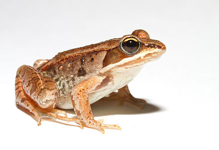

# Shuffling labels to generate a null {#perm1}   

```{r, echo = FALSE, warning=FALSE, message=FALSE}
library(tidyverse)
library(DT)
library(knitr)
library(blogdown)
library(beyonce, warn.conflicts=F, quietly=T)
library(stringr)
library(tweetrmd)
library(emo)
library(tufte)
library(cowplot)
library(lubridate)
library(ggthemes)
library(kableExtra)
library(ggforce)
library(datasauRus)
library(ggridges)
library(randomNames)
library(infer)
library(tiktokrmd)
library(ggridges)
library(colorspace)
```


```{block2, type='rmdnote'}
The closest thing to these note is section 8 in chapter 13 of  our textbook.   **The reading below is required,**  @whitlock2020 is  not.    
```


<span style="color: Blue;font-size:22px;">   Motivating scenarios:  </span>  <span style="color: Black;font-size:18px;">   You want to make the ideas of a null sampling distribution and a p-value more concrete  and learn a very robust way to test null hypotheses while you're at it. </span> 

**Learning goals: By the end of this chapter you should be able to**    

- Explain what a permutation is.    
- Explain why permuting many times generates a sampling distribution under the null.   
- Use `R` to permute data to see if two samples means differ.   
- Identify that we use permutation (shuffling) to generate null distributions, and bootstrapping (resampling with replacement) to estimate uncertainty.  
- Generalize the idea of permutation as a way to test most null models.    


```{block2, type='rmdwarning'}
No additional reading is assigned.     But [this paper](https://peerj.com/articles/9089/)) by my colleague here [@fieberg2020] helped lays out why this is a good way to do and teach staistics.   
```


## One simple trick to generate a null distribution


```{r, echo=FALSE}
tweet_embed("https://twitter.com/kdc509/status/1353808281563619333")
```


In Chapter \@ref(hypoth), we discussed the idea behind in null hypothesis significance testing.  Specifically, **the challenge in null hypothesis significance testing is to figure out how often we would see what we saw if some boring *null hypothesis* was true**.  A key step in this process id comparing our observed "*test statistic*" to its sampling distribution when the null hypothesis is true. 

<span style="color: lightgrey;">Later in the course we will deal with special cases for which mathematicians have estimated a sampling distribution under some set of assumptions.  But </span> A really clean way to generate a null distribution is to shuffle your data randomly, as if nothing where happening. Unlike the math tricks we cover later, this shuffling approach, known as **permutation**, makes very few  assumptions. The most critical assumption of the permutation test is that samples are Random and independent without bias, and that the null is no association.  


```{r, fig.cap="Listen to the permutation anthem [here](https://www.youtube.com/watch?v=KQ6zr6kCPj8).", echo=FALSE}
include_url("http://gfycat.com/ifr/ColorlessScalyHermitcrab")
```

### Motivation:  

One of the most common statistical hypotheses we ask are "Do these two samples differ." For example,   

- Do people who get a vaccine have worse side effects than people getting a placebo?   
- Does planting a native garden attract pollinators?   

So how do we go about asking these questions from data?  

In this chapter we focus in permuting to test for differences between two groups, but *permutation is super flexible and can be used for most problems, where the null is "no association"!*


## Case study: Mate choice & fitness in frogs  

There are plenty of reasons to choose your partner carefully. In much of the biological world  a key reason is "evolutionary fitness" - presumably organisms evolve to choose mates that will help them make more children. This could, for example explain Kermit's resistance in one of the [more complex love stories of our time](https://www.insider.com/miss-piggy-and-kermit-relationship-timeline-2018-12), as frogs and pigs are unlikely to make healthy children.   

To evaluate this this idea @swierk2019, identified a males top choice out of two female wood frogs and then had them mate with the preferred or unpreferred female and counted the number of hatched eggs. 


```{r, echo=FALSE,out.extra= 'allowfullscreen', out.width="30%", out.extra='style="float:right; padding:10px"'}

```

**Concept check**   

- Is this an experimental or observational study?       
- Are there any opportunities for bias? Explain!   
- What is the biological hypothesis?   
- What is the statistical null?   

Here are the raw data   

```{r, echo=FALSE}
frogs <- tibble(read.csv("data/Swierk_Langkilde_BEHECO_1.csv")) %>%
  select(year, pond, treatment,hatched.eggs, total.eggs, num.metamorphosed,field.survival.num)

DT::datatable(frogs,
              options = list(autoWidth = TRUE,pageLength = 5, lengthMenu = c(5, 25, 50)
))
```

## What to do with data?

### Visualize patterns  

**We visualize patterns:** (Chapters \@ref(viz1), \@ref(goodfigs), and  \@ref(betteRfigs)).    

```{r, warning=FALSE, fig.width=3.5, fig.height=2.5, warning=FALSE, message=FALSE}
ggplot(frogs, aes(x = treatment, y =  hatched.eggs, color = treatment, shape = treatment  ))+
  geom_sina(show.legend = FALSE)+
  stat_summary(color = "black",show.legend = FALSE)
```      

### Estimate parameters {#est}

We estimate parameters from samples of each group (Chapter \@ref(summaRy)).  

```{r, message=FALSE, warning=FALSE}
frog_summary <- frogs                           %>%
  group_by(treatment)                           %>%
  summarise(mean_hatched = mean(hatched.eggs),
              sd_hatched =   sd(hatched.eggs))

frog_summary 
```

**We estimate the difference (preffered - nonpreffered) in group means as**   

```{r}
mean_diff <- summarise(frog_summary,  nonpref_minus_pref = diff(mean_hatched))

pull(mean_diff) %>% round(digits = 2) 
```


... So visual and numeric summaries suggest that contrary to our expectation, we get more eggs from pairs of frogs when males don't get their preferred mate. But, we know that sample estimates will differ from population parameters by chance (aka. sampling error).  So we ...

### Quantify uncertainty  

Here we quantify uncertainty with the  'bootstrap' described in Chapter \@ref(uncertainty). Specifically, we resample within each treatment with replacement, and     

- Calculate groups means in this resampled data set,  and     
- Calculate the distribution of differences in the mean for each permutation.     

```{r, message=FALSE, warning=FALSE}
frogs.boot.nonpreffered <- frogs            %>%
  filter(treatment == "nonpreferred")  %>%
  rep_sample_n(size = nrow(frogs), replace = TRUE, reps = 10000) %>%
  summarise(mean_nonpreffered = mean(hatched.eggs))

frogs.boot.preffered <- frogs            %>%
  filter(treatment == "preferred")  %>%
  rep_sample_n(size = nrow(frogs), replace = TRUE, reps = 10000) %>%
  summarise(mean_preffered = mean(hatched.eggs))

# let's shove our bootstraps together!  
frogs.boot <- full_join(frogs.boot.nonpreffered, frogs.boot.preffered, by = "replicate") %>% 
  mutate(nonpref_minus_pref = mean_nonpreffered - mean_preffered)
```

Here are the bootstrap results: 

```{r, echo=FALSE}
frogs.boot %>% 
  select(-replicate)%>%
  mutate_all(round,digits = 2) %>%
DT::datatable(.,
              options = list(autoWidth = TRUE,pageLength = 5, lengthMenu = c(5, 25, 50)
))
```

Let's summarize uncertainty. To do so, we     

- Tidy the bootrapped data.   
- Find the standard error as the standard deviation of the bootstrapped distribution.     
- Find the upper and lower (95%) Confidence Intervals as the extreme 2.3 percentiles of the bootstrapped distribution.  

```{r, message=FALSE, warning=FALSE}
frog_uncertainty <- pivot_longer(frogs.boot, cols = -1, names_to = "treatment", values_to = "eggs_hatched") %>%
    group_by(treatment) %>%
    summarise(se = sd(eggs_hatched),
              lower_95_ci = quantile(eggs_hatched, prob = 0.025),
              upper_95_ci = quantile(eggs_hatched, prob = 0.975))
```

```{r, echo=FALSE}
frog_uncertainty %>%
  mutate_at(.vars = -1,round, digits  = 2)%>%
  kbl() %>%
  kable_styling()
```

```{r, echo=FALSE, fig.height=2.4, fig.width=4.4, message=FALSE, warning=FALSE}
ggplot(frogs.boot, aes(x = nonpref_minus_pref))+ 
  geom_histogram(color = "white")+
  geom_vline(xintercept = as.vector(t(frog_uncertainty[3,3:4])), color = "blue", lty = 2)+
  annotate(geom = "text",x = -70, y = 900, label = "95% CI",color = "blue")+
  labs(title = "Bootstrap distribution",
       x = "# eggs w. nonpreffered mate - # eggs w. preffered mate")
```

<span style="color: red;">**There is considerable uncertainty in our estimates**</span> -- our bootstrapped 95% confidence interval includes some cases in which preferred matings yield more hatched eggs than nonpreferred matings, in addition to cases in which nonpreferred matings yield more hatched eggs.  

How do we test the null model that mate preference doesn’t matter to egg hatching? Let generate a sampling distribution under the null!  


## Permute to generate a null distribution!  


<span style="color: Black;font-size:46px;">**IT'S TIME TO...**</span>

```{r, echo=FALSE}
include_graphics("https://media.giphy.com/media/pRHkn0CC08Wn6/giphy.gif")
```      

<span style="color: Black;font-size:46px;">**PERMUTE THE FROG**</span>

**Steps in a Permutation Test**    


1. Decide on a test statistic.   
2. Calculate the  test statistic the actual data.     
3. Permute the data by shuffling values of explanatory variables across observations.     
4. Calculate the test statistic on this permuted data set.   
5. Repeat step 3 and 4 many times to generate the sampling distribution under the null (a thousand is standard... the more permutations, the more precise the p-value).   
6. Calculate a p-value as the proportion of permuted values that are as or more extreme than observed in the actual data.       
7. Interpret the p-value.         


### Permutation: Decide on a test statistic.   

The test statistic for a permutation can be whatever we think best captures our biological hypothesis.  For this case, let's say the test statistic is the difference in mean number of eggs hatched in nonpreferred and preferred matings.  


### Permutation: Calculate the  test statistic the actual data.   
In section \@ref(est)  we  found   the mean number of eggs hatched     

-   Was `r round(pull(frog_summary[2,2]) , digits = 2)` in preferred matings,     
- And  `r round(pull(frog_summary[1,2]) , digits = 2)` in nonpreferred matings.    

Yielding a difference of `r pull(mean_diff) %>% round(digits = 2)` between the means.   


### Permutation: Permute the data.    

So now we permute the data by randomly shuffling "treatment" onto our observation by using the sample function. Let's make one permutation below.

```{r}
one.perm <- select(frogs,treatment, hatched.eggs)     %>%
  mutate(perm_treatment = sample(treatment, size = n(), replace = FALSE))         
```

```{r, echo = FALSE}
one.perm  %>%
  mutate(diff_label     = treatment !=perm_treatment) %>%
  relocate(hatched.eggs, .after = diff_label)%>%
DT::datatable(.,options = list(autoWidth = TRUE,pageLength = 5, lengthMenu = c(5, 25, 50)))
```

So we see that after randomly shuffling treatment onto values, some observations stay with the original treatment and some swap. This generates a null as if there is no association because we randomly shuffled, removing a biological explanation for an association.  

### Permutation: Calculate the test statistic on permuted data.  
Let's take the difference in means in this permuted data set.  As in section \@ref(est), to do so we  

- `group_by()` (permuted) treatment   
- `summarise()` (permuted) treatment means   
- find the `diff()`erence between group means   

```{r, message=FALSE, warning=FALSE}
perm.diff <- one.perm %>%
  group_by(perm_treatment) %>%
  summarise(mean_hatched = mean(hatched.eggs))%>%
  summarise(diff_hatched = diff(mean_hatched))
```

```{r, echo=FALSE}
perm.diff 
```

So we see that our single permutation (i.e. one sample from the null distribution) revealed a difference of `r round(pull(perm.diff ), digits = 2)` eggs on average between the nonpreffered and preferred matings. REMEMBER we know there is no actual association in the permutation because we randomly shuffled. We now do the many times to find the sampling distribution under the null.  

This permuted difference of `r round(pull(perm.diff ), digits = 2)` is  **`r ifelse( abs(pull(perm.diff ))  > abs(pull(mean_diff)) , "MORE","LESS")` extreme** than the actual difference of `r round(pull(mean_diff), digits = 2)` between treatments. 

### Permutation: Permute a bunch to build the null sampling distribution


But, this is just one sample from the null distribution.  Now we do this many times to generate the sampling distribution.     

#### **PERMUTE MANY TIMES**   {-}  

```{r}
sample_size <- nrow(frogs)
perm_reps   <- 10000

many.perm <- select(frogs,treatment, hatched.eggs)     %>%
  rep_sample_n(size = sample_size, replace = FALSE, reps = perm_reps ) %>%
  mutate(perm_treatment = sample(treatment, size = n(), replace = FALSE))  %>%
  group_by(replicate, perm_treatment)

many.perm
```

#### **FIND MEANS OF PERMUTED GROUPS FOR EACH REPLICATE**  {-}  

```{r}
many.perm.means <- many.perm %>%
  summarise(mean_hatched = mean(hatched.eggs), .groups = "drop")%>%
  group_by(replicate)

many.perm.means
```


#### **CALCULATE THE TEST STATISTIC (DIFFERENCE IN PERMUTED GROUP MEANS)  FOR EACH REPLICATE**  {-}  

```{r, message=FALSE, warning=FALSE, fig.width=3.5,fig.height=2}
many.perm.diffs <- many.perm.means %>%
  summarise(diff_hatched = diff(mean_hatched))

ggplot(many.perm.diffs, aes(x = diff_hatched)) +
  geom_histogram(bins = 32, color = "white")+
  labs(title = "Permuted sampling distribution")
```

### Permutation:  Calculate a p-value. 


Now that we have our observed test statistic and its sampling distribution under the null we can calculate a p-value -- the probability that we would observes a test statistic as or more extreme than what we actually saw if the null were true.

We do this by finding the proportion of permuted replicates that are as or more extreme than the actual data. **To look at both tails (i.e. a two-tailed test) we work with absolute values - allowing us to work with one tail while incorporating both extremes**.

Now that we have our observed test statistic and its sampling distribution under the null we can calculate a p-value -- the probability that we would observes a test statistic as or more extreme than what we actually saw if the null were true.

We do this by finding the proportion of permuted replicates that are as or more extreme than the actual data. **To look at both tails (i.e. a two-tailed test) we work with absolute values - allowing us to work with one tail while incorporating both extremes**.


```{r permdist, fig.cap= "Sampling distribution for the difference in mean eggs hatched by treatment under the null hypothesis (light blue line show the oberved value).", fig.height=3, fig.width=4}
many.perm.diffs <- many.perm.diffs %>% 
  mutate(abs_obs_dif = abs(pull(mean_diff)),
         abs_perm_dif = abs(diff_hatched),
         as_or_more_extreme = abs_perm_dif >= abs_obs_dif)

# Plot the permuted distribution
ggplot(many.perm.diffs, aes(x = diff_hatched, fill = as_or_more_extreme )) +
  geom_histogram(bins = 35, color = "white")    +  
  scale_fill_manual(values = c("grey","black")) +
  theme_light()                                 +
  theme(legend.position = "bottom")             + 
  labs(title = "Permuted distribution")         +
  geom_vline(xintercept = c(-1,1)*pull(mean_diff), color = "lightblue") +
  annotate(x = -125, y = 790, geom = "text", color = "lightblue", label = "Observed")+
  scale_y_continuous(limits = c(0,1000))
```

#### **CALCULATE A P-VALUE** {-}

Find the proportion of permutations that are as or more extreme than the real data (i.e. the proportion of the histogram in Figure \@ref(permdist)) by taking the mean of `as_or_more_extreme` (`FALSE = 0, TRUE = 1`). 

```{r}
summarise(many.perm.diffs, p_value = mean(as_or_more_extreme))
```

**ADVANCED DEALING WTH NONINDEP**

- Well, can visualize patters (Chapters \@ref(viz1), \@ref(goodfigs), and  \@ref(betteRfigs)).  
- we estimate parameters from samples of each group (Chapter \@ref(summaRy)).      
- But we know that because of sampling error (Chapter \@ref(sampling)), two random samples from the same population will differ by chance.      
- We can quantify uncertainty by calculating standard errors and confidence intervals (Chapter \@ref(uncertainty)).   
- We want to build a null distribution to test if our data would be super unlikely if the null where true (\@ref(hypoth)).    

## Review: samples  


In chapters \@ref(intro) and  \@ref(summaRy) we talked about estimation as a major goal of statistics -- we hope to summarize what we see in the world to estimate population parameters from a sample.     

But we also learned, in chapters \@ref(intro), \@ref(sampling), and \@ref(uncertainty), that all estimates are subject to sampling error. **Our goal in null hypothesis significance testing is to see if results are easily explained by sampling error.** Let's work though a concrete example: 

So, say we did an experiment: we gave the Moderna Covid vaccine to 15,000 people and a placebo to 15,000 people. This experimental design is meant to  

- Imagine if the population that got the Covid vaccine, or it did not.   
- Calculate parameters of interest (e.g. the probability of contracting Covid, or the frequency of severe Covid among those who caught Covid), or the frequency of severe reactions etc.. in the vaccinated and unvaccinated population.   
- Compare these parameters across **populations** with and without the placebo.    


for paired t-test
https://datadryad.org/stash/dataset/doi:10.5061/dryad.82t1k
