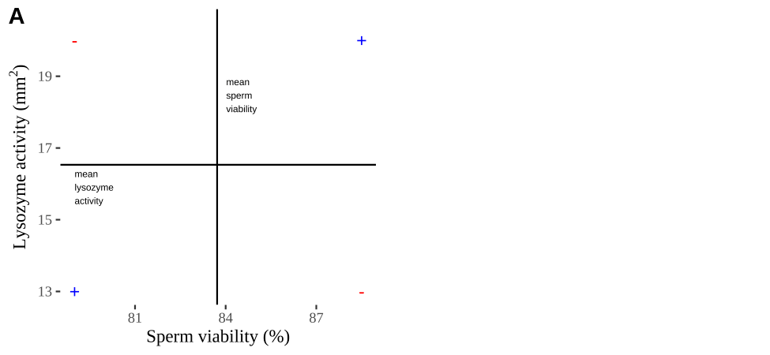
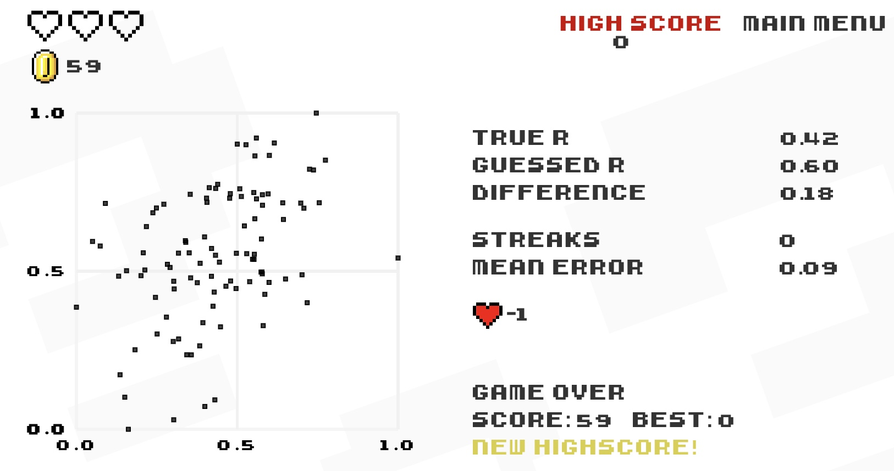

# Associations between continuous variables {#correlation}   

```{r, echo = FALSE, warning=FALSE, message=FALSE}
library(tidyverse)
library(DT)
library(knitr)
library(blogdown)
library(beyonce, warn.conflicts=F, quietly=T)
library(stringr)
library(tweetrmd)
library(emo)
library(tufte)
library(cowplot)
library(lubridate)
library(ggthemes)
library(kableExtra)
library(ggforce)
library(datasauRus)
library(ggridges)
library(randomNames)
library(infer)
library(tiktokrmd)
library(ggridges)
library(colorspace)
options(crayon.enabled = FALSE)   
```


```{block2, type='rmdnote'}
This text (roughly) follows Chapter 16 of our textbook.   **The reading below is required,**  @whitlock2020 is  not.    
```


<span style="color: Blue;font-size:22px;">   Motivating scenarios:  </span>  <span style="color: Black;font-size:18px;">   We are interested to estimate an association between two continuous variables, and test if this association is differs from zero. </span>

**Learning goals: By the end of this chapter you should be able to**    

- Summarize the association between to continuous variables as   
    - Covariance  AND      
    - Correlation         
- Estimate uncertainty in these estimates by    
    - By bootstrapping    AND  
    - Naively taking `R`'s output at face value.    
- Test the null hypothesis of no association by   
    - A permutation test    
    - Naively accepting `R`'s output at face value.    


```{block2, type='rmdwarning'}
No additional reading is assigned.     But [this paper](https://peerj.com/articles/9089/) by my colleague here [@fieberg2020] helped lays out why this is a good way to do and teach statistics.   
```

## Associations between continuous variables   


One of the most common statistical questions we come across is "are the two variables associated?"   

For instance, we might want to know if people who study more get better grades.  

Such an association would be quite interesting, and if it arises in a randomized controlled experiment, it would suggest that studying  caused this outcome.  


```{block2, type='rmdwarning'}
What confounds could explain an association (or lack thereof) if this  was an observational study?  
```

## Example: Disease and sperm viability    

It is hypothesized that there is a trade off between investment in disease resistance and reproduction. To look into this, @simmons2005, assayed sperm viability and lysozyme activity (a measure of defense against bacteria) in 39 male crickets. Let's use this to explore  associations between continuous variables.  

```{r, echo = FALSE, message=FALSE, warning=FALSE}
crickets  <- read_csv("https://whitlockschluter3e.zoology.ubc.ca/Data/chapter16/chap16q12CricketImmunitySpermViability.csv") %>%
  filter(spermViability>75)
```

```{r cricketsdat, fig.cap = 'Association between reproduction (measured as sperm viability) and immunity (measured as the diameter of lysozyme). Data from @simmons2005 are available [here](https://whitlockschluter3e.zoology.ubc.ca/Data/chapter16/chap16q12CricketImmunitySpermViability.csv). One extreme outlier was removed to simplify the analysis for purposes of explanation (it would not be removed in a real study).', fig.height=2.5, fig.width = 3}
ggplot(crickets , aes(x = spermViability, y = lysozyme))+
  geom_point()+
  labs(x = "Sperm viability (%)", y = expression(paste("Lysozyme activity (",mm^2,")")))
```

## Summarizing associations between two categorical variables    

We focus on two common summaries of associations  between two continuous variables, *X* and *Y*, the covariance and the correlation.    

Both these summaries describe the tendency for values of *X* and *Y* to jointly deviate from the mean.   

- If larger values of *X* tend to come with larger values of *Y* the covariance (and correlation) will be positive.   
- If smaller values of *X* tend to come with larger values of *Y* the covariance (and correlation) will be negative.  
- A covariance (or correlation) of zero means that -- on average -- *X* and *Y* don't predictably deviate from their means in the same direction. This does not guarantee that *X* and *Y* are independent -- if they are related by a curve rather than a line, *X* could predict *Y* well even if the covariance  (or correlation) was zero. It does mean that the best fit line between *X* and *Y* will be flat.  


For both these summaries *X* and *Y* are arbitrary - the covariance between sperm viability and lysozyme activity is the same as the covariance between lysozyme activity and sperm viability.   

### Covariance  

The covariance quantifies the shared deviation of *X* and *Y* from the mean as follows: 


\begin{equation} 
\begin{split}
\text{Sample covariance between X and Y}  = Cov(X,Y) &=\frac{\sum{\Big((X_i-\overline{X})\times (Y_i-\overline{Y})\Big)}}{n-1}\\
\end{split}
(\#eq:cov1)
\end{equation}

The numerator in Eq.  \@ref(eq:cov1)  is known as the 'Sum of Cross Products'. <span style="color: lightgrey;">This should remind you of the numerator in the variance calculation (Sum of squares = $\sum(X-\overline{X})(X-\overline{X})$) -- in fact the covariance of *X* with itself is its variance.  The covariance can range from $-\infty$ to $\infty$, but in practice cannot exceed the variance in *X* or *Y*.   </span>   


Some algebra can rearrange Eq. \@ref(eq:cov1) to become Eq. \@ref(eq:cov2). These two different  looking equations are identical. Often, computing the covariance from \@ref(eq:cov1) is more convenient, but this isn't always true.  

\begin{equation} 
\begin{split}
\text{Sample covariance between X and Y}  = Cov(X,Y) &= \frac{n-1}{n}(\overline{XY} - \overline{X} \times \overline{Y})\\
\end{split}
(\#eq:cov2)
\end{equation}

 This is also equal to $Cov(X,Y)  = \frac{n-1}{n}(\overline{XY} - \overline{X} \times \overline{Y})$. Which is sometimes easier to work with. 
 
We can calculate the covariance by  explicitly writing our math out in R or by using the [`cov()`](https://stat.ethz.ch/R-manual/R-devel/library/stats/html/cor.html)  function:   

```{r}
crickets %>%
  mutate(x_prods = (spermViability-mean(spermViability)) * (lysozyme-mean(lysozyme))) %>%
  summarise(n = n(),
            sum_x_prods = sum(x_prods),
            cov_math_a  = sum_x_prods / (n-1),
            cov_math_b  = (n/(n-1)) * sum(mean(spermViability * lysozyme) -
                                mean(spermViability) * mean(lysozyme)), 
            cov_r       = cov(spermViability, lysozyme))
```

Reassuringly we get the same result for all derivations-- higher quality sperm come from parents with less lysozyme activity.    

#### Covariance - a visual explanation   {-}   

Some people have trouble intuiting a covariance, as the mean of the product of the difference *X* and *Y* and their means (just typing it is a mouthful). 

So I'm hoping the visuals in Fig \@ref(fig:covviz) help -- if they don't then skip them. To calculate the covariance,    

- Draw a rectangle around a given data point and the means of *X* and *Y*.  
- Find the area of that rectangle.   
- If *X*  is less than its mean and *Y* is greater than its mean (or vice versa) put a negative sign in front of this area.  
- Do this for all data points.  
- Add this all up and divide by $n - 1$.  

```{r, echo=FALSE}

```
 
 
```{r covviz, fig.cap= "Visualizing covariance as areas from the mean. **A)** Animation of a rectangles around the $i^{th}$ data point and the mean sperm motility (x), and lysozyme activity (y), looped over all *n* observations. Values in the top left and bottom right quadrants are colored in red because x and y deviate from their means in different directions. Values in the bottom right and top left quadrants are colored in blue because they deviate from their means in the same direction. **B)** The area of the $i^{th}$ rectangle, with a running sum of cross products. **C)** All rectangles in **A** shown at the same time. **D)** The sum of positive (blue) and negative (red) areas.", echo=FALSE, message=FALSE, warning=FALSE, fig.height=3}

y <- read_csv("https://whitlockschluter3e.zoology.ubc.ca/Data/chapter16/chap16q12CricketImmunitySpermViability.csv") %>%
  filter(spermViability>75) %>%
  mutate(group = factor(1:n()),
         sign = sign((spermViability - mean(spermViability)) * ( lysozyme - mean(lysozyme))),
         sign = case_when(sign == -1 ~"negative", sign == 1 ~ "positive" ))


y_poly <- bind_rows(
  # bottom left
  mutate(y, spermViability  =  case_when(spermViability  < mean(spermViability) ~ spermViability,
                                         spermViability  > mean(spermViability) ~ mean(spermViability)),
         lysozyme  =        case_when(lysozyme        < mean(lysozyme)       ~ lysozyme,
                                      lysozyme        > mean(lysozyme)       ~ mean(lysozyme))),
  #top right
  mutate(y, spermViability  =  case_when(spermViability  > mean(spermViability) ~ spermViability,
                                         spermViability   < mean(spermViability) ~ mean(spermViability)),
         lysozyme   =         case_when(lysozyme         < mean(lysozyme)       ~ lysozyme,
                                        lysozyme        > mean(lysozyme)       ~ mean(lysozyme))),
  # top left
  mutate(y, spermViability  =  case_when(spermViability  > mean(spermViability) ~ spermViability,
                                         spermViability  < mean(spermViability) ~ mean(spermViability)),
         lysozyme   =  case_when(lysozyme                > mean(lysozyme) ~ lysozyme,
                                 lysozyme                < mean(lysozyme) ~ mean(lysozyme))),
  #
  mutate(y, spermViability  =  case_when(spermViability  < mean(spermViability) ~ spermViability,
                                         spermViability  > mean(spermViability) ~ mean(spermViability)),
         lysozyme   =  case_when(lysozyme                > mean(lysozyme)       ~ lysozyme,
                                 lysozyme           < mean(lysozyme)       ~ mean(lysozyme)))
) %>%
  arrange(group)


tot_area <- y %>%
  mutate(l =  (spermViability - mean(spermViability))*(lysozyme-mean(lysozyme))  ) %>%
  group_by(sign) %>%
  summarise(k=sum(abs(l)) )

cov_plot_a <- ggplot(y, aes(x = spermViability, y = lysozyme))+
  geom_point()+
  geom_polygon(data = y_poly, alpha = .3, aes(fill= sign, group = group))+
  geom_vline(xintercept = 83.7175)+
  labs(title = "Visualizing covariance",
       subtitle = "Area of rectangles connecting points to means",
       x = "Sperm viability (%)",
       y = expression(paste("Lysozyme activity (",mm^2,")")))+
  theme_tufte()+
  theme(legend.position = "top")

cov_plot_b <- tibble(x = sqrt(c(   0, pull(tot_area[1,2]), pull(tot_area[1,2]), 0,
                                   0, pull(tot_area[2,2]), pull(tot_area[2,2]), 0)),
                     y = sqrt(c(0,0,pull(tot_area[1,2]), pull(tot_area[1,2]),
                                0,0,pull(tot_area[2,2]), pull(tot_area[2,2]))),
                     sign = rep(c("-","+"), each = 4)) %>%
  ggplot(aes(x = x, y = y , fill = sign, group = sign))+
  geom_polygon( alpha = .3) +
  annotate(x = .5, y =  7, label = "- Area = 80.0",   color = "red", geom = "text", hjust = 0, vjust = 0, size = 5)+
  annotate(x = .5, y =  2, label = "+ Area = 25.9", color = "blue", geom = "text", hjust = 0, vjust = 0, size = 5)+
  theme_tufte()+
  scale_y_continuous(expand = c(0,0))+
  scale_x_continuous(expand = c(0,0))+
  #theme(axis.title.x = element_blank(), axis.title.y = element_blank())+
  labs(title = "Covariance as difference in area", x ="", y="",subtitle = "= (25.9 - 80.0) / (n - 1)\n= -54.1 / 39\n= -1.388")


plot_grid(cov_plot_a , cov_plot_b+theme(legend.position = "none") ,rel_widths = c(7,6), labels = c("C","D"))
```

### Correlation   

We found  a covariance in sperm viability and lysozyme activity of `r (cov(crickets)[1,2]) %>% round(digits = 3)`.  Is this large or small -- I don't know.   

We therefore usually present a more interpretable summary of the association between variables -- the correlation, which standardizes the covariance by dividing through by the product of the standard deviations in *X* and *Y*, $s_X$ and $s_Y$, respectively:


\begin{equation} 
\begin{split}
\text{Sample corelation between X and Y}  = Cor(X,Y) &= \frac{Cov(X,Y)}{s_X \times s_Y}\\
\end{split}
(\#eq:cov2)
\end{equation}

Again we can push through with math, or use the [`cor()`](https://stat.ethz.ch/R-manual/R-devel/library/stats/html/cor.html) function in R to find the correlation

```{r}
crickets %>%
  summarise(n = n(),
            cov_r       = cov(spermViability, lysozyme),
            cor_math    = cov_r / (sd(spermViability) * sd(lysozyme)),
            cor_r       = cor(spermViability, lysozyme))
```

So the correlation is `r round(cor(crickets)[1,2], digits = 3)`. It's not clear if this is a substantial correlation -- as this depends on our field and expectations etc. But we can meaningfully compare this to correlations between any other traits to put it in a broader context.    

## Bootstrap to quatify uncertainty 

Like all estimates, a sample correlation (or covariance) can deviate from the population parameter by chance. 

Again we can use the bootstrap -- resampling from our sample with replacement to approximate the sampling distribution --- to quantify the impact of sampling error on our estimates.  


### Bootstrap to quatify uncertainty: **Step 1. Resample.** {-}  

We first make many bootstrap replicates by resampling our data with replacement to make many new potential data sets (each the same size as our data). 


```{r, message=FALSE, warning=FALSE, fig.height=1.8, fig.width=6}
crickets_many_resamples <- crickets %>%
  rep_sample_n(size  = nrow(crickets), replace = TRUE, reps = 100000 ) 
```


So, we now have a data set of 4 million resampled combinations of sperm viability and lysozyme activity, in 100,000 groups of forty.   <span style="color: LightGrey;"> (I only show the first thousand values in table below).</span> 

```{r, echo=FALSE}
DT::datatable(head(crickets_many_resamples, n =1000),
              options = list(autoWidth = TRUE,pageLength = 5, lengthMenu = c(5, 25, 50)
))
```

### Bootstrap to quantify uncertainty: **Step 2. Summarize each resample.** {-}  

We then summarize each bootstrap replicate with our estimate of interest -- for now we'll focus on the correlation, but we could have chosen the covariance if we wanted.   


  


```{r, message=FALSE, warning=FALSE}
crickets_boots <- crickets_many_resamples  %>% 
  summarise(cor_vals = cor(spermViability, lysozyme))
```

This data set contains 100,000 values -- each one is an estimate of the correlation for a different bootstrap replicate. 

So, this is the bootstrapped sampling distribution.  <span style="color: LightGrey;"> (I only show the first thousand values in table below).</span>   
   
```{r, echo=FALSE}
DT::datatable(head(crickets_boots %>% mutate(cor_vals = round(cor_vals, digits = 3)), n = 1000),
              options = list(autoWidth = TRUE,pageLength = 5, lengthMenu = c(5, 25, 50)
))
```

### Bootstrap to quantify uncertainty: **Step 3. Summarize  the bootstrap distribution.** {-}

Now that we've approximated the sampling distribution, we can use it to summarize the uncertainty in our estimate.  Remember our common summaries of uncertainty:   

- **The standard error** which describes the expected deviation between a parameter and an estimate of as the standard deviation of the sampling distribution.  


```{r, message=FALSE, warning=FALSE}
crickets_SE <- summarise(crickets_boots, se = sd(cor_vals)) 
crickets_SE
```

- **A confidence interval** which puts reasonable bounds on our estimate.  


```{r}
crickets_CI <- crickets_boots %>%
    summarise(CI = quantile(cor_vals, prob = c(0.025,.975))) %>%
    mutate( bound = c("lower","upper"))

crickets_CI
```

We can visualize the bootstrapped distribution, with red dashed lines denoting 95% confidence intervals.  

```{r, fig.height=1.8, fig.width=6.5}
ggplot(crickets_boots, aes(x = cor_vals)) +
  geom_histogram(bins = 100, color = "white", size = .3)+
  geom_vline(data = crickets_CI, aes(xintercept = CI), 
             color = "red", lty = 2 )+
  theme_light()+
  scale_y_continuous(expand = c(0,0))+
  scale_x_continuous(limits  = c(-1,1), expand = c(0,0))+ 
  labs(title = "Bootstrap distribution of correlations",
       subtitle = "Sperm viability & lysozyme size in crickets.")
```


**So we find find a negative correlation between sperm motility and lyzosyme activity, with an estimated correlation coefficient of `r round(cor(crickets)[1,2], digits = 3)`, and Standard error of `r round(crickets_SE, digits  = 4)`, and a 95% confidence interval between  `r filter(crickets_CI, bound == "lower")%>% pull(CI) %>% round(digits = 3)` and `r filter(crickets_CI, bound == "upper")%>% pull(CI) %>% round(digits = 3)`.**

## Testing the null hypothesis of no association       


So, we estimate a negative correlation between sperm viability and lysozyme activity. As our 95% confidence interval excluded zero, it seems unlikely that the data came from a null population with a true correlation of zero.  Now, let's formally test the null hypothesis that such an  association could easily be generated by chance sampling from a null population with a true correlation of zero.  Here's how we do it!  

1. State the null hypothesis and its alternative.      
   - Null hypotheses: There **is NO linear association** between our two variables. e.g. *Crickets with more viable sperm* **do not** *have more or less lysozyme activity, on average, than crickets with less viable sperm*.          
   - Alternate hypotheses: There **is a linear association** between our two variables. e.g. *Crickets with more viable sperm* **do** *have more or less lysozyme activity, on average, than crickets with less viable sperm*.         
   

2. Calculate a test statistic to summarize our data.     
3. Compare the observed test statistic to the sampling distribution of this statistic from the null model.     
4. Interpret these results. If the test statistic is in an extreme tail of this sampling distribution, we reject the null hypothesis, otherwise we do not.   


### By permutation 

First let's test this null by permutation.  Remember in permutation we generate a sampling distribution under the null by shuffling explanatory and response variables.  We need a test statistic -- so let's take the correlation. <span style="color: lightgrey;"> (p-values and conclusions will be the same if we chose the covariance).</span>


####  ***Shuffle labels for many replicates***  


- Use  the `rep_sample_n()` function with `replace = FALSE` to make a bunch of identical copies of our data (the orders will be shuffled, but all data will be there and associations will be maintained).    
- So we the shuffle the explanatory variable (sperm viability) across the response (lysozyme activity) for each replicate to generate data from the null.  


```{r, message=FALSE, warning=FALSE}
# shuffle the relationship between explanatory and response variable
n_perms <- 100000

crickets_many_perm <- crickets %>%
  rep_sample_n(size  = nrow(crickets), replace = FALSE, reps = n_perms ) %>%
  group_by(replicate) %>%
  mutate(spermViability = sample(spermViability, replace = FALSE))
```

Unlike bootstrapping, here every observation in our initial data set is present in each permuted sample - but we've randomly swapped `spermViability` across individuals with known `lysozyme` activity.  The permutation thus reflects the null model of no association because we've randomly associated X and Y many times.   So, we now have a data set of 4 million reshuffled combinations of sperm viability and lysozyme activity, in 100,000 groups of forty.   <span style="color: LightGrey;"> (I only show the first thousand values in table below).</span> 

```{r, echo=FALSE}
DT::datatable(head(crickets_many_perm, n =1000),
              options = list(autoWidth = TRUE,pageLength = 5, lengthMenu = c(5, 25, 50)
))
```


####  ***And summarize permuted data***  

Now let us summarize our permuted data to approximate the sampling distribution under the null. Again we'll focus on the correlation, but we could have used a different test statistic, like the covariance.   


```{r, message=FALSE, warning=FALSE}
crickets_perms <- crickets_many_perm  %>% 
  summarise(cor_vals = cor(spermViability, lysozyme))
```

This data set contains 100,000 values -- each one is an estimate of the correlation for a different permuted replicate. This  is the null sampling distribution generate by permutation.  


####  ***Let's compare the correlations of permuted data to what we found in the real data***  


```{r, message=FALSE, warning=FALSE}
crickets_cor <- crickets %>% 
  summarize(obs_cor = cor(spermViability, lysozyme)) %>%
  pull()
          
          
crickets_perms <- crickets_perms  %>% 
  mutate(actual_cor = crickets_cor, 
         as_or_more_extreme = (abs(cor_vals) >= abs(crickets_cor)))
```

Let's have a look at these permuted summaries and how they compare to the actual data.  <span style="color: LightGrey;"> (I only show the first thousand values in table below).</span>   
   


```{r, echo=FALSE}
DT::datatable(head(crickets_perms %>% mutate(cor_vals = round(cor_vals, digits = 3)), n = 1000),
              options = list(autoWidth = TRUE,pageLength = 5, lengthMenu = c(5, 25, 50)
))
```

```{block2, type='rmdwarning'}
**Think.** Why did we take the absolute values of the observed and permuted correlations to ask if the permutated results were as or more extreme than actual observations?   
```


```{r, echo=FALSE, message=FALSE, warning=FALSE}
cricket_p_val <- crickets_perms %>%
  summarise(pvalue = mean(as_or_more_extreme))
```

####  ***Plot the permuted data***  

```{r cricketperms, fig.cap ="Distribution of permuted correlation coefficients in cricket data. Fewer than five percent of permutations generate correlations  as or more extreme then the actual correlation of -0.328  (P < 0.05).", fig.height=2.5, fig.width=5, message=FALSE, warning=FALSE}
ggplot( crickets_perms , aes(x = cor_vals, fill = as_or_more_extreme))+
  geom_histogram() +
  scale_fill_manual(values = c("grey","black"))+
  theme_tufte()+
  theme(legend.position = "bottom")+
  labs(title = "Permuted distribution of cricket data.")+
  annotate(x = -.5,y =10000, label = sprintf("p = %s", pull(cricket_p_val)%>%round(digits = 3)), geom = "text")

```
 


####  ***Find a p-value***    

Remember the p-value is the probability that we would observe our test statistic, or something more extreme if the null were true.  While it is clear from Figure \@ref(fig:cricketperms) that it would be quite strange to see a result as extreme as we did if the null were true, we want to quantify this weirdness with a p-value.    

We can approximate a p-value as the proportion of permutations with a correlation  as or more extreme as our observed correlation:

```{r }
cricket_p_val <- crickets_perms %>%
  summarise(pvalue = mean(as_or_more_extreme))

cricket_p_val 
```

### With math   


The permutation above did the job. We came to a solid conclusion. But there are a few downsides     

- It can be a bit slow -- it takes my computer like ten seconds to permute this data set  100,000 times. While ten seconds isn't a lot of time it would add up if for example we wanted to do this for large datasets with millions of variables.          
- It is influenced by chance. Ever permutation will have a slightly different p-value due to the chance outcomes of random shuffling. While this shouldn't impact our conclusions it's a bit unsatisfying.       


For these reasons, we usually only apply a permutation to cases where data do not meet the assumptions of the more traditional mathematical approach.  

Later in this term we will think a lot about the t-distribution, which is a common and handy statistical distribution. A t-value of one means our estimate is one standard error away from the parameter specified by the null, a t-value of two means our estimate is one standard error away... etc.. etc... etc... 

For now know: 

- We can approximate the standard  error of the correlation, $SE_r$, as $\sqrt{\frac{1-r^2}{n-2}}$, where $r$ is our estimated correlation coefficient. So for the cricket data - we can approximate the standard error as $\sqrt{\frac{1- (-0.328)^2}{40-2}} = 0.153$, a value similar to but not identical to the SE of `pull(crickets_SE) %>%round(digits = 3)` we estimated from the permutation. Don't stress about this slight difference -- this is statistics -- we want to be approximately right.     
- We can find $t$ as $r / SE_r$ -- approximately `-0.328/0.153 = -2.14` in our case.    
- In many cases we can use this $t$ value and the sample size to estimate significance. We'll track this down in a later class.   
- Calculating the confidence interval is gross.     
- R can do stats for us.   

We can test the null hypothesis of zero correlation with the [`cor.test()`](https://stat.ethz.ch/R-manual/R-devel/library/stats/html/cor.test.html) function in R. The [`cor.test()`](https://stat.ethz.ch/R-manual/R-devel/library/stats/html/cor.test.html) function needs `x` and `y` as vectors so we have to [`pull()`](https://dplyr.tidyverse.org/reference/pull.html) them out of our tibble.  


```{r}
cor.test(x = crickets %>% pull(spermViability),
         y = crickets %>% pull(lysozyme))
```

We find a P-value nearly identical to what we got by permutation and a confidence interval pretty close to ours.... WoooHooo stats works.  

Note that R's test output is easy for humans to read but hard for us to analyze further. The [`tidy()`](https://generics.r-lib.org/reference/tidy.html)  function in the [`broom`](https://broom.tidymodels.org/) package can tidy this output.  

```{r}
library(broom)
cor.test(x = crickets %>% pull(spermViability),
         y = crickets %>% pull(lysozyme)) %>%
  tidy()
```

### Care in interpreting (and running) correlation coefficients.   

**The correlation looks at how $X$ and $Y$ jointly deviate from their means. As such, interpreting a correlation is only meaningful when both $X$ and $Y$ are random.**

Additionally, correlations summarize linear relationships and will fail to capture more complex relationships between variables.

Finally, the $t$ test-based approach assumes that both variable come from a normal distribution... more on this later.  


## Attenuation: Random noise in X and/or Y brings correlations closer to zero.          

We rarely measure all values of X and Y perfectly. In this example      

- Each measurement of sperm viability will differ from the individual's true sperm viability % because of sampling error.     
- Lysozyme activity will be off because of both sampling error and imprecision of the ruler etc...    
If we are lucky this imprecision is randomly distributed across the true values for each data point.    

Such random imprecision impacts our estimate of the correlation because random noise will impact each observation of $X$ and $Y$ independently. As such their measured association will be, on average weaker (i.e. closer to zero), than the actual correlation in the real world. This is called *attenuation*. Two  consequences of *attenuation* are     

1. Even if imprecision in each value of $X$ and $Y$ is unbiased, our estimated correlation will biased to be closer to zero than the actual correlation.    Therefore measured correlations are, on average underestimates of true correlations.  
2. The more precise each measurement, the less bias in  our estimate of the correlation coefficient.    


```{block2, type='rmdnote'}
We do not see such attenuation for our estimates of the mean or difference in means etc. As random noise will result in our estimates bouncing around the true mean without bias.   
```


### Attenuation demonstration     

Don't take my word for the reality of attenuation - let's simulate it!    Let's take our crickets data set with an actual correlation of, `r round(cor(crickets)[1,2] , digits = 3)`, and pretend this is a real population.   

Now, let's use the [`jitter()`](https://stat.ethz.ch/R-manual/R-devel/library/base/html/jitter.html) function to add     

1. Random noise in $X$, `spermViability`.   
2. Random noise in $Y$, `lysozyme`    
3. Random noise in both variables,     

And compare our estimated correlation in these noisier estimates to our initial estimate of the correlation.   To do so, let's first copy our initial data set a bunch on times with the [`rep_sample_n()`](https://infer.netlify.app/reference/rep_sample_n.html) function in the [`infer`](https://infer.netlify.app/) package.  In both cases lets add a standard deviation's random noise   

```{r, fig.width=5, fig.height=5, message=FALSE, warning=FALSE}
n_reps <- 10000

many_crickets <-  crickets %>%
  rep_sample_n(size = nrow(crickets), replace = FALSE, reps = n_reps)

noisy_x <- many_crickets                                                        %>%
  mutate(spermViability = jitter(spermViability, amount = sd(spermViability) )) %>%
  summarise(est_cor = cor(spermViability, lysozyme))                            %>%
  mutate(noisy = "x")

noisy_y <- many_crickets                                       %>%
  mutate(lysozyme = jitter(lysozyme, amount = sd( lysozyme) )) %>%
  summarise(est_cor = cor(spermViability, lysozyme))           %>%
  mutate(noisy = "y")

noisy_xy <- many_crickets                                                       %>%
  mutate(lysozyme = jitter(lysozyme, amount = sd( lysozyme)),
         spermViability = jitter(spermViability, amount = sd(spermViability) )) %>%
  summarise(est_cor = cor(spermViability, lysozyme))                            %>%
  mutate(noisy = "xy")

### Make a plot 
bind_rows(noisy_x, noisy_y, noisy_xy)                       %>%
  mutate(noisy = fct_reorder(noisy, est_cor))               %>%
  ggplot(aes(x = est_cor , fill = noisy))                    +
  facet_wrap(~noisy, labeller = "label_both", ncol = 1)      +
  geom_density(show.legend = FALSE)                          +
  geom_vline(xintercept = crickets %>% summarise(cor(spermViability, lysozyme)) %>% pull() ) +
  geom_vline(data = . %>% group_by(noisy) %>% summarise(est_cor = mean(est_cor)), 
             aes(xintercept = est_cor), color = "white")+
  annotate(x = crickets %>% summarise(cor(spermViability, lysozyme)) %>% pull() ,
           y = 6, label = "correlation in data", geom = "text", hjust = 1.1)+
  geom_label(data = . %>% group_by(noisy) %>% summarise(est_cor = mean(est_cor)),
            aes(y=6),label = "Avg. noisy correlation",  hjust = 0, color = "white", show.legend = FALSE)+
  scale_y_continuous(limits = c(0,6.5))

```


## Homework

### Guess the correlation   

Play three games of [Guess the Correlation](http://guessthecorrelation.com/), and report your highe score.  

```{r, echo=FALSE}

```


### Quiz   


```{r, echo=FALSE}
include_app("https://brandvain.shinyapps.io/cors/",height = '800')
```


```{r, echo=FALSE}
rm(list = ls())
```


