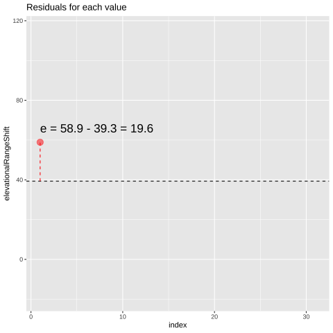

# Linear Models  {#linearmodels}   

```{r, echo = FALSE, warning=FALSE, message=FALSE}
library(tidyverse)
library(DT)
library(knitr)
library(blogdown)
library(beyonce, warn.conflicts=F, quietly=T)
library(stringr)
library(tweetrmd)
library(emo)
library(tufte)
library(cowplot)
library(lubridate)
library(ggthemes)
library(kableExtra)
library(ggforce)
library(datasauRus)
library(ggridges)
library(randomNames)
library(infer)
library(tiktokrmd)
library(ggridges)
library(colorspace)
library(ggfortify)
options(crayon.enabled = FALSE)   
```


```{block2, type='rmdnote'}
This text (roughly) follows Chapter 18 of our textbook.   **The reading below is required,**  @whitlock2020 is  not.    
```


<span style="color: Blue;font-size:22px;">   Motivating scenarios:  </span>  <span style="color: Black;font-size:18px;">   We feel like we have a solid grounding in the ideas behind how we do statistics and now want to actually do them! Here we have a look into linear modeling -- an approach that makes up most of the statistics we encounter in the world. </span>


**Learning goals: By the end of this chapter you should be able to**    


- Describe what a linear model is, and what makes a model linear.  
- Connect the math of a linear model to a visual representation of the model.    
- Use the [`lm()`](https://stat.ethz.ch/R-manual/R-patched/library/stats/html/lm.html) function in R to run a linear model and interpret its output to make predictions.
- Understand what a residual is     
    - Be able to calculate a residual.   
    - Visually identify residuals in a plot.  
- Describe and evaluate the assumptions of a linear model.  
- Recognize the limitations of predictions form a linear model.    


## What is a linear model?          

A statistical model describes the predicted value of a response variable as a function of one or more explanatory variables. The predicted value of the response variable of the $i^{th}$ observation is $\hat{Y_i}$, where the hat denotes that this is a prediction. This prediction, $\hat{Y_i}$ is a function of values of the explanatory variables for observation $i$ (Equation \@ref(eq:pred)). 

\begin{equation} 
\hat{Y_i} = f(\text{explanatory variables}_i)
(\#eq:pred)
\end{equation} 


A linear model predicts the response variable by adding up all components of the model.  So, for example, $\hat{Y_i}$ equals the parameter estimate for the "intercept", $a$ plus its value for the first explanatory variable, $y_{1,i}$ times the effect of this variable, $b_1$, plus its value for the second explanatory variable, $y_{2,i}$ times the effect of this variable, $b_2$ etc all the way through all predictors (Eq. \@ref(eq:predlong)).

\begin{equation} 
\hat{Y_i} = a + b_1  y_{1,i} + b_2 y_{2,i} + \dots{}
(\#eq:predlong)
\end{equation}
 
Linear models can include e.g. squared, and geometric functions too, so long as we get out predictions by adding up all the components of the model. Similarly, explanatory variables can be combined, too so we can include cases in which the effect of explanatory variable two depends on the value of explanatory variable one, by including an interaction in the linear model. 
 


```{block2, type='rmdwarning'}
**Predictions are hard -- especially outside of our data.** Its worth recognizing that the "prediction" we make in a linear model apply only to the range of values in, and conditions of our study. Extrapolating beyond this range or to differing conditions is generally not a great idea.
``` 
 
### Optional: A view from linear algebra {-}

If you have a background in linear algebra, it might help to see a linear model in matrix notation. 

The first matrix in Eq \@ref(eq:predlinearalgebra) is known as the  *design matrix*. Each row corresponds to an individual, and each column in the $i^{th}$ row corresponds to  this individual $i$'s value for the explanatory variable in this row. We take the dot product of this matrix and our estimated parameters to get the predictions for each individual.  Equation \@ref(eq:predlinearalgebra) has $n$ individuals and $k$ explanatory variables. Note that every individual has a value of 1 for the intercept.

 

\begin{equation} 
\begin{pmatrix}
    1 & y_{1,1} & y_{2,1} & \dots  & y_{k,1} \\
    1 & y_{1,2} & y_{2,2} & \dots  & y_{k,2} \\
    \vdots & \vdots & \vdots & \ddots & \vdots \\
    1 & y_{1,n} & y_{2,n} & \dots  & y_{k,n}
\end{pmatrix}
\cdot 
\begin{pmatrix}
    a \\
    b_{1}\\
    b_{2}\\
    \vdots  \\
     b_{k}
\end{pmatrix}
=
\begin{pmatrix}
    \hat{Y_1} \\
    \hat{Y_2}\\
    \vdots  \\
    \hat{Y_n}
\end{pmatrix}
(\#eq:predlinearalgebra)
\end{equation}
 

## The one sample t-test as the simplest linear model  

We're going to see some complex linear models in the coming weeks. For now, let's start with the simplest -- let's view the one sample t-test as a linear model. In this case, 

- All predicted values $\hat{Y_i}$ will be the same for all observations because we are not including any explanatory variables.    
- We are testing the null that the "intercept" $a$ equals its predicted value under the null $\mu_0=0$.  

So, our design matrix is simple -- every individual's prediction is one times the intercept. We tell R that we want to run this linear model with the `lm()` function. Because we have no explanatory variables, we type `lm(<response_var> ~ 1, data= <dataset>)`. We the get a summary of the linear model by piping its output to [`summary().lm`](https://stat.ethz.ch/R-manual/R-devel/library/stats/html/summary.lm.html)


For example, take the the elevations range change data from Chapter \@ref(t):

```{r, message=FALSE, warning=FALSE}
range_shift_file <- "https://whitlockschluter3e.zoology.ubc.ca/Data/chapter11/chap11q01RangeShiftsWithClimateChange.csv"
range_shift      <- read_csv(range_shift_file)
range_shift_lm   <- lm(elevationalRangeShift  ~ 1, data = range_shift)

range_shift_lm %>% summary.lm()
```

Let's focus on the line under coefficients, as that is the most relevant one. Reassuringly, our answers match the output of the [`t.test()`](https://stat.ethz.ch/R-manual/R-devel/library/stats/html/t.test.html) function (Section \@ref(hypt)). Our t-value is still 7.141 , and our p-value is still $6.06 \times 10^{-8}$. That's because all calculations are the exact same -- the t-value is still the distance, in standard errors, between the null and our estimate. 

Again, we can tidy the results of this model with the [`tidy()`](https://generics.r-lib.org/reference/tidy.html) function in the [`broom`](https://broom.tidymodels.org/) package. 

```{r}
library(broom)
tidy(range_shift_lm )
```


So here $\hat{Y_i} = a = 39.329$ -- that is, we predict that a given species range moved 39.329 meters upwards.  

## Residuals describe the difference  between predictions and observed values.  

```{r, echo=FALSE,out.width="50%"}
include_graphics("https://raw.githubusercontent.com/allisonhorst/stats-illustrations/master/other-stats-artwork/dragon_residual.png")
```

Of course, most observations will not exactly equal their predicted value. Rather, an observation $Y_i$  will differ from its predicted value, $\hat{Y_i}$ by some amount, $e_i$, called the residual.  

\begin{equation} 
\begin{split}Y_i &= \hat{Y_i} + e_i\\
 e_i&=Y_i-\hat{Y_i}
\end{split}
(\#eq:resid)
\end{equation} 


```{r residrange, fig.cap = 'Change in elevational range, arbitrarily ordered by species ID. All data are shown in the plot on the left. The plot on the right calculates residuals as the difference between expectation and observation.', echo=FALSE, message=FALSE, fig.show='hold', out.width='50%'}
library(gganimate)

ggplot(range_shift  %>%   mutate(index = 1:n()),
       aes(x = index, y =elevationalRangeShift))+
  geom_point()+
  geom_hline(yintercept = mean(range_shift$elevationalRangeShift), lty=2)+
  labs(title = "Shift in elevantional range")
       
```


```{r, echo=FALSE, eval=FALSE}
p <- ggplot(range_shift %>% 
         mutate(index = 1:n(),
                lab = sprintf("e = %s - %s = %s", elevationalRangeShift, 
                              round(mean(elevationalRangeShift),digits = 1), 
                              round(elevationalRangeShift - mean(elevationalRangeShift), digits = 1 ))),
       aes(x = index, y = elevationalRangeShift, label = lab))+
  geom_point(color = "red", size = 4, alpha = .5)+
    transition_states(index,
                    transition_length = 0,
                    state_length = 10)+
  geom_hline(yintercept = mean(range_shift$elevationalRangeShift), lty=2)+
  geom_segment(mapping = aes(x = index, xend = index, y = mean(range_shift$elevationalRangeShift), 
                             yend = elevationalRangeShift), color = "red", lty = 2)+
  geom_text(position = position_nudge(y = 7), size =6, hjust = 0)+
  labs(title = "Residuals for each value")
  
animate(p, fps=2)
```


The [`augment()`](https://generics.r-lib.org/reference/augment.html) function in the [`broom`](https://broom.tidymodels.org/) package is awesome in that it shows us our values (`elevationalRangeShift`) the prediction (`.fitted`) and residual (`.resid`) for each observation.   


```{r}
library(broom)
range_shift_lm %>%
  augment()    %>%
  dplyr::select(elevationalRangeShift, .fitted, .resid)
```


## More kinds of linear models   

Some common linear models include a two-sample t-test, an ANOVA, a regression, and an ANCOVA. We will go over these in coming weeks, so for now let's just have a quick sneak preview of the two sample t-test and the regression.  

### A two-sample t-test as a linear model   

We often want to know the difference in means between two (unpaired) groups, and test the null hypothesis that these means are identical.   For this linear model,   

- $a$ is the estimate mean for one group,
- $b_1$ is the average difference between individuals in that and the other group.   
- $y_{1,i}$ is an "indicator variable" equaling zero for individuals in group 1 and one for individuals in the other group.   

So, the equation $\hat{Y_i} = a + Y_{1,i} \times b_1$ is   

  \begin{equation}
    \hat{Y_i}=
    \begin{cases}
      a + 0 \times b_1 & = a, &\text{if }\ i \text{ is in group 1}\\
      a + 1 \times b_1 & = a +b_1, &\text{if }\ i\text{is in group 2}
    \end{cases}
  \end{equation}

#### Example: Lizard survival

Could long spikes protect horned lizards from being killed by the loggerhead shrike?  The loggerhead shrike is a small predatory bird that skewers its victims on thorns or barbed wire.  @young2004 compared horns from lizards that had been killed by shrikes to 154 live horned lizards. The data are plotted below.  


```{r, eval=FALSE}
lizards <- read_csv("https://whitlockschluter3e.zoology.ubc.ca/Data/chapter12/chap12e3HornedLizards.csv")  %>% na.omit()
ggplot(lizards, aes(x = Survival, y = squamosalHornLength, color = Survival))  +
  geom_jitter(height = 0, width = .2, size = 3, alpha = .5, show.legend = FALSE)  +
  stat_summary(fun.data = "mean_cl_normal", color = "black")
```


```{r, message=FALSE, echo=FALSE, warning=FALSE, fig.height=2.5, fig.width=3}
lizards <- read_csv("https://whitlockschluter3e.zoology.ubc.ca/Data/chapter12/chap12e3HornedLizards.csv")  %>% na.omit()
lizards <- rep_sample_n(lizards , size= nrow(lizards)) %>% ungroup() %>% dplyr::select(-replicate)
ggplot(lizards, aes(x = Survival, y = squamosalHornLength, color = Survival))  +
  geom_jitter(height = 0, width = .2, size = 1.5, alpha = .5, show.legend = FALSE)  +
  stat_summary(fun.data = "mean_cl_normal", color = "black")
```


##### Lizard summary stats {-} 

The means for each group are

```{r, message=FALSE, warning=FALSE}
lizards %>%
  group_by(Survival) %>%
  summarise(mean_squamosalHornLength = mean(squamosalHornLength))
```


##### Lizard linear model {-} 

We can represent this as a linear model  

```{r}
lizard_lm <- lm(squamosalHornLength ~ Survival, data = lizards)
lizard_lm
```

We can see that the intercept is the mean squamosal Horn Length for killed lizards, and `Survivalliving` is how much longer, on average horn length is in surviving lizards.


**We can look at the output of the linear model, below.** 


```{r}
lizard_lm %>% summary.lm()
```

From this, we estimate $\text{horn length}_i = 22.99 + 2.29 \times \text{living}_i$  where `living` is 0 for killed lizards and 1 for living lizards.


The `t value` and `p-value` for the intercept for  `(Intercept)` describe the difference between estimated horn length and zero. This is a very silly null hypothesis, and we ignore that $t$ and `p-value`, but we do care about this estimate and uncertainty.  


By contrast the `t value` and `p-value` for the `Survivalliving` describe the difference between estimated horn length of surviving and dead lizards. This is an interesting null hypothesis -- we conclude that the difference between the extreme 2.3mm difference in the horn lengths of killed and surviving lizards is unexpected by chance ($t = 4.35$, $df =  182$, $p = 2.27 \times 10^{-5}$). 


###### Lizard residuals {-} 

Again, we can look at this in more detail with the augment function in the broom package. 

```{r}
lizard_lm %>% 
  augment() %>%
  dplyr::select(squamosalHornLength, Survival, .fitted, .resid)
```

This shows the residuals (`.resid`), as the difference between the predicted values, $\hat{Y_i}$ (`.fitted`) and the observed values, $Y_i$ (`squamosalHornLength`). Note that the $\hat{Y_i}$ differs for living and killed lizards.  


### A regression as a linear model

Let's revisit our example in which we looked at the correlation by disease and sperm viability from Chapter \@ref(correlation). Remember, we looked into the hypothesis that there is a trade off between investment in disease resistance and reproduction using data from  @simmons2005, who assayed sperm viability and lysozyme activity (a measure of defense against bacteria) in 39 male crickets. 

In Chapter \@ref(correlation), we looked into a correlation, which showed us how the two variables changed together but did not allow us to make quantitative predictions. Now we will look into interpreting the regression as a linear model. We will consider how to make a regression later, but for now just know that we are modeling y (in this case, lysozyme activity) as a function of x (in this case, sperm viability), by a simple line.


```{r cricket2, fig.cap = 'Lysozyme activity deceases with sperm viability in crickets. Data from @simmons2005.', echo = FALSE, message=FALSE, warning=FALSE, fig.height=2, fig.width=3}
crickets  <- read_csv("https://whitlockschluter3e.zoology.ubc.ca/Data/chapter16/chap16q12CricketImmunitySpermViability.csv") %>%
  filter(spermViability>75)

ggplot(crickets, aes(x = spermViability, y =lysozyme )) + 
  geom_point()+
  geom_smooth(method = 'lm', se = FALSE)
```

As usual, we can generate the linear model with the `lm()` function, here predicting lysozyme activity as a function  of sperm viability.  

```{r}
cricket_lm <- lm(lysozyme  ~ spermViability, data = crickets)
cricket_lm 
```

So from  this model, we predict that an individual's lysozyme activity equals 36.64  minus 0.24 times  his sperm viability.   This prediction corresponds to the line in figure \@ref(fig:cricket2) and is mathematically:  

$$\text{lysozyme activity}_i = 36.64 -0.24 \times \text{sperm viability}_i+e_i$$
Again, we can use the augment function in the broom package to  look at actual values ($Y_i$), predicted values ($\hat{Y_i}$) and residuals $e_i$. In this case, there are a bunch of different predictions because there are a bunch of different sperm viability scores.  

```{r}
augment(cricket_lm) %>%
  dplyr::select(lysozyme, spermViability, .fitted, .resid)
```

We can look at this significance of our predictions with `summary.lm()`


```{r}
cricket_lm %>% summary.lm()
```

As above, the p-value for  the intercept is silly -- of course crickets have non-zero sperm viability. The more interesting result is that the 0.24 decrease in lysozyme activity with every percent increase in sperm viability is significant at the $\alpha = 0.05$ level ($t = -2.139$, $df = 38$, $p = 0.0389$), so we reject the null hypothesis, and conclude that lysozyme activity decreases with increasing sperm viability.   


## Assumptions of a linear model  {#linmodasum}


A linear model assumes    

- **Linearity:** That is to say that our observations are appropriately modeled by adding up all predictions in our equation. We can evaluate this by seeing that residuals are independent of predictors.       
- **Homoscedasticity:** The variance of residuals is independent of the predicted value, $\hat{Y_i}$  is the same for any value of X.    
- **Independence:** Observations are independent of each other (aside from the predictors in the model).  
- **Normality:**  That residual values are normally distributed.     
- **Data are collected without bias**   as usual.   

These vary in how hard they are to diagnose. But the [`autoplot()`](https://cran.r-project.org/web/packages/ggfortify/vignettes/plot_lm.html) function in the [`ggfortify`](https://github.com/sinhrks/ggfortify) package helps us evaluate assumptions of    

- Making sure the residuals are independent of predictors (a diagnosis for linearity).  A Residuals vs Fitted plot with a slope near zero is consistent with this assumption.    
- Making sure that the mean and variance in residuals are independent of predictors.  A Scale-location plot with a slope near zero is consistent with this assumption.    
- Normality of residuals. A qq plot with a slope near one is consistent with this assumption.  

```{r, out.width="30%", echo=FALSE}
include_graphics("https://raw.githubusercontent.com/allisonhorst/stats-illustrations/master/other-stats-artwork/dragon_residual_distribution.png")
```

Have a look at the diagnostic plots from our models to see if they look ok!   

```{r, message=FALSE, warning=FALSE}
library(ggfortify)
autoplot(lizard_lm)
```


```{r, message=FALSE, warning=FALSE}
autoplot(cricket_lm)
```

## Predictions from linear models  

Linear models can be used to predict new results. However, predictions only apply to the range of values investigated in the initial regression and to cases with similar conditions.     

## Quiz

```{r echo=FALSE}
include_app("https://brandvain.shinyapps.io/linear_models/")
```


```{r, echo=FALSE}
rm(list = ls())
```
