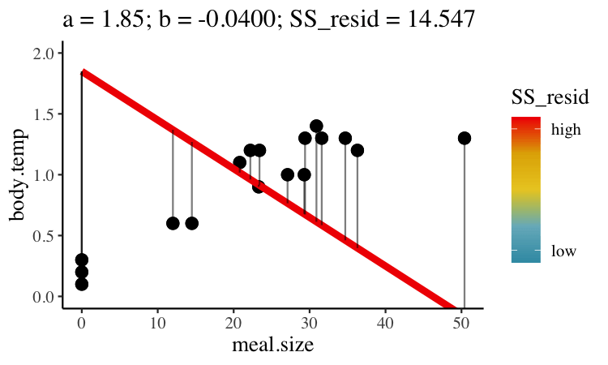

# Predicting one continuous variable from another {#linreg}   

```{r, echo = FALSE, warning=FALSE, message=FALSE}
library(tidyverse)
library(DT)
library(knitr)
library(blogdown)
library(beyonce, warn.conflicts=F, quietly=T)
library(stringr)
library(tweetrmd)
library(emo)
library(tufte)
library(cowplot)
library(lubridate)
library(ggthemes)
library(kableExtra)
library(ggforce)
library(datasauRus)
library(ggridges)
library(randomNames)
library(infer)
library(tiktokrmd)
library(ggridges)
library(colorspace)
library(ggfortify)
library(broom)
options(crayon.enabled = FALSE)   
```


```{block2, type='rmdnote'}
This text (roughly) follows Chapter 17 of our textbook.   **The reading below is required,**  @whitlock2020 is  not.    
```


<span style="color: Blue;font-size:22px;">   Motivating scenarios:  </span>  <span style="color: Black;font-size:18px;">   We are interested in predicting one continuous variable based on  the value of another, and to estimate the uncertainty and significance of this prediction. </span>

**Learning goals: By the end of this chapter you should be able to**    

- Use a  regression equation to predict the value of a continuous response variable from a continuous explanatory variable.    
- Explain the criteria for finding the line of "best" fit.      
- Use equations to find the line of "best" fit.      
- Use equations to find the line of "best" fit.      
- Calculate *t* values for the slope, estimate uncertainty in them, and test the null hypothesis that this differs from zero.  
- Make a linear regression and analyze it with the `lm()`, `summary.lm()`, and `anova()` functions in R.   
- Calculate sums of squares for a linear regression to calculate F and test the null hypothesis.  
- Recognize the assumptions and limitations of linear regression.


## Setup and review  

### The dataset

How do snakes heat up when they eat? To find out, @tattersall2004 noted the temperature of snakes as a function of their prey size (Fig.  \@ref(fig:snakeregression)).

The prey size of the $X$ axis of Figure  \@ref(fig:snakeregression)C is in units of percent of a snake's body weight, and the temperature on the Y axis of  Figure  \@ref(fig:snakeregression)C, is the degrees Celcius increase in a snake's body temperature two days after eating.  


```{r, snakeregression, fig.cap= "Infrared thermal image of a rattlesnake (**A**) before feeding and (**B**) two days after eating 32% of its body mass, **C** shows the association between meal size and  change in temperature. images **A**, and **B**, and data from [[@tattersall2004]](https://jeb.biologists.org/content/207/4/579). data [here](https://whitlockschluter3e.zoology.ubc.ca/Data/chapter17/chap17q11RattlesnakeDigestion.csv).", fig.show='hold', out.width="50%",fig.height=3, echo=FALSE, message=FALSE, warning=FALSE}
include_graphics("https://jeb.biologists.org/content/jexbio/207/4/579/F2.large.jpg?width=800&height=600&carousel=1",) 
snake_data <-  read_csv("https://whitlockschluter3e.zoology.ubc.ca/Data/chapter17/chap17q11RattlesnakeDigestion.csv")%>% rename(meal_size = mealSize, body_temp = tempChange)
a<- ggplot(snake_data, aes(x = meal_size, y = body_temp)) + 
  geom_point(alpha = .5, size =2)+
  labs(y = "\n\n temp change")+
    theme(axis.title = element_text(size = 18), axis.text = element_text(size = 15))
plot_grid(a, labels = "C", label_size = 17, label_y = .93, label_fontface = "plain")
```


### Review
 
In Chapter  \@ref(correlation) we summarized the association between two continuous variables as  the covariance and the correlation.  


- The **covariance** quantifies the shared deviation of *X* and *Y* from the mean as follows: $Cov_{X,Y} =\frac{\sum{\Big((X_i-\overline{X}) (Y_i-\overline{Y})\Big)}}{n-1}$, where the numerator, $\sum{\Big((X_i-\overline{X}) (Y_i-\overline{Y})\Big)}$ is called the "Sum of Cross Products".

- The **correlation**,  standardizes the covariance by dividing through by the product of the standard deviations in *X* and *Y*, $s_X$ and $s_Y$, respectively, and is noted by $r$. So the correlation between *X* and *Y* is equal to   $r_{X,Y} = \frac{Cov_{X,Y}}{s_X s_Y}$.  

For our snake data, we calculate these with math or by using the `cor` and `cov` functions in R:

```{r}
snake_data  %>% 
  summarise(n         = n(),
            sum_xprod = sum((meal_size - mean(meal_size)) *(body_temp - mean(body_temp))),
            cov_math  = sum_xprod / (n - 1), 
            cov_r     = cov(meal_size, body_temp),
            cor_math  = cov_math / (sd(meal_size) * sd(body_temp)),  
            cor_r     = cor(meal_size, body_temp))                                                             %>%  kable(digits = 4)#DT::datatable()%>%formatRound(columns=c('cov_math', 'cov_r','cor_math', 'cor_r'), digits=c(4,4))
```


## The regression as a linear model   

In Chapter \@ref(linearmodels), we saw that we predict the value of a response variable for the $i^{th}$ individual in our sample, $\hat{Y_i}$  as a function of its values of explanatory variables as follows  $\hat{Y_i} = a + b_1  y_{1,i} + b_2 y_{2,i} + \dots{}$, and the individual's actual value, $Y_i$ is   $Y_i = \hat{Y_i} + e_i$, where $a$ is the "intercept", and $e_i$ is the "residual" -- the difference between observed, $Y_i$, and predicted, $\hat{Y_i}$, values.  

So for a simple linear regression with one explanatory and one response varaible,


```{r, fig.height=2.5, fig.width=3.3, echo=FALSE, out.extra='style="float:right;padding-left: 20px"'}
dat_text <- data.frame(
#  label = c("beta > 0", "beta == 0", "beta < 0 ","alpha[2]","alpha[1]", "alpha[1] > alpha[2]"),
  label = c("b > 0", "b == 0", "b < 0 ","a[2]","a[1]", "a[1] > a[2]"),
  Model = c("Positive Slope", "Slope = 0", "Negative Slope","Different Intercepts","Different Intercepts","Different Intercepts"),
  x     = c(.1, .1, .1,.1,.1,.8),
  y     = c(.45, .75, .5,.25,.75,-.05),
  z     = c("a","a","a","b","c","a")
)


tibble(
  Model = c("Positive Slope","Positive Slope","Slope = 0","Slope = 0","Negative Slope","Negative Slope","Different Intercepts","Different Intercepts","Different Intercepts","Different Intercepts"),
  z     = rep(c("a","b","c"), times= c(6,2,2) ),
  x     = rep(c(0,1),5),
  y     = c(0,1,.5,.5,1,0,0,.5,.5,1)
)  %>%
  mutate(Model = factor(Model, levels = c("Positive Slope","Slope = 0","Negative Slope","Different Intercepts")))%>%
  ggplot(aes(x = x, y = y, group = z, color = z)) +
  geom_line(show.legend = FALSE) +
  facet_wrap(~Model,ncol =2) +
  xlim(c(-.1,1.1))+
  ylim(c(-.3,1.3))+
  theme_stata(scheme = "s1mono"  ) +
  theme(axis.text.x = element_blank(), axis.ticks.x = element_blank(), axis.title.x = element_blank(),
        axis.text.y = element_blank(), axis.ticks.y = element_blank(), axis.title.y = element_blank())+
  geom_text(
    data    = dat_text,
    mapping = aes(x = x, y = y, label = label),
    show.legend = FALSE,
    size = 5,
    parse = TRUE
  )+
  scale_color_manual(values = c("black","orange","blue"))
```


\begin{equation} 
\begin{split}
Y_i &=  a + b  x_{i}  
 \end{split}
(\#eq:linreg)
\end{equation}
 
 
 
 Where  
 
- $a$ is the intercept,   
- $b$ is the slope, and     
- $X_i$ is the $i^{th}$ individual's observed value for the explanatory variable, $X$   

```{r, echo=FALSE, out.width="50%"}
include_graphics("https://raw.githubusercontent.com/allisonhorst/stats-illustrations/master/other-stats-artwork/dragons_continuous.png")
```


### Finding the "line of best fit"   

We could draw lots of lines through the points in \@ref(fig:snakeregression)C, leading to a bunch of different values in Equation \@ref(eq:linreg).   How do we pick the best?  


Statisticians have decided that the best line is the one that minimizes the sums of squared residuals. <span style="color: LightGrey;">In the parlance  of machine learning, the sums of squares residual is the "objective function", where our objective is to minimize it.</span> We visualize this concept in Figure  \@ref(fig:minimizessres), which shows that the best line has an intercept, $a$ near 0.32 and a slope, $b$ of about 0.0274.  

```{r minimizessres, fig.cap= "Minimizing the sums of squares residual. We could loop over a bunch of potential slopes and intercepts, and find the one that minimizes the sum of the squared lengths of the black lines connecting predictions (dots) to observations (lines). Color shows the residual sums of squares from high (red), to low (blue).", echo=FALSE, out.width="40%", out.extra='style="float:right;padding-left: 30px"'}

```


## Estimation for a linear regression  

We could just jam through all combinations of slope, $b$, and intercept, $a$, calculate the sums of squares of the residuals of each point given our choices of $a$ and $b$, such that $ss_{resid}|a,b = \sum(e_i^2|{a,b}) = \sum(Y_i - \widehat{Y_i})^2$, and find the combinations of slope and intercept that minimize this equation. 

BUT mathematicians have found equations that find values for the slope and intercept that minimize the residual sums of squares, so we don't need to do all that. 

### Estimating the slope of the best fit line   

Recall that the covariance and correlation describe how reliably the response variable, *Y*, changes with the explanatory variable, *X*, but do not describe how much *Y* changes with** *X*.  Our goal is to find $b$ the slope which minimizes the sums of squares residual.  

**The regression coefficient (aka the slope, b), describes how much** ***Y*** **changes with each change in** ***X***. The true population parameter for the slope, $\beta$ equals the population covariance standardized by the variance in $X$, $\sigma^2_x$. We estimate this parameter with the sample correlation, $b$, in which we divide the sample covariance by the sample variance in X, $s^2_X$.  


\begin{equation} 
\begin{split}
b  = \frac{Cov(X,Y)}{s^2_X}\\
\end{split}
(\#eq:slope)
\end{equation}


**There are two points to remember**    

- You will get a different slope depending on which variable is $X$ & which is $Y$. <span style="color: LightGrey;">Unlike the covariance and correlation, for which $X$ and $Y$ are interchangeable.</span>    
- It's possible to have a large correlation and a small slope and vice-versa.    

```{r diffcorsloe, fig.cap= "A smaller correlation can have a larger slope and vie versa.", fig.height=3.2, echo=FALSE}
par(mar=c(3,2,3,2))
layout(matrix(c(rep(1:3,5),rep(4,3)), 6, 3, byrow = TRUE))

d1 <- data.frame(x = c(0.019,1.657,2.152,2.324,2.533,3.01,3.276,3.486,3.848,4.4,4.629,5.829,6.438,6.552,6.857,6.971,7.067,7.314), y = c(2.919,4.288,4.721,4.865,5.009,5.441,5.622,5.838,6.09,6.559,6.739,7.676,8.144,8.252,8.468,8.613,8.685,8.865))

plot(d1,pch=16, ylim = c(0,25), main = "(A):  r = 1;  b = 0.8")
abline(lm(d1$y~d1$x))

d2 <- data.frame(x = c(1.184154, 4.364050, 1.197098, 7.614647, 4.161705, 6.175450, 3.876818, 3.127992, 7.190663, 9.506916, 1.848544, 4.870602, 1.513890, 7.902941, 3.195879, 7.383404, 5.696359, 7.141873, 4.918782, 7.104874), y = c(3.3551616,  7.3820967, -0.2758058,  9.0630752,  8.6660538,  9.6124078,  7.8710876,  7.0541982,  7.9630398, 11.3676459,  5.4457956, 11.5087486,  2.7787598,  3.8456582,  2.3419682, 10.2345529,  9.9666299,  3.6578441,  9.3784562,  9.2501707))
plot(d2,pch=16, ylim = c(0,25), main = "(B):  r = 0.6;   b = 0.8")
abline(lm(d2$y~d2$x))

d3 <- data.frame (x=c(3.824333, 5.906714, 6.369252, 9.477934, 8.755837, 6.067987, 6.935961, 3.640488, 2.351787, 4.306424, 3.040166, 7.817630, 6.459495, 4.447377, 7.001698, 8.910529, 5.704132, 6.560676, 4.195273, 6.079712), y = c(0.4472916, 14.0181240, 16.6731528, 22.6260629, 18.6937442, 16.4329532, 22.6742846,  4.1466409,  3.9623698, 10.1485651, 20.9956516, 12.0942725, 12.4326807, 16.8822718, 19.2059141, 22.4305833, 13.0308434, 22.2777123, 16.4509748, 11.9365088))
plot(d3, pch=16, ylim = c(0,25), main = "(C):  r = 0.6;  b = 2")
abline(lm(d3$y~d3$x))

par(mar = c(0,0,0,0))
plot(0,axes=FALSE, type="n", xlim = c(0,3), ylim = c(0,1))
text(c(1,2.1),c(.5,.5), c("(A) and (B) \n Different correlation \n same slope","(B) and (C) \n Same correlation \n different slope"), cex=1.4, col="firebrick")
```

### Estimating the intercept of the best fit line     


The true population intercept -- the value the response variable would take if we follwoed the slope line all the way to zero -- is $\alpha$. We estimate the intercept as $a$ from our sample  as follows


\begin{equation} 
\begin{split}
a  = \overline{Y} - b \times \overline{X} \\
\end{split}
(\#eq:intercept)
\end{equation}


So we can estimate the slope and intercept in R by implementing equations \@ref(eq:slope), and \@ref(eq:intercept)  as follows 

```{r}
snake_data  %>% 
  summarise(slope     = cov(meal_size, body_temp ) / var(meal_size),
            intercept = mean(body_temp) - slope * mean(meal_size))                                                  %>% kable(digits = 4)
```

This means that in this study, a snakes temperature increases, on average, by 0.0274 degrees Celsius for every increase in meal size  (measured as percent of a snake's mass) in addition to the increase in temperature of 0.32 degrees Celsius, on average, that all snakes experienced, regardless of their meal size.  

### Fitting a linear regression with the `lm()` function.   


Like the other linear models we've seen (e.g. t and ANOVA) we can fit a linear regression with the [`lm()`](https://stat.ethz.ch/R-manual/R-patched/library/stats/html/lm.html) function like this `lm(<response> ~ <explanatory>, data = <data>)`. Doing this for our `snake_data` shows that we did not mess up our math. 

```{r}
snake_lm <- lm( body_temp ~ meal_size, data = snake_data)
coef(snake_lm)
```

## Hypothesis testing and uncertainty for the slope

So we can estimate a slope, but how do we describe our uncertainty in it and test the null hypothesis that it equals zero? 

Well, we find a t-value as the slope minus its null value (usually zero) and divide this by its standard error and then do our standard stuff!   


### The standard error of the slope  

We know that we are estimate the true population slope, $\beta$ from our sample as $b$. How do we think about uncertainty in this estimate? Like usual we quantify this as the standard error, as follows, by imagining we  

1. Take a sample of size n from the true population with a slope equal to $\beta$, 
2. Estimate $\beta$ from our sample as $b$, 
3. Repeated 1 and 2 many times  
4. Calculate the standard deviation of this sampling distribution, as the standard error of our estimate

As usual, we can estimate the bootstrap standard error by resampling from our data many times with replacement, which assumes our sample is large enough to represent the population  

```{r, message=FALSE}
rep_sample_n(snake_data, size = nrow(snake_data), replace = TRUE, reps = 10000) %>%
  summarise(b_boot            = cov(meal_size, body_temp) / var(meal_size) )    %>%
  summarise(boot_se           = sd(b_boot))                                                                        %>% kable(digits = 4)
```

Alternatively we can estimate the standard error mathematically, <span style="color: LightGrey;">which may be preferable for this modest sample size,</span> following  equation \@ref(eq:seb):


\begin{equation} 
\begin{split}
SE_b  &= \sqrt{\frac{MS_{resid}}{\sum(X_i-\overline{X})^2}}  =  \sqrt{\frac{e_i^2 / df_{b}}{\sum(X_i-\overline{X})^2}}    =  \sqrt{\frac{\sum(Y_i-\widehat{Y_i})^2 /  (n-2) }{\sum(X_i-\overline{X})^2}}   \\ 
\end{split}
(\#eq:seb)
\end{equation}

Where $df_b$ is the degrees of freedom for the slope, which equals the sample size minus two (one for the slope, and one for the intercept). 

Equation  \@ref(eq:seb) might look, at first blush, a bit different than most equations for the standard error we've seen before, but it actually is pretty familiar. The numerator i the difference between an observations and its mean value <span style="color: LightGrey;">(conditional, on X, which is a good way to think of $\widehat{Y_i}$)</span> divided by the degrees of freedom, which is basically the sample variance in the residuals. We estimate the standard error of the slope by taking the square root of this variance, after dividing through by the sum of square in our predictor X.  

### Confidence intervals and null hypothesis significance testing 


The **P-value** is the probability that a sample from the null distribution is as or more extreme than what we see. We find this by using `pt(q = abs(<our_t>), df = <our_df>, lower.tail = FALSE)`  to find this area on one side of the null sampling distribution, and multiplying this by two to capture both sides.   


We find the $100 \times (1-\alpha)\%$ **confidence interval** as  $b\pm se_b \times t_{crit, \alpha/2,df}$. Remember that $t_{crit, \alpha/2,df}$ is the value of t for which differentiates the upper  $\alpha/2$ of the null sampling distribution frmo the rest. We find $t_{crit}$ by using `pt(q = abs(<our_t>), df = <our_df>, lower.tail = FALSE)`.  

### Putting this all together 

We can calculate the standard error by implementing  Equation \@ref(eq:seb) in R, and then calculating the $t$ value, confidence intervals and uncertainty. I can think of a bunch of ways to implement  Equation \@ref(eq:seb) -- let's start pretty explicitly to help solidify these steps

```{r}
snake_data %>%
  mutate(predicted_temp  =  coef(snake_lm)["(Intercept)"]+            # find intercept
                             coef(snake_lm)["meal_size"] * meal_size, # add slope times meal size
         resid_tmp_sqrd  = (body_temp - predicted_temp)^2) %>%        # find squared differnce between predictions and observations.  
  summarise(b            = cov(meal_size, body_temp) / var(meal_size),# find slopw 
            #
            df           = n() - 2,                                    # find degrees of freedom
            MS_resid     = sum(resid_tmp_sqrd) / df,
            #
            se           = sqrt(MS_resid / sum((meal_size -mean(meal_size))^2) ),
            t_crit       = qt(0.05/2,df = df, lower.tail = FALSE),
            lwr_95   = b - t_crit  * se,
            upr_95   = b + t_crit  * se,
            #
            t_value      = b / se,
            p_value      = 2 * pt(q = abs(t_value), df = df, lower.tail = FALSE))                                            %>% mutate(p_value  = paste(round(p_value* 10^7,digits = 1),"x10^-7",sep= "")) %>% kable( digits=4)# DT::datatable()%>% formatRound(columns=c('b', 'MS_resid','se','t_crit','t_crit','lwr_95', 'upr_95','t_value' ), digits=4)
```

More simply, we could use the `augment()` function in the broom package, to calculate our residuals making this all easier

```{r}
augment(snake_lm) %>%
  summarise(MS_resid  = sum(.resid^2) / (n()-2),
            se        = sqrt(MS_resid / sum((meal_size  -mean(meal_size))^2) ))                                            %>% kable(digits = 4)
```

Or we could skip the calculations all together

```{r}
summary.lm(snake_lm)
```

> No matter how we do this, we estimate an increase 0f 0.0274  (se = 0.00345, 95% confidence interval from 0.0200 to 0.0347) degrees Celsius with each percent increase in size of meal (measured in percentage of snake's biomass), on top of the 0.320 increase in temperature experience over the experiment regardless of meal size. This strong of a relationship is an exceptionally  unlikely outcome of the null model (t = 7.944, p < $10^{-6}$, df = 15), so we reject the null model and conclude that snake body temperature increases with meal size. 

## Uncertainty in predictions

We think of the line of a regression as "Predicting" the value of the response variable, given the value of the explanatory variable, $\widehat{Y_i}$.   What does this mean? Well it's our estimate of the prediction for the population mean value of Y, given it had this value of X Figure \@ref(fig:predictionregression))A. 

We can acknowledge the uncertainty in this prediction by including a standard error on our regression line as in  Figure \@ref(fig:predictionregression))B.  

But this is a prediction for the expected mean $\widehat{Y_i}$, we might want bands to predict the range of 95% of observations. This is called the prediction interval and is presented in maroon in figure  \@ref(fig:predictionregression))C.   

```{r predictionregression, fig.cap = "Predictions from a linear regression (lines). **B** Shows our uncertainty in the predicted value, $\\widehat{Y_i}$, as the 95% confidence interval. **C** Shows the expected variability in observations, as capture by the 95%  prediction interval", fig.height=2.3, fig.width=7.6, message=FALSE}
a <- ggplot(snake_data, aes(x = meal_size, y = body_temp))    + 
  geom_point() +    
  geom_smooth(method = "lm", se = FALSE)+ 
  labs(title = "regression")

b <- ggplot(snake_data, aes(x = meal_size, y = body_temp))    + 
  geom_point() +    
  geom_smooth(method="lm")+ 
  labs(title = "95% confidence interval")

c <- bind_cols(snake_lm %>% augment(),
          snake_lm %>% predict(interval = "predict") %>% data.frame()) %>% # ger prediction intervals
  ggplot(aes(x = meal_size, y = body_temp))    + 
  geom_ribbon(aes(ymin = lwr, ymax = upr), fill = "maroon", alpha = .7) +    
  geom_point() +    
  geom_smooth(method=lm, se = FALSE, col = "yellow") + 
  labs(title = "95% prediction interval")

plot_grid(a,b,c, labels = c("a","b","c"), ncol = 3)
```

**No need to know the equations underlying these -- just know (1) they exist, (2) they are different (3) The prediction interval is always wider than the confidence interval (4) the different goals of each**   

## A linear regression as an ANOVA  


```{r varpartregresion, fig.cap = "An ANOVA framework for a linear regression. **A** Shows the difference between each observation, $Y_i$, and the  mean, $\\overline{Y}$. This is the basis for calculating $MS_{total}$.  **B** Shows the difference between each predicted value $\\widehat{Y_i}$ and the mean, $\\overline{Y}$. This is the basis for calculating $MS_{model}$. **C** Shows the difference between each observation, $Y_i$, and its predicted value  $\\widehat{Y_i}$. This is the basis for calculating $MS_{error}$.", fig.height=2.3, fig.width=7.6, echo=FALSE}
a <- ggplot(mutate(snake_data, mean_temp = mean(body_temp)) , 
            aes(x = meal_size, y = body_temp))+
  geom_point(alpha = .5)+
  geom_hline(aes(yintercept = mean_temp))+
  geom_segment(aes( xend = meal_size, yend = mean_temp ), 
               color = "black", alpha = .5)+
  labs(title = "Total deviation               = ")

b<-ggplot(mutate(augment(snake_lm), mean_temp = mean(body_temp)) ,
          aes(x = meal_size, y = body_temp))+
  geom_point(alpha = .2)+
  geom_hline(aes(yintercept = mean_temp))+
  geom_segment(aes( xend = meal_size,y = .fitted,  yend = mean_temp ), 
               color = "black", alpha = .5)+
  geom_line(aes(y = .fitted), alpha  = 2, color = "blue")+ 
  labs(title = "Model deviation             +")

c<-ggplot(augment(snake_lm) ,
          aes(x = meal_size, y = body_temp))+
  geom_point(alpha = .5)+
  geom_segment(aes( xend = meal_size,  yend = .fitted), 
               color = "black", alpha = .5)+
    geom_line(aes(y = .fitted), alpha  = 2, color = "blue")+ 
  labs(title = "Error (residual) deviation")

plot_grid(plot_grid(a + theme(legend.position = "none"),
          b + theme(legend.position = "none"),
          c + theme(legend.position = "none"), ncol = 3, labels = c("a","b","c"), label_y = .9),
           get_legend(a+theme(legend.position = "bottom")), 
                      ncol = 1, rel_heights = c(1,.1))
```

We can envision a linear regression as an ANOVA (Figure \@ref(fig:varpartregresion)), in which we partition variance much like we did in Chapter \@ref(anova) (Compare Figures \@ref(fig:varpart) and \@ref(fig:varpartregresion)). 

All concepts are the same ($SS_{total}$ describes the distance between observations and the mean,  $SS_{model}$ describes the distance between predictions and the mean, and $SS_{error}$ describes the distance between observations and predictions), but the mathematical notation is a bit different. Here,   

- $SS_{total}=\sum(Y_i - \overline{Y})^2$    
- $SS_{model}=\sum(\widehat{Y_i} - \overline{Y})^2$   
- $SS_{error}=\sum(Y_i - \widehat{Y_i})^2$ 
- $MS_{model}= SS_{model} / df_{model}$    
- $MS_{error}= SS_{error} / df_{error}$  
- $df_{model}= 1$    
- $df_{error}= n - 2$  
- $F  = \frac{MS_{model}}{MS_{error}}$   


```{r}
augment(snake_lm) %>%
  summarise(ss_total = sum((body_temp - mean(body_temp))^2) ,
            ss_model = sum((.fitted   - mean(body_temp))^2),
            ss_error = sum((body_temp - .fitted)^2),
            r2       = ss_model / ss_total,
            #
            df_model = 1,
            df_error = n()-2,
            #
            ms_model = ss_model / df_model,
            ms_error = ss_error / df_error,
            F_val    = ms_model/   ms_error,
            p_value  = pf(F_val, df1 = df_model, df2 = df_error, lower.tail = FALSE))            %>% dplyr::select(-  df_model, -df_error)                                                        %>% mutate(p_value  = paste(round(p_value* 10^7,digits = 1),"x10^-7",sep= "")) %>% kable( digits=4)
```

Or with the [`anova`](https://stat.ethz.ch/R-manual/R-devel/library/stats/html/anova.lm.html) function

```{R}
anova(snake_lm)
```


### The squared correlation and the proportion variance explained   

In Chapter \@ref(anova), we called $r^2 = ss_{model} / ss_{total}$ "the proportion variance explained." In this example we found $r^2 =2.3118 / 2.8612 = 0.808$.  

In Chapter \@ref(correlation) we defined the correlation, $r$ as $\frac{Cov_{X,Y}}{s_X s_Y}$, which equals  `r cor(snake_data$meal_size, snake_data$body_temp) %>% round(digits =4)`, and note that $0.8989^2 =0.808$. 

So we can calculate the proportion variance explained a either $r^2 = ss_{model} / ss_{total}$ or  $r^2  = \big(\frac{Cov_{X,Y}}{s_X s_Y}\big)^2$, they are equivalent!!  


## Caveats and considerations for linear regression   

Linear regression is a super useful tool. So it's important to recognize its limitations before gettting carried away!!!

### Effect of measurement error on estimated slopes

We rarely measure all values of X and Y perfectly. In Chapter \@ref(correlation), we saw that measurement error in X and/or Y brought our estimated correlation closer to zero. 

How does measurement error impacts the estimate o the slope?  


- Measurement error in $X$ increases BOTH the variance of residuals and biases the slope closer to zero and away from its true value.  

- By contrast, measurement error in $Y$  does not reliably increase or decrease our estimate of the slope -- but it will tend to increase the standard error,  the variance of residuals and the p-value.   

#### Attenuation demonstration for slopes   

Don't take my word for the reality of attenuation - let's simulate it!    Let's take our snake data set with an actual slope of, `rround(coef(snake_lm)[2], digits = 4)`, and pretend this is a real population.   

Now, let's use the [`jitter()`](https://stat.ethz.ch/R-manual/R-devel/library/base/html/jitter.html) function to add     

1. Random noise in $X$, `meal_size`.   
2. Random noise in $Y$, `body_temp`    
3. Random noise in both variables,     

And compare our estimated slop in these noisier estimates to our initial estimate of the correlation.   To do so, let's first copy our initial data set a bunch on times with the [`rep_sample_n()`](https://infer.netlify.app/reference/rep_sample_n.html) function in the [`infer`](https://infer.netlify.app/) package.  In both cases let's add a standard deviation's random noise   

```{r, fig.height=2,fig.width=7.2, message=FALSE, warning=FALSE}
n_reps <- 10000

many_snakes <-  snake_data %>%
  rep_sample_n(size = nrow(snake_data), replace = FALSE, reps = n_reps)

noisy_x <- many_snakes                                              %>%
  mutate(meal_size    = jitter(meal_size, amount = sd(meal_size) )) %>%
  summarise(est_slope = cov(meal_size, body_temp) / var(meal_size)) %>%
  mutate(noisy = "x")

noisy_y <- many_snakes                                              %>%
  mutate(body_temp = jitter(body_temp, amount = sd(body_temp) ))    %>%
  summarise(est_slope = cov(meal_size, body_temp) / var(meal_size)) %>%
  mutate(noisy = "y")

noisy_xy <- many_snakes                                              %>%
  mutate(body_temp = jitter(body_temp, amount = sd(body_temp) ),
         meal_size = jitter(meal_size, amount = sd(meal_size) ),)    %>%
  summarise(est_slope = cov(meal_size, body_temp) / var(meal_size))  %>%
  mutate(noisy = "xy")

### Make a plot 
bind_rows(noisy_x, noisy_y, noisy_xy)                       %>%
  mutate(noisy = fct_reorder(noisy, est_slope))             %>%
  ggplot(aes(x = est_slope , fill = noisy))                  +
  facet_wrap(~noisy, labeller = "label_both", ncol = 3)      +
  geom_density(show.legend = FALSE)                          +
  geom_vline(xintercept = summarise(snake_data,  cov(meal_size, body_temp) / var(meal_size))%>% pull() ) +
  geom_vline(data = . %>% group_by(noisy) %>% summarise(est_slope = mean(est_slope)), 
             aes(xintercept = est_slope), color = "white")+
  annotate(x =  summarise(snake_data,  cov(meal_size, body_temp) / var(meal_size) )%>% pull() ,
           y = 200, label = "slope in data", geom = "text", hjust = -0.1, size=2.5)+
  geom_label(data = . %>% group_by(noisy) %>% summarise(est_slope = mean(est_slope)),
            aes(y=200),label = "Avg. noisy slope",  hjust = 1, size=2.5, color = "white", show.legend = FALSE)+
  scale_y_continuous(limits = c(0,250))

```


### Be warry of extrapolation 

> Det er vanskeligt at spaa, især naar det gælder Fremtiden.  
> It is difficult to predict, especially when it comes to the future.

This quote is a great encapsulation of the major challenges in regression. <span style="color: LightGrey;">The power of this quote is clear as it has been incorrectly attributed to some of our most famous folk philosophers (e.g. Niels Bohr, Yogi Berra, Mark Twain and Nostradamus). An example of the phenomenon that "famous things that are said../ no matter who they're said by, they tend to gravitate to being attributed to even more famous people." ([Grant Barrett](https://grantbarrett.com/about/) on  [The Origins of Oranges and Door Hinges](https://underunderstood.com/podcast/episode/orange-door-hinge-rhyme/) episode of [Under Understood](https://underunderstood.com/podcast/)).</span> 


> It is difficult to predict from a linear regression, especially when it comes to data outside the range of the model.  
>
> `r tufte::quote_footer('--- Me')`

 <span style="color: LightGrey;">In addition to the standard caveats about uncertainty, bias, nonindependence and model assumptions etc...</span> Predictions from a linear model are only good for similar conditions across the range of values of the explanatory variable used to generate the model.  


#### Be warry of extrapolation: Example 


*Species X Area relationship:* How does the number of fish species change with pool area?  Data for small pools from  @kodricbrown1993 are presented in Figure \@ref(fig:dontextrap)A. From this we fit the following linear model $\text{# species} = 1.79 + 3.55 \times 10^{-4} m^2$.  By extrapolation, we predict $\approx  20$ fish species in a $50000$ $m^2$ pool (Figure \@ref(fig:dontextrap)B). We see from additional data that this is a terrible prediction (Figure \@ref(fig:dontextrap)C).    


```{r dontextrap, fig.cap= "Be warry of extrapolation. A regression fits the data from small pools quite well (A). Extrapolation to larger pools (B), poorly predicts diversity in large ponds (C). Data from @kodricbrown1993 are available [here](http://whitlockschluter.zoology.ubc.ca/wp-content/data/chapter17/chap17f5_3DesertPoolFish.csv)", fig.height=2,fig.width=7.2, echo=FALSE, warning=FALSE, message=FALSE,echo = FALSE}
pool    <- read.csv("data/DesertPoolFish1.csv")
a<- ggplot(pool, aes(x=poolArea, y = nFishSpecies)) +
  geom_jitter(color = "red", size= 2, height = .2, width = 0,alpha = .3)+
  geom_smooth(method = "lm", se = FALSE)+
  xlab(expression(paste("pool area ",(m^2) )))+ 
  ylab("# fish species")  +
  ggtitle("Limitted data")

b <- ggplot(pool, aes(x=poolArea, y = nFishSpecies)) +
  geom_jitter(color = "red", size= 2, height = .2, width = 0,alpha = .3)+
  geom_abline(slope = 0.000355, intercept = 1.79, color = "blue", lwd=1.2)+
  xlim(c(0,100000))+
  ylim(c(0,50))+
  geom_hline(yintercept = 20, color = "lightgrey", lty = 2)+
  geom_vline(xintercept = 50000, color = "lightgrey", lty = 2)+
  xlab(expression(paste("pool area ",(m^2) )))+ 
  ylab("# fish species")  +
  ggtitle("Extrapolation")

pool2 <- read.csv("data/DesertPoolFish2.csv")
c <- ggplot(pool2, aes(x=poolArea, y = nFishSpecies)) +
  geom_jitter(color = "red", size= 2, height = .2, width = 0,alpha = .3)+
  geom_abline(slope = 0.000355, intercept = 1.79, color = "blue", lwd=1.2)+
  xlim(c(0,100000))+
  ylim(c(0,50))+
  geom_hline(yintercept = 20, color = "lightgrey", lty = 2)+
  geom_vline(xintercept = 50000, color = "lightgrey", lty = 2)+
#  annotate(geom = "text",x = 65000, y = 23, label = "extrapolation", color = "blue", size = 5,hjust = 0)+
    annotate(geom = "text",x = 65000, y = 10, label = "reality",color = "forestgreen",size = 5,hjust = 0)+
  geom_smooth(se = FALSE, color = "forestgreen")+
  xlab(expression(paste("pool area ",(m^2) )))+ 
  ylab("# fish species")  +
  ggtitle("Actual data")

plot_grid(a,b,c, nrow = 1)
```

   
- Number of fish species  is POORLY  predicted by linear exptrapolation of  the area of a desert pool!  
- The regression from the small lakes does not do a good job of predicting our observations for larger lakes.   
- **Lesson:** Do not extrapolate from your model -- predictions are only valid within the range of X that data came from.    


 
## Asumptions of  linear regression and what to do when they are violated  

### Assumptions of linear regression

Recall from Section \@ref(linmodasum), a linear model assumes.    

- **Linearity:** That is to say that our observations are appropriately modeled by adding up all predictions in our equation. We can evaluate this by seeing that residuals are independent of predictors.       
- **Homoscedasticity:** The variance of residuals is independent of the predicted value, $\hat{Y_i}$  is the same for any value of X.    
- **Independence:** Observations are independent of each other (aside from the predictors in the model).  
- **Normality:**  That residual values are normally distributed.     
- **Data are collected without bias**   as usual.   


As usual, we can evaluate the assumptions of normality of residuals and the independence of predicted values, $\widehat{Y_i}$ and residuals, $e_i$ with the [`autoplot()`](https://cran.r-project.org/web/packages/ggfortify/vignettes/plot_lm.html) function in the `ggfortify` package.  

```{r diaglinreg, fig.cap = "Evaluating the normality of residuals (in the QQ plot), and if their values (Residual v Fitted plot) or variance (Scale-Location plot) are indepedent of their predictd values, $\\widehat{Y_i}$.", warning=FALSE, message=FALSE, fig.height=2.3, fig.width=7.6}
library(ggfortify)
autoplot(snake_lm, which = c(2,1,3), ncol = 3)
```

Figure \@ref(fig:diaglinreg) show that the assumptions seem to be met-- with the caveat that the observed value of the largest prediction $Y_{17} = 1.3$ is substantially smaller than its predicted value, $\widehat{Y_{17}} = 1.70$.  

### When assumptions aren't met 

If we fail to meet assumptions, we have a few options    

1. Ignore violations if minor   
2. Nonparameteric approaches  - For example, we can rank all values of x and y, calculate a correlation of these ranks, and look up how weird it would be to obtain an estimate as or more extreme than ours from the null sampling distribution. A technique known as ["Spearman's Rank correlation"](https://en.wikipedia.org/wiki/Spearman%27s_rank_correlation_coefficient).
3. Transform    
4. Build a better model   

#### Transformation Example  

When data fail to meet test assumptions, an appropriate  transformation not only meets the assumptions, but also often identifies a more meaningful model, and natural scale. 

For example, returning to the full [data](http://whitlockschluter.zoology.ubc.ca/wp-content/data/chapter17/chap17f5_3DesertPoolFish.csv) from @kodricbrown1993 about the association between pond size and species diversity.

```{r fullfpooldatlin, fig.cap ="(A) Fitting a linear regression to predict the number of fish species from pool area. (B) A qq-plot of the residuals of this model. (C) The relationship between predictions, $\\widehat{Y_i}$, and residuals, $a_i$ from this model.", echo = FALSE, warning=FALSE, message=FALSE, fig.height=2.3, fig.width=7.6}
a <- ggplot(pool2, aes(x = poolArea, y = nFishSpecies))+ geom_point()+geom_smooth(method = "lm") +labs("linear area")
b <- augment(lm(nFishSpecies~ poolArea, data = pool2)) %>% ggplot(aes(sample = .std.resid))+geom_qq()+geom_qq_line()+labs(title = "Normal Q-Q", x = "Theoretical Quantiles", y = "Standardized Residuals")
c <- augment(lm(nFishSpecies~ poolArea, data = pool2)) %>% ggplot(aes(x =.fitted, y = .resid)) +geom_point()+geom_smooth(se =   FALSE)+labs(title = "Residuals vs Fitted", x = "Fitted Values", y = "Residuals")
plot_grid(a,b, c, ncol = 3)
```

The plot of the raw data (Figure \@ref(fig:fullfpooldatlin)A) shows a clear and strong association between pool area and the number of fish species, and a large proportion of variance explained (0.39) -- but something is clearly weird.  Looking at the diagnostics it's clear that the small values are too big and the small values are too small  (Figure \@ref(fig:fullfpooldatlin)B,C).  

```{r fullfpooldatlog10, fig.cap ="(A) Fitting a linear regression to predict the number of fish species from $log_{10}(pool area)$. (B) A qq-plot of the residuals of this model. (C) The relationship between predictions, $\\widehat{Y_i}$, and residuals, $a_i$ from this model.", echo = FALSE, warning=FALSE, message=FALSE, fig.height=2.3, fig.width=7.6}
a <- ggplot(pool2 %>% mutate(log10_poolArea = log10(poolArea)), aes(x = log10_poolArea, y = nFishSpecies))+ geom_point()+geom_smooth(method = "lm")+labs("log10 area")
b <- augment(lm(nFishSpecies~ log10_poolArea, data = pool2 %>% mutate(log10_poolArea = log10(poolArea)))) %>% ggplot(aes(sample = .std.resid))+geom_qq()+geom_qq_line()+labs(title = "Normal Q-Q", x = "Theoretical Quantiles", y = "Standardized Residuals")
c <- augment(lm(nFishSpecies~ log10_poolArea, data = pool2 %>% mutate(log10_poolArea = log10(poolArea)))) %>% ggplot(aes(x =.fitted, y = .resid)) +geom_point()+geom_smooth(se =   FALSE)+labs(title = "Residuals vs Fitted", x = "Fitted Values", y = "Residuals")
plot_grid(a,b, c, ncol = 3)
```


A $log_{10}$ transform of the x axis  (Figure \@ref(fig:fullfpooldatlog10)A) shows a clear and strong association between $log_{10}$ of pool area and the number of fish species. This nearly doubles the proportion of variance explained ($r^2 = 0.74$). So, in addition to better meeting test assumptions ((Figure \@ref(fig:fullfpooldatlin)B,C), this transformation seems to be a better and more natural scale on which to address this question.    


### Polynomial regression example   

Another example that reveals that violating assumptions often hints  to a biologically inappropriate model comes from again predicting the number of species, but this time from the productivity of the plot.  


```{r bmasslin, fig.cap ="(A) Fitting a linear regression to predict the number of plant species from prodcutivity of a plot. (B) A qq-plot of the residuals of this model. (C) The relationship between predictions, $\\widehat{Y_i}$, and residuals, $a_i$ from this model.", echo = FALSE, warning=FALSE, message=FALSE, fig.height=2.3, fig.width=7.6}
bmass <- data.frame( Biomass = c(192.982,308.772,359.064,377.778,163.743,168.421,128.655,98.246,107.602,93.567,83.041,33.918,63.158,139.181,148.538,133.333,127.485,88.889,138.012), 
                     n.species = c(25.895,12.729,8.342,2.885,21.504,20.434,18.293,16.046,16.046,11.655,12.725,9.515,7.16,16.042,16.042,11.655,12.725,2.88,8.338))

a <- ggplot(bmass, aes(x = Biomass, y =  n.species))+ geom_point()+geom_smooth(method = "lm") + labs(title =  expression(paste("sp = a + ",b[1], "bmass")),x ="Productivity (g/15 Days)" )
b <- augment(lm(n.species~ Biomass, data = bmass)) %>% ggplot(aes(sample = .std.resid))+geom_qq()+geom_qq_line()+labs(title = "Normal Q-Q", x = "Theoretical Quantiles", y = "Standardized Residuals")
c <- augment(lm(n.species~ Biomass, data = bmass))  %>% ggplot(aes(x =.fitted, y = .std.resid)) +geom_point()+geom_smooth(se =   FALSE)+labs(title = "Residuals vs Fitted", x = "Fitted Values", y = "Residuals")
plot_grid(a,b, c, ncol = 3)
```

The plot of the raw data (Figure \@ref(fig:bmasslin)A) shows practically no association between productivity  and the number of plant species, with nearly no  variance explained ($r^2 = 0.015$) -- but something is clearly weird.  Looking at the diagnostics it's clear that even though residuals are normally distributed, Figure \@ref(fig:bmasslin)B, intermediate values have large and positive residuals  (Figure \@ref(fig:bmasslin)C). 

```{r bmasspoly, fig.cap ="(A) Fitting a polynomial regression to predict the number of plant species from prodcutivity of a plot. (B) A qq-plot of the residuals of this model. (C) The relationship between predictions, $\\widehat{Y_i}$, and residuals, $a_i$ from this model.", echo = FALSE, warning=FALSE, message=FALSE, fig.height=2.3, fig.width=7.6}

a <- ggplot(bmass, aes(x = Biomass, y =  n.species))+ geom_point()+geom_smooth(method = "lm",formula = y ~ poly(x, 2, raw = TRUE)) + labs(title = expression(paste("sp = a + ",b[1], "bmass + ", b[2], " ",bmass^2)),x ="Productivity (g/15 Days)")
b <- augment(lm(n.species~ poly(Biomass,2), data = bmass)) %>% ggplot(aes(sample = .std.resid))+geom_qq()+geom_qq_line()+labs(title = "Normal Q-Q", x = "Theoretical Quantiles", y = "Standardized Residuals")
c <- augment(lm(n.species~ poly(Biomass,2, raw = FALSE), data = bmass))  %>% ggplot(aes(x =.fitted, y = .std.resid)) +geom_point()+geom_smooth(se =   FALSE)+labs(title = "Residuals vs Fitted", x = "Fitted Values", y = "Residuals")
plot_grid(a,b, c, ncol = 3)
```

A polynomial regression   (Figure \@ref(fig:bmasspoly)A) shows a clear and strong association between productivity and diversity -- diversity is maximized at intermediate productivity. This model suddenly explains a large portion of the variance in species diversity($r^2 = 0.5316$). So, in addition to better meeting test assumptions ((Figure \@ref(fig:fullfpooldatlin)C), this transformation seems to be a better and more natural model.  

We return to polynomial regression in the next section!  
    
## Quiz

```{r, echo=FALSE}
include_app("https://brandvain.shinyapps.io/regression/", height = "800")
```
